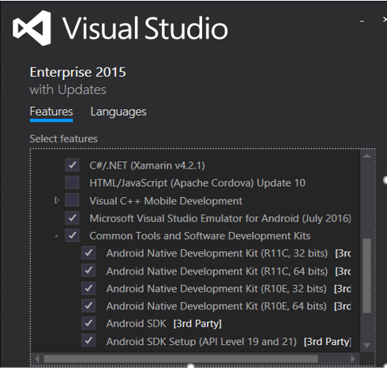

---
# required metadata

title: Retail POS APIs
description: This topic contains a list of available POS APIs and how to access them.
author: mugunthanm 
manager: AnnBe
ms.date: 10/29/2018
ms.topic: article
ms.prod: 
ms.service: dynamics-365-retail
ms.technology: 

# optional metadata

# ms.search.form: 
# ROBOTS: 
audience: Developer
# ms.devlang: 
ms.reviewer: kfend
ms.search.scope: Operations, Retail 
# ms.tgt_pltfrm: 
ms.custom: 
ms.assetid: 
ms.search.region: global
ms.search.industry: Retail
ms.author: mumani
ms.search.validFrom: 2018-29-10
ms.dyn365.ops.version: AX 8.0, AX 8.1

---
# How to Setup POS Hybrid App on Android and iOS

## Setup and install Xamarin on Windows

**Pre-requisites**

-   Recommended: a physical Windows computer (not a VM) running Windows 8 or later

-   You can use a computer with Windows 7 or earlier, in which case you’ll use the Xamarin Player for Android as the emulator

**Steps:**

Open **Control Panel > Programs and Features**, choose the **Visual Studio 2015** item, and click **Change**. When the installer opens, click **Modify**

  1.  **Cross-Platform Mobile Development > C#/.NET (Xamarin)**. This will also automatically select various Android tools under Common Tools and Software Development Kits. This option should also update any existing Xamarin installation. Select all **Common Tools and Software Development Kits**
  
  
  
  Click the Install button and let the process run. Again, this will take some time to complete

  2.  Once installation is complete, launch Visual Studio and sign in with your Microsoft account if prompted (this is the same account you use with Windows). Then check for Xamarin updates through **Tools > Options > Xamarin** or **Tools > Options > Xamarin > Other**, where you’ll find a **Check Now** link:
      
If you do not see an option for Xamarin in **Tools > Options**, double-check your installation, or try restarting Visual Studio. You can also search for Xamarin in the Options dialog. Download and install latest version.
      
  3.  From the Retail SDK folder Open SampleExtensions\HybridApp\Android\solution and build/deploy on emulator and verify.
  
  4.  On Emulator, please enter Retail Server URL and save.
  
  5.  You should be able to login and activate the device.

**Setup and install Xamarin on iOS**

  1.  Download and install Xcode from <https://developer.apple.com/xcode/>, and add your Apple ID as described on [Adding Your Account to XCode](https://developer.apple.com/library/content/documentation/IDEs/Conceptual/AppStoreDistributionTutorial/AddingYourAccounttoXcode/AddingYourAccounttoXcode.html#//apple_ref/doc/uid/TP40013839-CH40-SW1) (apple.com).
  
  2.  Download and install Xamarin by following the instructions on [Installing and Configuring Xamarin.iOS](http://developer.xamarin.com/guides/ios/getting_started/installation/mac/) (xamarin.com).
  
  3.  Once you have completed installing Xamarin on both the Windows and Mac computers, follow the instructions on [Connecting to the Mac](http://developer.xamarin.com/guides/ios/getting_started/installation/windows/xamarin-mac-agent/) (xamarin.com) so that you can work with iOS and the Mac from Visual Studio on the Windows computer.
  
  4.  From the Retail SDK folder, Open SampleExtensions\HybridApp\iOS\solution.
      After connecting to mac and building the application in Visual Studio, we need to select the iOS device type and deploy the app on selected device.
      
         
      
  5.  On Emulator, go to Settings -> RetailMPos ->please enter Retail Server URL.
      
         
      
         
      
  6.  Launch the MPos app, you should be able to login and activate the device.
