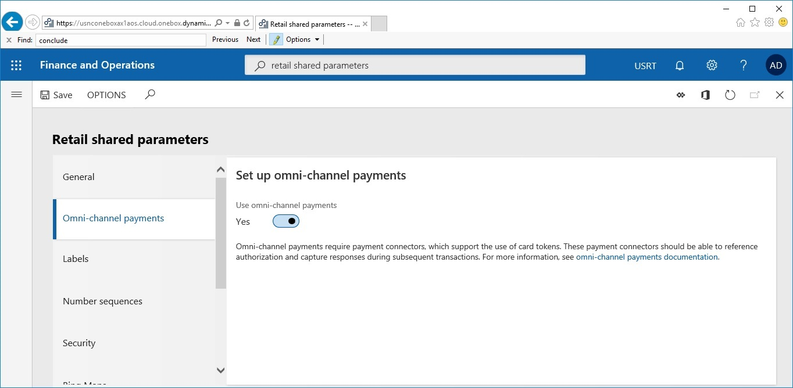

---

# required metadata

title: Linked refunds - refunds of previously approved and confirmed transactions
description: This topic describes how to enable and use Linked refunds.
author: josaw1
manager: AnnBe
ms.date: 3/28/2019
ms.topic: article
ms.prod: 
ms.service: dynamics-365-retail
ms.technology: 

# optional metadata

# ms.search.form: 
# ROBOTS: 
audience: Developer
# ms.devlang: 
ms.reviewer: josaw
ms.search.scope: Operations, Retail
# ms.tgt_pltfrm: 
ms.custom: 
ms.search.region: Global
ms.search.industry: Retail
ms.author: rapraj
ms.search.validFrom: 2019-03-28
ms.dyn365.ops.version: Retail 10.0.1 update

---

# Linked refunds - refundr of previously approved and confirmed transactions

[!include [banner](../../includes/banner.md)]

Returns are an integral operation for a Retailer. The ability to accept returns for sales and refund the payments to the customer allows the Retailer an option to service their customers’ needs and issues.

This topic provides information on configuration and use of the 'Linked refunds' feature which is available in Dynamics 365 for Retail version 10.0.1. A **Linked Refund** is a refund of a previously approved and confirmed transaction. This can either be a full or partial refund of the previous transaction and cannot exceed the full amount of the original authorization. 

In Dynamics 365 for Retail version 10.0 and before, Retailers can process refunds to Cards, but these must be manually specified by the cashier. Cashiers were not able to process the funds to the original mode of payment(s) unless provided by the customer. Customers could potentially move balance from one card to another by providing new card details during returns. 

With the use of **Linked Refunds**, retailers can greatly reduce the risk factor by ensuring that refunds are processed only to the cards authorized during original transaction. Un-authorized card balance transfers can be prevented by prompting the cashiers to use the confirmed and approved card token for processing refunds. Card authoirzation costs for the retailers can be reduced by using original form of payment for refunds.

 
## Enabling Linked Refunds

The new 'Linked Refunds' feature is coupled to work with the 'Omni Channel Payments' feature. The Omni Channel payments is available from Dyanmics 365 for Retail 8.1 and later. 

On the **Retail \> Headquarters setup \> Parameters \> Retail Shared parameters** page, go to the **Omni-Channel Payments** tab. Set the **Use omni-channel payments** toggle to **Yes**. 

 

Before you enable this feature, ensure that you have tested and trained your employees, as this will change the business process flow of how shipping or other charges are calculated and added to POS sales orders. This will enable the availability of Card Payment Tokens used on one channel (like Call Center, Modern Point of Sale, etc..) to all channels set up for the Retailer. It will also ensure that the **Linked Refunds** feature is activated for the point of sale applications. Call center, Modern Point of Sale and e-Commerce applications will continue to have the same behavior they have had historically related to manual entry of Card numbers for payment. 

### Supported flows :
Cashiers can now process refund to card used during original transaction without the card being present for return.
- Linked refunds for cash and carry using credit/debit cards.
- Linked refunds for customer orders using credit/debit cards.
 
### Not supported flows :
- Linked refunds with gift cards.
- Linked refunds with loyalty cards.
- Exchange orders support.
- Multiple return orders in the same transaction.
- Returns without a reciept or customer account details. 

### Additonal Setup Required
If the customer is not using Adeyn Connector out of box implementation, they will have to set up the connector that supports tokenization of credit cards.

## Use case example
In this section, sample use cases are presented to help you understand the configuration and usage of linked refunds and payment authorizations with the context of a Customer Order or a Return with Reciept. These examples illustrate the behaviour of the application when the **Omni-Channel Payment** paramter has been enabled. 

### Customer Account or Reciept based return with single Card authorization
#### Use case sceanrio
Customer has come to return a good purchased with a single credit card. A receipt is provided within the allowed period of return. Upon scanning the receipt the item for return is processed. When the payment refund is procesed using any payment method button selected, a prompt with the exisiting credit card authorization is displayed. 

 

When the Cashier selects the Credit card authorzation the payment refund will be processed and the transaction end screen will be dispayed, if a receipt print is configured then the prompt for receipt printing will be displayed. 

### Customer Account or Reciept based return with single Card authorization
#### Use case scenario
Customer has come to return a good purchased with multiple credit cards. Upon scanning the receipt the item for return is processed. When the payment refund is procesed using any payment method button selected, a prompt with the multiple payment credit card authorizations is displayed. 

 

When the Cashier selects the Credit card authorzation the payment refund will be processed, if there is more amount to be refunded the current transaction screen will display the amount and when the reminder payment is processed for refund the reminaing authorizations left will be displayed till there is no more amount left for refund. Once all the amount is sucesfully refunded the transcation can be completed with the receipt print as configured. 

