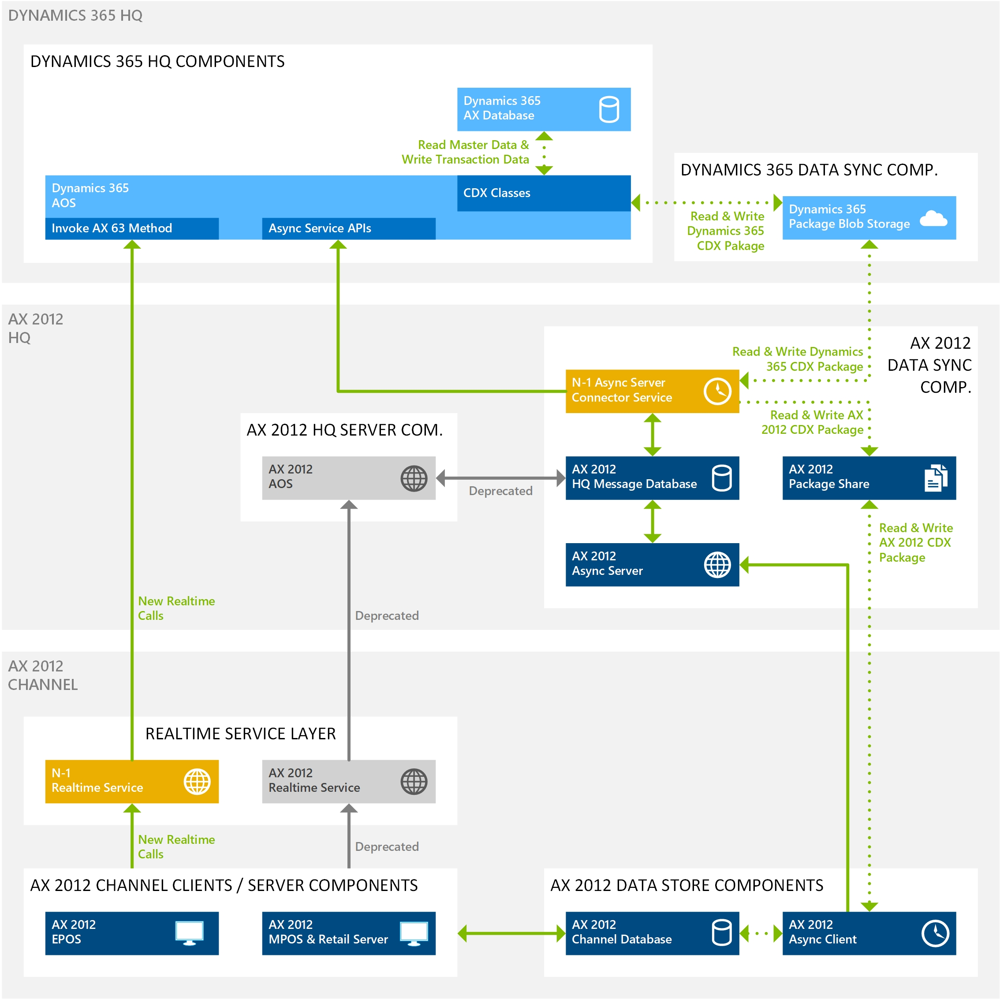

---
# required metadata

title: Phased Rollout (N-1) Installation, Configuration, and Cutover Guide
description: This topic explains how to setup Phased Rollout (N-1) components to enable your Dynamics AX 2012 R3 channel components, such as the Dynamics AX 2012 Modern POS (MPOS) and Retail Server or the Dynamics AX 2012 Enterprise POS (EPOS), to work with a Dynamics 365 for Retail headquarters.
author: jashanno
manager: AnnBe
ms.date: 06/16/2017
ms.topic: article
ms.prod: 
ms.service: Dynamics-365-retail
ms.technology: 

# optional metadata

ms.search.form: SysAADClientTable, RetailTransactionServiceProfile
# ROBOTS: 
audience: IT Pro
# ms.devlang: 
ms.reviewer: sericks
ms.search.scope: Operations, Retail, Core
# ms.tgt_pltfrm: 
ms.custom: 44351
ms.search.region: Global
# ms.search.industry: 
ms.author: jashanno
ms.search.validFrom: 2017-07-31
ms.dyn365.ops.version: Retail July 2017 update

---

# Phased Rollout (N-1) Installation, Configuration, and Cutover Guide
This topic explains how to setup Phased Rollout (N-1) components to enable your Dynamics AX 2012 R3 channel components, such as the Dynamics AX 2012 Modern POS (MPOS) and Retail Server or the Dynamics AX 2012 Enterprise POS (EPOS), to work with a Dynamics 365 for Retail headquarters.

## Key Terms
| Term | Description |
| --- | --- |
| N-1 Async Server Connector Service | Component to sync data packages between the Dynamics 365 for Retail headquarters and the Dynamics AX 2012 Channel components. |
| N-1 Realtime Service | Component to support real time calls from the Dynamics AX 2012 R3 Channel components to the Dynamics 365 for Retail headquarters. |

## Overview
This topic describes the following steps to get an environment setup with N-1. These steps assume that an existing Dynamics 365 for Retail headquarters is already deployed and an existing Dynamics AX 2012 R3 environment is currently running.

- **[Setup AAD accounts](#Setup-AAD-Accounts)**: Describes how to setup Azure Active Directory (AAD) accounts used by the N-1 components to connect to the Dynamics 365 for Retail headquarters.
- **[Configure N-1 components](#Configure-N-1-Components)**: Describes how to configure the N-1 components in the Dynamics 365 for Retail headquarters.
- **[Install N-1 components](#Install-N-1-Components)**: Describes how to download and install N-1 components in the existing Dynamics AX 2012 R3 environment.
- **[Cutover steps to switch to N-1](#Cutover-steps-to-switch-to-N-1)**: Describes the steps needed to cutover an existing Dynamics AX 2012 R3 environment from the Dynamics AX 2012 R3 headquarters to the new Dynamics 365 for Retail headquarters using the N-1 components.
- **[Troubleshooting steps](#Troubleshooting-steps)**: Details list of troubleshooting steps for common issues.
- **[Required KBs for N-1](#Required-KBs-for-N-1)**: List of required KBs needed to get an N-1 environment setup.

### High Level Architecture
The following diagram illustrates the high-level overview of the N-1 setup.

## Setup AAD Accounts
> [!Important]
> To help maintain a high level of security across the company, we strongly recommend that you create a new client ID and secret for this installation. This step requires a new Web App.

1. Generate a Microsoft Azure Web App to create a client ID and secret. For instructions, see the "Basics of Registering an Application in Azure AD" section in [Create an Azure Active Directory Application](https://docs.microsoft.com/en-us/azure/azure-resource-manager/resource-group-create-service-principal-portal).
2. After you've created a client ID and secret for Connector for Microsoft Dynamics AX, the client ID must be accepted in Retail. Go to System administration > Setup > Azure Active Directory applications . Enter the client ID in the Client ID column, enter descriptive text in the Name column, and enter RetailServiceAccount in the User ID column.

## Configure N-1 Components
Follow the steps described in order to configure the N-1 components in the Dynamics 365 for Retail headquarters.

### Connector for Microsoft Dynamics AX
1. Sign in to the Dynamics 365 for Retail headquarters and navigate to the Retail > Headquarters setup > Retail scheduler > Connector for Microsoft Dynamics AX form.
2. On the Action pane click on New and set the following fields:

| Section | Field Description | Sample Value |
| --- | --- | --- |
| Header | Profile	Unique name of the N-1 profile to setup. You should create one profile per environment / server where you currently have installed the Dynamics AX 2012 R3 Realtime Service. | |
| Header | Description | Helpful description text to identify the profile. | |	
| Connection | Server | The name of the server where the N-1 Realtime Service will be installed (same server as the current Dynamics AX 2012 R3 Realtime Service). | |
| Connection | Port | The port the N-1 Realtime Service will use. | |
| Connection | Web application name | The name to use for the N-1 Realtime Service in the Internet Information Services (IIS). | |
| Connection | Protocol | The protocol that the current Dynamics AX 2012 R3 Realtime service uses. | |
| Connection | Common name | The friendly name of the certificate that the N-1 Realtime Service uses. | |
| Connection | Passphrase | Passphrase to use for the N-1 Realtime Service. | |	
| Connection | Language | The language associated with the stores that are mapped to this N-1 Realtime service. | |	

3.	Click the Save button once done.

Retail Shared Parameters
1.	Sing in to the Dynamics 365 for Retail headquarters and navigate to the Retail > Headquarters setup > Parameters > Retail shared parameters form.
2.	On the left pane select the Security tab and set the following fields:
Section	Fie ld	Description	Value for Dr. Martens Environment
Set up the retail shared parameters for security	Real-time Service profile	 	
Set up the retail shared parameters for security	TS password encryption name	The algorithm used to connect to the transaction service. This value should be set to ‘SHA256’.	SHA256 

Retail Scheduler Parameters
1.	Sign in to the Dynamics 365 for Retail headquarters and navigate to the Retail > Headquarters setup > Parameters > Retail scheduler parameters form and set the following fields:
Section	Field	Description	Value for Dr. Martens Environment
HQ Message Database	SQL Server instance name	The name of the SQL Server instance hosting the existing Dynamics AX 2012 R3 HQ Message Database.	
HQ Message Database	Server name	The name of the server hosting the existing Dynamics AX 2012 R3 HQ Message Database.	
HQ Message Database	Database name	The name of the Dynamics AX 2012 R3 HQ Message Database. Note, the default database name in Dynamics AX 2012 R3 was “HQMessageDB”.	

3.	Click the Save button once done.

Working Folders
Note:  Environments upgraded from Dynamics AX 2012 R3 will already have these values populated but should validated to ensure that they are correct. This information must be manually entered for environments that have not been upgraded from Dynamics AX 2012 R3. 
1.	Sign in to the Dynamics 365 for Retail headquarters and navigate to the Retail > Headquarters setup > Retail scheduler > Working folders form and set the following fields.
2.	Make sure the following entry exist in the table. 
Field	Description	Value for Dr. Martens Environment
Name	Name of the working folder.	File storage for N-1
Description	Description for the working folder.	File storage for N-1
Download path	Network path where the Dynamics AX 2012 R3 CDX download packages are stored.	TBD
Upload path	Network path where the Dynamics AX 2012 R3 CDX upload packages are stored.	TBD

3.	Click the Save button once done.

Channel Database Group
Note:  Environments upgraded from Dynamics AX 2012 R3 will already have these values populated but should validated to ensure that they are correct. This information must be manually entered for environments that have not been upgraded from Dynamics AX 2012 R3. 
1.	Sing in to the Dynamics 365 for Retail headquarters and navigate to the Retail > Headquarters setup > Retail scheduler > Channel database group form and set the following fields.
1.	On the Action pane click on New for each physical channel database present in the Dynamics AX 2012 R3 environment and set the following fields:
Section	Field	Description	Value for Dr. Martens Environment
Header	Name	Name of the Channel Database Group used for the Dynamics AX 2012 R3 channel environment.	Default_AX63
Header	Description	Description of the Channel Database Group used for the Dynamics AX 2012 R3 channel environment.	Default group for AX63 channel database
General	Retail channel schema	The schema of the Dynamics AX 2012 R3 schema. This must be set to “AX2012R3”.	AX2012R3
General	Working folders	The reference to the working folders record used for the CDX data package sync. This was created the  steps above.	File storage for N-1 (from steps above).

3.	Click the Save button once done.

Channel Database
Note:  Environments upgraded from Dynamics AX 2012 R3 will already have these values populated but should validated to ensure that they are correct. This information must be manually entered for environments that have not been upgraded from Dynamics AX 2012 R3. 
1.	Sing in to the Dynamics 365 for Retail headquarters and navigate to the Retail > Headquarters setup > Retail scheduler > Channel database form and set the following fields.
2.	On the Action pane click on New for each physical channel database present in the Dynamics AX 2012 R3 environment and set the following fields:
Section	Field	Description	Value for Dr. Martens Environment
Header	Channel database ID	Unique identifier for the physical Channel Database. This value should be derived from the Dynamics AX 2012 R3 environment.	<lookup from AX 2012 environment>
Header	Channel database group	The Channel Database Group that the Channel Database is mapped to. This value should be derived from the Dynamics AX 2012 R3 environment.	<lookup from AX 2012 environment>
Header	Type	The type of the Channel Database record. This must be set to “Channel database”.	Channel database
Header	Data sync interval	The interval at which to runt the CDX data sync. This must be left blank.	<leave it blank>
Header	Username (Case Sensitive)	The username to use to connect to the Dynamics AX 2012 R3 Channel Database.	<Set by Dr. Martens/Hitachi>
Header	Password	The password to use to connect to the Dynamics AX 2012 R3 Channel Database.	<Set by Dr. Martens/Hitachi>
Header	Database name	The name of the Dynamics AX 2012 R3 Channel Database.	<lookup from AX 2012 environment>
Header	Server name	The name of the server where the Dynamics AX 2012 R3 Channel Database is hosted.	<lookup from AX 2012 environment>
Retail channel	List	The list of Retail Channels that are mapped to this Channel Database. This value should be derived from the Dynamics AX 2012 R3 environment.	<lookup from AX 2012 environment>

3.	Click the Save button once done.

Channel Profiles
Note:  Environments upgraded from Dynamics AX 2012 R3 will already have these values populated but should validated to ensure that they are correct. This information must be manually entered for environments that have not been upgraded from Dynamics AX 2012 R3. 
Note: This section only applies if the existing Dynamics AX 2012 R3 environment uses the Retail Server to interact with the Channel Database. If direct Channel Database access is enabled from the Dynamics AX 2012 R3 Modern POS (MPOS) then this step can be omitted.
1.	Sing in to the Dynamics 365 for Retail headquarters and navigate to the Retail > Channels > Retail stores > All retail stores form and set the following fields.
2.	On the Action pane click on New for each of the Retail Servers hosted on the N-1 environment and set the following fields:
Section	Field	Description	Value for Dr. Martens Environment
Header	Name	Unique name of the N-1 Channel Profile to setup. You should create one profile per environment / server where you currently have installed the Dynamics AX 2012 R3 Retail Server.	Default_AX63
Profile properties	Property key	The key for the Retail Server URL used on the Dynamics AX 2012 R3 environment. This must be set to “Retail Server URL”.	Retail Server URL
Profile properties	Property value	The Retail Server URL used on the Dynamics AX 2012 R3 environment.	<lookup from AX 2012 environment>
Profile properties	Property value	The key for the Hardware Station URL used on the Dynamics AX 2012 R3 environment. 	TODO 
Profile properties	Property value	The Hardware Station URL based on the Dynamics AX 2012 R3 environment.	TODO

3.	Click the Save button once done.

All Retail Stores 
Note, the fields described below will be set if the Dynamics 365 for Retail headquarters environment was upgraded from the Dynamics AX 2012 R3 headquarters.
1.	Sing in to the Dynamics 365 for Retail headquarters and navigate to the Retail > Channels > Retail stores > All retail stores form and set the following fields.
2.	Click on the Retail Channel ID for each of the stores that are mapped to the N-1 environment, set the fields below on the newly opened form, and click save.
Section	Field	Description	Value for Dr. Martens Environment
General	Live channel database	The Channel Database this store is mapped to and setup in the steps above.	<lookup from AX 2012 environment>
General	Channel profile	The Channel Profile this store is mapped to and setup in the steps above.	<lookup from AX 2012 environment>

Initialize AX 2012 Retail Scheduler
1.	Sing in to the Dynamics 365 for Retail headquarters and open the form Initialize AX 2012 Retail Scheduler form and click OK.

Distribution Schedule
Note, the fields described below will be set if the Dynamics 365 for Retail headquarters environment was upgraded from the Dynamics AX 2012 R3 headquarters.
1.	Sing in to the Dynamics 365 for Retail headquarters and navigate to the Retail > Retail IT > Distribution schedule form.
2.	For each distribution schedule in the left page that hast the suffix “AX63” make sure the Channel database groups has the new entries created above mapped to it.

Workers
Note, the fields described below will be set if the Dynamics 365 for Retail headquarters environment was upgraded from the Dynamics AX 2012 R3 headquarters.
1.	Sing in to the Dynamics 365 for Retail headquarters and navigate to the Retail > Employees > Workers form.
2.	For each of the Workers that will login to the Dynamics AX 2012 R3 environment, click on the name of the worker, then on the new form click on the Retail tab, and in the Retail section set the Password field. 

Install N-1 Components
Before you run the Connector for Microsoft Dynamics AX installers, make sure that the following requirements are met:
•	The installer requires that the Microsoft .NET Framework version 4.5.1 be installed on the system.
•	The installers install the Connector for Microsoft Dynamics AX applications only on the following operating systems. Before you install any component, you must update the operating system with all service packs and updates that are available for it.
•	Windows 7 Professional, Enterprise, or Ultimate edition (both x86 and x64 architectures). Home edition and embedded edition aren’t supported.
•	Windows 8.1 Update 1 Pro or Enterprise edition (both x86 and x64 architectures). Standard edition isn’t supported.
•	Windows 10 Pro or Enterprise edition (both x86 and x64 architectures). Home edition isn’t supported.
•	Windows Server 2012 R2 or Windows Server 2016.
 
Async Server Connector Service
The installer validates that all prerequisites are met. These prerequisites include SQL prerequisites, such as a local installation of SQL Server, or the alternative prerequisites, such as SQL Command Line Utilities and other required SQL connectivity installations.
To meet prerequisites, the SQL Server that is connected to must have Full-text search and, at a minimum, support for Transport Layer Security (TLS) 1.2. For Microsoft SQL Server 2012, Service Pack 3 must be installed, at a minimum. For Microsoft SQL Server 2014, Service Pack 2 must be installed.
If a system restart is required, the installer shows this requirement. Although the restart is recommended, the installer can continue without it.
Once ready follow these steps to download and install the component:
1.	Sing in to the Dynamics 365 for Retail headquarters and navigate to the Retail > Headquarters setup > Retail scheduler > Connector for Microsoft Dynamics AX form and select the connector you created in the steps above.
2.	Click on DOWNLOAD in the action pane and select the Async Server Connector Services and corresponding Configuration file. Make sure that the configuration file is always dropped next to the setup file.
3.	Once downloaded, double click on the installer and follow these steps:
A.	Verify the Application Object Server (AOS) URL (the URL that is used to access Retail headquarters), and then select Next.

B.	If a specific user is required, enter the user name and password that the service should run as. By default, the installer automatically generates a service account to use. This approach is more secure and is recommended, but it can't be used when the database is located on a separate computer . Select Next to continue.
C.	Enter the application ID (client ID) and secret that are associated with this Connector for Microsoft Dynamics AX installation. 
D.	Click Install.
Note, for information about how to correctly generate an Azure Web App to create a client ID and secret, see the "Basics of Registering an Application in Azure AD" section in Create an Azure Active Directory Application.
When you create the Web App, the initial URI and URL don't have to be any specific value. Only the application ID (client ID) and secret that are created are important.
4.	After an application ID (client ID) and secret are created, the application ID must be accepted in Retail. Navigate to Retail > Headquarters setup > Azure Active Directory applications. Enter the client ID in the Client ID column, enter descriptive text in the Name column, and enter RetailServiceAccount in the User ID column.
5.	Sing in to the Dynamics 365 for Retail headquarters and navigate to the Retail > Headquarters setup > Parameters > Retail shared parameters form, select Identity providers on the left pane, and select the provider that begins with HTTPS://sts.windows.net/. The values on the Relying parties FastTab are set, based on your selection.
6.	On the Relying parties FastTab, select +Add. Enter the client ID that was created for this installation. Set the Type field to Public and the UserType field to Worker. Then, on the Action Pane, select Save.
7.	On the Action Pane, select Save. 
N-1 Realtime Service   
1.	Sing in to the Dynamics 365 for Retail headquarters and navigate to the Retail > Headquarters setup > Retail scheduler > Connector for Microsoft Dynamics AX form and select the connector you created in the steps above.
2.	Click on DOWNLOAD in the action pane and select the Real-time service for Dynamics AX 2012 R3 and corresponding Configuration file. Make sure that the configuration file is always dropped next to the setup file.
3.	Once downloaded, double click on the installer and follow these steps:
A.	Verify the Application Object Server (AOS) URL (the URL that is used to access Retail headquarters), and then select Next.

B.	Select a valid SSL certificate to use for HTTPS communication. Select Next to continue.
i.	The certificate must use private key storage, and server authentication must be listed in the enhanced key usage property. Additionally, the certificate must be trusted locally, and it can’t be expired. It must be stored in the personal certificate store location on the local computer.

C.	If a specific user is required, enter the user name and password that the application pool should run as. By default, the installer automatically generates a service account to use. This approach is more secure and is recommended, but it can't be used when the database is located on a separate computer. Select Next to continue.
D.	Verify the HTTPS port that should be used and verify that the host name of the computer is correct. Select Next to continue.

i.	The HTTPS port is listed in the Store system profile. To access the Store system profile, on the Retail store details page, on the Store systems FastTab, select the profile ID of the selected Store system.

The installer automatically enters the host name. If, for any reason, the host name must be changed for the installation, change it here. The host name must be the FQDN of the system, and it must match the value that you entered on the Connector for Microsoft Dynamics AX page earlier in this topic.
E.	Enter the application ID (client ID) and secret that are associated with this Connector for Microsoft Dynamics AX installation. Then select Install.
i.	This application ID and secret can be the same application ID and secret that you used in the Async Server Connector service installation. For information about how to correctly generate an Azure Web App to create a client ID and secret, see the "Basics of Registering an Application in Azure AD" section in Create an Azure Active Directory Application.

When you create the Web App, the initial URI and URL don't have to be any specific value. Only the application ID (client ID) and secret that are created are important.

Cutover steps to switch to N-1
The following section describes the recommended step by step instructions on how to switch an existing Dynamics AX 2012 R3 channel environment from the Dynamics AX 2012 R3 headquarters to the Dynamics 365 for Retail headquarters. Note, these instructions are generic and different implementations will likely have to deviate from these steps to accommodate specific business or technical requirements.

Prerequisites
Follow these steps to prepare your environment for the cutover.
Step	Details	Timeline	How to Validate this is done	Date for Dr. Martens Go-Live
Deploy Dynamics 365 for Retail headquarters	The Dynamics 365 for Retail headquarters is up and running. The Dynamics 365 for Retail Cloud POS (CPOS) can be used to validate functionality on the environment.	Weeks or months before the cutover.		TBD
Install Dynamics 365 for Retail Application (X++) KBs	Install KBs listed below to ensure all N-1 related issues are addressed.	Weeks or months before the cutover.		TBD
Setup AAD Accounts	Follow the instructions on the “Setup AAD Accounts” section above to create the accounts needed for the N-1 components to authenticate against the Dynamics 365 for Retail headquarters.	Weeks or months before the cutover.		TBD
Configure the Dynamics 365 for Retail headquarters	Follow the instructions on the “Configure N-1 Components” section above to configure all the settings for the N-1 components before they are installed.	Weeks or months before the cutover.		TBD
Install N-1 Realtime Service component	Follow the instructions on the “Install N-1 Components” section above to install the N-1 components. 

Note, the N-1 Async Server Connector Service component should be installed but immediately disabled to ensure that we do not mix Dynamics AX 2012 R3 and Dynamics 365 CDX packages.	Weeks or months before the cutover.		TBD

Preparation
Follow these steps to prepare a few days before the cutover is scheduled.
Step	Details	Timeline	How to Validate this is done	Date for Dr. Martens Go-Live
Stop all Dynamics AX 2012 R3 download jobs	Make sure these are stopped in the Dynamics AX 2012 R3 headquarters.	At least couple days before.	All packages in the Dynamics AX 2012 R3 network share for upload jobs are processed and no new packages appear.	TBD
Execute full sync on all “AX63” CDX download jobs in Dynamics 365 for Retail headquarters.	Run the CDX download jobs to ensure the packages are generated and dropped in the Azure blob storage to be consumed by the N-1 Async Server Connector Service during cutover.	At least couple days before.	CDX download jobs are in “Available” state on the “Download Sessions” form in the Dynamics 365 for Retail headquarters.	TBD

Cutover Steps
Follow these steps below in order during the actual cutover.
Step	Details	Timeline	How to Validate this is done	Date and Time for Dr. Martens Go-Live
1. Close all shifts	Make sure all shifts are closed.	After store closing	Manually validate with the stores that the shifts are closed.	TBD
2. Cleanup any suspended transactions	Make sure all suspended transactions are cleaned up.		Manually validate with the stores that the shifts are closed.	TBD
3. Synchronize all transactional data	Make sure all transactional data is synchronized through the CDX Upload jobs to the Dynamics AX 2012 R3 headquarters.		All packages in the Dynamics AX 2012 R3 network share for upload jobs are processed and no new packages appear.	TBD
4. Disable Dynamics AX 2012 R3 CDX upload jobs	Make sure all Dynamics 2012 R3 upload jobs are disabled so no packages are being picked up anymore.		Manually validate through the Dynamics AX 2012 R3 headquarters UI.	TBD
5. Shut down the Dynamics AX 2012 R3 Realtime Service	Connect to the server hosting the Dynamics AX 2012 R3 Realtime Service, open Internet Information Services (IIS), right click on the Dynamics AX 2012 R3 Realtime Service and stop the service.		Manually validate in IIS that the service is stopped.	TBD
6. Execute “Reset metadata synchronization” in Dynamics 365 for Retail headquarters	Navigate to the “Retail > Headquarters setup > Retail scheduler > Connector for Microsoft Dynamics AX” form in AX and click the “Reset metadata synchronization” button to rese the “HQMessageDB” on the Dynamics AX 2012 R3 environment for N-1 cutover.		TBD	TBD
7. Turn on N-1 Async Server Connector Service	Connect to the server hosting the N-1 Async Server Connector Service and enable the windows service.		Download jobs in the Dynamics 365 for Retail headquarters “Download Sessions” form will move from “Available” to “Applied”.	TBD

The diagram below is a visual representation of the steps described above.
 
Troubleshooting  Guide
The following section described common problems you might encounter and the corresponding steps to investigate or recover from the issue.

Runtime
The following section describes troubleshooting steps for errors you might encounter during the runtime of the application.

Metadata synchronization fails
Event Log	Microsoft-Dynamics-Commerce-AsyncServerConnectorService/Operational

Sample Event Log Error Message	Async server connector service encounters error in download timer tick. CorrelationId {4c9cd9a0-d4e3-43e5-80da-59ea2eb01acf}; Error details: Microsoft.Dynamics.Retail.AsyncServerConnector.Service.Exceptions.SyncMetadataException: Failed synchronizing metadata. ---> Microsoft.Dynamics.Retail.AsyncServerConnector.Service.Exceptions.MessageDBOperationException: Failed updating metadata in HQ message DB. ---> System.Data.SqlClient.SqlException: A connection was successfully established with the server, but then an error occurred during the login process. (provider: SSL Provider, error: 0 - The certificate chain was issued by an authority that is not trusted.) ---> System.ComponentModel.Win32Exception: The certificate chain was issued by an authority that is not trusted 
MPOS Error on Activation Screen	-
Troubleshooting Steps	This could have happened because the Synch service web.config connection string has the TrustServerCertificate set to false.
 
To fix the issue browse the Sync service website and open the web.config. Find the connectionStrings section, update the TrustServerCertificate to True if it is false.

Metadata synchronization fails
Event Log	Microsoft-Dynamics-Commerce-AsyncServerConnectorService/Operational

Sample Event Log Error Message	Async server connector service encounters error in download timer tick. CorrelationId {73d9d0d3-4d12-42ca-ac65-3f1f947c7840}; Error details: Microsoft.Dynamics.Retail.AsyncServerConnector.Service.Exceptions.SyncMetadataException: Failed synchronizing metadata. ---> Microsoft.Dynamics.Retail.AsyncServerConnector.Service.Exceptions.MessageDBOperationException: Failed updating metadata in HQ message DB. ---> System.Data.SqlClient.SqlException: Cannot open database "HQMessageDB" requested by the login. The login failed. 
Login failed for user 'localhost\RetailAsUser'. 
MPOS Error on Activation Screen	-
Troubleshooting Steps	This could have happened because the user who runs the Async server connector service does not have access to the HQ message database.
 
To fix the issue run services.msc, check the user who runs the Async server connector service. Provide this user access to HQ message database in SQL. 

Metadata synchronization fails or CDX Jobs were successfully downloaded but failed to apply
Event Log	Microsoft Dynamics AX Retail : Async Client SynchClientService 

Sample Event Log Error Message	Unable to communicate with server for download. Please check username/password, server and database connections. Error Details: System.ServiceModel.CommunicationException: An error occurred while making the HTTP request to https://localhost:44300/SynchService/DownloadService.svc. This could be due to the fact that the server certificate is not configured properly with HTTP.SYS in the HTTPS case. This could also be caused by a mismatch of the security binding between the client and the server. ---> System.Net.WebException: The underlying connection was closed: An unexpected error occurred on a send. ---> System.IO.IOException: Authentication failed because the remote party has closed the transport stream. 
MPOS Error on Activation Screen	-
Troubleshooting Steps	This could have happened because of the following reasons.
1)    The user ID and password that we provide in async client does not match with the channel database User ID and password that we provide in AX.
2)    The async service end point is not reachable. 
https://localhost:44300/SynchService/DownloadService.svc
 
To fix this issue, 
1)    Launch the Async client configuration utility (AsyncClientConfigurationUtility.exe) from the async client install location. Under the “Async Server connection” tab -> Authentication information (case sensitive) -> Update the Channel database ID, User name and Password fields as per the values provided under N-1 channel database (retail -> Headquarters setup -> Channel database) in AX. 
2)    Now click on “Test connection” in the utility. If the connection is successful, restart the Async client service. If the connection fails, go to N-1 channel database (retail -> Headquarters setup -> Channel database) in AX, update the Username and password, save. Go to Retail scheduler parameters in AX and click “Reset metadata synchronization.” This will populate the HQ message database with the new values. Repeat step 1 again.  
3)    If the async server end point (https://localhost:44300/SynchService/DownloadService.svc)
is not reachable, check the bindings of the service and make sure there is a certificate associated.  
If the issue still exists, check that the “Working folders” were specified for all the Channel database group’s that were linked to “AX2012R3” retail channel schema.

CDX Jobs were successfully downloaded but failed to apply
Event Log	Microsoft Dynamics AX Retail : Async Client SynchClientService 

Sample Event Log Error Message	Exception during DownloadAgent.Execute. Error Details: System.IO.FileNotFoundException: Could not load file or assembly 'Microsoft.Dynamics.Retail.StoreConnect.Request.Base, Version=6.3.0.0, Culture=neutral, PublicKeyToken=31bf3856ad364e35' or one of its dependencies. The system cannot find the file specified. 
File name: 'Microsoft.Dynamics.Retail.StoreConnect.Request.Base, Version=6.3.0.0, Culture=neutral, PublicKeyToken=31bf3856ad364e35' 
at Microsoft.Dynamics.Retail.SynchClient.Core.DownloadAgent.ApplySessionFileToClientDatabase(SessionManager sessionMgr, String fileName) 
at Microsoft.Dynamics.Retail.SynchClient.Core.DownloadAgent.ProcessDownloadSession(DownloadSession session) 
at Microsoft.Dynamics.Retail.SynchClient.Core.DownloadAgent.Execute() 
MPOS Error on Activation Screen	-
Troubleshooting Steps	This could have happened because the AX63 store connect components were not installed on the environment. 
 
To fix the issue install the AX63 store connect components on the environment that is running the async client component. 

N-1 Async Server Connector Service Communication Exception
Event Log	Microsoft Dynamics AX Retail : Async Client SynchClientService
Sample Event Log Error Message	Unable to communicate with server for download. Please check username/password, server and database connections. Error Details: System.ServiceModel.CommunicationException: An error occurred while making the HTTP request to https://localhost:44300/SynchService/DownloadService.svc. This could be due to the fact that the server certificate is not configured properly with HTTP.SYS in the HTTPS case. This could also be caused by a mismatch of the security binding between the client and the server. ---> System.Net.WebException: The underlying connection was closed: An unexpected error occurred on a send. ---> System.IO.IOException: Authentication failed because the remote party has closed the transport stream.
Troubleshooting Steps	Make sure the HQ Message DB has data. Use the asyncClient configuration tool to validate the connection is successful.

Dynamics AX 2012 R3 Modern POS Activation Fails with error on Step 1
Event Log	Microsoft Dynamics AX Retail : Retail Server RetailServer

Sample Event Log Error Message	Microsoft.Dynamics.Commerce.Runtime.UserAuthenticationException: An error occurred during logon. ---> Microsoft.Dynamics.Commerce.Runtime.ConfigurationException: The published channel can not be found in local database. Please make sure at least 1 retail channel is published to this DB through AX.
MPOS Error on Activation Screen	DA1002: A server side error occurred that prevents user from logging on. Please check the server log for detailed information or contact your IT support.
Troubleshooting Steps	Make sure the CDX download jobs ran successfully and the channel database has data.

Dynamics AX 2012 R3 Modern POS Activation Fails with error on Step 2
Event Log	Microsoft Dynamics Retail Modern POS 

Sample Event Log Error Message	Dynamics-Error: LoginViewModel ActivateDevice Logon failed 
ErrorMessage: ; 
ErrorCode: Microsoft_Dynamics_Commerce_Runtime_HeadquarterTransactionServiceMethodCallFailure; 
ErrorObject: '{"_canRetry":false,"_errorCode":"Microsoft_Dynamics_Commerce_Runtime_HeadquarterTransactionServiceMethodCallFailure","_errorMessage":"","_commerceException":null,"_formatData":[],"_extraData":null,"_clientErrorCode":"DA2001","_errorMessageDetails":[]}' 1524013518876mS
MPOS Error on Activation Screen	DA2001
Troubleshooting Steps	Device you are trying to activate is already active. Please deactivate the device and try the activation.

Dynamics AX 2012 R3 Modern POS Activation Fails with error on Step 2
Event Log	Microsoft Dynamics Retail Modern POS 

Sample Event Log Error Message	Exception occured: [04/19/2018 19:26:51] Microsoft.Dynamics.Commerce.Runtime.UserAuthenticationException: An error occurred during logon. ---> Microsoft.Dynamics.Commerce.Runtime.StorageException: Failed to read from the database. See inner exception for details 
DatabaseErrorCode: 0 ---> Microsoft.Dynamics.Commerce.Runtime.Data.DatabaseException: Invalid object name 'crt.EMPLOYEEPERMISSIONSVIEW'. ---> System.Data.SqlClient.SqlException: Invalid object name 'crt.EMPLOYEEPERMISSIONSVIEW'. 
at System.Data.SqlClient.SqlConnection.OnError(SqlException exception, Boolean breakConnection, Action`1 wrapCloseInAction) 
at System.Data.SqlClient.TdsParser.ThrowExceptionAndWarning(TdsParserStateObject stateObj, Boolean callerHasConnectionLock, Boolean asyncClose) 

MPOS Error on Activation Screen	DZ1001 
Troubleshooting Steps	Device you are trying to activate is already active. Please deactivate the device and try the activation.

Dynamics AX 2012 R3 Modern POS Activation Fails with error on Step 9
Event Log	Microsoft Dynamics Retail Modern POS 

Sample Event Log Error Message	Dynamics-Error: LoginViewModel ActivateDevice Logon failed 
ErrorMessage: Sorry, something went wrong with the encryption on your device. Please contact your system administrator.; 
ErrorCode: MICROSOFT_DYNAMICS_POS_DATAENCRYPTIONERROR; 
ErrorObject: '{"_canRetry":false,"_errorCode":"MICROSOFT_DYNAMICS_POS_DATAENCRYPTIONERROR","_errorMessage":"Sorry, something went wrong with the encryption on your device. Please contact your system administrator.","_commerceException":null,"_formatData":[],"_extraData":null,"_clientErrorCode":"DA3122","_errorMessageDetails":[]}' 1524014350787mS
MPOS Error on Activation Screen	DA3122: Sorry, something went wrong with the encryption on your device. Please contact your system administrator.
Troubleshooting Steps	Check the RealTime Service profile filed in the CDX Backward compatibility section of the store. This must be set to the RTS profile that you created for N-1.

KBs to Install
The following list describes all the KBs that need to be installed for N-1 to work properly. 
Dynamics 365 for Retail – AX 7.2 headquarters
KB Number 	Title
4095190	You cannot set the default transaction service profile ID on the shared parameter page
4095192	You cannot set the transaction service password encryption algorithm
4095209	Issue when the component tries to authenticate with the transaction service
4095189	The protocol column of the RetialTransactionServiceProfile table is not synced to the old version channel databases
4095191	You are not allowed to set the retail server URL to be http based URL
4132456	[Upgrade & N-1][Designer] Number pad height should be extensible
4095926	Upgrade & N-1: Return order fails from 63MPOS as the transaction was not found on a N-1 non upgrade environment.
4095664	All Microsoft Dynamics AX 2012 clients connecting to Microsoft Dynamics 365 for Operations HQ to create new customers
4132454	N-1 version of 1070 fails due to duplicate record exception caused by the CompanyImage_AX63 subjob
4131243	When running D365 Retail in N-1 mode, the user is not able to set the HardwareStationURL using the AX client hence may not be able to configure the 6.3 hardwaresation properly

