---
# required metadata

title: New environments, Visual Studio Team Services and branch setup for Retail projects
description: This topic describes recommended practices for Microsoft Dynamics 365 for Retail implementation projects
author: Andreash1
manager: AnnBe
ms.date: 02/08/2018
ms.topic: article
ms.prod: 
ms.service: dynamics-365-retail
ms.technology: 
# optional metadata

ms.search.form: 
# ROBOTS: 
audience: IT Pro
# ms.devlang: 
ms.reviewer: kfend
ms.search.scope: Operations, Retail
# ms.tgt_pltfrm: 
# ms.custom: [used by loc for topics migrated from the wiki]
ms.search.region: Global
ms.search.industry: Retail
ms.author: andreash
ms.search.validFrom: 2017-12-31
ms.dyn365.ops.version: Retail 7.3

---

# New environments, Visual Studio Team Services, and branch setup for Retail projects

Starting with the launch of Microsoft AX 7.0, most environments are hosted in the cloud. They are either Microsoft-hosted (on a Microsoft subscription) or cloud-hosted (on a customer subscription). The former is the default, and the latter is usually done to have more control over a development or build environment.  For more details, see [Understand Lifecycle Services](../../dev-itpro/lifecycle-services/lcs-works-lcs.md).

Tier 1 machines are developer or build environments. 

**Development tier 1 environments** 

For Retail implementations that include code extensions, we do not recommend using a development environment without administrative privileges. There are many tools and operating system (OS) features that need to be configured if a development environment without administrative privileges is used. An alternative setup is to have a machine hosted on a separate Microsoft Azure subscription (also known as “cloud-hosted” in Lifecycle). 

There are three hosting models for a Tier 1 development or build environment. 

If you want to build your own POS extensions with an appx certificate (see below). 

Because these decisions have financial impact, you can reduce some of the cost by using Tier 1, which is free, as a simple test environment (or golden config environment). This is not ideal, but should work for most projects.   

> Note: You have the option to shutdown cloud-hosted environments any time. This helps to reduce the hosting cost.  

A hosting alternative is to download a VHD from LCS and host it locally on a server. From a development perspective, there is no difference regarding the capabilities of the VHD images compared with a hosted VM, except that LCS deployment are not supported on VHDs. Command line deployments are still supported.

Refer to the following table to evaluate the pros and cons to evaulate what works best for your project.

[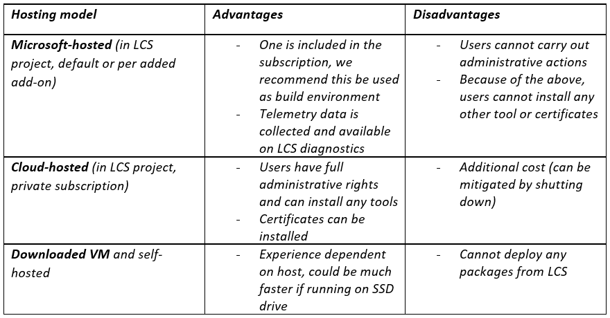](./media/18-three-hosting-model.png)

Tier 2 and higher machines are multi-box environments for multiple test and verification purposes. Production environments are hands-off, and the size of the environment is determined by the sizing process in Lifecycle Service (LCS).  

**Branches, build definitions, and environments**

Branching is a major practice in software development. To learn more about branching, visit this [link](https://msdn.microsoft.com/en-us/library/aa730834(v=vs.80).aspx). 

To summarize branching, using a paragraph from the resource above. 

> A branching and merging strategy involves a tradeoff between risk and productivity. You trade the safety of working in isolation for the increased productivity of working with other people. The productivity increases come with a cost—the additional effort required for merging software assets sometime in the future.

> Using branches provides better isolation and control of individual software assets and increases productivity, because teams or individuals can work in parallel. However, using branches also requires an increase in merge activities and therefore risk, because you must later reassemble branches into a whole.

To learn more about the delivery of Dynamics 365 Finance and Operations implementation projets, refer to the following [video](https://mbspartner.microsoft.com/D365/Videos/101393). 

There is no single best strategy for the creation of branches. Different projects and different sizes of implementations require various approaches. The approach mentioned by Joris De Gruyter (the above video link) is a successful method. 

 
The diagram above illustrates three code branches. The numbers highlight the order of setup, as described further below.  

The **Dev** branch [2] is used for daily work that is not quite ready for testing but needs to be shared with other developers. If there are larger teams, you might want to multiple Dev branches for different features or purposes.  

The **Main** branch [1]  is for changes that meet a certain quality bar and are ready for test by others (user acceptance tests (UAT), performance tests, integration tests, sanity tests after hotfixes, etc.). Deployable packages for this branch must be created by a build environment.  It is not a good practice to generate X++ packages in a Tier 1 environment and then deploy these packages into an official test or production environment in case uncommitted source changes are excluded from the build. 

The **ProdRel1** [3] branch holds all source code exactly as it is deployed in a production environment at any point in time.  A build environment can be used but it is not required. If packages from the Main branch are deployed to a production environment, the code should be merged (**Main** > **ProdRel1**) after a production deployment. Having a branch for a production provides the opportunity to generate official builds later - if needed. 

All three branches hold both X++ code (extensions and hotfixes in Metadata folders) and a copy of the **Retail SDK** [5, 6, 7]. The Retail SDK includes base Microsoft code and code extensions, which can be different in each branch. 

The **RetailSdk-mirror** folder [4] is used to bring in Microsoft changes to the Retail SDK and is not for development or build.  It should only be updated when a new version or hotfix is used. The process is described in detail later in this topic. 

For small Retail projects it's okay to have two only branches. However, developers must be disciplined to immediately handle any code submissions that might affect tested builds. In this case, the Main branch would become the Dev branch. 

You can opt to build deployable packages out of multiple branches, in which case you must have one build definition per buildable branch.  The initial build definition is created automatically as part of deployment of a build environment (Main). You can make copies of the build for other branches. Note that small editions must be made to incorporate the Retail code. 

The following high-level steps show  how to set up an environment so that development work can begin. Refer to the illustration above for details about numbering in this list): 

- Deploy a build environment and an empty Main VSTS branch [1] 
- Deploy a development environment
- Create the dev and release branches [2, 3] 
- Add the Retail SDK [4 - 7] 
- Prepare development environment
- Deploy a second build environment for the release branch (optional) 
- Prepare the build definitions 

After all these steos have been completed, we will have branches, environment, and builds ready to go. 

These individual steps are explained in more detail below. 

[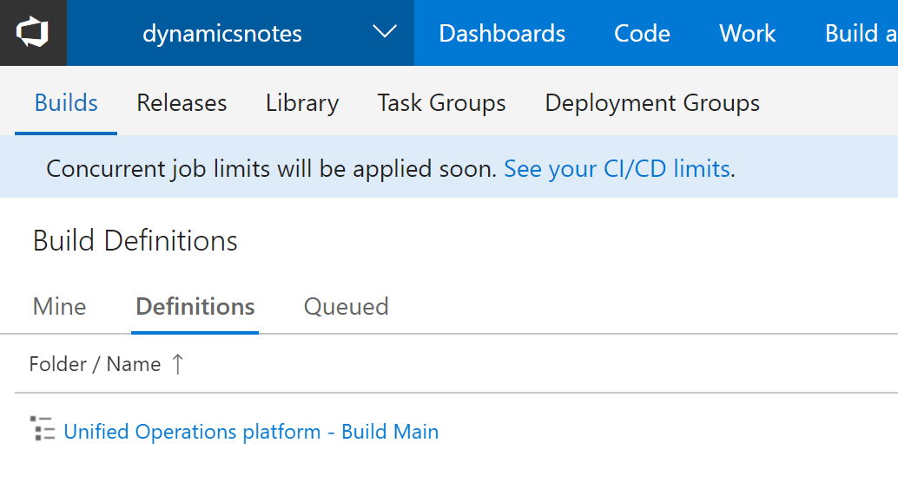](/media/19-build-definitions.png)

[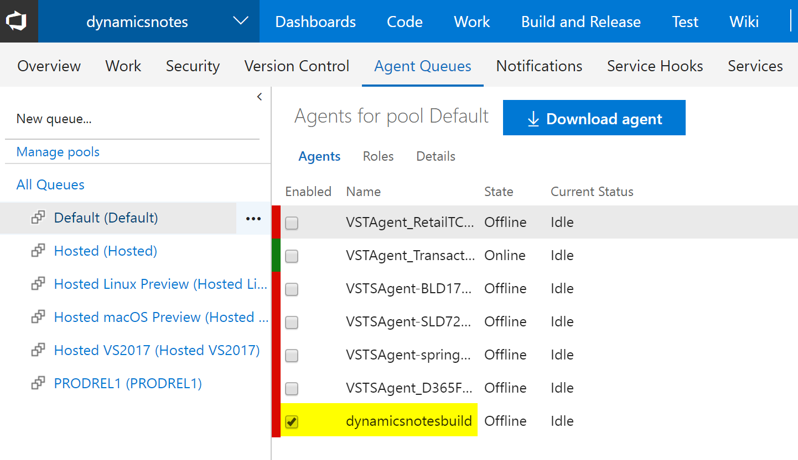](/media/20-agents-for-pool-default.png)

### Deploy a build environment and empty Main VSTS branch 

Use the LCS portal to deploy a new build environment. We recommend that you use a cloud-hosted environment, as there will be more options and capabilities if you have administrative rights. See the table about the different environment hosting models above in the Development tier 1 environments section. 

If you create a new project, you will also need to create a new Visual Studio Team Services (VSTS) project. To do this, in your VSTS account, click New project. 

 
After the new VSTS project is created, you need to allow VSTS to access it. Create a new personal access token on the VSTS account. When that is done, configure the LCS project with the following information. 

When the LCS project is linked to VSTS, you are ready to deploy.  

Add a new environment, select the version, topology of DEVTEST, and a build environment. On the next screen, provide a meaningful name for the environment, then give a similar name to the build agent. 

[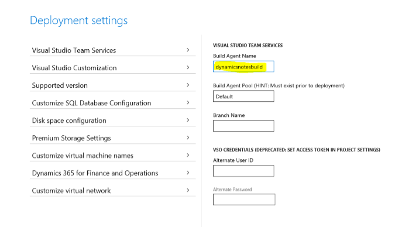](/media/4-build-agent.png)

Next, under **Customize virtual machine names**, provide a unique name and then deploy. 

The build box will be deployed, and the build definition and Main branch will be created. This process may take a couple of hours.  

[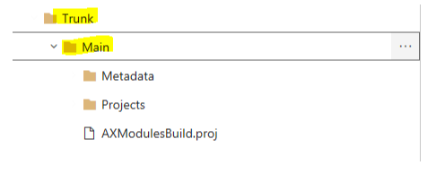](/media/5-build-box-main-branch.png)
 
### Deploy a development environment 

Use the LCS portal of your implementation project to create a cloud-hosted development environment. Make sure that you are signed in to the correct user account. This user account will be used to create the tenant of the development machine. For example, if you are logged into LCS with lily@pad.com, the environment will be setup for the @pad.com tenant and expect users from that tenant. Other users can be added, however the point of sale (POS) activation must be carried out by a user from that tenant.  There are cases where user accounts from different domains can be used, for example if customers, partners, or other parties use email from different domains. Coordination is needed during the POS activation, as only the tenant that was used during the deployment can activate users.  

Select the correct version, then DEVTEST, then DEV, a meaningful and unique name and make sure that the machine name is also unique (inside advanced settings). The process of preparing the machine may take a couple hours. 

Because there is currently no Dev branch, you can skip mapping VSTS to the local directories. You will need to do that later. 

### Create the dev and release branches 

As mentioned above, you need a branch that holds frequent, yet less often tested changes and a branch that holds the source code for production. The expected hierarchy for this looks like the following.  

 
Follow these steps to create the branches: 

- Sign in to a development environment. 
- Launch Visual Studio as an administrator and make sure that you are logged in with an account that has access to the VSTS project. 
- In Team Explorer, connect Visual Studio to the VSTS project (if not already done).
- Map the Trunk/Main folder to a local folder (if not already done). This is temporary. 
- In Source Control Explorer, right click the **Main** folder, select **Branching and Merging**, **Convert to Branch*.  
- Right-click the **Main** branch, select **Branching and Merging**, **Branch** and name the new branch **Dev** 
- Use the Pending Changes, submit this change to VSTS. 
- Right-click the Main branch, select **Branching and Merging**, **Branch** and name the new branch **ProdRel1**. 
- Use Pending Changes, and submit this change to VSTS. 

At this point, the Source Depot Explorer in Visual Studio should look like the following screenshot. 

[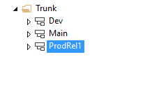](/media/7-source-depot-explorer.png)
 
### Add the Retail SDK 

Next, you need to add the Retail SDK to each of the three code branches. This will allow propagation of code changes from Dev to Main and eventually to ProdRel1. This will also allow separate changes between these different branches, just like with the X++ code. Having the Retail SDK in each branch next to the X++ code means that even though they represent different technologies and deployment locations, the X++ code represents a public API that the channel-side (Retail SDK + customizations) uses. This is because a change in the X++ code is often needed when there are changes in the Retail SDK. For example, a table extension for both Dynamics 365 for Retail and Retail Channel with CDX changes, or a new real-time API that Retail Server consumes. 

First, add the mirror branch. The Retail SDK mirror branch is needed as a baseline for code merges when updates from Microsoft are imported. The process on how to take updates will be explained later.  

The mirror branch or folder is only needed once per project.

- Find the unchanged Retail SDK of the exact version that you want to start your development with. This can be found on every development machine in the service drive, or in every downloaded hotfix. You can uniquely identify a version of the Retail SDK with naming convention of Microsoft-version.txt file. This file should not be changed, except by an update to the Retail Sdk mirror folder. 
- [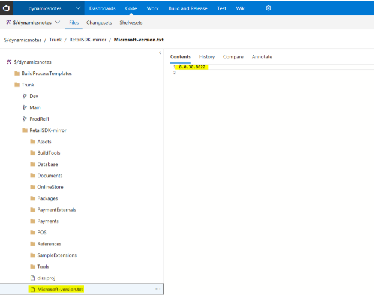](/media/8-retail-sdk.png)
- In Source Control Explorer, right-click the **Trunk** folder and select **Add Items to Folder**.  
- Select the top folder in the Retail SDK and **Next**. 
- Visual Studio will display the number of files that will be added. Make sure that the **RetailSdk** folder is under the Trunk folder. 
- Make sure that there are 0 excluded items by selecting them and clicking Include items. 

[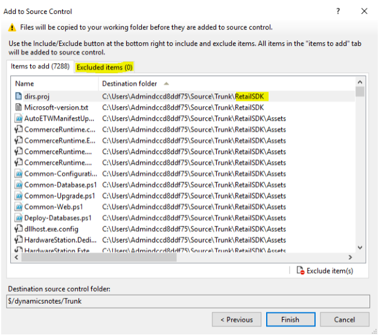](/media/9-source-control.png)
 
- Click Finish. This process will take a few minutes. 
- When complete, rename the folder to RetailSdk-mirror 

Now, you will need to branch to each branch. To do this, follow the same path that the code changes will flow, which is, first to Dev, then the Main, then to ProdRel1. 

- Select the folder for the mirror branch, right-click, and then select **Branching and Merging**, and **Branch**. 
- Go to the Dev branch, append **RetailSdk** to the name, and then click OK.
- [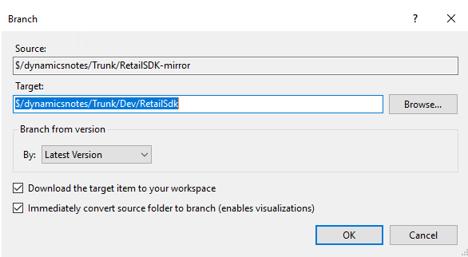](/media/10-branch-change.png).
- Using **Pending Changes**, submit the changes.  
- Next, follow the same steps to branch the **RetailSdk** folder of the Dev branch to the Main branch. 
- Finally, follow the same steps to branch the **RetailSdk** folder of the Main branch to the ProdRel1 branch. 

There are now code branches and code locations for X++ and Retail extensions. In Source Control Explorer, the file structure should look like this.  

 
You should also change the version of the Retail customization. This should be different in Dev, Main, and ProdRel1 branches. Change either the Customization.settings file or add a new global.props file in the **RetailSdk**\ **BuildTools** folder. For an example of numbering, you could number Dev as 1.0.0.x, Main as 1.0.1.x, and ProdRel1 as 1.0.2.x.  

### Prepare the development environment 

Now you can prepare the development environment for Retail development tasks. The development environment will map the Dev branch code locations for both X++ and the Retail SDK to local folders. The Metadata folder (X++) must be always mapped to the PackagesLocalDirectory. The location of the RetailSdk folder needs to follow these guidelines:

- Should be located somewhere inside the local user’s folder.
- The path should be no more than 256 characters. You could use c:\users\<username>\Source\RetailSdk.

In order to map the X++ and Retail Sdk, edit the current Workspace (Pending Changes, Actions, Workspaces…), update the current Workspace to something like this. 

[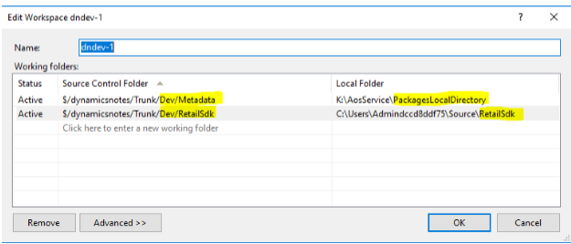](/media/12-edit-current-workspace.png)

The actual download of the files may take a few minutes.  

Regardless if there are customizations in the code branches, the following steps help to bring a development box into a state where Retail extension code can be authored and executed. Some steps may be optional, depending on what customizations are planned. 

1. Install your favorite development tools. Here's an example of an automated [script](https://dynamicsnotes.com/auto-installing-most-needed-dev-tools-in-5-mins/). 
2. Exclude the code folders from Windows Defender for a faster compile time. 
3. If there is already code in the **Dev/Metadata folder**, build all Dynamics 365 for Retail models. (To do this, select all and select database sync).
4.	To speed up the development experience, switch to IIS by following [this](https://ievgensaxblog.wordpress.com/2018/04/02/msdyn365fo-how-to-switch-from-iis-express-to-iis-on-development-vm/). This can only be done on the tier 1 VM on which you have administrative privileges (cloud-hosted environments)
5. Optional: Restore a recent copy of a production database with good data. 
     - Rename the existing database to AxDB_Orig 
     - Restore the .bak file in SQL Server Management Studio (if a .bacpac file exists, follow the steps in the [topic]  (https://docs.microsoft.com/en-us/dynamics365/unified-operations/devitpro/database/copy-database-from-azure-sql-to-sql-server).)  
     - Refresh the model store in Visual Studio. 
     - In Visual Studio, do a full build (if the source and destination environments of the database are on different versions). 
     - In Visual Studio, run a full database sync. 
     - Be sure Batch service is running. 
     - Run the Environment re-provisioning tool (Find the latest version in the Asset library and deploy it with the LCS Maintain function) 
     - Verify that the tool succeeded. The following query should show all updated local dev machine URLs: select * from dbo.RETAILCHANNELPROFILEPROPERTY where ISSYSTEMRECORD = 1 
     - In the Dynamics 365 for Retail user interface, run the Initialize Retail Scheduler to delete old data. 

6. Make sure that you now can sign into Retail with your user account.  If you were not the original Admin user in the production database, you can run the Admin Provisioning tool to take ownership. (This tool is in PackagesLocalDirectory/bin.) 
7. Verify that the CDX data sync works. In Retail, go to **Download sessions**, you should see many applied sessions. If not, select job 9999 and run it.
8. Install TypeScript version 2.2.2 from [here](https://www.microsoft.com/enus/download/details.aspx?id=48593).  
9. Do a full build of the Retail SDK from the command prompt.
      - Open MSbuild command prompt for Visual Studio 2015 as Administrator. 
      - Change the directory to where your RetailSdk is located on the local VM. 
      - Type msbuild and click Enter. 

10. Add the development/sample MPOS certificate to the local machine's trusted root certificate store ...\RetailSDK\BuildTools\ModernPOSAppxSigningCert-Contoso.pfx, password empty string. 
11. Install MPOS or MPOSOffline, run ...\RetailSDK \References\YourCompany|Contoso.ModernPOSSetupOffline.exe. This is needed to deploy the ClientBroker files.
12. In Visual Studio, open ModernPOS.sln (as admin), complete a full rebuild. 
13. Click F5 to launch MPOS in the Debugger.
14. In Finance and Operations, go to Channel profiles, find the Retail Server URL for the default channel profile, and copy it 
15. In a browser, paste the URL. You should be able to browse to your local Retail Server. 
16. In Finanance and Operations, add external user to any worker, save the password, and then do not allow password reset on first sign in 
17. In Finance and Operations, run 1060 (AX/Distribution schedule). 
18. In MPOS activation flow, activate Modern POS with same Azure Active Directory (Azure AD) user that you added above, paste the Retail Server URL, select a store <YourStore>, and register <Register>, and then sign in as the user that you just created.  
 
You should now be able to run MPOS in the debugger from your local sources.  

### Optional: Deploy a second build environment for the different branch 

In the case you need to maintain multiple releases at the same time, it becomes necessary to create deployable packages from different code branches (i.e. Main2, Main3 and/or ProdRel1, ProdRel2).

The setup steps for a second build are the same as for the first build environment. A VSTS project, including the link between the LCS project and the VSTS project, already exists at this point already.   

To separate the build environments, we suggested that you create a new VSTS Agent Queue for the release branch. Even though there are ways to share an agent queue (and its build environment) for multiple branches, this can become tricky.  

Currently, the build environment must be on the same platform and binary hotfix version as the target environment’s during deployment.  If it is not, LCS will not allow the deployment. This is because the test environment and the Main branch with Main’s build environment is already at a newer platform and/or binary hotfix version. 

First, create a new VSTS agent queue. 

Use 'PRODREL1' as the agent queue name when deploying from LCS. 
 

Next, under **Customize virtual machine names** provide a unique name and then deploy. 

The process of deploying a new build and creating a new agent queue may take a couple of hours.  

[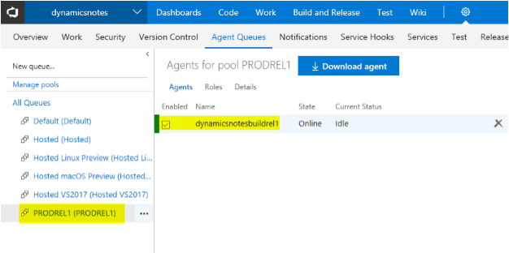](/media/15-new-agent-queue.png)
 
### Prepare the build definitions 

After following the steps earlier in this topic, you should have a single build definition and 2 agent queues with an agent each. To build different branches, you need to configure the build definition differently, which means that you need to clone the build definition. 

However, before you do this, you must first add the Retail SDK into the build so that you do not have to do this twice. To edit the existing build definition (named “Unified Operations platform - Build Main”), follow the steps in this [link](https://docs.microsoft.com/en-us/dynamics365/unified-operations/retail/dev-itpro/retailsdk/integrate-retail-sdk-continuous-build) to integrate the Retail SDK into the metadata build of the **Main** branch.
  

If you had multiple build branches and environments, just clone the build definition and name it so it becomes clear for which branch it is (clone feature available on the VSTS portal). Provide a new name for the new build definition, select the new Agent queue that you created, and change the following paths in any build steps or source mappings (change Main to ProdRel1). 

- Source mappings
- Retail SDK build step 
- Retail SDK copy binaries step 
- Build the solution step (X++ build) 
- Retail SDK copy packages step 
 
 
Here are some additional best practices or tricks: 

1. An official build can be sped up by making these changes to the Build definition (Variables section):  
     - Set DeployReports to 0 
     - Set SkipSourcePackageGeneration to 1 
2. Change the version of the Retail customization in each branch. It should be different in the Dev, Main, and ProdRel1 branches. Change either the Customization.settings or add a new global.props file under the RetailSdk\BuildTools folder. You can use any kind of numbering for the file name, for instance, you could number Dev as 1.0.0.x, Main as 1.0.1.x, and ProdRel1 as 1.0.2.x.  
3. For efficiency, shut down build or dev environments when they are not in use. 
4.	If you are using cloud-hosted tier 1 development environments (you have administrative privileges) you can switch from IISExpress to IIS. This is a little more robust because we are avoiding the switching. Details can be found [here](https://ievgensaxblog.wordpress.com/2018/04/02/msdyn365fo-how-to-switch-from-iis-express-to-iis-on-development-vm/).  
5.	For prototyping, a developer may want to change the Retail SDK right on a development VM. Always keep the original Retail SDK untouched and make a copy to work in temporarily. That way you have the opportunity to take the unchanged Retail Sdk later into your mirror branch, if needed.
6.	Currently, it is a requirement that a build environment must be on the same platform and binary hotfix version as the target environment

## Additional Resources 

### [Code and environment update procedures for Retail projects](./updating-environments.md)

### [Testing and performance](./retail-implementation-testing-performance.md)
