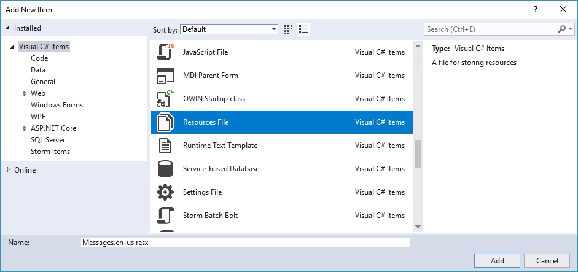
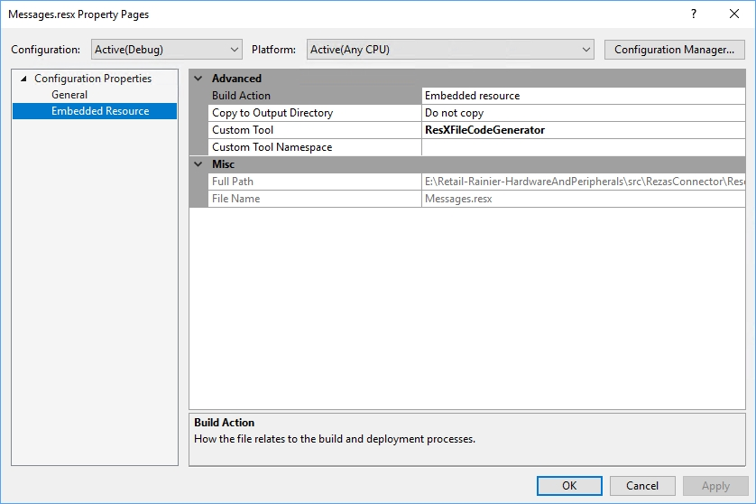

---
# required metadata

title: Custom localized error messages for payment terminal extensions
description: This topic describes how to create custom error messages for payment terminal extensions.
author: 
manager: AnnBe
ms.date: 07/20/2018
ms.topic: article
ms.prod: 
ms.service: dynamics-365-retail
ms.technology: 

# optional metadata

# ms.search.form: 
# ROBOTS: 
audience: Developer
# ms.devlang: 
ms.reviewer: josaw
ms.search.scope: Operations, Retail
# ms.tgt_pltfrm: 
ms.custom: 
ms.search.region: Global
ms.search.industry: Retail
ms.author: rassadi
ms.search.validFrom: 2018-07-20
ms.dyn365.ops.version: AX 7.0.0, Retail July 2017 update

---

# Custom localized error messages for payment terminal extensions
This topic describes how to create custom localized error messages for payment terminal extension. The most common scenario to leverage these custom error messages is when the payment terminal returns additional details on why a specific payment has failed that would be relevant to the cashier operating the POS terminal. For example, sometimes the external payment terminal/gateway might return unique identifiers (e.g. reference numbers or transaction identifiers) that would be relevant for troubleshooting with the payment provider.

## Key terms

| Term | Description |
|---|---|
| Payment connector | An extension library that is written to integrate the POS with a payment terminal. |

## Overview
This topic describes the following steps to create custom localized error messages for payment terminal extensions:

- **[Create custom error messages](#Create-custom-error-messages):** This step describes in detail how to create a custom error message in payment connector that can be returned and displayed in the POS. 
- **[Create localized error messages](#Create-localized-error-messages):** This step describes in detail how to localize the error messages in the payment connector that are returned and displayed in the POS.

## Create custom error messages
In order to trigger a custom error message in the POS the `Errors` property of the `paymentInfo` passed to the `AuthorizePaymentTerminalDeviceResponse` object has to be set with the appropriate error. In particular, the `isLocalized` parameter on the constructor of the `PaymentError` object has to be set to `true` to force the POS to use the customized error message rather than the built in error message for a decline.

``` csharp
namespace Contoso.Commerce.HardwareStation.PaymentSample 
{ 
    /// <summary>
    /// <c>Simulator</c> manager payment device class.
    /// </summary>
    public class PaymentDeviceSample : INamedRequestHandler
    {
        /// <summary>
        /// Gets the collection of supported request types by this handler.
        /// </summary>
        public IEnumerable<Type> SupportedRequestTypes
        {
            get
            {
                return new[]
                {
                    typeof(AuthorizePaymentTerminalDeviceRequest),
                    ...
                };
            }
        }

        /// <summary>
        /// Executes the payment device simulator operation based on the incoming request type.
        /// </summary>
        /// <param name="request">The payment terminal device simulator request message.</param>
        /// <returns>Returns the payment terminal device simulator response.</returns>
        public Response Execute(Microsoft.Dynamics.Commerce.Runtime.Messages.Request request)
        {
            ThrowIf.Null(request, nameof(request));

            Type requestType = request.GetType();
            Response response;

            if (requestType == typeof(AuthorizePaymentTerminalDeviceRequest))
            {
                response = this.AuthorizePayment((AuthorizePaymentTerminalDeviceRequest)request);
            }
            else if (...)
            {
                ...
            }
            else
            {
                throw new NotSupportedException(string.Format(CultureInfo.InvariantCulture, "Request '{0}' is not supported.", request));
            }

            return response;
        }

        /// <summary>
        /// Authorize payment.
        /// </summary>
        /// <param name="request">The authorize payment request.</param>
        /// <returns>The authorize payment response.</returns>
        public AuthorizePaymentTerminalDeviceResponse AuthorizePayment(AuthorizePaymentTerminalDeviceRequest request)
        {
            ThrowIf.Null(request, "request");

            ...

            // Assuming the external payment terminal/gateway returned a decline and a reference number.
            // Construct the custom error message and set the payment error on the 'paymentInfo' object set
            // on the response.
            PaymentInfo paymentInfo = new PaymentInfo();
            bool isLocalized = true;
            string errorMessage = string.Format("The payment was declined. Reference number '{0}'.", referenceNumber);
            PaymentError paymentError = new PaymentError(ErrorCode.Decline, errorMessage, isLocalized);
            paymentInfo.Errors = new PaymentError[] { paymentError };

            return new AuthorizePaymentTerminalDeviceResponse(paymentInfo);
        }
    }
}
```

The following screenshot illustrates how the customized error message will surface in the POS.


## Create localized error messages

### Create resource files for each locale
In order to return localized error messages from the payment connector to the POS create distinct files you will need to create localized resource files for each locale you plan to support. To create a resource file right click on your connector project (or a sub-folder if necessary) in Visual Studio, click on `Add` > `New Item ...`. In the new `Add New Item` window select `Visual C# Items` in the left pane and select `Resource File` in the middle pane. 



You can see an example of these files below. Note, the culture specific postfix on each file (e.g. `en-us`) is required in order for each localizes sattelite assembly to be generated. Also, make sure you have the culture neutral resources file (i.e. `Messages.resx`) defined as it serves as the fallback in case you are missing a file for a specific culture. Once created, the following files should be present in your project. Note, this illustrates only one extra local, namely `en-us`, but you can add support for as many locales as needed).


You also have to make sure that the resource files have the correct properties set in Visual Studio as shown below.



### Create custom localized error messages
Each of the resource files has to contain each of the error message you would like to customize and localize. The screenshot below illustrates an example of the resource file. Note, the entry `CustomPaymentConnector_Decline` is referenced in the code to retrieve the appropriate message for a given locale. Each of the resource files for each locale should have an identical set of localized messages.


### Load the localized message in the connector code
The example below illustrates how you can leverage the resource files created above in your payment connector code to load a localized message. The process consists of two steps, namely

1. Ensure the `TerminalSettings` are retrieved during the `OpenPaymentTerminalDeviceRequest` request to access the locale for the request.
2. Use the `Local` property on the `TerminalSettings` during the `AuthorizePaymentTerminalDeviceRequest` call (or equivalent calls) to retrieve the correct localized message resource file.

     > [!NOTE]
-    > - The example below is significantly simplified to illustrate the mechanics of loading the localized messages during the runtime of your payment connector code. However, we recommend that you introduce a new set of classes to manage loading the appropriate resource file.

``` csharp
namespace Contoso.Commerce.HardwareStation.PaymentSample 
{ 
    /// <summary>
    /// <c>Simulator</c> manager payment device class.
    /// </summary>
    public class PaymentDeviceSample : INamedRequestHandler
    {
        // Cached version of the terminal settings retrieved during the OpenPaymentTerminalDeviceRequest call.
        private SettingsInfo terminalSettings;
        
        // Resource manager to retrieve localized messages.
        private ResourceManager messagesResourceManager;
        
        /// <summary>
        /// Initializes a new instance of the <see cref="PaymentDeviceSample"/> class.
        /// </summary>
        public PaymentDeviceSample()
        {
            this.messagesResourceManager = new ResourceManager("Contoso.Commerce.HardwareStation.PaymentSample.PaymentDeviceSample .Resources.Messages", typeof(PaymentDeviceSample).GetTypeInfo().Assembly);
        }
        
        /// <summary>
        /// Gets the collection of supported request types by this handler.
        /// </summary>
        public IEnumerable<Type> SupportedRequestTypes
        {
            get
            {
                return new[]
                {
                    typeof(OpenPaymentTerminalDeviceRequest),
                    typeof(AuthorizePaymentTerminalDeviceRequest),
                    ...
                };
            }
        }

        /// <summary>
        /// Executes the payment device simulator operation based on the incoming request type.
        /// </summary>
        /// <param name="request">The payment terminal device simulator request message.</param>
        /// <returns>Returns the payment terminal device simulator response.</returns>
        public Response Execute(Microsoft.Dynamics.Commerce.Runtime.Messages.Request request)
        {
            ThrowIf.Null(request, nameof(request));

            Type requestType = request.GetType();
            Response response;

            if (requestType == typeof(OpenPaymentTerminalDeviceRequest))
            {
                response = this.Open((OpenPaymentTerminalDeviceRequest)request);
            }
            else if (requestType == typeof(AuthorizePaymentTerminalDeviceRequest))
            {
                response = this.AuthorizePayment((AuthorizePaymentTerminalDeviceRequest)request);
            }
            else if (...)
            {
                ...
            }
            else
            {
                throw new NotSupportedException(string.Format(CultureInfo.InvariantCulture, "Request '{0}' is not supported.", request));
            }

            return response;
        }
        
        /// <summary>
        /// Open the payment terminal.
        /// </summary>
        /// <param name="request">The open request.</param>
        /// <returns>The open response.</returns>
        private Response Open(OpenPaymentTerminalDeviceRequest request)
        {
            this.terminalSettings = request.TerminalSettings;
            
            ...
        }

        /// <summary>
        /// Authorize payment.
        /// </summary>
        /// <param name="request">The authorize payment request.</param>
        /// <returns>The authorize payment response.</returns>
        public AuthorizePaymentTerminalDeviceResponse AuthorizePayment(AuthorizePaymentTerminalDeviceRequest request)
        {
            ...

            // Assuming the external payment terminal/gateway returned a decline and a reference number. Construct 
            // the custom error message and set the payment error on the 'paymentInfo' object set on the response.
            PaymentInfo paymentInfo = new PaymentInfo();
            CultureInfo cultureInfo = new CultureInfo(this.terminalSettings.Locale);
            string localizedString = this.messagesResourceManager.GetString("CustomPaymentConnector_Decline", cultureInfo);
            string errorMessage = string.Format(localizedString, referenceNumber);
            bool isLocalized = true;
            PaymentError paymentError = new PaymentError(ErrorCode.Decline, errorMessage, isLocalized);
            paymentInfo.Errors = new PaymentError[] { paymentError };

            return new AuthorizePaymentTerminalDeviceResponse(paymentInfo);
        }
```
