---
# required metadata

title: Test recorder and Regression suite automation tool for Retail Cloud POS
description: This topic explains how to automate UAT testing using the POS test recorder and the Regression suite automation tool.
author: mugunthanm
manager: AnnBe
ms.date: 08/19/2019
ms.topic: article
ms.prod: 
ms.service: dynamics-365-retail
ms.technology: 

# optional metadata

# ms.search.form: 
# ROBOTS: 
audience: Developer
# ms.devlang: 
ms.reviewer: rhaertle
ms.search.scope: Operations, Retail
# ms.tgt_pltfrm: 
ms.custom: 28021
ms.assetid: 
ms.search.region: Global
# ms.search.industry: 
ms.author: mumani
ms.search.validFrom: 2019-08-2019
ms.dyn365.ops.version: AX 10.0.5

---

# Test recorder and Regression suite automation tool for Retail Cloud POS

[!include [banner](../includes/banner.md)]

[!include [preview banner](../includes/preview-banner.md)]

This topic explains how to use the new test recorder tool in Cloud POS to record business scenarios for user acceptance/UI testing and automate the test validation using the Regression suite automation tool (RSAT). The RSAT tool uses the Azure DevOps test suite to download the test cases and reports the result back to Azure DevOps with the test execution status. The test cases can be manually created in Azure DevOps or they can be synced from the LCS Business process model (BPM) to Azure DevOps and then to RSAT.

This topic applies to Dynamics 365 for Retail and Dynamics 365 for Finance and Operations version 10.0.5 and later.

> [!NOTE]
> Test recorder is supported only in Cloud POS using Chrome browser. Support for other browsers and device types will be added later.  

## Test Recorder

Test recorder is a new feature added in POS that significantly reduces the time and cost of user acceptance testing. User acceptance testing is typically required before taking a Microsoft application update or applying custom code and configurations to your Retail POS production environments.

Test recorder can record user actions in the client with exact fidelity for all the controls and DOM elements. In POS, test recorder captures the event that has occurred and stores along all pertinent information about the corresponding user action in real time. From this information, test recorder can capture the type of user action (such as a button click, value entry, or navigation) and any data that is related to the user action (such as the input data value and type, view context, or record context etc.) except for password information. Test recorder persists all the recorder information in memory during the recording and generate output file at the end of the recording with enough detail to help playback later using the RSAT tool exactly as the user performed them.

> [!NOTE]
> Test recorder captures all the data entered during the recording except for POS user passwords. Do not record any PII, secrets, sensitive, or user-specific data. All data entered during recording will be stored in the Recording.xml and other users can see it in Lifecycle service, Azure DevOps, variables.xlsx, Recording.xml, and during playback.

## Regression Suite Automation Tool

The Regression Suite Automation Tool (RSAT) enables functional power users to execute a test case in Retail POS. RSAT then updates the test execution result in Azure DevOps for reporting and investigation. RSAT provides options to investigate the test failures. RSAT decouples the test parameters from test steps and stores the parameters in Microsoft Excel files for easy editing of the test parameter values.

## Prerequisites

+ Dynamics 365 for Finance and Operations Retail POS environment. Your test environment must be running binary update 10.0.5 or later. The Regression Suite Automation Tool must have access to your test environment via a web browser.
+ You need Microsoft Excel installed to generate and edit test parameters.
+ You must have an Azure DevOps project to store and manage your test cases, test plans and test case results.

## Install and configure

### Enable Test recording in Retail POS application

To enable task recording in POS, follow these steps in Retail headquarters:

1.  Click **Retail** &gt; **Channel Setup** &gt; **POS Setup** &gt; **Registers**.
2.  Click the register to enable task recording on.
3.  On the **Register** tab, on the **General** FastTab, set the **Enable task and test recorder** option to **Yes**.
4.  Click **Save**.
5.  Go to **Retail** &gt; **Retail IT** &gt; **Distribution schedule**.
6.  Select the **Registers (1090)** job, and then click **Run now**.

## Controlling Test recorder

### Start

To Start test recorder, login to Retail Cloud POS and navigate to the **Settings** page, in the **Task and Test recorders** section, click **Open test recorder**.

[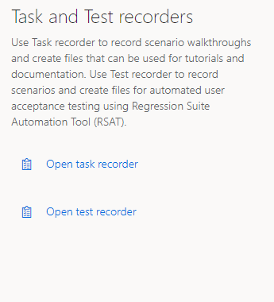](./media/CreateTest.png)

### Stop

[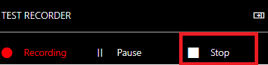](./media/Stop.png)

Click **Stop** to end the recording session. Note that you can't restart a session after you end it. Therefore, make sure that the recording is completed before you end it.

### Pause

[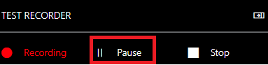](./media/Pause.png)

Click **Pause** to temporarily stop (pause) the recording session. Steps that you perform after you click **Pause** aren't recorded.

### Continue

To resume the recording session after you've paused it, click **Recording**.

[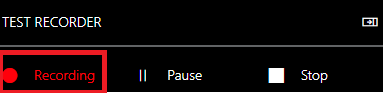](./media/Recording.png)

### Start task and End task

You can specify the beginning and end of a set of grouped steps by using the **Start task** and **End** **task** buttons. Click **Start task** to add a "Start Task" step, and then perform the steps that should be included in the group. After you've finished performing the steps for the group, click **End task**. Tasks help you organize your procedures. Tasks can be nested within other tasks. In this way, you can better organize very long and complex business processes.

### New task

### Adding annotations

An annotation is additional text that you add to a step in a recording. For example, you can use annotations to give the user more context or instructions. You can add an annotation to any step by clicking the **Edit** button (pencil symbol) to the right of the step.

### Texts and notes

You can use the **Texts** and **Notes** fields in the annotation dialog to add text that should be associated with a step in a Task guide.

+ **Text:** Text that you enter in the **Text** field appears *above* the step text in the test steps.
+ **Note:** Text that you enter in the **Notes** field appears *below* the step text in the LCS.

### Value

User input values entered during the recording can be changed here. Ex: If you added product “0005” during recording, by default this value will be stored in the Recording.xml file but if you want to change you can change it to different product id and you can change the value here. The value will show up only f there is user input.

[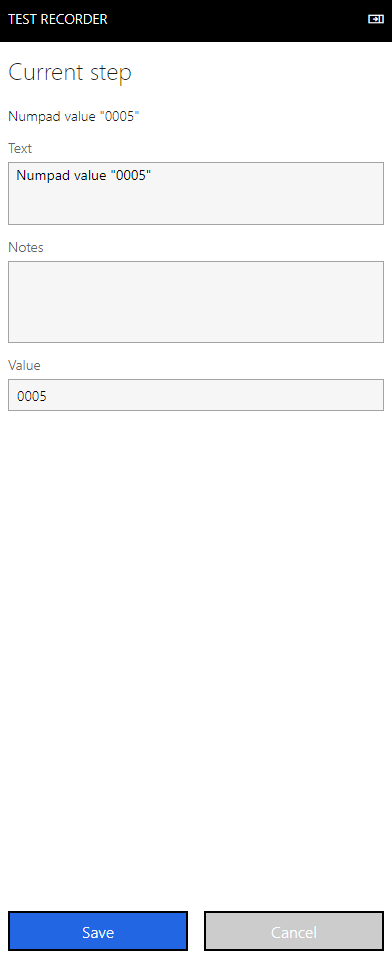](./media/EditAnnotation.png)

### Hide test recorder panel:

Click the collapse icon to hide/show the test recorder panel during recording.

### Test recorder floater control:

[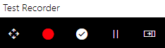](./media/Floatter.png)

We added the new test recorder floater control to help during recording when the test recorder panel is hidden. The test recorder panel overrides the non-error dialogs or and portion of the POS view and sometimes you need to hide the panel to add validation in the dialogs or click the controls etc. If the test recorder panel is hidden and if you still need to access any of the test recording functionality like validation, pause or continue you can use this floater control.

### Test recorder floater controls:

### Move:

The move control allows you to move the floater control within the POS app.

### Validation:

Turn on the validation mode and pauses the recording. You need to turn of the validation mode to continue with the recording.

### Pause:

Click **Pause** button to temporarily stop (pause) the recording session and continue with the operation. Steps that you perform after you click **Pause** aren't recorded.

### Recording:

To resume the recording session after you've paused it, click **Recording**.

### Record test case in Retail POS:

Create a recording
------------------

Follow these steps to create a new recording using test recorder:

1.  Start Retail Cloud POS, and sign in.

2.  On the **Settings** page, in the **Task Recorder** section, click **Open test recorder**.

3.  Click the Create a new recording.

[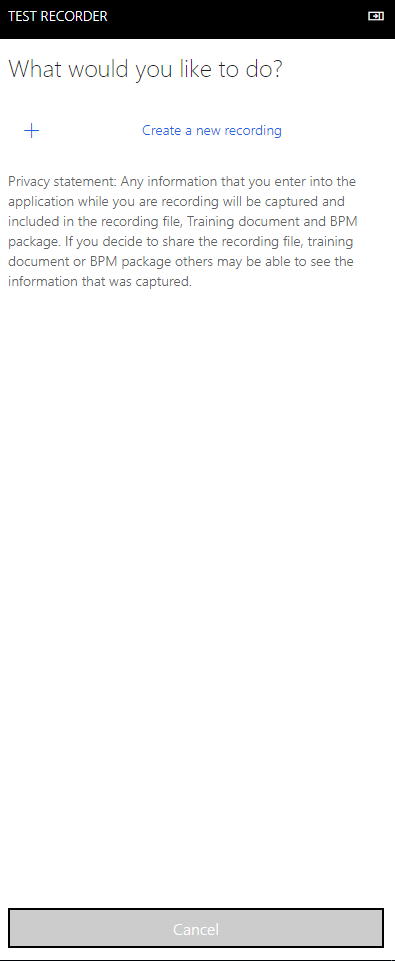](./media/Newtest.png)

4.  Enter a name and description for the recording, and then click **Start**. The recording session begins as soon as you click **Start**.

5.  After you click **Start**, test recorder enters recording mode. The **test recorder** pane shows information and controls that are related to the recording process.

6.  Perform the actions that you want to perform in the Retail POS user interface (UI).

### Validation mode:

Validation mode during recording allows the user to validate values during test execution. Ex: If you want to validate a label text, or the item price or tax is calculated correctly or validate any error message etc. can be done using the validation mode feature. To enable validation during recording enable the validation mode by clicking the enable validation mode toggle button.

7.  Turn on the Enable validation mode toggle button.

8.  Click on values or text in the POS to add the validation step. We will not be able to add validation for password, sensitive data and for fields where test recorder is not able to get the field values. Later during test execution, the playback engine will check whether the value is same or not, accordingly the test case will be passed or failed.

**Note:** In validation mode, test recorder will be in paused state, test recorder will add only validations steps and POS will not respond to any user action other than adding validation steps. Ex: In validation mode you will not be able to navigate to different POS view or perform any POS functionality. You must turn off the validation mode to continue with the recording by clicking the Enable validation mode toggle button.

9.  To end the recording session, click **Stop**.

Download options
----------------

After you end the recording session, you can download your recording by clicking the Save to this PC.

[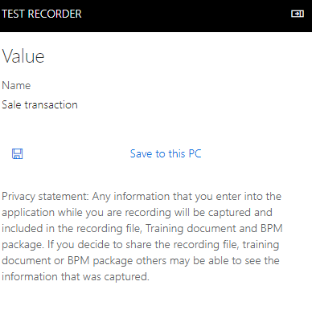](./media/Save.png)

The Recording.xml file is stored to the local file system, user have to manually upload to LCS or Azure DevOps and delete the file from the file system or secure it.
---------------------------------------------------------------------------------------------------------------------------------------------------------------------

### Install the RSAT:

**Download the Regression Suite Automation Tool.msi** to your machine and double-click it to run the installer. After installing the RSAT tool you need to install the selenium and browser drivers. The RSAT tool can be downloaded from this [link](https://www.microsoft.com/en-us/download/details.aspx?id=57357).

Note: You must setup Azure DevOps and complete the required general setting and other required settings in the RSAT tool before doing the test execution, detailed steps are mentioned  in this [link](https://docs.microsoft.com/en-us/dynamics365/unified-operations/fin-and-ops/get-started/hol-set-up-regression-suite-automation-tool). Below are the required configurations for executing the Retail POS test cases using RSAT:

### Configure the Retail POS setting:

1.  Open RSAT from your desktop.

2.  Click the “Settings” button on the top right to configure RSAT.

3.  Click the Retail POS tab.

4.  Click the **Playback environment**.

[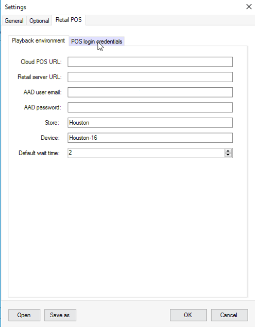](./media/Setting.png)

**Cloud POS URL:** This is the URL of your Cloud POS environment where you want to do the test execution.

**Retail Server URL:** Retail server URL to do activation. We will use this Retail Server URL to activate the device if it’s not activated before.

**AAD user email:** AAD user email address to activate the device. AAD user must have permission to activate the device.

**AAD password:** AAD user password to activate the device.

**Store:** Store id (Retail channel) to execute the test. The test will be executed in this Store.

**Device:** Device id to execute the test. The test will be executed in this device.

**Default wait time:** Wait time in seconds before failing the test case if any element is not found. During test execution the playback engine will try to find the find element till this default wait time after that it will fail the test case saying element recorded is not found or loaded for playback.

6.  Click the POS login credentials tab.

Test recorder only captures the username during the recording from the POS, it will not store any password but to execute the test we need both the login username and password to login to POS. To securely store the password information instead of the recording file, we added this tab to capture the POS logon username and password. During test execution we will map the user id used in the recording file with the same user id entered in the RSAT tool and get the password. Please enter all the username and password used during the recording in the RSAT tool so that during test execution we can map and get the password or else the test execution will fail saying logon details not found.

 

6.  Click the New button.

[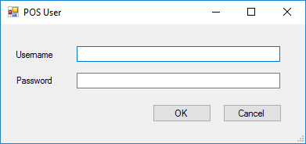](./media/EditPosUser.png)

7.  In the username field enter the POS logon username.

8.  Password field enter the POS logon password.

9.  Repeat steps 6-8 to enter different POS logon username and password.

10.  To edit the POS logon credential, click the Edit button.

11.  To delete the POS logon credential, click the Delete button.

### Run:

The following sections explain how to load test cases from Azure DevOps, generate automation files, modify test parameters, run tests, investigate results, and save your work back to Azure DevOps.

### Note: The detailed steps on how to setup Azure DevOps, test cases etc. are available in the RSAT manual, please complete those steps before starting your test execution.

### Load Test Cases and Create parameter Files

Click Load to download test cases and test case automation files from Azure DevOps. All test cases belonging to the test plan specified in the Settings dialog are downloaded.

Test cases are organized by test suites under a common test plan. These are test suites you created in your Azure DevOps project. Using this tool, you can work with one test suite at a time. If the tool fails to load any test case, verify that your test plan in Azure DevOps is properly created and contains the desired test suites and test cases.

If this is the first time you load this test plan, the Parameters File column will be blank. You must create test automation parameter files for your test cases. To execute the tests, generate the below two test automation files:

-   Test parameter files (Microsoft Excel files contain test case parameters)

-   XML files needed to execute the tests.

When you click the New button, test automation files are generated in your working directory. The Excel test parameter files will appear on the grid under Parameters File column.

For the retail test recording files ***Generate Test Execution files only*** option will be disabled because Retail Cloud POS uses the selenium web directly to do the playback so no additional script file generation is required.

[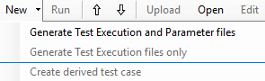](./media/RSATNewOption.png)

### Modify Test Parameters and validation values:

This section describes how to modify Excel files to specify input and validation parameters for your test run. Select one or more test cases you want to modify and click Edit. This will open an Excel window for each selected test case. Alternatively, you can open the Excel files directly from the working directory. In addition to the summary tab, the Excel file contains a variables tab which has the details of all the variables generated. Retail POS automatically generate variables for all the input values entered during the recording so you don’t need to generate the variables separately and each variables will have unique variable id and you can pass the variable id to different test cases in a single instance of execution in sequence. All the variables generated in the variables tab are organized in the sequence which they are entered during the recording.

### Validate Expected Values:

An important component of a test case is validation of expected values. You can define validation parameters during the authoring of your test cases using Test Recorder in the validation mode. Enable validation mode during recording and click all the fields to be validated while recording. This action becomes a validation step that you can use with RSAT and the validation values will also show up in the same excel file variables tab in the sequence entered, so before execution you can modify and values in the excel and test execution will use this new value for data entry and validation.

### Run

Click **Run** to execute the selected test cases. Only test cases with automation files generated can be run. The tool will open Retail POS and execute these tests with the data you entered in Excel. After the test run the results will be updated in the RSAT tool Result column and in Azure DevOps.

Note: You can modify the order in which test cases are executed using the up and down arrow buttons.

### Investigate Results

When test cases complete execution, pass or fail status will be populated in the RSAT result column. You can click on the result column to see the error messages. More investigation details are available in Azure DevOps. From your Azure DevOps project page, go to **Test &gt; Runs**.

All error messages are also available locally under: C:\\Users\\$YourUserName\\AppData\\Roaming\\regressionTool\\errormsg-&lt;TestCaseId&gt;.txt

### System and metadata files:

Below is the list of different files generated during recording, Test execution and parameters files and playback.

| File Name      | Description                                                                                                                                                                                                                                                                                   | File generation flow                                                                                 | File save flow                                                          |
|----------------|-----------------------------------------------------------------------------------------------------------------------------------------------------------------------------------------------------------------------------------------------------------------------------------------------|------------------------------------------------------------------------------------------------------|-------------------------------------------------------------------------|
| Recording.xml  | Contains all steps necessary to playback a recording, including all user-specific values for each of the steps in the recording.                                                                                                                                                              | Generated by the user when recording a test case and uploaded to DevOps to be used by the RSAT tool. | It is saved into disk when the test case is loaded into RSAT.           |
| Variables.xml  | Contains the values for each of the variables used in the recording file, used by the playback tool.                                                                                                                                                                                          | Generated when the user clicks the button ‘Generate Test Execution and Parameter Files’ in RSAT      | When the user clicks ‘Generate Test Execution and Parameter Files’.     |
| Variables.xlsx | Contains the values for each of the variables used in the recording file. It is modifiable by the user and used by the playback tool.                                                                                                                                                         | Generated when the button ‘Generate Test Execution and Parameter Files’ in RSAT                      | When the user clicks ‘Generate Test Execution and Parameter Files’.     |
| OutputLog.txt  | Contains a log of execution of the playback process. Contains a description of each of the steps executed and may contain an exception which may contain data available in the Recording.xml file based on the exception.                                                                     | Generated after execution of the playback tool in RSAT, regardless of success/failure                | When a test case is played back.                                        |
| Time.xml       | Contains the list of steps, user edited description and the amount of time taken to execute each.                                                                                                                                                                                             | Generated after execution of the playback tool in RSAT in case of success.                           | When a test case is played back successfully.                           |
| Out.xml        | Contains the values for each of the variables used in the recording file, using the updated values from Variables.xlsx for each of them. It is used by the playback tool to support test cases that depend on variables from other test cases.                                                | Generated after execution of the playback tool in RSAT, regardless of success/failure                | When a test case is played back.                                        |
| In.xml         | Contains the values for each of the variables used in the recording file of all test cases run before the current one, using the updated values from each of their Variables.xlsx file. It is used by the playback tool to support test cases that depend on variables from other test cases. | Generated before execution of the playback tool in RSAT when running multiple test cases             | When the previous test case finishes and before a new test case is run. |

The user must manually delete these files and secure it if required. All the above files are stored in RSAT working directory.

### Best Practices

### Authoring test cases using the Test Recorder:

1. Make sure all your recordings start from the POS login screen.

2. Keep individual recordings short and focus on a business task performed by one user, like creating a sale transaction. This simplifies maintainability and reusability of test cases.

3. Don’t record any scenario which includes secrets.

4. Recording and playback must be done in the same screen layout and resolution. If recording and playback done in different layout and resolution, then playback will fail.

5. Once recorded, you will not be able to change the POS username during playback. Always record using the right username which will be later used for playback.
