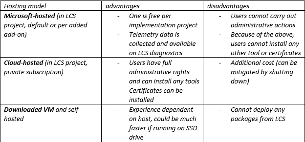
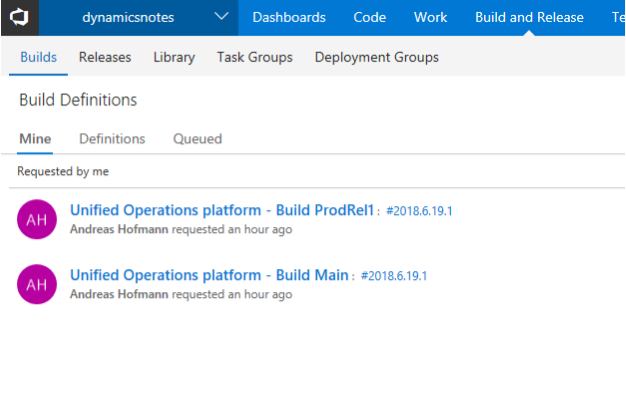

---
# required metadata

title: Recommended practices for Dynamics 365 for Retail implementation projects 
description: This topic describes recommended practices for Microsoft Dynamics 365 for Retail implementation projects
author: Andreash1
manager: AnnBe
ms.date: 02/08/2018
ms.topic: article
ms.prod: 
ms.service: dynamics-365-retail
ms.technology: 
# optional metadata

ms.search.form: 
# ROBOTS: 
audience: IT Pro
# ms.devlang: 
ms.reviewer: kfend
ms.search.scope: Operations, Retail
# ms.tgt_pltfrm: 
# ms.custom: [used by loc for topics migrated from the wiki]
ms.search.region: Global
ms.search.industry: Retail
ms.author: andreash
ms.search.validFrom: 2017-12-31
ms.dyn365.ops.version: Retail 7.3

---

# Recommended practices for Dynamics 365 for Retail implementation projects 

This topic describes recommended practices to follow during a Microsoft Dynamics 365 for Retail implemantation project. 

## Onboarding Environments, Visual Studio Team Services and branches 

Starting with the launch of AX7 the majority of environments are hosted in the cloud. They are either Microsoft-hosted (on a Microsoft subscription) or cloud-hosted (on a customer subscription). The former is the default, and the latter is usually done to have more control over a development or build environment.  See more details at [Understand Lifecycle Services](../../dev-itpro/lifecycle-services/lcs-works-lcs).

Tier 1 machines are developer or build environments. Tier 2 and up are multi-box environments for multiple test and verification purposes. Production environments are hands-off, and size of the environment is determined by the sizing process in LCS.  

A hosting alternative is to download a VHD from LCS and host it locally on a server. From a development perspective, there is no difference regarding the capabilities of the VHD images compared with a hosted VM, except that LCS deployment are not supported on VHDs. Command line deployments are still supported. 

**Development tier 1 environments** 

For Retail implementations that include code extensions, it is not recommended to use a development environment without administrative privileges. There are a multitude of tools available and OS features that would need to be configured if a development environment without administrative priviledge is used. A suggested setup is a machine hosted on a separate Azure subscription (aka. “cloud-hosted” in LCS user interface). 

There are three hosting models for a tier 1 development or build environment. Please evaluate the pros and cons to decide what works best for your project.

If you want to build your own POS extensions with an appx certificate (see below). 

Since these decisions have financial impact, one can recover some of the cost by using the free Tier 1 as a simple test environment (or golden config environment). It’s not ideal, but should work for most projects.   

Note: A user has the option to shutdown cloud-hosted environments at will. This helps reducing the hosting cost substantially.  

**Branches, build definitions and environments**

A video resource for information about Continuous Delivery for Dynamics 365 Finance and Operations implementation projects can be viewed here: 
https://mbspartner.microsoft.com/D365/Videos/101393. 

There is no single best strategy for the creation of branches. Different projects and different sizes of implementations require various approaches. The approach mentioned by Joris De Gruyter (link above) is a successful method. 

 
The diagram above illustrates 3 code branches.  

The **Dev** branch is used for daily work that is not quite ready for testing but needs to be shared with other developers. If there are larger teams, there may be multiple Dev’ branches for different features or purposes.  

The **Main** branch is for changes that meet a certain quality bar and are ready for test by others (UAT, performance tests, integration testing, sanity testing after hotfixes, etc.). Deployable packages for this branch must be created by a build environment.  It is not a good practice to generate X++ packages in a tier 1 and deploy these packages into an official test or production environment because it cannot be guaranteed that uncommitted source code changes were excluded from the build. 

The **ProdRel1** branch holds all source code exactly as it is deployed in production at any point in time.  A build environment may be used but it is not strictly required. If packages from Main branch will be deployed to production, the code should be merged (Main -> ProdRel1) after a production deployment.  But having our own branch for production gives us the opportunity to generate official builds from it if we later choose to do so. 

All three branches hold both X++ code (extensions and hotfixes in Metadata folders) and a copy of a **RetailSdk**. The RetailSdk includes base Microsoft code and code extensions and can be different in each branch. 

The **RetailSdk-mirror** folder is used to bring in Microsoft changes to the RetailSdk and is not for development or build.  It should just be updated when a next version or hotfix is used. The process is described in detail below. 

Note: For smaller Retail projects it can be sufficient to have two branches only. However, developers must be more disciplined as any code submissions immediately affect the officially tested builds.  The Main branch basically would become the Dev branch. 

We can opt to build deployable packages out of multiple branches. If we do so, we must have one build definition per buildable branch.  The initial build definition is created automatically as part of a deployment of a build environment (Main). We can make copies of it for other branches. Note that small editions must be made to incorporate the Retail code in it (more information below). 

The high level steps to set this up in a way that real development work can begin is below (see illustration above for numbering): 

- Deploy a build environment (and empty Main VSTS branch) (1) 
- Deploy a development environment 
- Create the dev and release branches (2, 3) 
- Addition of the Retail Sdk (4 - 7) 
- Preparation of development environment(s) 
- (optional) Deploy a 2nd build environment for the release branch 
- Preparation of the build definition(s) 

### Deploy a build environment (and empty Main VSTS branch) 

Use the LCS portal to deploy a new build environment. We recommend to use a cloud-hosted environment. We will have more options and capabilities if we have administrative rights. See here for a discussion why a cloud-hosted environment may be beneficial. 
If we start a brand-new project, we will have to create a new VTST project as well. In your VSTS account, click new project. 

 
Once the new VSTS project is created, we need to allow VSTS to access it. For that you need to create a new personal access token on the VSTS account. Once that is done, we need to configure the LCS project with this information: 

When the LCS project is linked to VSTS, we are ready to deploy.  
Add a new environment, pick the correct version, topology of DEVTEST, and a Build environment. In the next screen, there are two things we should setup before deploying. First, give that environment a meaningful name, then give a similar name to the build agent. 

Next, under “Customize virtual machine names” give it a unique name and then deploy. 

In a couple of hours, the build box will be deployed, build definition and Main branch will be created.  

 
### Deploy a development environment 

Use the LCS portal of your implementation project to create a cloud-hosted development environment. Make sure you are logged in the correct user account. The user account will be used to create the tenant of the development machine. As an example, if you are logged into LCS with foo@bar.com, the environment will be setup for the @bar.com tenant and expects users from that tenant. Even other users can be added to AX, the POS activation must be carried out by a user from that tenant.  There are cases where user accounts from different domains were used. That is needed for example in the case of customers, partners and other parties using emails from different domains. Coordination would have to be done during the POS activation, as only the tenant that was used during the deployment can activate.  This approach requires communication. 

Pick the correct version, then DEVTEST, then DEV, a meaningful and unique name and make sure that the machine name is also unique (inside advanced settings). In a couple of hours, the machine will be ready and can be used. 

Since we do not have the Dev branch yet, we will skip mapping our VSTS to the local directories at this time. We will do that after the next section. 

### Create the dev and release branches 

As mentioned above we need a branch that holds more frequent and less often tested changes and we need a branch that holds the source code for production. Our desired hierarchy looks like this: 

 
Follow these steps to get the branches created: 

- Log into a development environment 
- Launch Visual Studio as an administrator and make sure you are logged in with an account that has access to the VSTS project 
- In Team Explorer, connect Visual Studio to the VSTS project (if not already done) 
- Map the Trunk/Main folder to a local folder (if not already done). This is just temporary 
- In Source Control Explorer, right click the Main folder, choose Branching and Merging, Convert to Branch… 
- Right click the Main branch, chose Branching and Merging, Branch… and name the new branch Dev - using the Pending Changes, submit this change to VSTS 
- Right click the Main branch, chose Branching and Merging, Branch… and name the new branch ProdRel1 
- Using the Pending Changes, submit this change to VSTS 

At this point the Source Depot Explorer in Visual Studio looks like this: 

 
### Addition of the Retail Sdk 

We need to add the Retail Sdk to each code branch (3 branches as shown here). This will allow us very quick propagation of code changes from Dev to Main and eventually to ProdRel1, and still separate changes between these different branches, just like with the X++ code. Another reason for having the Retail Sdk live in each branch next to the X++ code is that even though they represent different technologies and deployment locations, the X++ code represents in a sense a public API that the channel side (Retail Sdk + customizations) uses. Often a change in the X++ code goes hand-in-hand with a change in the Retail Sdk (tables extension for both AX and Channel with CDX changes, or a new Realtime API that Retail Server consumes). 

The first thing we need to do is to add the mirror branch. The Retail Sdk mirror branch is needed to have a baseline for code merges when updates from Microsoft are being imported. The exact process how to take updates will be explained later.  

The mirror branch or folder is only needed once per project. Follow these steps: 

- Find the UNCHANGED Retail Sdk of the exact version you want to start your development with. It can be found on every development machine in the service drive, or in every downloaded hotfix. You can uniquely identify a version of the Retail Sdk by the Microsoft-version.txt file. This file should not be changed, except by an update to the Retail Sdk mirror folder. 
- 
- In Source Control Explorer, right click the Trunk folder and pick Add Items to Folder… 
- Then browse to the top folder for the Retail Sdk and select it (but do not drill into it) and hit Next 
- Visual Studio will calculate all files and show the files it is about to add. Make sure that the RetailSdk folder is properly under the Trunk folder 
- Also, make sure there are 0 Excluded items but marking them and hitting Include items(s) 

 
- Then hit Finish. This process will take a few minutes. 
- When done, rename the folder to RetailSdk-mirror 

Now, we need to branch out into each branch. We follow the same path the code changes will normally flow, first to Dev, then the Main, then to ProdRel1. 

- Select the folder for the mirror branch, right click and select Branching and Merging…, and Branch… 
- Browse into the Dev branch, append RetailSdk to the name and hit OK 
- 

 
Using Pending Changes, submit the changes.  

Next, carry out the same steps to branch out the RetailSdk folder of the Dev branch to the Main branch. 

Finally, carry out the same steps to branch out the RetailSdk folder of the Main branch to the ProdRel1 branch. 

We now have all code branches and code locations for X++ and Retail extensions finalized and prepared. In Source Control Explorer, it looks like this: 

 
One additional change could be done now, the version of the Retail customization. It should be different in Dev, Main and ProdRel1 branches. Change either the Customization.settings or add a new global.props file under the RetailSdk\BuildTools folder. Any numbering is fine. You could number Dev as 1.0.0.x, Main as 1.0.1.x and ProdRel1 as 1.0.2.x.  

### Preparation of development environment 

Now, we can prepare the development environment for Retail development tasks. The development environment will map the Dev branch code locations for both X++ and the Retail Sdk to local folders. The Metadata folder (X++) must be always mapped to the PackagesLocalDirectory. The RetailSdk’s location is non-critical, but should be: 

- Kept somewhere inside the local user’s folder, and 
- The path should be not too long (If any full file path will be hitting 256 characters, we will get a build error) 

Edit the current Workspace (Pending Changes, Actions, Workspaces…) to something like this: 

The actual download of the files may take a few minutes.  

No matter if we have customizations in the code branches already or not, the following steps help to bring a development box into a state where Retail extension code can be authored and executed. Some steps may be optional, depending of what customizations are planned. 

1. Install your favorite development tools (An example reccomended automated script: https://dynamicsnotes.com/auto-installing-most-needed-dev-tools-in-5-mins/). Feel free to use it.  
2. Exclude the code folders from Windows Defender for a little speedier compiles (K:, C:) at your own risk. 
3. If there is already code in Dev/Metadata folder, build all AX models (check all and select database sync) 
4. Optional: Restore a recent copy of a production database with good data 

 a. Rename existing database to AxDB_Orig 
 
 b. Restore the bak file in SQL Server Management Studio (if a bacpac file exists, follow these steps: https://docs.microsoft.com/en-us/dynamics365/unified-operations/devitpro/database/copy-database-from-azure-sql-to-sql-server)  
 
 c. Refresh the model store in Visual Studio 
 
 d. In Visual Studio, do a full build (if the source and destination environments of the database are on different versions) 
 
 e. In Visual Studio, run a full DB sync 
 
 f. Make sure Batch service is running 
 
 g. Run the Environment Re-provisioning tool (latest from global shared asset library, LCS/Maintain to deploy) 
 
 h. Verify that the tool succeeded, this query should show all updated local dev machine urls: select * from dbo.RETAILCHANNELPROFILEPROPERTY where ISSYSTEMRECORD = 1 
 
 i. Using the AX user interface, run the “Initialize Retail Scheduler” with deleting old data 

5. Make sure you now can login into AX with your user account.  If you were not the original Admin user in AX production database (if you restored), you can run the Admin Provisioning tool to take ownership (tool is in PackagesLocalDirectory/bin) 
6. Verify that CDX data sync works. In AX, go to “Download sessions”, you should see many applied sessions. If not, select job 9999 and run it 
7. Install TypeScript version 2.2.2 from https://www.microsoft.com/enus/download/details.aspx?id=48593 
8. Do a full build of the RetailSdk on command line 
 
 a. open "MSbuild command prompt for Visual Studio 2015" as Administrator 
 
 b. change directory into where your RetailSdk is located on the local VM 
 
 c. type msbuild and hit Enter, this should not cause any build errors 

9. add the development/sample MPOS certificate to the local machine's trusted root certificate store (...\RetailSDK\BuildTools\ModernPOSAppxSigningCert-Contoso.pfx, password empty string) 
10. install MPOS or MPOSOffline, run ...\RetailSDK \References\YourCompany|Contoso.ModernPOSSetupOffline.exe. This is needed only once to get the ClientBroker files deployed 
11. In Visual Studio, open the ModernPOS.sln (as admin), do a full Rebuild 
12. hit F5 to launch MPOS in the Debugger, ready to be activated 
13. in AX: Go to Channel Profiles, find the RetailServer url for the default channel profile, copy it 
14. in browser, paste the url, you should be able to browse to your local RetailServer 
15. in AX, add external user to any worker, save its password, disable password reset on first login 
16. in AX, run 1060 (AX/Distribution schedule) 
17. in MPOS activation flow: activate MPOS with same AAD user you added above for worker, paste the RetailServer url, pick store <YourStore>, register <Register>, login with user from worker above 
 
At this point you should be able to run MPOS in the debugger from your local sources.  
 
### Deploy a 2nd build environment for the release branch 

The setup steps are the same steps as for the first build environment. A VSTS project, including the linkage between the LCS project and the VSTS project, exists at this point already.   

To separate the build environments, it is suggested to create a new VSTS Agent Queue for the release branch. Even though there are ways to co-share an agent queue (and its build environment) for multiple branches it can become a little tricky.  

As of the time of this writing, a build environment must be on the same platform and binary hotfix version as the target environment’s during the deployment.  If it is not, the deployment may not be allowed by LCS. And there may be occasions when the test environment(s) (and the Main branch with Main’s build environment) is already at a newer platform and/or binary hotfix version. 

First, create a new VSTS agent queue. 

Then, choose this specific agent queue name during the deploying from LCS: 
 

Next, under “Customize virtual machine names” give it a unique name and then deploy. 

In a couple of hours, the build box will be deployed, and the new agent queue be created. 

 
### Preparation of the build definitions 
Now, subsequently from following the steps earlier, we now have a single build definition and 2 agent queues with an agent each. To build different branches, we need to configure the build definition differently, so we need to clone the build definition. However, before we do this, we must first add the Retail Sdk into the build so that we do not have to do this twice. To edit the one existing build definition (named “Unified Operations platform - Build Main”), please follow the steps in this link to integrate the Retail Sdk into the Metadata build of the **Main** branch: 

https://docs.microsoft.com/en-us/dynamics365/unified-operations/retail/dev-itpro/retailsdk/integrate-retail-sdk-continuous-build  

Once we are done, we just clone the build definition and name it so it becomes clear for which branch it is (clone feature available on the VSTS portal). We need to give the new build definition a new name, pick the new Agent queue we created and change all paths in any build steps or source mappings (change Main to ProdRel1): 

- the source mappings
- the Retail Sdk build step 
- the Retail Sdk copy binaries step 
- the “Build the solution” step (X++ build) 
- the Retail Sdk copy packages step 
 

 
Some other good practices or tricks: 

1. An official build can be sped up by making these changes to the Build definition (Variables section):
 
 a. Set DeployReports to 0 
 
 b. Set SkipSourcePackageGeneration to 1 

2. Change the version of the Retail customization in each branch. It should be different in Dev, Main and ProdRel1 branches. Change either the Customization.settings or add a new global.props file under the RetailSdk\BuildTools folder. Any numbering is fine. You could number Dev as 1.0.0.x, Main as 1.0.1.x and ProdRel1 as 1.0.2.x.  
3. To save cost, shut down build or dev environments when they are not in use 

## Testing and performance 
### User acceptance testing 

The main goal of acceptance testing is to verify that the main scenarios the business cares about function according to the expectations. The testing should not only include the customizations, but outof-the-box Microsoft functionality and non-happy path testing.  The goal is to catch any issues that may not function properly before going to the production environment.  

For best results, a proper UAT environment should be a Tier 2 – 5 environment and not a development environment. 

If one would use a development environment (Tier 1) there are scenarios where a developer using the same environment could cause errors (uncommitted source changes, debugger attached, etc.). Also, the  switching between IISExpress and IIS may cause issues. Additionally, since there is no way to know what exactly has happened on a development machine, Microsoft support will be very limited for a Tier 1 environment. 

A production environment could be used for UAT (for example as a go-live dry run). However, the disadvantage is that anything you wanted to do in SQL would have to be going though DSE service requests. That may not be timely efficient. Also, a production environment is not available for very long before the planned go-live date. 

The UAT should be done after deploying officially built deployable packages and not on Visual Studio built packages. The reason is that it cannot be proven what code changes were included in a manually built package. Only an official build system give assurance and audit trail of what exact changes are in a certain build.  

If you do use POS, make sure you use the correct user roles. You should test by logging in as both a manager and a lower-privileged cashier. 

### Performance 
#### Channel performance 

Poor performance is often caused by these factors (in the order from highest impact): 

- Additional custom Retail Server calls. By extending the product with additional RetailServer calls the performance often is decreased substantially. Not only do we have to account for additional processing, but the network latency must be considered too. It is recommended to try to avoid any additional RetailServer calls whenever possible. Often, ExtensionProperties and extending existing CRT handlers or triggers can accomplish the same tasks 
- Additional Channel Database SQL extensions. Make sure the SQL is efficient and uses proper indexes 
- The exact same custom or built-in CRT SQL queries are exercised multiple times. If it is too expensive and appropriate, caching could be applied.  

For more details, see the section on [Retail development](dev-retail-home-page). 
 
Regarding investigating store performance, please follow some of the ideas published here: https://dynamicsnotes.com/retail-channel-performance-investigations/. With this information, you should be able to answer questions like “why is scanning an item in POS so slow” or “why is the customer details view so slow”. 

#### Using telemetry data to find performance issues 
To troubleshoot Retail and Finance and Operations performance (especially slow SQL queries or SQL deadlocks), the LCS environment diagnostics page exposes valuable telemetry data. This data can be used to find potential performance issues in code, configuration, or design. More details can be found here: https://blogs.msdn.microsoft.com/axsa/2018/06/05/how-to-use-environment-monitoring-view-raw-logs/. With this information, you should be able to get an idea why certain batch processes or form loads are slow.   

#### Performance testing 

Testing the performance of a system usually makes most sense for the components where many resources are competed for because they are shared. These resources may be different for various projects, customers or requirements.  

Some of those bottlenecks may be: 

- Resource intensive calculations in Finance and Operations such as statement posting, change calculations for channel data sync, warehousing operations with large product assortment, MRP runs, etc. 
- The Finance and Operations database. 
- Retail business logic for many terminals or stores running on a few Retail Servers (either in the cloud or in a scale unit) 
- Integrated 3rd party systems (integrated either from Finance and Operations or Retail Server) 
- Realtime transaction service frequently called from Retail Server 

In general, default and non-real time POS operations are not considered a bottleneck as it has its own dedicated resource - the computer it is installed or running on.  Performance issues are more likely caused by the business logic or chatty calls to RetailServer. 

Ideally, the performance testing should be done after some initial optimizations according to the information above (https://dynamicsnotes.com/retail-channel-performance-investigations/) has already completed. If it does not perform well for a single user or process, it will not perform well concurrently either.  

Dynamics 365 F&O performance tooling is pretty mature. There are good articles on the https://docs.microsoft.com/en-us/dynamics365/unified-operations/ site. Search for PerfSdk or “Trace parser”. 

Each project is different and therefore it is not easy to give a general answer for what exact performance tests are needed to be run.  
If the transaction sales line count is pretty low (< 100,000 per day for all stores) and no custom extension code was added in the area of statement posting, it should be ok to not do a performance test for posting.  On the other hand, if the sales line count is substantially  higher or major custom changes have been added, it would be a good idea to do so. 

## Updating environments 

An environment can be updated by either updating its data or its code.  

There are multiple ways to update the data. There are good examples about how to get data into an environment here: https://docs.microsoft.com/en-us/dynamics365/unified-operations/dev-itpro/dataentities/data-entities-data-packages 

Moving the whole database can also be considered updating an environment. It’s a quick and easy way to duplicate the data from one environment to another. 

The other kind of updates is code updates. The LCS environment page keeps track of what updates have been applied and what is available to be applied. 

 
Platform code is very low-level and there is no Retail-feature that is implemented in the platform. That means, that stand-alone **Platform binary updates** will not require any Retail specific code to be retested.  Examples of features that are implemented in the platform is Data Import and Export Framework (DIXF) and the Batch framework. 

**Binary updates or hotfixes** include DLLs, scripts, channel SQL schema changes and more. All channelside hotfixes are shipped with a binary update/hotfix.  Since they are DLLs, binary updates are cumulative. If you download a binary update on Friday, you automatically get all binary hotfixes from Monday – Thursday.   

The version of a binary hotfix taken is exactly the version of the Retail Sdk’s Microsoft-version.txt file (assuming the code merging has been done correctly). 

**Application updates or hotfixes** are being delivered in X++ source code. Therefore, they are not for the channel, but for the AX side.  

Note that some updates require both an application and a binary update. It is often not trivial to figure out which ones are dependent (although sometimes this is documented). See next section for hotfix recommendations.  

### Updating data by restoring the database 

A useful and common operation is to move the whole database from one environment to another. This maybe the production database to development environments for getting ready to develop the next features. It could also be used to move the golden setup database to production as part of the go-live process.  

Whatever, the reason maybe, every time a database from a different environment is restored there are certain “links” in the database that get broken.  The Environment Reprovisioning tool is a tool that fixes all these broken links for the Default database group. It does not matter what type of environment is. The rule of thumb is, if the database comes from a different server, the retargeting tool must be run. 

The details about how to run this are outlined in: 

https://docs.microsoft.com/en-us/dynamics365/unified-operations/dev-itpro/database/copy-databasefrom-azure-sql-to-sql-server. 

The Reprovisioning tool should be run when the binary version of the target and destination database is the same. If that is not the case, either a build + dbsync (development environment) or deployment should also be done (sandbox, production).   

In many cases the Retail scheduler should be reset whenever a database. 

The list of all steps mentioned above (after restoring the database) is: 

1. Build + db sync or deployment of the AX deployable package 
2. Make sure Batch service is running 
3. Run the Environment Re-provisioning tool (latest from global shared asset library, LCS/Maintain to deploy) 
4. Verify that the tool succeeded, verify that the Retail channel profile is update with the correct urls and that the data sync jobs for the Default data group succeeded 
5. Using the AX user interface, run the “Initialize Retail Scheduler” with deleting old data 

### Taking updates frequently  

If your project is further away than a few weeks from go-live or the final UAT, it is suggested you take all hotfixes (binary, X++ and platform) on a regular schedule. We suggested to do this once a month. In fact, the more often you do this, the less issues occur as the code churn of the hotfixes is smaller. It will take substantially less time than 8 hours if you do this frequently. 

We do not suggest trying to pick and choose hotfixes as it is more error-prone and likely not worth your time. If you have a count of 1000 or even 500, you should ask yourself if you are ready to go-live. You will get a more quality product if your LCS update tile count is very low (application fixes < 100, binary fixes < 10).   

After taking new hotfixes, the results of a previous UAT become less meaningful. It would be beneficial to retest. The extent of it can be debated and is dependent on the number of files that changed.  But, if hotfixes are being taken often, especially during the implementation phase, the number of new files is not too large.   

Another possible approach is to take all hotfixes frequently and only run part of all UATs.  But when new hotfixes are taken again next time, a different part of UATs is run, in a circular fashion.  Before going live, a full UAT should be run. 

The full details about how to take updates is documented here: https://dynamicsnotes.com/dynamics-365-for-finance-and-operations-hotfix-and-deployment-cheatsheet/.   

### Updating development environments 

Deploy binary updates, and platform updates via LCS’s package deployment. 

You can sync the Metadata folder and do a full build and db sync, so you do not have to deploy AX packages.  However, it is also possible to deploy AX packages via LCS.  

If major new Retail changes have been checked in by others in the team, especially if the RetailSdk has been updated from a new binary update (and code merged), use LCS’s package deployment to deploy the retail package. Continued development does not require a package deployment after that. 

### Updating build environment 

Deploy binary updates, and platform updates via LCS’s package deployment. 

AX and Retail customization packages should NOT be deployed to a build environment. 

### Updating tier 2+ environments 

All packages should be deployed via LCS’s package deployment. The order should be platform or binary with platform, then AX, then Retail. 

### Comparing LCS tile counts 

Environments that should be at the same version level, should also have the same LCS tile counts.  If the tile counts are different, this can be caused by multiple reasons: 

- the same deployable packages have not been deployed/applied and therefore the versions are actually different 
- The scheduled task that collects the version information from an environment has not run yet. On development environments you can force the schedule task “LCSDiagnosticsCollector” to run 
- Build environment’s application update counts do not match as X++ packages are not deployed on them. Binary and platform counts should be correct. 

It maybe ok that some environments are on different versions. For example, if a developer works with the next version but the rest of the team is still working with a different release. Or, one development environment could have been kept on an older version just in case a production hotfix may have to be developed (if production is on older version as current development efforts). 

### Moving to a new version 

If you are trying to upgrade to a new version (i.e. 7.2 to 7.3 or 7.3 to 8.0), you must deploy a new environment and target that new version.  If applicable, you also need to run a code upgrade and a db upgrade. More details can be found at https://docs.microsoft.com/en-us/dynamics365/unifiedoperations/dev-itpro/migration-upgrade/code-migration-home-page. 

