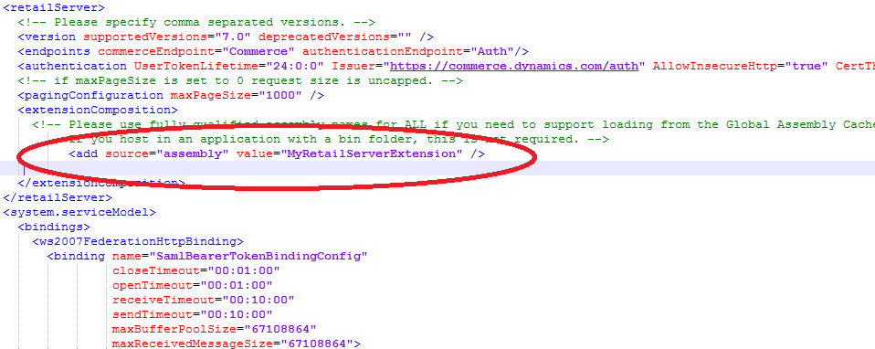

---
# required metadata

title: Create retail deployable packages
description: This topic explains how to create a retail deployable package for Microsoft Dynamics 365 Retail.
author: mugunthanm
manager: AnnBe
ms.date: 03/25/2019
ms.topic: article
ms.prod: 
ms.service: dynamics-365-retail
ms.technology: 

# optional metadata

# ms.search.form: 
# ROBOTS: 
audience: Developer
# ms.devlang: 
ms.reviewer: rhaertle
ms.search.scope: Operations, Retail
# ms.tgt_pltfrm: 
ms.custom: 28021
ms.assetid: 0fa3c8e7-49e4-417d-afe9-fa2055f6546f
ms.search.region: Global
# ms.search.industry: 
ms.author: sijoshi
ms.search.validFrom: 2016-02-28
ms.dyn365.ops.version: AX 7.0.0, Retail July 2017 update

---

# Create retail deployable packages

[!include [banner](../../includes/banner.md)]

This topic explains how to create a Retail deployable package (which is a package that contain all the extensions) for the following Retail components and deploy the package to your environment by using Microsoft Dynamics Lifecycle Services (LCS):

- Commerce runtime (CRT)
- Retail proxy
- Retail Server
- Modern POS
- Cloud POS
- Hardware station
- Channel database scripts
- Payment connector
- Retail Store Scale Unit
- Hybrid app (IOS and Android POS app)

## Retail deployable package

A retail deployable package is one combined package that contains all your customizations together with all the metadata that is required for deployment. You can use this retail deployable package to deploy your customizations to various environments. You can do the deployment by using the automated flow in LCS, or you can do it manually by using the scripts that are provided inside the package. This topic guides you through the process of generating the retail deployable package.

> [!IMPORTANT]
> All customizations for the Retail components are packaged as a single retail deployable package. Separate packages for individual Retail components, such as Modern POS, Cloud POS, Retail Store Scale Unit, CRT, and Retail Server are not supported. You must package all extensions as a single retail deployable package, even if you must merge or combine extensions from independent software vendors (ISVs) or various partners.
>
> If your customizations were built and packaged as individual Retail component packages by using a version of the Retail software development kit (SDK) that is older than application version 7.1.1541.3036, the packages are no longer supported for deployment in LCS. You must uptake the hotfix in [KB 4015062](https://fix.lcs.dynamics.com/Home/Index/0/kb/4015062?permission=Download), and then rebuild and repackage your customizations.

For detailed information about the Retail SDK, see [Retail SDK overview](retail-sdk-overview.md).

### Steps to create a retail deployable package

There are two ways to generate a retail deployable package. You can use the Retail build automation, or you can generate the package manually by using the build tools in the Retail SDK. This topic focuses on the manual method.

1. Customize or add functionality to the Retail stack.
2. Use the build tools to identify the customized installation package, code-sign it, and specify the customized CRT, Retail Server, and Hardware station assemblies, and customized database scripts.
3. After all the settings have been specified in the **Customization.settings** file in the **...\\Retail SDK\\BuildTools** folder, run **msbuild /t:rebuild** on the root of the Retail SDK folder. You can use either the MSBuild build tool or the Microsoft Visual Studio developer command-line tool to generate the retail deployable packages. Before you build the package, put all the customized assemblies in the **...\\Retail SDK\\References** folder. Additionally, put the modified configuration files, such as **CommerceRuntime.Ext.config**, **CommerceRuntime.MPOSOffline.Ext.config**, **HardwareStation.Extension.config**, and **RetailProxy.MPOSOffline.ext.config**, in the **...\\Retail SDK\\Assets** folder.

## Retail SDK build tools – Customization settings

Most of the configuration values that the Retail SDK uses to build and package customizations are set in the BuildTools\\Customization.setting files. These values define metadata that controls how binaries, components, and packages are named, versioned, and code-signed. After you define this metadata, the Retail SDK build system uses it to identify the customization assets and package them for all the Retail components.

The following configuration settings are available in the Customization.settings file:

- **AssemblyNamePrefix** – Specify the prefix name for the assembly. When you build the Retail SDK, all the assemblies are prefixed with this name.
- **CustomAssemblyVersion** – Specify the custom assembly version for all assemblies that are built by using the Retail SDK.
- **CustomVersion** – Specify the custom file version for all assemblies that are built by using the Retail SDK.
- **CustomName** – Specify the custom name for the assembly.
- **CustomDescription** – Specify the description for the assembly.
- **CustomPublisher** – Specify the publisher for the assembly.
- **CustomPublisherDisplayName** – Specify the copyright for the assembly.
- **SignAssembly** – Specify **True** to sign the assembly during the build.
- **DelaySign** – Specify **True** to delay signing of the assets during the build.
- **AssemblyOriginatorKeyFile** – Specify the strong name key to use to sign the assembly.
- **ModernPOSPackageCertificateKeyFile** – Specify the Personal Information Exchange (PFX) file to use to sign Modern POS and Hardware station.
- **RetailServerLibraryPathForProxyGeneration** – Specify the customized Retail Server assembly to use for proxy generation (both TypeScript and C\# proxies).

    For 7.1 and earlier versions, you must specify the name of the Retail Server assembly here.

    For 7.2 and later versions, use the commerce generator tool for proxy generation. However, if you're using the proxy on the e-commerce client side, specify the assembly name here.

- The **ItemGroup** section includes the following settings:

    - **ISV\_CommerceRuntime\_CustomizableFile** – Specify the details of all the customized CRT assemblies. You can have multiple entries, one for each CRT assembly.

        **Example**

        ```
        ISV_CommerceRuntime_CustomizableFile Include="$(SdkReferencesPath)\MyCrtExtension.dll"
        ```

    - **ISV\_RetailServer\_CustomizableFile** – Specify the details of all the customized Retail Server assemblies. You can have multiple entries, one for each Retail Server assembly.

        **Example**

        ```
        ISV_RetailServer_CustomizableFile Include="$(SdkReferencesPath)\MyRetailServerExtension.dll"
        ISV_RetailServer_CustomizableFile Include="$(SdkReferencesPath)\MyRetailServerExtension2.dll"
        ```

    - **ISV\_RetailProxy\_CustomizableFile** – Specify the details of all the customized Retail proxy assemblies. You can have multiple entries, one for each Retail proxy assembly. 

        **Example**

        ```
        ISV_RetailProxy_CustomizableFile Include="$(SdkReferencesPath)\MyRetailProxyExtension.dll"
        ```

    - **ISV\_HardwareStation\_CustomizableFile** – Specify the details of all the customized Hardware station assemblies. You can have multiple entries, one for each customized Hardware station assembly.

        **Example**

        ```
        ISV_HardwareStation_CustomizableFile Include="$(SdkReferencesPath)\MyHardwareStationExtension.dll"
        ```

    - **ISV\_CustomDatabaseFile\_Upgrade\_Custom** – Specify the details of all the customized database scripts.

        **Example**

        ```
        ISV_CustomDatabaseFile_Upgrade_Custom Include="$(SdkRootPath)\Database\Upgrade\Custom\SqlUpdatev1.sql"
        ```

> [!IMPORTANT]
> Before you start the build process, you must put extension assemblies in ...\\Retail SDK\\References and custom database scripts under ...\\RetailSDK\\Database\Upgrade\\Custom.

### Database scripts

Database scripts are packaged together with the Retail Server and Modern POS Offline packages, and are run when Retail Server and Modern POS are installed. If there are multiple custom database scripts, they are run in alphabetical order. Therefore, to run the scripts in a specific order, you must name them accordingly. The CRT.RETAILUPGRADEHISTORY table tracks the scripts that are already applied to the database. Therefore, the next package upgrade runs only the upgrade scripts that don't have an entry in the CRT.RETAILUPGRADEHISTORY table.

For more details about Channel database extensions, see [Channel database extensions](../channel-db-extensions.md).

## Update the extension configuration files

If you have any new extensions in CRT, Retail Server, Hardware station, or proxy, you should register the details of the extension assemblies in the \<composition\> section of the relevant extension configuration file. You can find all the extension configuration files in the ...\\RetailSDK\\Assets folder. Because all extensions are loaded based on the information in the extension configuration files, you must register your assemblies there.

Before you do the package, you must update the following configuration files if you have any customization in that area:

- **CommerceRuntime.Ext.config** – Register all your CRT extension assemblies.

    **Example**

    ```C#
    <?xml version="1.0" encoding="utf-8"?>
    <commerceRuntimeExtensions>
        <composition>
            <!-- Register your own assemblies here. -->
            <add source="assembly" value="my custom library" />
        </composition>
    </commerceRuntimeExtensions>
    ```

- **CommerceRuntime.MPOSOffline.Ext.config** – Register all your CRT extensions for offline.

    **Example**

    ```C#
    <?xml version="1.0" encoding="utf-8"?>
    <commerceRuntimeExtensions>
        <composition>
            <!-- Register your own assemblies or types here. -->
            <add source="assembly" value=" my custom library" />
        </composition>
    </commerceRuntimeExtensions>
    ```

- **HardwareStation.Extension.config** – Register all your Hardware station extensions.

    **Example**

    ```C#
    <?xml version="1.0" encoding="utf-8"?>
    <hardwareStationExtension>
        <composition>
            <! -- Register your own assemblies or types here. -->
            <add source="assembly" value=" my custom library" />
        </composition>
    </hardwareStationExtension>
    ```

- **RetailProxy.MPOSOffline.ext.config** – Register all your retail proxy extensions.

    **Example**

    ```C#
    <?xml version="1.0" encoding="utf-8"?>
    <retailProxyExtensions>
        <composition>
            <!-- Register your own proxy extension assemblies. -->
            <add source="assembly" value=" my custom library" />
        </composition>
    </retailProxyExtensions>
    ```

### Retail Server extension assemblies

Before you start the package, you must add an entry for the Retail Server extension assemblies in the \<extensionComposition\> of the Retail Server web.config file, so that the assemblies are loaded and used. You can find the web.config file in the Retail SDK\\Packages\\RetailServer\\Code folder.

The following illustration shows an example of a Retail Server web.config file.

[](./media/retail-server-web-config.png)

> [!NOTE]
> You should not add or change any custom settings in the above mentioned example or in any of the channel config files. The only supported modification is adding custom assemblies details in the composition section.
>
> Also, as part of your extension or package, do not edit any of the following config files. These config files will be updated with the latest file from core Microsoft package during deployment and your changes will be lost.
>
> - CommerceRuntime.config
> - dllhost.exe.config
> - HardwareStation.Dedicated.config
> - HardwareStation.Shared.config
> - workflowFoundation.config
> - Hardware station - Web.config

## Install NuGet.exe 

Some of the dependency packages and references have moved to NuGet packages to minimize the file merge and the size of the SDK. These are available for download from the NuGet.org. When you build the Retail SDK these dependencies are automatically pulled from the NuGet.org based on the packages.config file. For this to work, you need to install the [NuGet command line interface](https://docs.microsoft.com/nuget/tools/nuget-exe-cli-reference#installing-nugetexe) and add the nuget to the Windows path after downloading nuget.exe from NuGet.org. The following steps show how to add the nuget to the Windows path:

1. Open the Windows menu and type **Path**. The **Edit the system environment variables** will be available. 
2. In that menu, click **Environment variables** on the lower right.
3. In the next window, under **System variables**, select **Path** and click **Edit**.
4. Add an entry for the folder where you would like to store the nuget.exe file or store the nuget.exe file in a folder that is already listed.

## Generate a retail deployable package

To generate the retail deployable package, open the MSBuild build Command Prompt window. (On the developer virtual machine, search for **msbuild** on the **Start** menu.) Then run the following command.

```
msbuild /p:Configuration=Release
```

You can also run the same command in the Microsoft Visual Studio 2015 developer command-line tool.

### Packages

After the build is completed, retail deployable packages are generated as a zip file (RetailDeployablePackage.zip) in the Retail SDK\\Packages\\RetailDeployablePackage folder.

> [!NOTE]
> There won't be separate packages the various Retail components. All the packages will be combined into one bundle package that is named RetailDeployablePackage.

## Deploy the retail deployable packages

For information about how to deploy the packages either manually or by using the automated flow in LCS, see [Apply a deployable package](../../../dev-itpro/deployment/apply-deployable-package-system.md) and [Install a deployable package](../../../dev-itpro/deployment/install-deployable-package.md).
