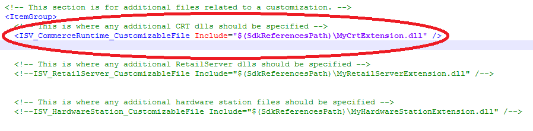
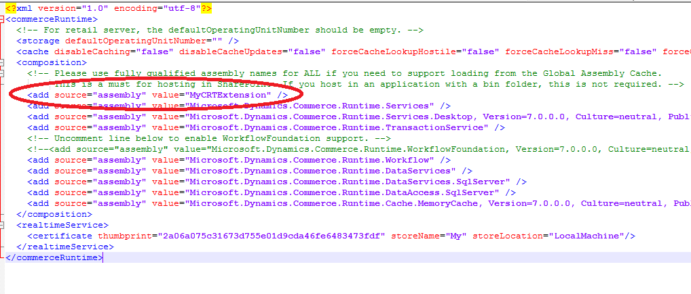
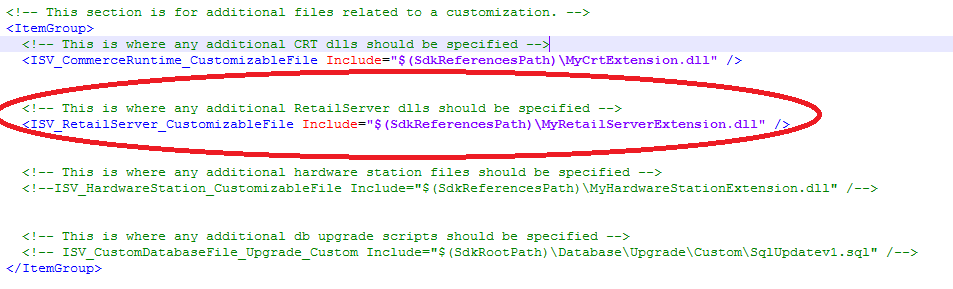
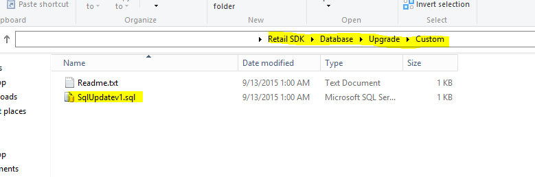
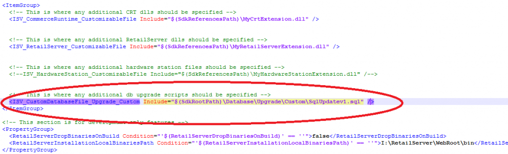

---
# required metadata

title: Retail SDK packaging
description: This topic explains how to create a Retail deployable package for Microsoft Dynamics 365 for Finance and Operations.
author: mugunthanm
manager: AnnBe
ms.date: 11/14/2017
ms.topic: article
ms.prod: 
ms.service: dynamics-365-retail
ms.technology: 

# optional metadata

# ms.search.form: 
# ROBOTS: 
audience: Developer
# ms.devlang: 
ms.reviewer: josaw
ms.search.scope: Operations, Retail
# ms.tgt_pltfrm: 
ms.custom: 28021
ms.assetid: 0fa3c8e7-49e4-417d-afe9-fa2055f6546f
ms.search.region: Global
# ms.search.industry: 
ms.author: sijoshi
ms.search.validFrom: 2016-02-28
ms.dyn365.ops.version: AX 7.0.0, Retail July 2017 update

---

# Retail SDK packaging

[!include [banner](../../includes/banner.md)]

This topic explains how to package customizations for the following artifacts and deploy it to your environment using LCS.

-   Commerce runtime (CRT)
-   Retail Server
-   Modern POS
-   Cloud POS
-   Hardware station
-   Channel database scripts
-   Payment connector
-   Retail store scale unit(RSSU)
-   Hybrid app (IOS and Andriod POS app)

## Retail deployable package
Retail deployable package is one combined package which contain all your customizations packaged together with all the necessary metadata for deployment. You can use this retail deployable package to deploy your customization to different environment using LCS or manually using the scripts provided inside this package. In this document we will walkthrough how you can generate this package.

**Note:** All customizations for the retail components or packaged as a single retail deployable package, we don't support separate package for individual retail components like Modern POS, Cloud POS, RSSU, CRT, Retail server etc. You must package all extension as one retail deployable package, even if you have ISV extensions or different partner extensions all has to be packaged together for now becuase we don't support individual retail components deployment. If your customizations were built and packaged using Retail SDK prior to application version 7.1.1541.3036 as individual retail component packages, these are no longer supported for deployment in LCS. You must uptake the below hotfix and re-build and re-package your customizations for retail components.

-   [KB 4015062](https://fix.lcs.dynamics.com/Home/Index/0/kb/4015062?permission=Download)

For detailed information about the Retail software development kit (SDK), see [Retail SDK overview](retail-sdk-overview.md). 

### Steps to create a Retail deployable package

There are two ways to generate the Retail deployable package. One is using the Retail build automation or manually using the build tools in Retail SDK. In this topic we will focus on the manual way.
1. Customize or add functionality to the Retail stack.
2. Use the build tools to give an identity to the customized installation package, code-sign it, and specify the customized CRT, Retail Server, customized Hardware station assemblies, and customized database scripts.
3. After all the settings have been specified on Customization.settings file under ...\Retail SDK\BuildTools folder, run **msbuild /t:rebuild** on the root of the Retail SDK folder using the msbuild or VS dev command prompt tool to generate the retail deployable packages. Before building the package, place all the customized assemblies to ...\Retail SDK\References folder and also place the modified config files like CommerceRuntime.Ext.config, CommerceRuntime.MPOSOffline.Ext.config, HardwareStation.Extension.config and RetailProxy.MPOSOffline.ext.config to the ...\Retail SDK\Assets folder.

## Retail SDK build tools – Customization settings
BuildTools\Customization.setting files is where most of the configuration values for the Retail SDK are set for build and packaging. These values control how binaries, components, and packages are named, versioned, and code-signed. After you define this metadata, The Retail SDK build system uses it to give an identity to the assets, and to package the customization assets for all the Retail components.

The following list of configurations is available in Customization.Settings file:
-   **AssemblyNamePrefix** – Specify the prefix name for the assembly. When you build the Retail SDK, all the assemblies are prefixed with this name.
-   **CustomAssemblyVersion** – Specify the custom assembly version for all assemblies that are built by using the Retail SDK.
-   **CustomVersion** – Specify the custom file version for all assemblies that are built by using the Retail SDK.
-   **CustomName** – Specify the custom name for the assembly.
-   **CustomDescription** – Specify the description for the assembly.
-   **CustomPublisher** – Specify the publisher for the assembly.
-   **CustomPublisherDisplayName** – Specify the copyright for the assembly.
-   **SignAssembly** – Specify **True** if you want to sign the assembly during the build.
-   **DelaySign** – Specify **True** if you want to delay signing of the assets during the build.
-   **AssemblyOriginatorKeyFile** – Specify the strong name key to use to sign the assembly.
-   **ModernPOSPackageCertificateKeyFile** – Specify the PFX file to use to sign Modern POS and Hardware station.
-   **RetailServerLibraryPathForProxyGeneration** – specify the customized Retail Server assembly to use for proxy generation (both TypeScript and C\# proxy - You have to specify the Retail Server assembly name here for 7.1 and previous versions, starting from 7.2 use the commerce generator tool for proxy generation but if you are using the proxy in the e-commerce client side then add the assembly name here).
-   In the **ItemGroup** section:
    -   **ISV_CommerceRuntime_CustomizableFile** – Specify all the customized CRT assembly details here. You can have multiple entries, one for each  CRT assembly.
        **Ex:** ISV_CommerceRuntime_CustomizableFile Include="$(SdkReferencesPath)\MyCrtExtension.dll"
    -   **ISV_RetailServer_CustomizableFile** – Specify all the customized Retail Server assembly details here. You can have multiple entries, one for each Retail Server assembly.
        **Ex:** ISV_RetailServer_CustomizableFile Include="$(SdkReferencesPath)\MyRetailServerExtension.dll"
           ISV_RetailServer_CustomizableFile Include="$(SdkReferencesPath)\MyRetailServerExtension2.dll"
    -   **ISV_RetailProxy_CustomizableFile** - Specify all the customized Retail proxy assembly details here. You can have multiple entries, one for each Retail proxy assembly. 
        **Ex:** ISV_RetailProxy_CustomizableFile Include="$(SdkReferencesPath)\MyRetailProxyExtension.dll"
    -   **ISV_HardwareStation_CustomizableFile** – Specify all the customized Hardware station assembly details here. You can have multiple entries, one for each customized Hardware station assembly.
       **Ex:** ISV_HardwareStation_CustomizableFile Include="$(SdkReferencesPath)\MyHardwareStationExtension.dll"
    -   **ISV_CustomDatabaseFile_Upgrade_Custom** – Specify all the customized database scripts details here.
       **Ex:** ISV_CustomDatabaseFile_Upgrade_Custom Include="$(SdkRootPath)\Database\Upgrade\Custom\SqlUpdatev1.sql"

**Note: Please make sure you place all your extension assemblies in ...\Retail SDK\References and custom DB scripts in ...\RetailSDK\Database\Upgrade\Custom before starting the build process**

### CRT extension assemblies
By default, there is no separate package for individual retail components, because CRT isn't deployed individually, instead, CRT assets are packaged together with other application components, such as Modern POS, Retail Server, and Microsoft Dynamics 365 for finance and Operations HQ. In order for the Retail SDK build tools to package CRT in all the components where it's used, you must make the following configuration entries:

1.  **CRT extension assemblies** – These will be the new assemblies where you've written CRT extensions. Specify an entry for CRT extension assemblies in Retail SDK\\BuildTools\\Customization.settings. 

    
    
2.  **CRT commerceruntime.config file** – If you have a new CRT assembly, you must add it to the CRT configuration file so that the runtime can load it. Specify an entry for CRT extension assemblies in Retail SDK\\References\\commerceruntime.config. 

    

#### Retail Server extension assemblies
1.  **Retail Server extension assemblies** – These will be the new assemblies where you've written Retail Server customizations. Specify an entry for CRT extension assemblies in Retail SDK\\BuildTools\\Customization.settings. 

    
    
2.  **Retail Server web.config file** – You must add an entry for Retail Server extension assemblies to the Retail Server web.config file, so that they are loaded and used. Specify an entry for Retail Server Extension assemblies in Retail SDK\\Packages\\RetailServer\\Code\\web.config. 

    

##### Database scripts
As a part of a customization, you might have to upgrade a channel database in addition to a Modern POS offline database. Currently, you use upgrade SQL scripts to upgrade the channel and Modern POS offline databases. You can write an upgrade SQL script and put it at Retail SDK\Database\Upgrade\Custom, so that packaging tools can pick it up and include it in the deployable package for the correct components (Retail Server and Modern POS Offline). 

 
You must also update Retail SDK\\BuildTools\\Customization.settings to instruct the build tools which files to package for the database. 

Database scripts are packaged together with the Retail Server and Modern POS Offline packages, and are run when Retail Server and Modern POS are installed. If there are multiple custom database scripts, they are run in alphabetical order. Therefore, if you want to run the scripts in a specific order, you must name them accordingly. The CRT.RETAILUPGRADEHISTORY table keeps track of which scripts are already applied to the database. Therefore, the next database upgrade will run only those upgrade scripts that don't have an entry in the CRT.RETAILUPGRADEHISTORY table.

## Update the extension config files

## Generate a retail deployable package

The Retail SDK fully supports msbuild. To build the Retail SDK and , open a **Visual studio 2015 developer Command Prompt tool** window as an administrator, and run **msbuild** (or, for a non-debug version, run **msbuild /p:Configuration=Release**). 

### Packages

After the build is completed, retail deployable packages(RetailDeployablePackage.zip) is generated in the Retail SDK\Packages\RetailDeployablePackage folder. Note: There will not be any separate packages for retail, all will be combined and created as one bundle package called RetailDeployablePackage
      
 ## Deploy the retail deployable packages
 
To deploy the packages either manually or by using the LCS automated flow, refer to the following topics, [Apply a deployable package](../../../dev-itpro/deployment/apply-deployable-package-system.md) and [Install a deployable package](../../../dev-itpro/deployment/install-deployable-package.md).
