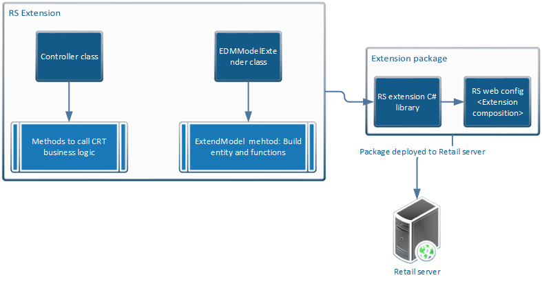

---
# required metadata

title: Create new Retail Server extension
description: This topic explains how to create new Retail Server extension.
author: mugunthanm
manager: AnnBe
ms.date: 08/25/2019
ms.topic: article
ms.prod: 
ms.service: dynamics-365-retail
ms.technology: 

# optional metadata

# ms.search.form: 
# ROBOTS: 
audience: Developer
# ms.devlang: 
ms.reviewer: rhaertle
ms.search.scope: Operations, Retail
# ms.tgt_pltfrm: 
ms.custom: 28021
ms.assetid: 
ms.search.region: Global
# ms.search.industry: 
ms.author: mumani
ms.search.validFrom: 2019-08-2019
ms.dyn365.ops.version: AX 10.0.5

---

# Create new Retail Server extension

[!include [banner](../includes/banner.md)]

This document explains how to create new Retail Server (RS) API and expose it for POS or other clients to consume. Modifying the existing Retail server APIs are not supported.

There are only a few end-to-end Retail Server extension samples including CRT in the Retail SDK. You can use these sample as template to start your extensions. You can find the sample extensions in the **RetailSDK\\SampleExtensions\\RetailServer** folder.

## End-to-end sample repository in Retail SDK

| Sample Extension<br>(RetailSDK\\SampleExtensions\\RetailServer)  | CRT sample<br>(RetailSDK\\SampleExtensions\\CommerceRuntime) | POS Sample<br>(RetailSDK\\POS\\Extensions) |
|---------------------------------------------|--------------------------------------------|----------------------------------------|
| Extensions.StoreHoursSample                 | Extensions.StoreHoursSample                | StoreHoursSample                       |
| Extensions.SalesTransactionSignatureSample  | Extensions.SalesTransactionSignatureSample | SalesTransactionSignatureSample        |
| Extensions.PrintPackingSlipSample           | Extensions.PrintPackingSlipSample          |                                        |
| Extensions.CrossLoyaltySample               | Extensions.CrossLoyaltySample              |                                        |

## Create a new RS extension
Follow these steps to create new RS extensions.

### End-to-end flow

The following image describes the flow of the extension.



### RS extension class diagram

The following diagram shows the class structure of the extension.


### Steps

1. Before creating the Retail server extension, create the Commerce Runtime extension. RS APIs should not have any logic other than calling the commerce runtime with the parameters.
2. Create new C\# class library project using the .NET target framework minimum 4.6.1.
3. Add a reference to your CRT extension library or project to the RS extension project. This lets you call the CRT request and response, lets you use the entities from the Retail Server extension project.
4.  Inside the RS extension project create a new controller class that extends **NonBindableOperationController** or **CommerceController**. The base class depends on your scenario. The **Controller** class will contain the method to be exposed by the RS API. Inside the controller class add methods to call the commerce runtime request.

```C#
/// <summary>;
/// The controller to retrieve a new entity.
/// <summary>
[ComVisible(false)]
public class SampleController : CommerceController<SampleEntity, long>;
{
    ///<summary>;
    /// Gets the controller name used to load extended controller.
    /// <summary>
    public override string ControllerName
    {
        get { return "SampleEntity"; }
    }

    /// <summary>;
    /// Gets the sample entity.
    /// <summary>;
    /// <param name="parameters">The parameters to this action.</param>
    /// <returns>The list of sample entity.</returns>
    [HttpPost]
    [CommerceAuthorization(CommerceRoles.Anonymous, CommerceRoles.Customer, CommerceRoles.Device, CommerceRoles.Employee)]
    public System.Web.OData.PageResult<SampleEntity> GetSampleEntity(ODataActionParameters parameters)
    {
        if (parameters == null)
        {
            throw new ArgumentNullException("parameters");
        }

        var runtime = CommerceRuntimeManager.CreateRuntime(this.CommercePrincipal);
        QueryResultSettings queryResultSettings = QueryResultSettings.SingleRecord;
        queryResultSettings.Paging = new PagingInfo(10);
        var request = new CRTDataRequest((string)parameters["key"]) { QueryResultSettings = queryResultSettings };
        PagedResult<SampleEntity> sample = runtime.Execute<CRTDataResponse>(request, null);
        return this.ProcessPagedResults(sample);
    }
}
```

5.  Create the new **EdmModelExtender** class that extends the **IEdmModelExtender** interface. The **EdmModelExtender** (EDM) class contains the abstract data model that is used to describe the data exposed by an RS API. An OData Metadata Document is a representation of a service's data model exposed for client consumption. The central concepts in the EDM are entities, relationships, entity sets, actions, and functions.

    The **IEdmModelExtender** interface contains the abstract **ExtendModel** method. When you extend this interface you must implement the **ExtendModel** method. Inside the **ExtendModel** is where you will build your EDM entities and functions that are exposed for the client using the **CommerceModelBuilder** class.

    The CommerceModelBuilder Contains the build method to build the entities and functions:

    | Method name              | Return type                                      | Description                                    |
    |--------------------------|--------------------------------------------------|------------------------------------------------|
    | BuildEntity\<TEntity\>() where TEntity : class                              | EntityTypeConfiguration\<TEntity\>       | Builds the entity.                                                             |
    | BuildEntitySet\<TEntity\>(string entitySetName) where TEntity : class       | EntitySetConfiguration\<TEntity\>        | Builds entity set.                                                             |
    | BuildComplexType\<TComplexType\>() where TComplexType : class               | ComplexTypeConfiguration\<TComplexType\> | Builds complex entity type.                                                    |
    | BuildEnumType\<TEnumType\>()                                                | EnumTypeConfiguration\<TEnumType\>       | Builds enumeration type.                                                       |
    | BindAction(string actionName)                                               | ActionConfiguration                      | Binds action in the model builder. An action represents a HTTP POST request.   |
    | BindEntityAction\<TEntity\>(string actionName) where TEntity : class        | ActionConfiguration                      | Binds entity action of the model. An action represents a HTTP POST request.    |
    | BindEntitySetAction\<TEntity\>(string actionName) where TEntity : class     | ActionConfiguration                      | Binds entity set action. An action represents a HTTP POST request.             |
    | BindFunction(string functionName)                                           | FunctionConfiguration                    | Binds function in the model builder. A function represents a HTTP GET request. |
    | BindEntityFunction\<TEntity\>(string functionName) where TEntity : class    | FunctionConfiguration                    | Binds entity function of the model. A function represents a HTTP GET request.  |
    | BindEntitySetFunction\<TEntity\>(string functionName) where TEntity : class | FunctionConfiguration                    | Binds entity set function. A function represents a HTTP GET request.           |

    The following examples shows who to extend the EDM model.

    ```C#
    /// <summary>;
    /// The class to extend the EDM model.
    /// <summary>;
    [Export(typeof(IEdmModelExtender))]
    [ComVisible(false)]
    public class EdmModelExtender : IEdmModelExtender
    {
        /// <summary>;
        /// Extends the EDM model.
        /// <summary>;
        /// <param name="builder">The builder to build the EDM model.</param>
        public void ExtendModel(CommerceModelBuilder builder)
        {
            ThrowIf.Null(builder, "builder");
            // Extends entity sets.
            builder.BuildEntitySet<SampleEntity>("SampleEntity");
            // Extends entity set actions.
            var action = builder.BindEntitySetAction<SampleDataModel.StoreDayHours>("GetSampleEntity");
            action.Parameter<string>("Key");
            action.ReturnsCollectionFromEntitySet<SampleEntity>("SampleEntity");
        }
    }
    ```

6.  Build the extension project and drop the binary in the \\RetailServer\\webroot\\bin\\Ext folder.
7.  Update the Retail server web.config form the \\RetailServer\\webroot folder with the new RS extension library name under the extension composition section.

    ```
    <extensionComposition>
    <!-- Please use fully qualified assembly names for ALL if you need to support loading from the Global Assembly Cache.
    If you host in an application with a bin folder, this is not required. -->
    <add source="assembly" value="SampleExtension" >;
    </extensionComposition>
    ```

8.  Restart the Retail server in IIS to load the new RS extension.
9.  To verify the extension successfully loaded, you can browse the metadata of the Retail Server and confirm that your entities and methods show up in the list.

    To browse the Retail server metadata, use the below URL type in the browser:

    **https://Your retail server URL/Commerce/$metadata**

10. To call the Retail Server extension in your client, you need to generate the Retail proxy. Using the generated proxy you can call your new RS APIs from the client.

    To generate the proxy, follow the steps mentioned in [Generate Retail proxy](typescript-proxy-retail-pos).


