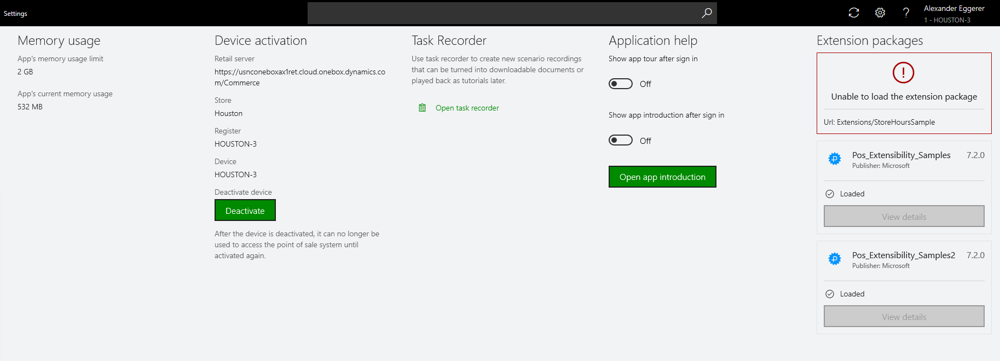

---
# required metadata

title: View POS extension package information
description: This article describes the steps for merging the build systems for both Dynamics 365 for Finance and Operations, and Dynamics 365 for Retail using Azure DevOps.  
author: mumani
manager: AnnBe
ms.date: 02/25/2019
ms.topic: article
ms.prod: 
ms.service: dynamics-365-retail
ms.technology: 

# optional metadata

# ms.search.form: 
# ROBOTS: 
audience: Developer
# ms.devlang: 
ms.reviewer: josaw
ms.search.scope: Operations, Retail
# ms.tgt_pltfrm: 
ms.search.region: Global
# ms.search.industry: 
ms.author: mumani
ms.search.validFrom: 2019-02-25
ms.dyn365.ops.version: AX 10.0.1

---

# View POS extension package information

[!include [banner](../includes/banner.md)]

> [!NOTE]
> This topic applies to Dynamics 365 for Finance and Operations, and to Microsoft Dynamics 365 for Retail with application update 10.0.1 or later.

There is a section under “Extension packages” in the point of sale (POS) **Settings** view that shows the list of POS extension packages included as part of the core POS. Under each package, you can view the status of the package--whether the extension is loaded, failed, or skipped.

## Extension package status

This section describes what each status means.

   - **Loaded**: This status means that the extension package loaded successfully.

   - **Failed**: The extension package was not loaded.

   - **Skipped**: The package was skipped and not loaded. In the extension manifest, you can specify that the package should be loaded for a particular locale and skipped in all the other locales. For example, you can specify that the extension be loaded only in “en-fr” and skipped in all the other locales. 

## Extension package details

If there's an issue with loading an extension or if there's a conflicting extension, you can view the details of each extension package and use that information to troubleshoot which extension file may be causing the issue.

To view the details of each extension package, click **View details** under the **Package details** tile. POS will navigate to a new view where you can see the details of all the individual extensions within the package. If any of the extensions failed to load or were skipped, the details will appear in the right pane. The status column shows the status of the individual extensions within that package, the name column shows the name of the extension type, and the path column shows the path of the implementation file within the package. The description of each extension is also shown in the right details pane when you click the specific line item.

The information in this view is based on the manifest file included in the extension package. The POS extension loader loads all the extension packages and updates the status, including any errors logged.

