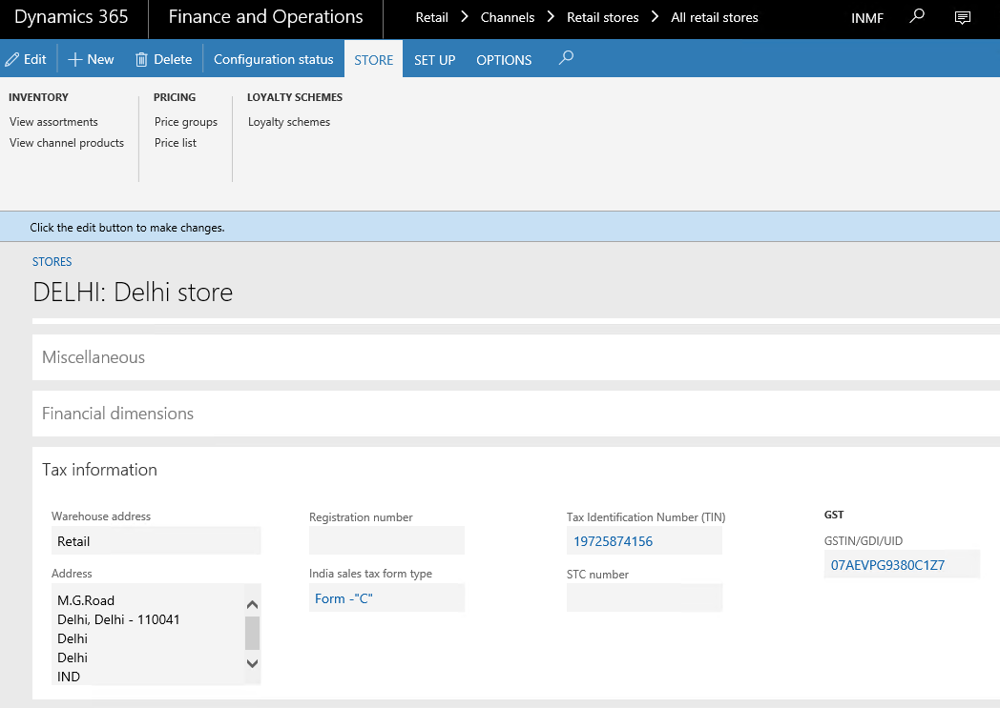
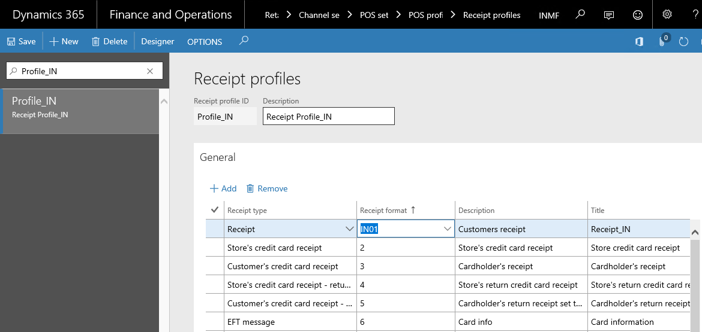
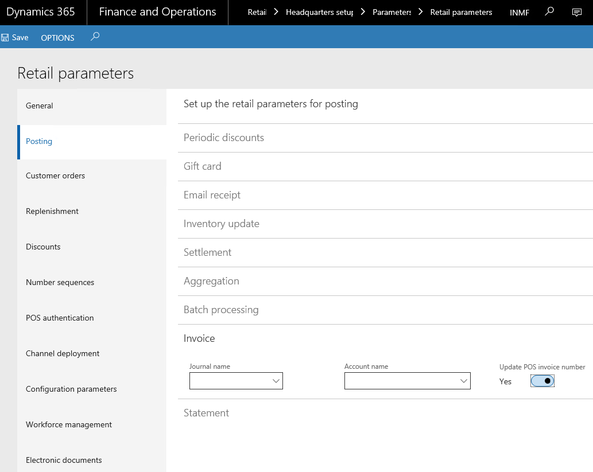

---
# required metadata

title: GST integration for cash registers for India
description: This topic provides an overview of the cash register functionality that is available for India. It also provides guidelines for setting up the functionality.
author: EvgenyPopovMBS 
manager: annbe
ms.date: 01/31/2018
ms.topic: article
ms.prod: 
ms.service: dynamics-365-retail
ms.technology: 

# optional metadata

# ms.search.form: 
audience: IT Pro
# ms.devlang: 
ms.reviewer: shylaw
ms.search.scope: Retail, Operations
# ms.tgt_pltfrm: 
# ms.custom: 
ms.search.region: India
ms.search.industry: Retail
ms.author: v-pakris
ms.search.validFrom: 2018-1-31
ms.dyn365.ops.version: 7.3.1
---
# GST integration for cash registers for India

This topic provides a walkthrough of the features that are related to Goods and Services Tax (GST) in Microsoft Dynamics 365 for Retail. This document also highlights the effect of GST on various type of retail business transactions, and shows the accounting and posting of retail transactions with the receipt printed at the POS.

> [!NOTE]
  > This topic applies to both Dynamics 365 for Finance and Operations, Enterprise edition, and to Dynamics 365 for Retail.

## Prerequisites 

- Execute [Goods and Services tax configuration in Dynamics 365 for Finance and Operations, Enterprise edition](./???)
> [!NOTE] TODO: add a link
- Configure Retail channel components: to enable India-specific functionality, you must configure extensions for Retail channel components. For more information, see the [deployment guidelines](./apac-ind-loc-deployment-guidelines.md).
  
## India tax entities mapped in Dynamic 365 for Retail
The navigation path for the India tax entities are different in the **Dynamics 365 for Retail** and **Dynamics 365 for Finance and operations, Enterprise edition**. For information about the navigation path in Dynamics 365 for Finance and Operations, Enterprises edition, see [Goods and Services tax configuration in Dynamics 365 for Finance and Operations, Enterprise edition](./???). The below table guides the navigation path for the India tax entities in the **Dynamics 365 for Retail**.

| **India tax entities**              | **Navigation path in Dynamics 365 for Retail**                                |
|-------------------------------------|-------------------------------------------------------------------------------|
| Business verticals                  | Retail \> Channel setup \> Sales taxes \> Business verticals                  |
| Enterprise tax registration numbers | Retail \> Channel setup \> Sales taxes \> Enterprise tax registration numbers |
| GST reference number sequence group | Retail \> Channel setup \> Sales taxes \> GST reference number sequence group |
| HSN codes                           | Retail \> Channel setup \> Sales taxes \> HSN codes                           |
| Service accounting codes            | Retail \> Channel setup \> Sales taxes \> Service accounting codes            |
| Maintain setoff hierarchy profiles  | Retail \> Channel setup \> Sales taxes \> Maintain setoff hierarchy profiles  |
| VAT schedules                       | Retail \> Channel setup \> Sales taxes \> VAT schedules                       |
| Tax setup                           | Retail \> Channel setup \> Sales taxes \> Tax configuration \> Tax setup      |

## Additional setup for Retail solutions

### Validate tax information for the retail store

The tax information on the Retail store, defaults from the selected retail warehouse as defined in the Warehouse master. The configured tax information from the store gets printed on the POS receipt and updates on the retail sales order at the headquarter for the financial postings.

1.  Go to **Retail** \> **Channels** \> **Retail stores** \> **All retail stores**.
2.  Select a retail store.
3.  Click the **Tax information** FastTab.

Configure Language text and custom fields 
------------------------------------------

This content guides to configure the **Language text** and **Customs fields** that can be used in the receipt format for the POS receipts.

The **Language ID**, **Text ID**, and **Text **values that are shown in the screenshot are just examples. These values can be change as per the requirement.

The default company of the user creating the receipt setup should be the same as the legal entity in which the Language text setup is created. Alternatively, the same language texts should be created in both the default company of the user and the legal entity of the store for which the setup is being created.

**Language text**

1.  Go to **Retail** \> **Channel** s**etup** \> **POS setup** \> **POS profile \> Language text**.
2.  Click the **POS** tab.
3.  Click **POS language text** fasttab.
4.  Enter the **Language ID** field, which should be same as the language preference of the user.
5.  Enter the **Text ID** field, equal or greater than 900001.
6.  Enter the **Text** field.

**Custom fields**

On creating the Customs fields, the **Caption text ID** field values must be corresponded to the **Text ID **field value as defined in the **Language text.**

1.  Go to **Retail** \> **Channel setup** \> **POS setup** \> **POS profile \> Customs fields**.
2.  Enter the **Name** field.
3.  In the **Type** field, select the value.
4.  Enter the **Caption text ID** field.

  

Receipt format
--------------

This section guides to configure the custom fields to the appropriate sections in the **Receipt format designer**, which must be printed on the POS receipts.

1.  Click **Retail** \> **Channel setup** \> **POS setup** \> **POS profile** \> **Receipt formats**.
2.  Select a receipt format for the **Receipt** receipt type and make the required changes.

    

Update receipt profiles 
------------------------

To update receipt profiles, click **Retail** \> **Setup** \> **POS** \> **Receipt profile**.

Update POS invoice number 
--------------------------

This feature facilitates to reconcile the POS receipt number with the Invoice number for the named customer retail transactions. On selecting **the Update POS invoice number** checkbox in the **Retail parameter**, the POS receipt number gets populated in the **Transaction id** field for the corresponding Retail sales order.

1.  Click **Retail** \> **Headquarter setup** \> **Parameters** \> **Retail parameters**.
2.  On the **Posting** tab, select the **Update POS invoice number** check box to update the POS receipt number as the invoice number for customer transactions.

  > [!NOTE]
  > You can select the **Update POS invoice number** check box only if the existing receipt number format includes the store number and terminal number.

Run a distribution schedule 
----------------------------

To sync the Generic tax engine data from the headquarter to the POS database, a job has been added in the **Distribution schedule** form.

1.  Click **Retail** \> **Periodic** \> **Data distribution** \> **Distribution schedule**.
2.  Verify that a new job, **1180**, has been added for **Generic tax engine**.
3.  Run all the jobs (**9999**).

Scenarios 
----------

### Sales to a registered customer 

Sales to a registered customer are known as B2B sales. If the store location’s state and place of supply state (customer address) are same, then the transaction becomes an intrastate sale and CGST & SGST are payable. If the store location’s state and place of supply (customer address) are in different states, then the transaction become an interstate and IGST is payable.

Customer address with the registration number are required fields for these transactions

**Customer order**

1.  Login to the POS.
2.  Enter the items, and then click **Enter**.

3. Validate GST calculates as per the rate defined in the Tax setup.

**Example**:

| **Item/Service** | **Unit price** | **Tax rates** | **CGST** | **SGST** |
|------------------|----------------|---------------|----------|----------|
| M0001            | 10,000.00      | CGST12%       | 1,200.00 | 1,100.00 |
|                  |                | SGST11%       |          |          |
| M0002            | 5,000.00       | CGST10%       | 500.00   | 500.00   |
|                  |                | SGST10%       |          |          |
| S0001            | 1,200.00       | CGST11%       | 132.00   | 60.00    |
|                  |                | SGST5%        |          |          |
|                  | 16,200.00      |               | 1,832.00 | 1,660.00 |
| Total amount     | 19,692.00      |               |          |          |

4.  Click **Orders \>Create customer order**.
5.  Click on **Add customer** to select the customer account.
6.  Click **Pick up all**.
7.  Select the **Store** and **Pick-up date**.
8.  Click **OK**.

 

  >  [!NOTE]
  >  In this example, Store location state is Delhi and Customer address state is Delhi. Both are of same state and hence intrastate GST gets computed.

9.  Click **Exact**, to process the deposit payment.

### Validate the receipt

1.  Click **Show journal**.
2.  Select the transactions.
3.  Click **Receipt**.

   

### Validate the sales order and tax document at Retail Headquarters

1.  Go to **Retail \> Customers \> All sales orders**.
2.  Select the sales order.
3.  On the Action Pane, on the **Sell** tab, in the **Tax** group, click **Tax
    document**.

  

### Recall and process the customer order

1.  Login to POS.
2.  Click **Recall order**.
3.  Search for the order and Select the order.
4.  Click **Picking and packing** \> **Pickup**
5.  Click **Select all** and then **Pickup.**

   

6.  Click **Exact,** to process the payment.

### Validate the receipt

1.  Click **Show journal**.
2.  Select the transactions.
3.  Click **Receipt**.

### Validate the voucher transactions

1.  Go to **Retail \> Customers \> All sales orders**.
2.  Select the sales order.
3.  On the Action Pane, on the **Invoice** tab, click **Invoice journals**.
4.  Click **Voucher**.

|Ledger account name|Debit amount (Rs.)|Credit amount (Rs.)|
|-------------------|------------------|-------------------|
|Customer account|    19,692.00||
|   CGST payable account||   1,832.00|
|   SGST payable account||   1,660.00|
|   Sales account||   16,200.00|

5.  Click **Tax document.**
6.  Validate the receipt number is updated as the **Transaction id**.

### Sale of taxable goods to a consumer 

Sales to unregistered customer are known as B2C sales. There is no difference in computation of tax for a B2B and B2C sales. Customer shall be selected as **Consumer**, if the customer master is maintained with the address in the Retail Headquarters.

1.  Login into POS.
2.  Enter an Item, and then click **Enter**.
3.  Click **Add customer**, and select the customer account

  

  >  [!NOTE]
  > In this example, Store location state is Delhi and Customer address state is Bangalore. Both are of different state and hence interstate GST gets computed.

4.  Click **Exact,** to process the payment.

### Validate the receipt

1.  Click **Show journal**.
2.  Select the transactions.
3.  Click **Receipt**.

 

### Validate the retail sales invoice in Retail Headquarters

1.  Go to **Retail** \> **Retail IT** \> **Data distribution**.
2.  Run job **P-0001** (**Channel transactions**).
3.  Close the form.

### Post the statement

1.  Go to **Retail** \> **Channels \> Retail stores** \> **Open statements**.
2.  Create a statement.
3.  Click **Calculate statement** and then **Post statement**.

### Validate voucher transactions

1.  Go to **Retail** \> **Customers** \> **All sales orders**.
2.  Select the sales invoice.
3.  Click **Sales order lines** \> **Tax information** button
4.  Verify the Location (Store address) and the Customer address in the
    respective tabs.

5.  Click **OK**.
6.  On the Action Pane, on the **Invoice** tab, click **Invoice journals**.
7.  Click **Voucher**.

    

8.  Click **Tax document.**
9.  Validate the receipt number is updated as the **Transaction id**.

  

### Sale of taxable goods to an anonymous customer where GST is price-inclusive

**Define price-inclusiveness at the retail store**

1.  Go to **Retail** \> **Channels** \> **Retail stores \> All retail stores.**
2.  Select a retail store
3.  Set the **Price include sales tax** option to **Yes**.

**Run the distribution schedule**

1.  Go to **Retail** \> **Retail IT** \> **Data distribution**.
2.  Run the job, to update the changes in the POS database.
3. Close the form

**Point of Sales**

1.  Login into POS.
2.  Enter an Item, and then click **Enter**.

**Example**:

Taxable value = 10000.00

CGST – 12% ; SGST – 11%

1.  Click **Exact,** to process the payment.

**Validate the receipt**

1.  Click **Show journal**.
2.  Select the transactions.
3.  Click **Receipt**.

**Validate the retail sales invoice in Retail Headquarters**

1.  Go to **Retail** \> **Retail IT** \> **Data distribution**.
2.  Run job **P-0001** (**Channel transactions**).
3.  Close the form.

**Post the statement**

1.  Go to **Retail \> Channels \> Retail stores \> Open statements.**
2.  Create a statement.
3.  Click **Calculate statement** and then **Post statement**.

**Validate voucher transactions**

1.  Go to **Retail \> Customers \> All sales orders**.
2.  Select the sales invoice.
3.  On the Action Pane, on the **Invoice** tab, click **Invoice journals**.
4.  Click **Voucher**.

|Ledger account name|Debit amount (Rs.)|Credit amount (Rs.)|
|-------------------|------------------|-------------------|
|Customer account|    10,000.00||
|   CGST payable account||   975.61|
|   SGST payable account||   894.31|
|   Sales account||   8,130.08|

5.  Click **Tax document.**
6.  Validate the **Transaction id** is updated as per the GST number sequence
    defined in **the GST reference number sequence group**.

### Sales of exempted good 

1.  Login to POS.
2.  Enter an exempted item.

1.  Click **Exact**, to process the payment.

**Validate the receipt**

1.  Click **Show journal**.
2.  Select the transactions.
3.  Click **Receipt**.

**Validate the retail sales invoice at Retail Headquarters**

1.  Go to **Retail** \> **Retail IT** \> **Data distribution**.
2.  Run job **P-0001** (**Channel transactions**).
3.  Close the form.

**Post the statement**

1.  Go to **Retail** \> **Channels \> Retail stores** \> **Open statements**.
2.  Create a statement.
3.  Click **Calculate statement** and then **Post statement**

**Validate the voucher transactions**

1.  Go to **Retail** \> **Customers** \> **All sales orders**.
2.  Select the sales invoice.
3.  On the Action Pane, on the **Invoice** tab, click **Invoice journals**.
4.  Click **Voucher**.

|Ledger account name|Debit amount (Rs.)|Credit amount (Rs.)|
|-------------------|------------------|-------------------|
|Customer account|    12,000.00||
|   Sales - Finished Goods||   12,000.00|

1.  Click **Tax document**.
2.  Verify that the **Exempt** option is set to **Yes**.

### Return transaction with GST

1.  Login to POS.
2.  Click **Show journal**.
3.  Select the transaction and Click **Return**.
4.  Click **Select all** and then **Return**.
5.  Verify the GST computation is as per the selected original transactions to
    be returned.

1.  Click **Exact**.

**Validate the receipt**

1.  Click **Show journal**.
2.  Select the transactions.
3.  Click **Receipt**.

>   [./media/image35.png](./media/image35.png)

**Validate the retail sales invoice at Retail Headquarters**

1.  Go to **Retail \> Retail IT \> Data distribution**.
2.  Run job P-0001 (Channel transactions).
3.  Close the form.

**Post the statement**

1.  Go to **Retail \> Channels \> Retail stores \> Open statements**.
2.  Create a statement.
3.  Click **Calculate statement** and then **Post statement**.

**Validate the voucher transactions**

1.  Go to **Retail \> Customers \> All sales orders**.
2.  Select the sales invoice.
3.  On the Action Pane, on the **Invoice** tab, click **Invoice journals**.
4.  Click **Voucher**.

1.  Click **Tax document**.
2.  Validate the return receipt number is updated as the **Transaction id**.

