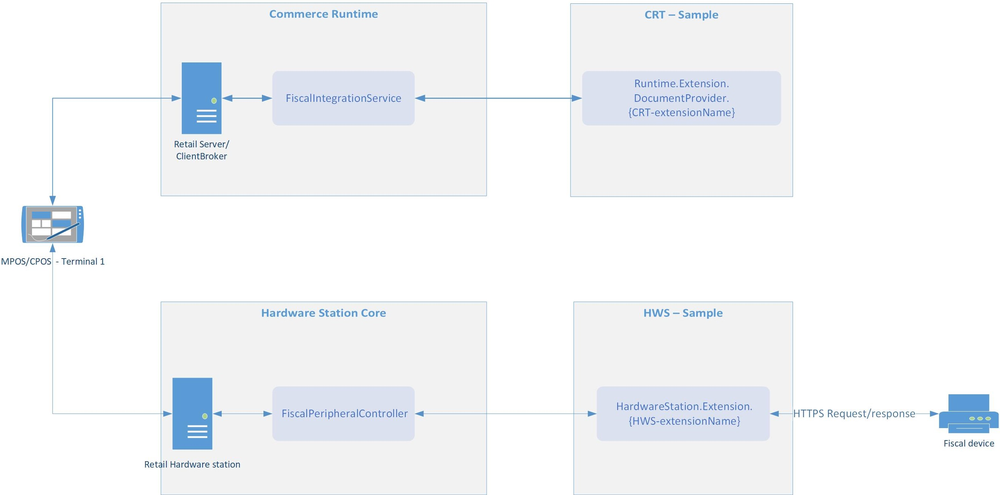

---
# required metadata

title: Overview of fiscal integration for Retail channel
description: This topic provides an overview of the fiscal integration capabilities available in Microsoft Dynamics 365 for Retail. 
author: josaw
manager: annbe
ms.date: 01/16/2019
ms.topic: article
ms.prod: 
ms.service: dynamics-365-retail
ms.technology: 

# optional metadata

ms.search.form: RetailFunctionalityProfile, RetailFormLayout, RetailParameters
audience: Application User
# ms.devlang: 
ms.reviewer: josaw
ms.search.scope: Core, Operations, Retail
# ms.tgt_pltfrm: 
# ms.custom: 
ms.search.region: Global
ms.search.industry: Retail
ms.author: v-kikozl
ms.search.validFrom: 2019-1-16
ms.dyn365.ops.version: 10.0

---
# Overview of fiscal integration for Retail channel

[!include [banner](../includes/banner.md)]

This topic is an overview of the fiscal integration capabilities that are available in Microsoft Dynamics 365 for Retail. Fiscal integration includes integration with various fiscal devices and services that enable fiscal registration of retail sales per local fiscal laws that are aimed to prevent tax fraud in the Retail industry. Typical scenarios that can be covered by using fiscal integration include:

- Registering a retail sale in a fiscal device connected to Retail POS, such as a fiscal printer, and printing a fiscal receipt for the customer;
- Securely submitting information related to sales and returns completed on Retail POS to an external web-service operated by tax authority;
- Ensuring inalterability of sales transaction data by means of digital signature.

The fiscal integration functionality in Retail is a framework that provides a common solution for further development and customization of integration between Retail POS and fiscal devices and services. The functionality also includes fiscal integration samples that support basic Retail scenarios for specific countries or regions and are working with specific fiscal devices or services. A fiscal integration sample consists of several extensions of Retail components and is included in the Retail software development kit (SDK). See [Fiscal integration samples in Retail SDK](#Fiscal-integration-samples-in-Retail-SDK) for more information about fiscal integration samples that are available in Retail SDK. See [Retail SDK overview](../dev-itpro/retail-sdk/retail-sdk-overview) for information on how to install and use the Retail SDK.

To support other scenarios not supported by a fiscal integration sample, integrate Retail POS with other fiscal device or service, or cover requirements of other country or region, you need to extend an existing fiscal integration sample or create a new sample using an existing sample as an example.

## Components of fiscal integration sample

The fiscal registration is performed in accordance with parameters of the fiscal registration process assigned to the current POS functionality profile. Some parameters could be specified on the fiscal registration process, some of them are related to the fiscal registration entities that are a part of the fiscal registration process (Fiscal document provider, Fiscal connector and its profiles, Fiscal connector group). Default parameters of the Fiscal connector and the Fiscal document provider are defined in their configurations. Part of the logic related to the fiscal registration is predefined in extensions of Retail components. 

All these parts together represent a fiscal integration sample dedicated to support fiscal integration requirements for a specific country, and it works with a specific fiscal device model or a fiscal service. For more details about setting up a fiscal registration process, see [How to set up a fiscal registration process](setting-up-fiscal-integration-for-retail-channel#how-to-set-up-a-fiscal-registration-process).

The example below demonstrates a common execution flow of the fiscal registration performed on a fiscal device or service connected to the Hardware station. 

  - **POS** orchestrates the registration process. 
  
  A fiscal integration sample for a local fiscal device or service consists of the following components:

  - **Commerce runtime extension** (CRT extension) generates fiscal documents for retail transactions and events in the format supported by the fiscal device or service.

  - **Hardware station extension** (HWS extension) is responsible for communication with the fiscal device or service. 

  - **Document Provider configuration** defines an output method and a format of fiscal documents.

  - **Fiscal Connector configuration** defines a method of communication with the fiscal device or service, and its parameters.

Fiscal registration flow starts for an event in POS (e.g. a finalization of a sales transaction) and implements the following sequence of steps:

1. POS requests a fiscal document from CRT.

2. CRT identifies if the current event requires fiscal registration.

3. CRT finds a fiscal connector to be used for the fiscal registration.

4. RT runs the fiscal document provider that generates a fiscal document (e.g. an XML document) that represents the retail transaction or event.

5. POS sends the fiscal document prepared by CRT to HWS.

6. HWS runs the fiscal connector that processes the fiscal document and communicates it to the fiscal device or service.

7. POS analyzes the response from the fiscal device or service to decide if the fiscal registration has passed successfully or not.

8. CRT saves the response in the Channel DB.

## Error handling

The fiscal integration framework provides the following options to handle failures during the fiscal registration:

  - **Retry**: this option can be used when the failure can be resolved quickly, and the fiscal registration can be re-run. Examples are: the fiscal device is not connected; the fiscal printer is out of paper; there is a paper jam in the fiscal printer; etc.

  - **Cancel**: this option allows postponing the fiscal registration of the current transaction or event after it fails. After the registration is postponed, the operator may continue working on POS and complete any operation which the fiscal registration is not required for. When any event that requires the fiscal registration occurs in POS (for example, a new transaction is opened), the error handling dialog is displayed automatically to notify the operator that the previous transaction was not registered properly and to provide the error handling options.

  - **Skip**: this option can be used when it is possible to omit the fiscal registration under some specific conditions and continue regular operations on POS. For example, a sales transaction which the fiscal registration failed for may be registered in a special paper journal.

  - **Mark as registered**: this option can be used when the transaction was registered in the fiscal device (e.g. a fiscal receipt was printed), but a failure occurred when saving the fiscal response to the Channel DB. 

    >[!NOTE]
     > The options **Skip** and **Mark as registered** should be activated in the fiscal registration process beforehand. In addition, corresponding permissions should be granted to operators. 
     
The options **Skip** and **Mark as registered** allow using info codes to capture some specific information about the failure, such as the reason of the failure or a justification for skipping the fiscal registration or marking the transaction as registered. For more details about setting up error handling parameters, see [Error handling settings](setting-up-fiscal-integration-for-retail-channel#error-handling-settings).

## Fiscal transactions and storing fiscal response
Upon a successful fiscal registration of a transaction or event, a fiscal transaction is created in the Channel DB and linked to the original transaction or event. Similarly, if the option **Skip** or **Mark as registered** is selected for a failed fiscal registration, this information is stored in a fiscal transaction. A fiscal transaction holds the fiscal response of the fiscal device or service. If the fiscal registration process consists of several steps, then a fiscal transaction is created for each step of the process.

After running *P-job* on the **Distribution schedule** page, this information is transferred to the headquarter. Open the **Retail store transactions** page to view the fiscal transactions created based on the fiscal responses related to a specific transaction on the FastTab **Fiscal transactions**. 
A fiscal transaction stores the following details:
  - Identifiers the fiscal connector and the registration process (Process, Connector group, Connector, etc.). It also stores a serial number of the fiscal device in the field **Register number**, if it's included in a fiscal response.
  - Status of the fiscal registration: *Completed* for successful registration, *Skipped* if the **Skip** option was selected for failed registration, *Marked as registered* if user selected the **Mark as registered** option.
  - Info code transactions related to a selected fiscal transaction. 
    - Select a fiscal transaction with the status equal to *Skipped* or *Marked as registered*, and click button **Info code transactions** on the FastTab **Fiscal transactions** to view the info code transactions.
        >[!NOTE]
     > Info codes **Skip** and **Mark as registered** should be set up on fiscal connector groups beforehand. For more details , see [Error handling settings](https://github.com/MicrosoftDocs/Dynamics-365-Operations/blob/fpi-sample-pol/articles/retail/localizations/fiscal-integration-for-retail-channel.md#error-handling-settings).

## Fiscal text for discounts

Some countries have specific requirements on the additional text that must be printed in fiscal receipts when the discount is applied. At the same time most of fiscal devices have a limitation on a number of discounts that might be applied to the same transaction line.

The fiscal integration handles all discounts applied to a transaction line as one cumulative product discount. It also supports setting up a special text to be printed in fiscal receipt after discount line. A fiscal text may be specified for Info codes and Discounts, so it's possible to print a special text for any channel-specific discount as well as for any type of manual discount applied on POS. If fiscal texts were set up for several discounts, a text line in a fiscal receipt would concatenate fiscal text from all applied discounts. For more details about setting up a fiscal text for discounts, see [Setting up a fiscal text for discounts](https://github.com/MicrosoftDocs/Dynamics-365-Operations/blob/fpi-sample-pol/articles/retail/localizations/fiscal-integration-for-retail-channel.md#setting-up-a-fiscal-text-for-discounts).

## Printing fiscal X and fiscal Z reports

There's a possibility in the fiscal integration framework to run daily / shift reports from POS. 
  - New buttons **Print fiscal X** and **Print fiscal Z** should be added to a button grid. For more details, see [Set up running fiscal X/Z reports from POS](https://github.com/MicrosoftDocs/Dynamics-365-Operations/blob/fpi-sample-pol/articles/retail/localizations/fiscal-integration-for-retail-channel.md#set-up-running-fiscal-xz-reports-from-pos).
  - In the fiscal integration sample these buttons should be matched with the direct commands to a fiscal device, which implements running a daily /shift report in the format supported by the fiscal device.
  
## Fiscal integration samples in Retail SDK

  - [Fiscal printer integration sample for Italy](https://github.com/MicrosoftDocs/Dynamics-365-Operations/blob/fpi-sample-pol/articles/retail/localizations/emea-ita-fpi-sample.md#fiscal-printer-integration-sample-for-italy).
  - [Fiscal printer integration sample for Poland](https://github.com/MicrosoftDocs/Dynamics-365-Operations/blob/fpi-sample-pol/articles/retail/localizations/emea-pol-fpi-sample.md#fiscal-printer-integration-sample-for-poland).
