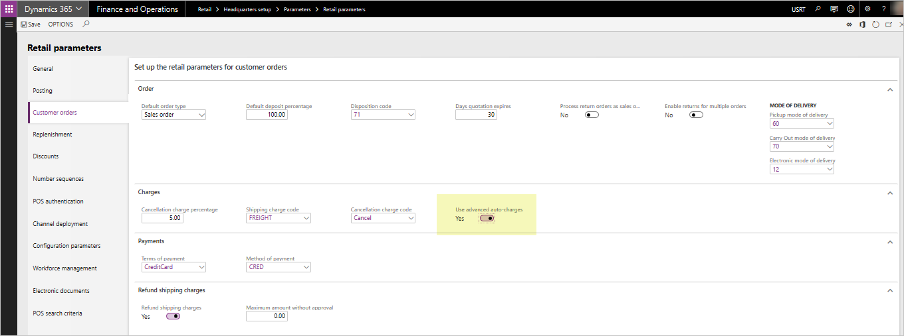
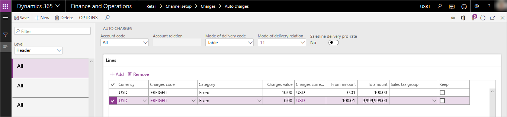
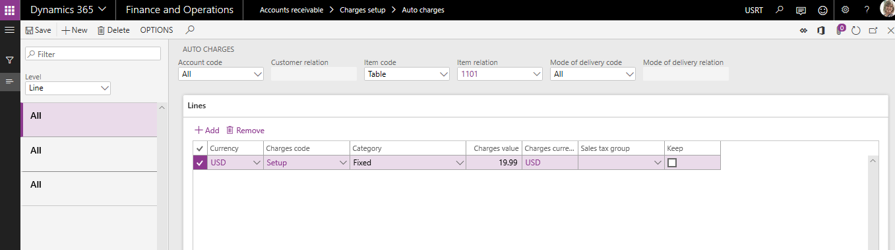
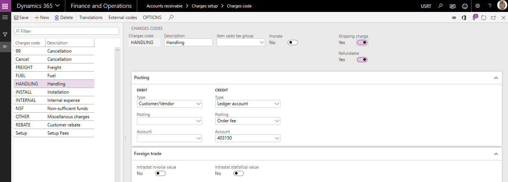

---
# required metadata

title: Omni-Channel Advanced Auto Charges
description: This topic describes capabilities for managing additional order charges for Retail channel orders using advanced auto charges features.
author: hhaines
manager: annbe
ms.date: 1/22/2019
ms.topic: article
ms.prod: 
ms.service: dynamics-365-retail
ms.technology: 

# optional metadata

ms.search.form:  
# ROBOTS: 
audience: Application User
# ms.devlang: 
ms.reviewer: josaw
ms.search.scope: Core, Operations, Retail
# ms.tgt_pltfrm: 
ms.custom: 
ms.assetid: 
ms.search.region: global
ms.search.industry: Retail
ms.author: hhaines
ms.search.validFrom: 
ms.dyn365.ops.version: 10.0

---

# Omni-channel advanced auto charges

[!include [banner](includes/banner.md)]

This topic provides information on configuration and deployment of the advanced auto-charges feature which will be available beginning in Dynamics 365 for Retail version 10.0.

When the advanced auto-charges features are enabled, orders created in any supported Retail channel (point of sale (POS), call center, and online), can take advantage of the [auto-charges](https://docs.microsoft.com/en-us/dynamics365/unified-operations/retail/configure-call-center-delivery#define-charges-for-delivery-services) configurations defined in the ERP application for both header and line-level related charges.  

In releases prior to Dynamics 365 for Retail version 10.0, [auto-charge](https://docs.microsoft.com/en-us/dynamics365/unified-operations/retail/configure-call-center-delivery#define-charges-for-delivery-services) configurations are only accessible by orders created in ecommerce and call center channels. In versions 10.0 and later, POS-created orders can leverage the auto-charges configurations. That way, additional miscellaneous charges can systematically be added to sales transactions.

When using releases prior to version 10.0, a POS user is prompted to manually enter a shipping fee during the creation of a "ship all" or "ship selected" POS transaction. While the misc charges capabilities of the application are utilized in respect to how the charges are written to the order, no systematic calculation is provided--the calculation relies on the user's input to determine the value of the charges. The charges can only be added as a single "shipping" related charges code and can not easily be edited or changed in the POS once they are created. 

The use of manual prompts to add shipping charges is still available in versions 10.0 and later. If an organization does not enable the **Advanced Auto-charges** parameter, the POS prompts for manual entry of charges will remain the same.

With the advanced auto-charges feature, POS users can have systematic calculations for any defined misc charges code based on auto-charges setup tables. In addition, users will have the ability to add or edit an unlimited amount of additional charges and fees to any POS sales transaction at the header or line-level (for a cash and carry or customer order).

## Enabling advanced auto-charges

From the **Retail \> Headquarters setup \> Parameters \> Retail parameters** page, navigate to the **Customer orders** tab.  In the **Charges** fasttab, locate the **Use advanced auto-charges** toggle and set to **Yes**.

When advanced auto-charges are enabled, users are longer prompted to manually enter a shipping charge at the POS terminal when creating a ship-all or ship-selected customer order. POS order charges are systematically calculated and added to the POS transaction (if a corresponding auto-charges table that matches the criterion of the order being created are found). Users also have the ability to add or maintain header or line-level charges manually through newly added POS operations that can be added to the POS screen layouts.  

When advanced auto-charges are enabled, the existing **Retail parameters** for **Shipping charges code** and **Refund shipping charges** are no longer utilized. These parameters are only applicable if the **Use advanced auto-charges** parameter is set to **No**.

Before you enable this feature, ensure you have tested and trained your employees, as this will change the business process flow of how shipping or other charges are calculated and added to POS sales orders. Make sure you understand the impact of the process flow to the creation of transactions from POS. For call center and ecommerce orders, the impact of enabling advanced auto-charges is minimal. Call center and ecommerce applications will continue to have the same behavior they have had historically related to the auto-charges tables to calculate additional order fees. Call center channel users will continue to have the ability to manually edit any system calculated auto-charges at the header or line level, or manually add additional misc charges at the header or line level.

## Additional POS operations

For advanced auto-charges to work properly in your POS application environment, new POS operations have been added. These operations must be added to your [POS screen layouts](https://docs.microsoft.com/en-us/dynamics365/unified-operations/retail/pos-screen-layouts) and deployed to the POS devices as you deploy advanced auto-charges. If these operations are not added, users will not be able to manage or maintain misc charges on the POS transactions and will have no way of adjusting or changing the charges values that are systematically calculated based on auto-charges configurations. At minimum, it is suggested that you deploy the **Manage Charges** operation to your POS layout.

The new operations are:

- **142 - Manage charges** - use this operation to allow POS users to view and edit misc charges for the POS transaction that were either added manually or systematically through auto-charges calculations.
- **141 - Add header charges** - use this operation to give the user the ability to manually add a header level misc charge to any POS sales transaction (and select the charges code to be used).
- **140 - Add line charges** - use this operation to give the user the ability to manually add a line level misc charge to any POS sales transaction line (and select the charges code to be used).
- **143 - Recalculate charges** - use this operation to perform a full re-calculation of the charges for the sales transaction.  Any previously user-overwritten auto-charges will be recalculated based on the current cart configuration.  

As with all POS operations, security configurations can be done to require manager approval in order to execute the operation.

## Use Case Examples
This section of documentation will cover some sample use cases to better understand the configuration and usage of auto-charges and misc. charges within the context of Retail channel orders.   Note that these examples will illustrate the behavior of the application when the **Use advanced auto-charges** parameter has been enabled.

### Auto-charges header charges example
#### Use case scenario description:  

_A retailer wishes to automatically add charges for freight when transactions are created in any Retail channel that require a shipment of products to the customer.  The retailer offers 2 methods of delivery: Ground and Air.   If a customer chooses Ground delivery and the order value is less than $100, the retailer wishes to charge the customer a freight charge of $10.  If the order is over $100 in value and the customer chooses ground shipping, the customer will not be charged any additional freight fees.   If the customer chooses the Air method of delivery- all orders, regardless of their total value, will be charged a freight fee of $20.00._

#### Setup and Configuration

This scenario requires the configuration of 2 different auto-charges tables.   

From Headquarters, navigate to **Accounts receivable>Charges setup>Auto charges**.  

Configure two different Header level auto charges; one for the Ground mode of delivery and one for the Air mode of delivery. For this scenario, they will be configured to be used for All customers.  

For the Ground delivery charges, in the lines section of the auto-charges form, define a charge that will be applied for orders between $.01 and $100 as $10.00.  Another charges line should be created to indicate orders over $100.01 will have no charges.

For the Air delivery charges, in the lines section of the auto-charges form, define a charge of $20.00 that will be applied to all orders (to and from value of $.01 to $9,999,999)

These charges must then be sent to the Retail Server/Channel DB so that the POS can utilize them. This is done by running the 1040 distribution schedule job.

#### Sales processing for this scenario

Once the configuration steps outlined in the previous section are complete and the changes have been applied to the channel database, any customer orders or sales transactions created in the POS, Call Center or Ecommerce channels that have the Ground or Air delivery methods set at the header level will utilize these charges and automatically apply them to the sale.   

It is important to note that at this time the charges will apply to all sales transactions created within the legal entity that utilize these delivery modes as there is no ability at this time to designate that an auto-charge configuration will only apply to a specific selling channel.

For POS and Ecommerce scenarios, since there is no clearly defined "header" on these orders, header level charges will only apply if all sales lines on the transaction are set to ship with the exact same mode of delivery.   If there are "mixed-modes" of fulfillment on the transactions created by POS or Ecommerce, only line level auto-charges will be considered and applied.

In call center scenarios, the user has control over the setting of the delivery mode at the order header, therefore header level charges will apply for these orders, even if some of the sales lines have been configured to use a different mode of delivery. Header level charges for call center orders will always be based on the mode of delivery that is defined at the order header level of the sales order.

### Auto-charges line charges example
#### Use case scenario description:
_A retailer wishes to add an additional charge to the customer for setup fees whenever the customer purchases a particular model of computer.  This particular computer requires additional non-optional setup actions that the retailer will perform for the customer.  The retailer has informed customers that there will be an additional fee for this setup.  The retailer prefers to manage the charges related to this fee separately from the product sales price for financial reporting purposes.   A setup fee of $19.99 will be charged to the customer whenever this particular computer is purchased in any retail channel._

#### Setup and Configuration

This scenario requires the configuration one line level auto charges table 

From Headquarters, navigate to **Accounts Receivable>Charges setup>Auto charges**.  

Set the **Level** drop down to "Line" and create a new auto-charges record for All customers and for the specific product or product group where the Setup fees will be charged.

These charges must then be sent to the Retail Server/Channel DB so that the POS can utilize them. This is done by running the 1040 distribution schedule job.

#### Sales processing for this scenario

Once the configurations steps outlined in the previous section are complete and the changes have been applied to the channel database, any customer orders or sales transactions created in the POS, Call Center or Ecommerce channels that have this item on the order will trigger a line level charge to be systematically added to the order total.   

It is important to note that at this time the charges will apply to any sales line that matches the configuration of the line level auto charges within the legal entity.  There is no ability at this time to designate that a line level auto-charge configuration will only apply to a specific selling channel.

### Manual header charges example
  #### Use case scenario description:
_A retailer is making an exception to normal processes and is offering to provide a special home delivery of products to a particular customer who is ordering products in the store.  The retailer and the customer have agreed that the customer will pay an additional $25 handling fee for this service.  The order taker needs to add this additional fee to the transaction.  Because the fee is a blanket fee and not related to any single product on the order, a header charge will be utilized._

#### Setup and Configuration

Ensure the charges code that will be used in this scenario has been properly configured in Headquarters.  This is done by navigating to **Accounts Receivable>Charges setup>Charges** and defining an appropriate charges code for the scenario.

Note that if this charge should be considered a "shipping" related charge for the purpose of shipping related discounts or promotions, the **Shipping charge** toggle on the charges code should be set to **Yes**.   If this charge is also allowed to be systematically refunded during the processing of a return transaction in the POS application, the **Refundable** toggle should also be set to **Yes**.  It's important to note that the **Refundable** flag is only applicable when the **Use advanced auto-charges** parameter is set to **Yes**.   

New charges codes created in HQ must be distributed to the retail channels for use in POS application scenario.  This data is distributed through the 1040 distribution schedule job.

The **Add header charge** operation must be configured in your [POS screen layout](https://docs.microsoft.com/en-us/dynamics365/unified-operations/retail/pos-screen-layouts) so that a button that is accessible to the user from POS can call this operation (operation 141).  These screen layout changes must be distributed to the retail channel as well through the distribution schedule function. 

#### Sales processing of manual header charges

To execute the scenario in the POS application, the POS user will create the sales transaction as usual, adding the products and any other configurations to the sale.  At a time prior to collecting payment, the user should execute the **Add header charge** operation.  This will prompt the user to select a charges code and enter the charges value.   Once the user completes this process, this charge will be added to the sales order as a Header level charge.  

Note that this same process can be applied in the Call Center by using the existing **Charges** feature found on the **Sell** tab of the ribbon toolbar.  This will open the **Maintain charges** form where the user is able to add a new charges line to the order header.

### Manual line charges example
 #### Use case scenario description:
_A customer has requested that 2 of the 5 items on their sales order be gift-wrapped. The retailer offers this optional service for a fee of $2.00 per item.  The order taker will need to add these fees to the specific items that need to be gift-wrapped._

#### Setup and Configuration

Ensure the charges code that will be used in this scenario has been properly configured in Headquarters.  This is done by navigating to **Accounts Receivable>Charges setup>Charges** and defining an appropriate charges code for the scenario.

Note that if this charge should be considered a "shipping" related charge for the purpose of shipping related discounts or promotions, the **Shipping charge** toggle on the charges code should be set to **Yes**.   If this charge is also allowed to be systematically refunded during the processing of a return transaction in the POS application, the **Refundable** toggle should also be set to **Yes**.  It's important to note that the **Refundable** flag is only applicable when the **Use advanced auto-charges** parameter is set to **Yes**.  

New charges codes created in HQ must be distributed to the retail channels for use in POS application scenario.  This data is distributed through the 1040 distribution schedule job.

The **Add line charge** operation must be configured in your [POS screen layout](https://docs.microsoft.com/en-us/dynamics365/unified-operations/retail/pos-screen-layouts) so that a button that is accessible to the user from POS can call this operation (operation 140).  These screen layout changes must be distributed to the retail channel as well through the distribution schedule function. 

#### Sales processing of the manual line charge

To execute the scenario in the POS application, the POS user will create the sales transaction as usual, adding the products and any other configurations to the sale.  At a time prior to collecting payment, the user should select the specific line where the charge will apply from the POS item list display and execute the **Add line charge** operation.  This will prompt the user to select a charges code and enter the charges value.   Once the user completes this process, this charge will be linked to the line and added to the order total as a line level charge.  The user can repeat the process to add additional line charges to other items lines on the transaction if applicable.

Note that this same process can be applied in the Call Center by using the existing **Maintain Charges** feature found under the **Financials** drop down in the **Sales order lines** section of the sales order form.  This will open the **Maintain charges** form where the user is able to add a new line specific charge to the transaction.

## Additional Features

### Editing charges on a POS sales transaction

The **Manage charges** operation (142) should be added to the [POS screen layout](https://docs.microsoft.com/en-us/dynamics365/unified-operations/retail/pos-screen-layouts) to support the ability for a user to view and edit/override any system calculated or manually created header or line level charges.   If this operation is not added, users will not be able to adjust the value of the charges on the POS transaction, nor will they be able to view the details of the charges such as the type of charges code that was tied to the charge.  

From the **Manage charges** form in POS, the user can view both Header and Line level charges details.  The user can utilize the **Edit** function available on this form to make changes to the amount charged to a specific charges line.  Note that once a charges line is overwritten manually, it will not be systematically recalculated unless the user chooses to initate the **Recalculate charges** operation.

If the **Charge override reason code** has been configured on the **Retail parameters** setup form in the ERP (Customer Orders tab>Charges section), the user will be prompted to provide a reason code whenever charges have been modified in the POS application.

If reason codes have been captured for overwritten charges, a new report is also available to review and audit these overrides.  This can be found in **Retail>Inquiries and reports>Charge override history**

### Refunding charges on a POS return transaction

If the **Use advanced auto-charges** parameter is set to **Yes**, it is important to note that the existing Retail parameter for **Refund shipping charges** is no longer applicable.  To indicate which charges should be systematically refunded to a customer when using advanced auto-charges, ensure the related charges code has been configured as **Refundable** in HQ.  This setting is found on the **Charges code** setup form.  Ensure these settings have been synchronized to your Retail channel databases through distribution schedule processing.

### Refunding charges on a Return Order transaction in HQ

At this time, charges are not systematically refunded to **Return orders** created in the ERP/HQ.  Users are required to select the **Copy charges** option when creating the **Return order** in the ERP application.  If **copy charges** is not selected, charges from the original sales transaction will not be automatically refunded.  If **Copy charges** is selected, all charges will be copied to the Return order and the user can manually edit/remove any charges they wish to not have refunded.  The call center return order process currently does not acknowledge the **Refundable** flag on the **Charges code** setup.

### Configuring POS receipts to show charges

Six new receipt elements have been added to the Receipt Line and Footer to support the Advanced Auto-charges feature.

**Line Shipping Charges** - this line level element can be used to recap specific charges codes that have been applied to the sales line.  Only charges codes that have been flagged as **Shipping** charges in the **Charges code** form setup will display here.

**Line Other Charges** - this line level element can be used to recap any non-shipping specific charge codes that have been applied to the sales line.  These are charges codes where the **Shipping** flag on the **Charges code** setup has not been enabled.

**Order Shipping Charges Details** - this footer level element will display the descriptions of the charge codes applied to the order that have been flagged as **Shipping** charges in the **Charges code** setup form.

**Order Shipping Charges**  - this footer level element shows the dollar value of the shipping related charges.

**Order Other Charges Details** - this footer level element will display the description of the charges codes applied to the order that have NOT been flagged as shipping related charges.

**Order Other Charges** - this footer level element will display the dollar value of the other charges that are not shipping related.

It is suggested that the organization add some free text fields to their receipt footer as well to define the areas where charges will be recapped.  See the included sample receipt for general idea.  In this sample, free text elements using the text "Total shipping charges" and "Total other charges" were added above their respective footer elements.

### Preventing charges from calculating until the POS order is completed

Some organizations may prefer to wait until the user has finished adding all of the sales lines to the POS transaction before calculating charges.  To prevent calculation of charges as items are added to the POS transaction, the organization should turn on the **Manual charge calculation** parameter in the **Functionality profile** that will be used by the store.   Enabling this parameter will require the POS user to use the **Calculate totals** operation when they have completed adding the products to the POS transaction.   This **Calculate totals** operation will then trigger the calculation of any auto charges for the order header or lines as applicable.
