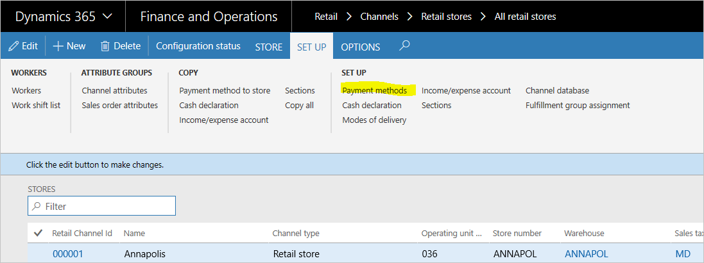
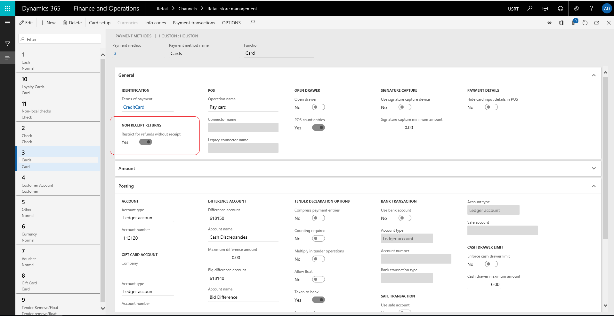
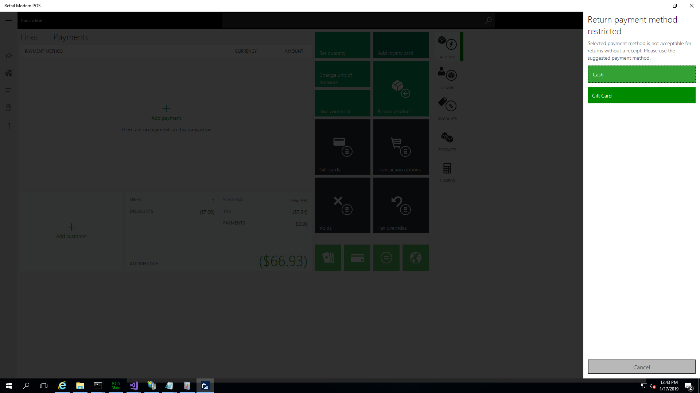

---
# required metadata

title: Restrict payment methods for returns without a receipt
description: Each payment type that a retailer accepts must be configured when the system is set up. This article describes how certain payment types can be restricted for refund if the returns are made without a receipt.
author: rapraj
manager: AnnBe
ms.date: 01/17/2019
ms.topic: article
ms.prod: 
ms.service: dynamics-365-retail
ms.technology: 

# optional metadata

ms.search.form: RetailTenderTypeTable
# ROBOTS: 
audience: Application User
# ms.devlang: 
ms.reviewer: josaw
ms.search.scope: Core, Operations, Retail
# ms.tgt_pltfrm: 
ms.custom: 15831
ms.assetid: 465893a5-6b4f-4c5f-b305-db071df2d33f
ms.search.region: global
ms.search.industry: Retail
ms.author: yabinl
ms.search.validFrom: 2019-02-01
ms.dyn365.ops.version: AX 10.0.0, Retail Feb 2019 update

---

# Restrict Payment methods for returns without a receipt.

[!include [banner](includes/banner.md)]

Each payment type that a retailer accepts must be configured when the system is set up. This article describes how certain payment types can be restricted for refund if the returns are made without a receipt.

### To set up payment methods, you must complete the following tasks.

1. Set up payment methods for an organization. Create the payment methods that are accepted by the whole organization.
2. Create organization-wide card types and card numbers. If credit cards or debit cards are accepted, you must create one payment method for cards, and then create the organization-wide card types and card numbers.
3. Set up store payment method. Associate payment methods with each store, and then enter the store-specific settings for each payment method.
4. Set up card payment methods for stores. For any card payment methods that the store accepts, complete the card setup.

### To restrict payment methods when returns are made without a receipt.

 

1. For each store payment method, 'Restrict for refunds without receipt' toggle needs to be edited.
2. Default value of the toggle is set to 'No' - this ensures that the payment method is allowed for refunds. 

 

3. When the toggle is set to 'Yes', the selected payment method will not be allowed for refunds. 

#### Note:
When a cashier selects a payment method that is restricted for refund without a receipt, a notification message prompting the acceptable payment methods.
 

In case a transaction has both a receipted return and a return without a receipt - the restriction conditions are not enforced as it is considered to be a return workflow with a receipt. 

