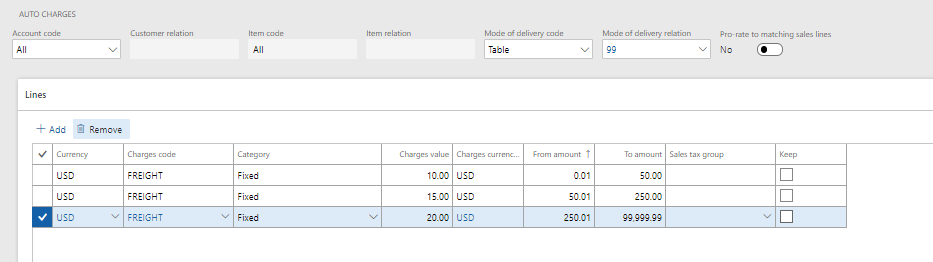
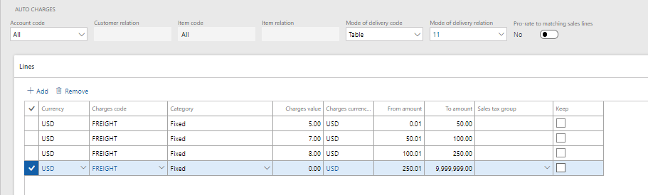
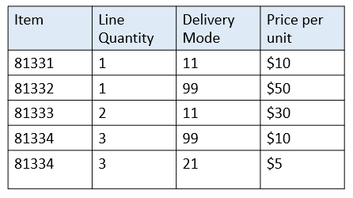
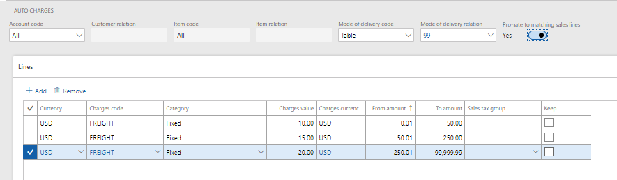
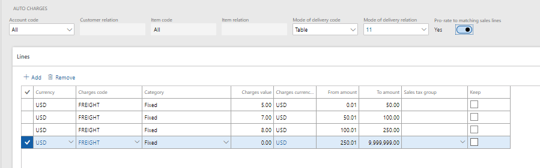
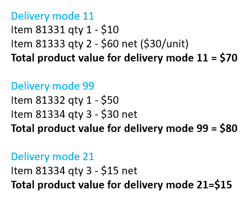
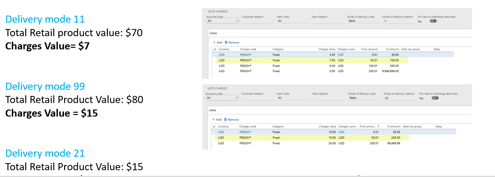
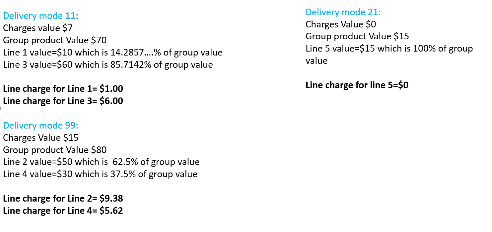

---
# required metadata

title: Prorate header charges to matching sales lines
description: This topic describes additional capabilities for calculating and applying auto-charges to Retail channel orders using the advanced auto charges features.
author: hhaines
manager: annbe
ms.date: 03/05/2019
ms.topic: article
ms.prod: 
ms.service: dynamics-365-retail
ms.technology: 

# optional metadata

ms.search.form:  
# ROBOTS: 
audience: Application User
# ms.devlang: 
ms.reviewer: josaw
ms.search.scope: Core, Operations, Retail
# ms.tgt_pltfrm: 
ms.custom: 
ms.assetid: 
ms.search.region: global
ms.search.industry: Retail
ms.author: hhaines
ms.search.validFrom: 
ms.dyn365.ops.version: 10.0.1

---

# Prorate header charges to matching sales lines

[!include [banner](includes/preview-banner.md)]
[!include [banner](includes/banner.md)]

The grouping and proration of header auto charges to the Retail sales line feature described in this topic are available for Point of Sale (POS)-created transactions in Dynamics 365 for Retail version 10.0.1 and available for call center-created sales in version 10.0.2.

This functionality is only available if the [advanced auto charges](https://docs.microsoft.com/en-us/dynamics365/unified-operations/retail/omni-auto-charges) feature is enabled in the **Retail parameters**. The enhanced auto charges calculation method can only be applied to Retail sales orders created through Retail channels (POS, call center, and ecommerce).

With this new functionality, an organization will have more flexibility in how header level auto charges are calculated and applied to retail sales transactions.

In versions earlier than Dynamics 365 for Retail version 10.0.1, auto charges defined at the header level with a specific mode of delivery relation are only calculated when there is a match with the mode of delivery defined on the sales order header. For example, if header level auto charges are defined for mode of delivery "99" and mode of delivery "11", and a sales order is created with mode of delivery "99" on the order header, but also had some sale lines that were configured to ship by mode of delivery "11",  only the header level charges linked to mode of delivery "99" are considered and applied to the sales order. 

In all in-market versions of Retail, the header level charges have an added feature that allows you to define a [tiered charge configuration](https://docs.microsoft.com/en-us/dynamics365/unified-operations/retail/configure-call-center-delivery) based on the order value. For example, if the order value is between $50.00 and $200.00, the organization may want to charge a freight charge of $5.00, but if the order is between $200.01 and $500.00, the freight charge may be $4.00.  

Some organizations want the benefits of the tiered charges calculation that is provided with the header level charges, but they also want to ensure that in a mixed delivery mode scenario, that the charges calculated are based on a match with the mode of delivery as defined on each sales line.

You can now configure your header level auto charges so that all modes of delivery on the order will be considered in the charges calculation. This functionality requires a more complex calculation logic when calculating the header charges that will group together the items shipping the same mode of delivery and treat those as their calculation group when calculating the header auto charges. Items with like modes of delivery have their auto charges calculated based on their combined sales value to determine the appropriate auto charge tier to be used.   

Once the appropriate header charges are obtained for the sales lines that are shipping the same mode of delivery, the calculated charges will be prorated down to the sales line level. By placing these charges at the line level as opposed to keeping them at the header level, a more specific link is made between the item and the charges value calculated for it. This can be useful in partial return scenarios when an organization may wish to only refund a portion of the charge instead of the entire charge when only some items are returned.

## Scenarios
Below are two sample scenarios to outline how these charges would be calculated with and without the new functionality.

### Scenario 1
This scenario outlines the behavior when **Prorate to matching sales lines** configuration is disabled in the auto charge setup (this is equivalent to how the header charges behaved in Retail versions earlier than version 10.0.1).

In this scenario, header level charges have been defined by the organization for **Mode of delivery relation** "99" and **Mode of delivery relation** "11". There are no auto charges are configured for mode of delivery "21".

A sales order is created in call center with a delivery mode set as "99". This order contains 5 items; two order lines have been configured to use delivery mode "99", two lines configured for delivery mode "11", and one line configured with delivery mode "21".

In this scenario, the entire order is evaluated against the auto charges table for mode of delivery "99".  The full total of all sales lines is used to determine a matching tier in the auto charges configuration and this charge is applied at the order header level. In this example, the order total is $165 and the application would apply the $15.00 freight charge to the order header. Auto charges configured for mode of delivery "11" are never referenced or applied.

In this scenario, if a customer returns some of the items on this order and if the [charge code has been configured to be refunded](https://docs.microsoft.com/en-us/dynamics365/unified-operations/retail/omni-auto-charges#setup-and-configuration-2), the total header charge will be systematically applied to the refund, even if only some of the items are being returned.

### Scenario 2

In this scenario, header level charges are also defined for **Mode of delivery relation** "99" and **Mode of delivery relation** "11", but the **Prorate to matching sales lines** flag has also been enabled for these auto charge tables.

In this scenario, we have the same sales order with 5 lines. The delivery mode on the order header is set to "99", but each item on the sales order has delivery modes configured as shown in the image below.

Because the configuration of the auto charges is set to **Prorate to matching sales lines**, the system will perform the following calculation steps.

In Step 1, all like delivery mode items will be grouped together and their total product value added up.

In Step 2, the header level auto charges configuration that matches the customer/mode of delivery settings for each group of items will be located. If found, the charge to apply in the tiered configuration will be located based on the total product value of items in that delivery mode group.

In Step 3, the system will calculate the charges value to apply to each line based on proration logic that considers the proportional value of the line in relation to the group's total product value.

In this example, item "81334" will be assigned a Freight charge of $5.62. These charges can be viewed on the **Maintain charges** page for the specific sales line. How this would look like for item "81334" is shown below.

With this method of calculation in a partial return scenario, if the charge code is refundable, only the portion of the charge allocated to that line will be refunded when the item is returned. 
