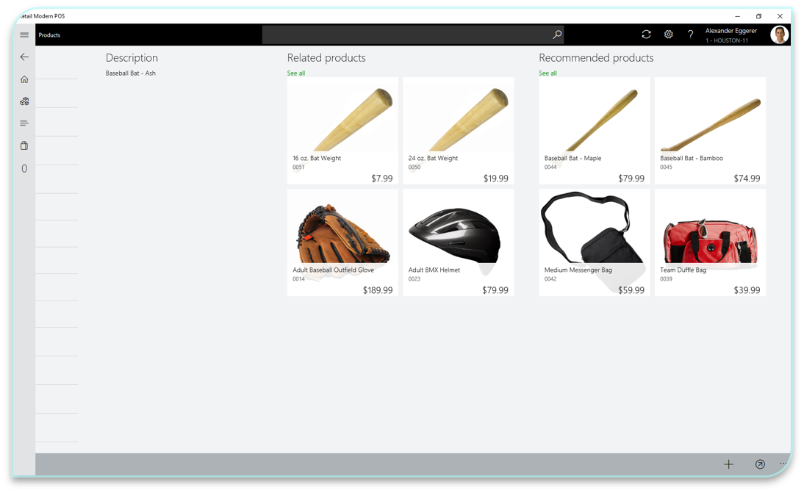
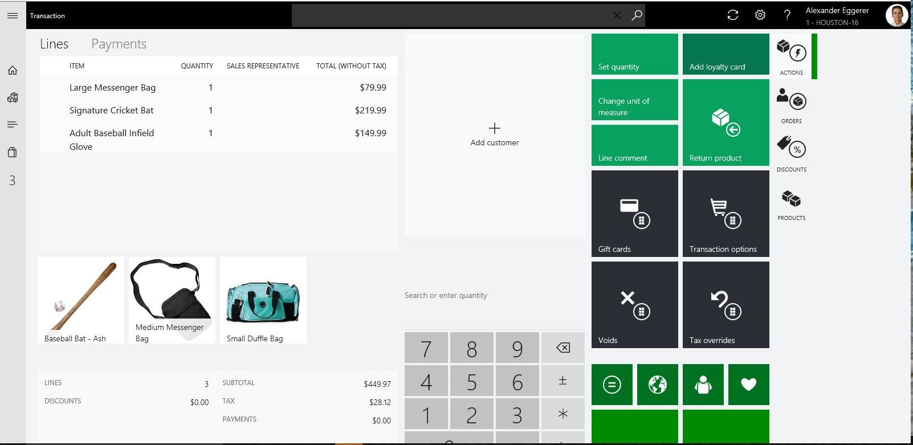

---
# required metadata

title: Product recommendations for POS
description: This topic applies to Dynamics 365 for Retail and Dynamics 365 for Finance and Operations.
author: ashishmsft
manager: AnnBe
ms.date: 02/05/2018
ms.topic: article
ms.prod: 
ms.service: dynamics-365-retail
ms.technology: 

# optional metadata

ms.search.form: RetailParameters
# ROBOTS: 
audience: Application User
# ms.devlang: 
ms.reviewer: josaw
ms.search.scope: Core, Operations, Retail
# ms.tgt_pltfrm: 
ms.custom: 259664
ms.assetid: 5dd8db08-cd96-4f7e-9e65-b05ca815d580
ms.search.region: global
ms.search.industry: Retail
ms.author: asharchw
ms.search.validFrom: 2016-11-30
ms.dyn365.ops.version: Version 1611

---

# Personalized product recommendations

[!include [banner](includes/banner.md)]

> [!NOTE]
> We are removing the current version of the product recommendation service as we redesign this feature with a better algorithm and newer retail-oriented capabilities. For more information see [Removed or deprecated features](../dev-itpro/migration-upgrade/deprecated-features.md).

In Dynamics 365 for Retail build 10.0.6, product recommendations can be displayed on the point of sale (POS) device. At its core, product Recommendations are a transformative business application that span across all retail spaces to create rich, engaging, and tailored product discovery experiences. 

By showcasing products targeted to a customer's interests and buying habits, or through patterns of products that are frequently bought together, product recommendations can help retailers with up-sell and cross-sell and ultimately enhance customer retention and participation. 

## Scenarios

Beginning in build 10.0.6, Product recommendations are enabled for the following POS scenarios. They are available in Cloud POS or Modern POS (MPOS).

1. On the **Product details** page:

    - •	If a store associate visits a **Product details** page when looking at previous transactions across different channels, the recommendations service suggests additional items that are likely to be purchased together.

    

2. On the **Transaction** page:

    - •	The recommendation engine suggests items based on the entire list of items in the basket that are frequently bought together.

    > [!NOTE]
    > To display recommendations on the **Transaction** page, the retailer needs to update the screen layout in Dynamics 365 for Retail. The **Recommendations** control must be dropped onto the **Transaction** page.

    

## Configure Dynamics 365 for Retail to enable POS recommendations

To set up product recommendations, follow these steps:

1. Ensure your service has been updated to the **10.0.6 build.**
2. Follow the instructions on how to [enable product recommendations](enable-product-recommendations.md) for your business.
3. Optional: To display recommendations on the transaction screen, go to **Screen Layout**, choose your screen layout, launch the **Screen layout designer**, and then drop the **recommendations** control where needed.
4. Go to **Retail parameters**, select **Machine-learning**, select **Yes** under **Enable POS recommendations**.
5. To see recommendations on POS, run global configuration job **1110**. To reflect changes made to POS screen layout designer, run channel configuration job **1070**.

## Troubleshoot issues where you have Product recommendations already enabled

- Navigate to **Retail Parameters** \> **Recommendation lists** \> **Disable product recommendations** and run **Global configuration job \[9999\]**. 
- If you added the **Recommendations control** to your transaction screen using the **Screen layout designer**, please remove that as well.
- If you have additional questions, check out the [Recommendations FAQ](faq-recommendations.md) for more information.

## Additional resources

[Add a recommendations control to the transaction page on a POS device](add-recommendations-control-pos-screen.md)

