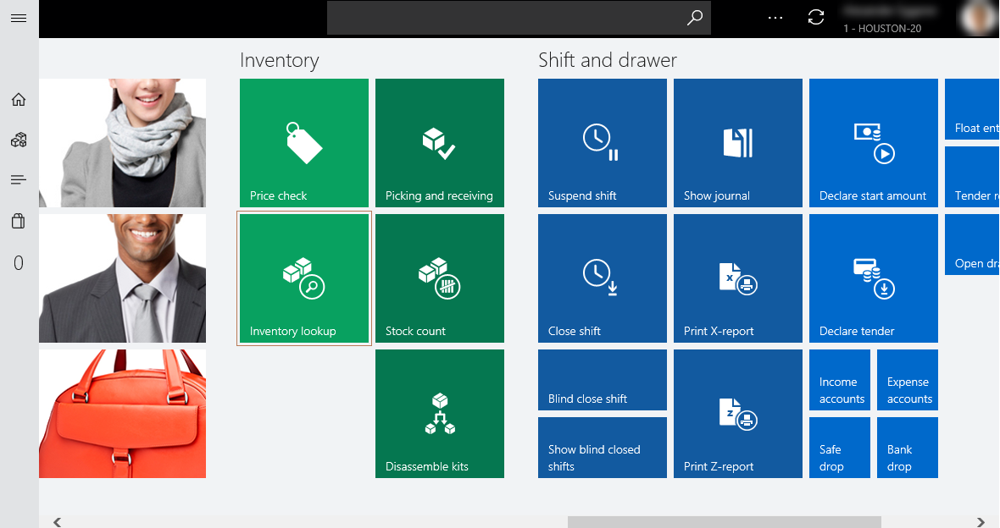
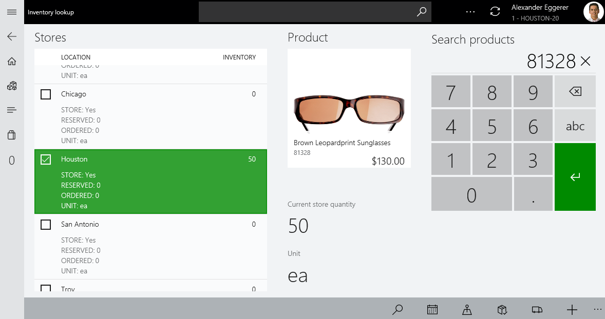
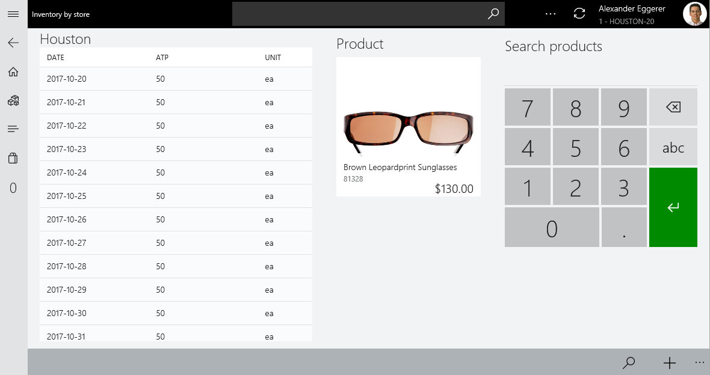
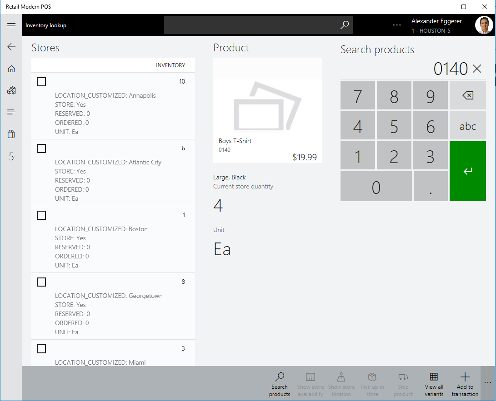
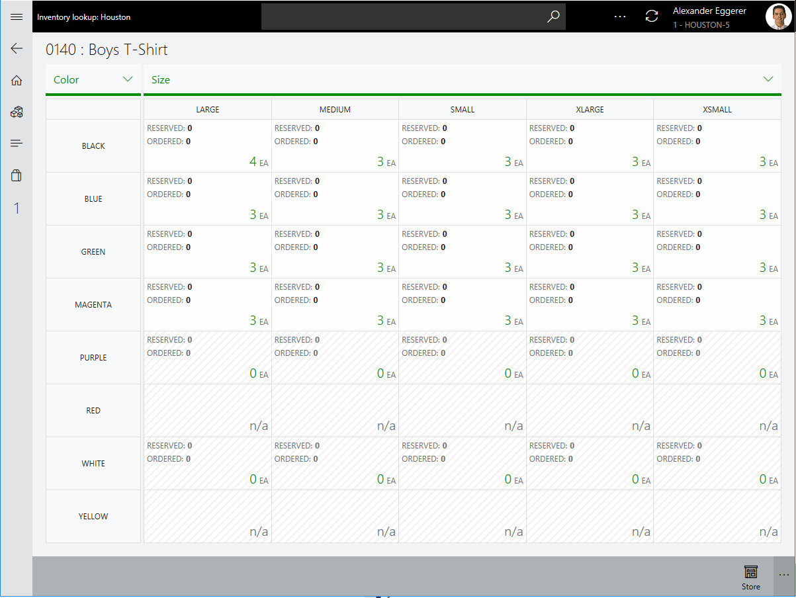
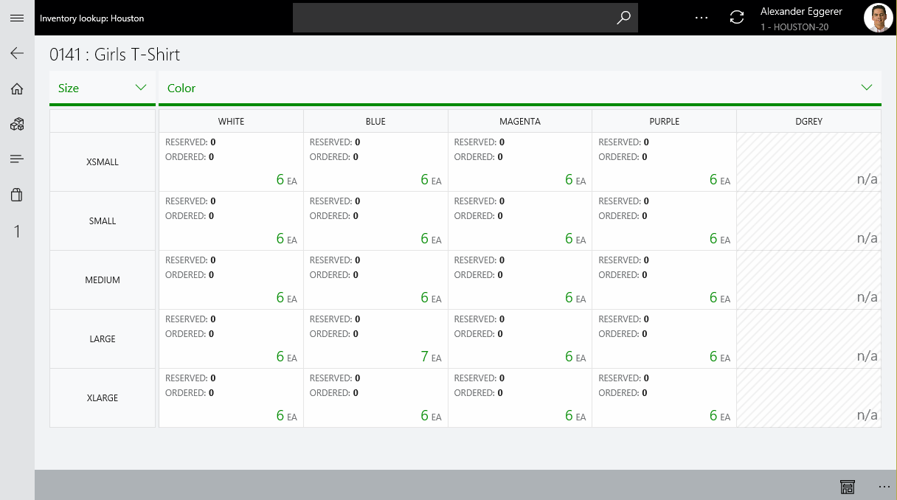
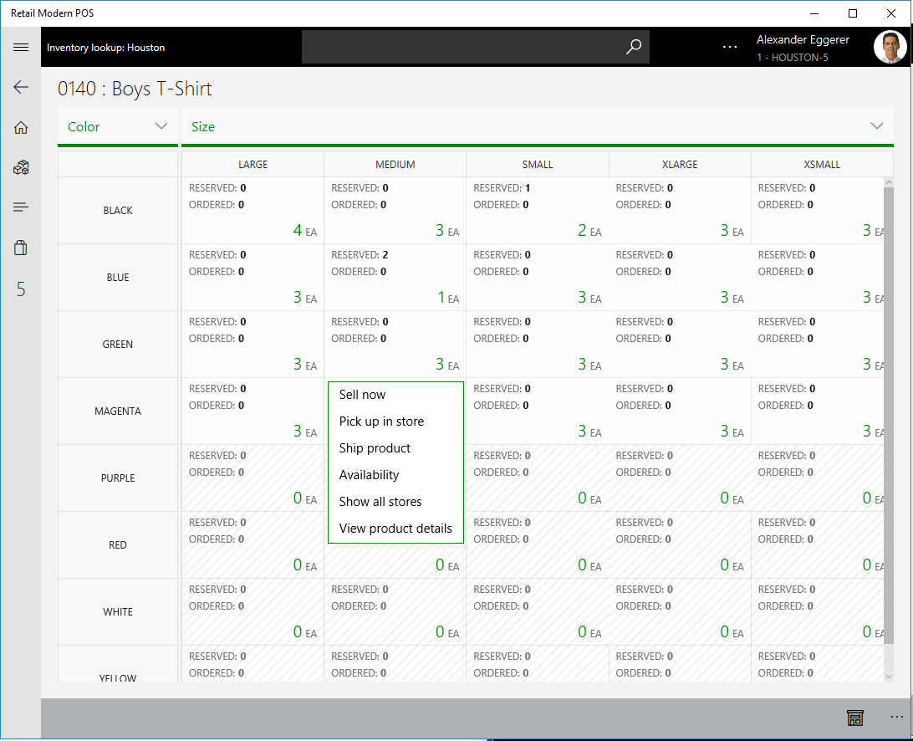

## Inventory lookup on POS 

Inventory lookup on POS helps retailers achieve real-time operational excellence and insights by connecting stores, POS, and the back office. It provides an accurate real-time view of products inventory across various stores and distribution centers. It also helps retailers drive additional efficiencies and cost savings by improving inventory planning in real time. 

An accurate real-time inventory view across organization helps store-associates to provide timely, elevated customer service. The moment that matters most is the when the customer is ready to make a purchase decision. Real-time inventory information at the fingertips of cashiers the in store, empowers them to be able to accurately promise product delivery and pick up. 

Go to the Retail Modern POS or Retail Cloud POS home page to open the **Inventory lookup** page.

The **Inventory lookup** page allows you to enter a product on the number pad so you can view quantity on hand for multiple stores and warehouses. 

There are also values shown for **Reserved** and **Ordered** for each location. 

 - **Reserved quantity** - Refers to the *'Physical reserved'* value from back-office for a product number at the given location.

 - **Ordered quantity** - Refers to the *'Ordered in total'* value from back-office for a product number at the given location. 

### What are the locations for which inventory availability information is shown

The locations list is comprised of two types of entities: **Retail stores** and **Distribution centers**. 

 - **Retail stores** - This is the list of stores that are configured using **Store-locator group** for the current store in the headquarters. 

- **Distribution centers** - These different types are configurable in Dynamics 365 for Retail but we show inventory availability information only for the **Standard/Default type** of Distribution centers. *(Note - We do not show inventory availability information in POS for Transit, Quarantine & GoodsInRoute_RU type of warehouses.)*

On the **Inventory lookup** page, in addition to the *current quantity on hand, reserved & ordered*, the future **available to promise (ATP) quantities** can be viewed for each individual store. To do so, select the store that you want to view the ATP for and then click **Show store availability**.

### To open the **Dimension based matrix view** showing all variants

There are two ways to navigate to the **'Dimension based matrix view'** from the following pages: 
   - **Product details** page
   - **Inventory lookup** page

You would notice a new control available on the app-bar titled as **'View all variants'**. And this button is active/available only for an item **(Product master)** with product variants. (*Note - 'View all variants' button in app-bar is inactive/ not-available for standard standalone products or kits.*)

Upon clicking **'View all variants'** from *'Product details page'* of a **product master** or from *'Inventory look up page* without selecting a location' user shall be navigated to **'Dimension based matrix view'** showcasing inventory availability information for all variants of an entered product for *current store*.

(*Note - The display order of dimensions is alphabetic - that's because the display order for the dimensions on this product were not configured)*

And as you may notice, there are various kind of variant tiles 

| **Variant tile on-hand value** | **Description**                                                                                                                                                                                                               |
|----------------------------|---------------------------------------------------------------------------------------------------------------------------------------------------------------------------------------------------------------------------|
| Numeric (>0)               | Indicates that a particular variant is released to the selected location, and you can perform additional actions in that individual cell.                                                               |
| Numeric (= 0)              | Indicates that a particular variant is released to the selected location, and the item is not available in selected location, but you can interact with that individual cell to perform additional actions. |
| n/a or dead cell           | Indicates that a particular variant is not released to the selected location, and you cannot perform additional actions in that individual cell.                                                    |

You can also change the pivot for dimensions by selecting the dimension that you would like to swap.

*(Note: The display order of dimensions for this product is custom [non-alphabetic], it's based on the dimension display order that is set in the back office.)*

Additionally, to boost a a store associates productivity there are additional actions that can be performed from a product-dimension based matrix form of inventory lookup. For example, you can do the following: 
 
- Change the store location to look up inventory availability of all product variants at other locations. This include other stores in the store-locator group as well as standard/default types from the distribution center.
- Sell an individual product variant to a customer using cash and carry, pick up at store, and ship to address. 
- Provide the customer with available-to-promise information for an individual product variant at a specific location. 

(*Note - The display order of dimensions is alphabetic because the display order for the dimensions on this product were not configured.*) 

| **Actions**              | **Description**                                                                                                                                                                                                          |
|----------------------|----------------------------------------------------------------------------------------------------------------------------------------------------------------------------------------------------------------------|
| Sell now             | Adds the selected item variant to the transaction and re-directs the user to the transaction screen. (*Not available when the selected iocation is of type distribution center.*)                                             |
| Pick up in store     | Creates a customer order for that product variant to be picked up from the selected location and re-directs the user to the transaction screen. (*Not available when the selected location is of type distribution center.*)     |
| Ship product         | Creates a customer order for the product variant to be shipped from the selected location and re-directs the user to the transaction screen.                                                                              |
| Availability         | Shows the available to promise information (ATP) for the selected variant combination for the selected location.                                                                                                     |
| Show all locations      | Switches the user to standard inventory look up view, highlighting inventory availability information for that particular item variant across all stores in the store-locator group and standard/default distribution centers. |
| View product details | Re-directs the user to the product details page of the associated product master.                                                                                                                                        |
