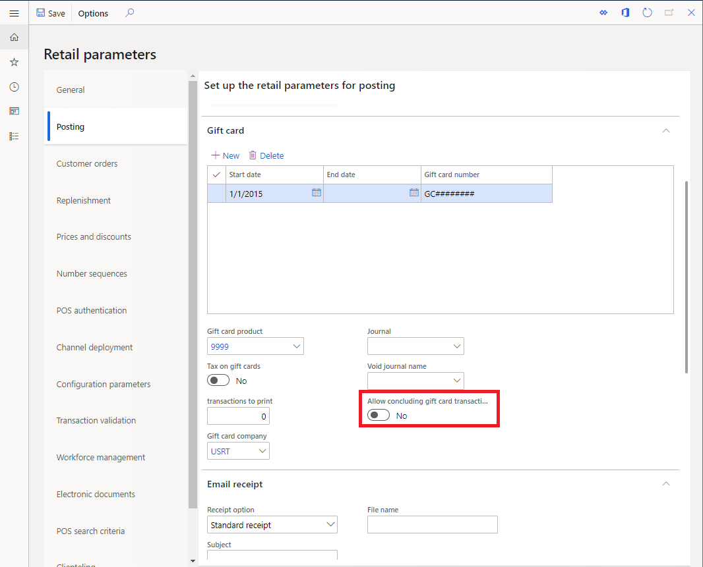
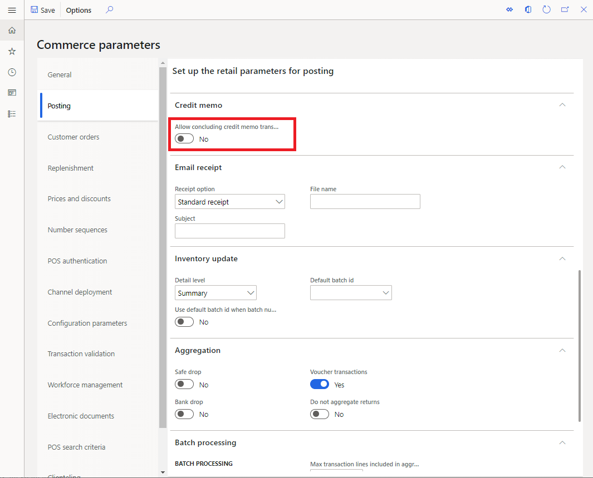

---
# required metadata

title: Seamless offline switch for gift card and credit memo operations
description: This topic provides an overview of improvements made to seamless offline switch for certain payment types. 
author: rubendel
manager: AnnBe
ms.date: 1/28/2020
ms.topic: article
ms.prod: 
ms.service: dynamics-365-retail
ms.technology: 

# optional metadata

# ms.search.form: 
# ROBOTS: 
audience: Application user
# ms.devlang: 
ms.reviewer: josaw
ms.search.scope: Operations, Retail
# ms.tgt_pltfrm: 
ms.custom: 141393
ms.assetid: 
ms.search.region: Global
ms.search.industry: Retail
ms.author: rubendel
ms.search.validFrom: 2019-01-01
ms.dyn365.ops.version: AX 8.1.3

---

# Seamless offline switch for gift card and credit memo operations

[!include [banner](../includes/banner.md)]

When the point of sale loses connection with the channel database, most POS operations and transactions that are in progress may proceed after the cashier receives a warning that the channel database connection was lost. In certain cases, however, transactions may have elements that rely on the realtime service and those elements may not be supported in offline mode. Recently some improvements have been made to reduce the impact when such scenarios occur. 

## Conclude gift card transactions in offline mode

Release added: 10.0.5

### Description

Internal gift cards carry a dependency on the real-time service. This is because the balance for the gift card must be maintained centrally within Dynamics. Since Dynamics is the single source of truth for internal gift cards-c and to prevent fraud or other sync issues- gift cards are locked as soon as they are added to a transaction. The locking function serves to ensure that the gift card cannot be used on multiple terminals at the same time. When a transaction concludes, the gift card is then updated and unlocked. 

For scenarios where a gift card is added to a transaction, then the point of sale loses HQ connectivity, the gift card would get into an unusable state without automatic recovery. To avoid this a new parameter has been created which allows the transaction with a gift card line to be concluded while offline. When this parameter is enabled, gift card transactions which are forced offline= will be saved with offline transactions and synchronize to the back office when the offline transactions are synchronized. The synchronization will also unlock the gift card so it may be used at another terminal. 

Retail parameters are typically cached, so once this parameter is updated and the distribution schedule is initiated to synchronize it to the channel, the change make take up to 24 hours to take effect. Resetting IIS can make the changes effective immediately. 

## Conclude credit memo transaction in offline mode

Release added: 10.0.9

### Description

Like internal gift cards, credit memos also are centrally managed in the back office and may fall into a bad state if they are added to a transaction that is forced offline.

For the 10.0.9 release a parameter was added to support concluding credit memo transactions while offline. This parameter functions the same was as the gift card parameter mentioned above. If the parameter is enabled and a credit memo is forced offline, it will synchronize back to the channel database along with other transactions that were performed while offline. 

Retail parameters are typically cached, so once this parameter is updated and the distribution schedule is initiated to synchronize it to the channel, the change make take up to 24 hours to take effect. Resetting IIS can make the changes effective immediately. 

## Related topics

- [Offline point of sale (POS) functionality](https://docs.microsoft.com/en-us/dynamics365/retail/pos-offline-functionality)
- [Online and offline point of sale (POS) operations](https://docs.microsoft.com/en-us/dynamics365/retail/pos-operations)
