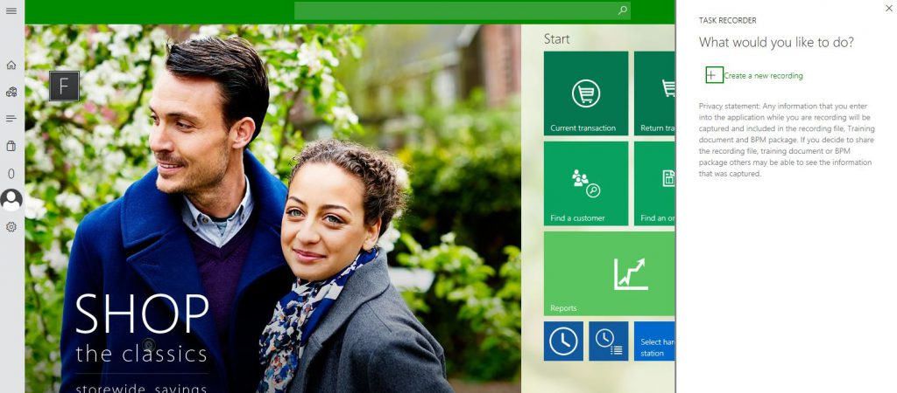
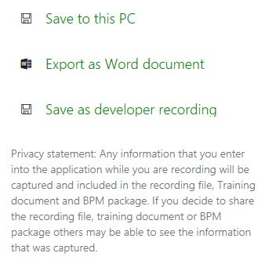
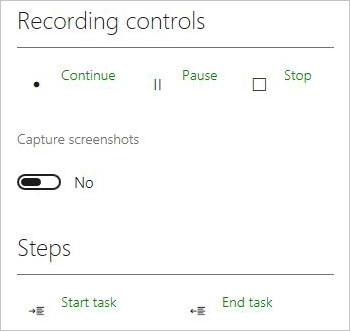
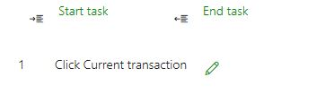
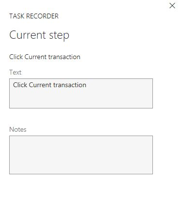

---
# required metadata

title: Task recorder and Help for POS
description: This topic describes how to use Task recorder in Retail Modern POS and Cloud POS.
author: mugunthanm
manager: AnnBe
ms.date: 06/19/2017
ms.topic: article
ms.prod: 
ms.service: dynamics-365-retail
ms.technology: 

# optional metadata

ms.search.form:  RetailTerminalTable, SystemParameters
# ROBOTS: 
audience: Application User
# ms.devlang: 
ms.reviewer: josaw
ms.search.scope: Core, Operations, Retail
# ms.tgt_pltfrm: 
ms.custom: 1205393
ms.assetid: 2f13e9cf-55b5-458b-8c32-3f8cd98c9ecf
ms.search.region: Global
ms.search.industry: Retail
ms.author: mumani
ms.search.validFrom: 2016-02-28
ms.dyn365.ops.version: AX 7.0.0, Retail July 2017 update

---

# Task recorder and Help for POS

This topic describes how to use Task recorder in Retail Modern POS and Cloud POS.

Overview
--------

Task recorder in Retail Modern POS or Cloud POS is a new solution that was built with a focus on high responsiveness. It provides a flexible application programming interface (API) for extensibility and seamless integration with consumers of business process recordings. Additionally, Task recorder integration with the Business process modeler (BPM) tool on Microsoft Dynamics Lifecycle Services ([https://bpm.lcs.dynamics.com](https://bpm.lcs.dynamics.com/)) has been brought forward. Therefore, users can continue to produce rich business process diagrams from recordings to analyze and design their applications.

## Architecture
Task recorder can record user actions in the client with exact fidelity. Each control is instrumented to notify Task recorder about the execution of a user action. The control notifies Task recorder that an event occurred and passes along all pertinent information about the corresponding user action in real time. From this information, Task recorder can capture the type of user action (such as a button click, value entry, or navigation) and any data that is related to the user action (such as the input data value and type, form context, or record context). Task recorder persists the information with enough detail to help guarantee that a playback of the recording can perform the recorded actions exactly as the user performed them. (The playback feature isn't yet implemented at Retail modern POS or Cloud POS.)

## Basic configuration
To enable task recording in POS, follow these steps.

1.  Click **Retail** &gt; **Channel Setup** &gt; **POS Setup** &gt; **Registers**.
2.  Click the register to enable task recording on.
3.  On the **Register** tab, on the **General** FastTab, set the **Enable task recording** option to **Yes**.
4.  Click **Save**.
5.  Go to **Retail** &gt; **Retail IT** &gt; **Distribution schedule**.
6.  Select the **Registers (1090)** job, and then click **Run now**.

## Create a recording
Follow these steps to create a new recording using Task recorder.

1.  Start Retail Modern POS or Cloud POS, and sign in.
2.  On the **Settings** page, in the **Task Recorder** section, click **Open task recorder**. The **Task recorder** pane appears. You can click the **Close** button (**X**) in the upper-right corner to close the **Task recorder** pane before you begin a new recording. To reopen the pane, repeat step 2.

3.  Enter a name and description for the recording, and then click **Start**. The recording session begins as soon as you click **Start**.

**Note:** If you click the **Close** button (**X**) in the upper-right corner while recording is in progress, the **Task recorder** pane is closed, but the recording session isn't ended. To reopen the Task recorder pane, click the **Help** button (question mark) at the top of the screen. 

4.  After you click **Start**, Task recorder enters recording mode. The **Task recorder** pane shows information and controls that are related to the recording process.
5.  Perform the actions that you want to perform in the Retail Modern POS or Cloud POS user interface (UI).
6.  To end the recording session, click **Stop**.

## Download options
After you end the recording session, several options are shown, so that you can download your recording. 

### Save to this PC

You can use the recording package to play a Task guide, maintain the recording, or edit the annotations in the recording. (This feature isn't yet implemented in Retail Modern POS and Cloud POS.)

### Export as Word document

You can save the recording as a Microsoft Word document. The document will contain the recorded steps and the screenshots that were captured.

### Save as developer recording

The raw recording file will be useful for developer scenarios such as test code generation. (This feature isn't yet implemented.)

## Recording controls
### 

### Stop

Click **Stop** to end the recording session. Note that you can't restart a session after you end it. Therefore, make sure that the recording is completed before you end it.

### Pause

Click **Pause** to temporarily stop (pause) the recording session and continue with the operation. Steps that you perform after you click **Pause** aren't recorded.

### Continue

To resume the recording session after you've paused it, click **Continue**.

### Capture screenshots

Task recorder can capture screenshots of the Retail Modern POS UI as you record a business process. To turn on the screenshot capture feature, set the **Capture screenshot** option to **Yes** and then make the recording. Once the recording is completed, click **Stop** and download the Word document. The document will contain the steps with relevant screenshots.

#### Note
> Capture screenshot functionality is not supported in Cloud POS.

### Start task and End task

You can specify the beginning and end of a set of grouped steps by using the **Start task** and **End** **task** buttons. Click **Start task** to add a “Start Task” step, and then perform the steps that should be included in the group. After you've finished performing the steps for the group, click **End task**. Tasks help you organize your procedures. Tasks can be nested within other tasks. In this way, you can better organize very long and complex business processes.

## Adding annotations
An annotation is additional text that you add to a step in a recording. For example, you can use annotations to give the user more context or instructions. You can add annotations before or after a step. You can add an annotation to any step by clicking the **Edit** button (pencil symbol) to the right of the step. 

### Texts and notes

You can use the **Texts** and **Notes** fields to add text that should be associated with a step in a Task guide.

#### Text

Text that you enter in the **Text** field appears *above* the step text in the Task guide. This location is appropriate for text that you want the user to read before he or she completes the step.

#### Notes

Text that you enter in the **Notes** field appears *below* the step text in the Task guide. To read the note text, the user must expand the step text in the pop-up window. This location is appropriate for optional reading material or other information that might be useful to the user, but that the user doesn't require in order to complete the action.

## Help in Retail Modern POS and Cloud POS
To show your own custom task recordings in the Help pane of Retail Modern POS and Cloud POS so that they can be viewed as text, you must save your task recordings to your own BPM library, and then update your Help system parameters to point to your BPM library. For more information, see [Connecting the Help system](../fin-and-ops/get-started/help-connect.md). Retail Modern POS and Cloud POS Help searches LCS in real time. It searches across all the BPM libraries that are selected in the Microsoft Dynamics 365 for Retail Help system parameters and shows the relevant results. To access the **Help** menu, click the **Help** button (question mark) at the top of the screen and then in the search box type your process name and hit the search button. 

 

When you click a Task guide in the search results, you can either view the steps as a Help topic or export the steps to a Word document. 
#### Note
> Help in Retail Modern POS and Cloud POS will not bring up task guides according to what form you're on or operation you're doing. You have to type the process name in the search box and then click **Search**.

