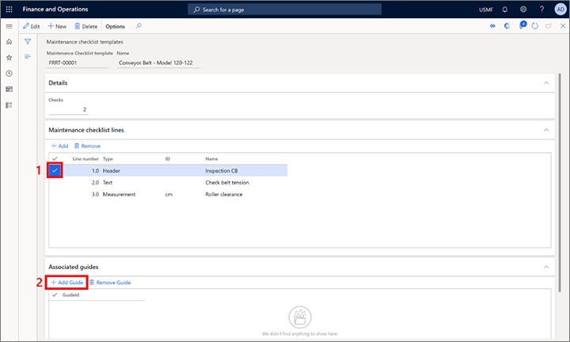
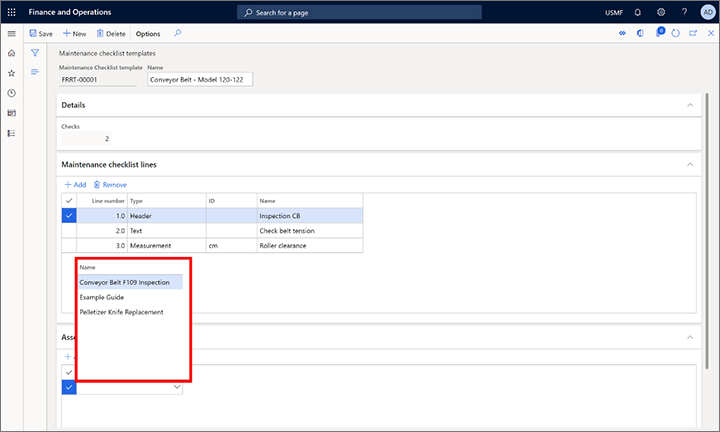
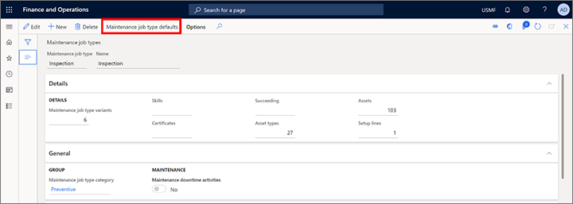
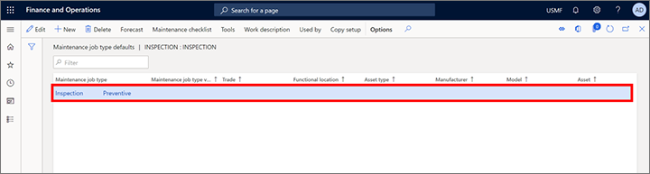
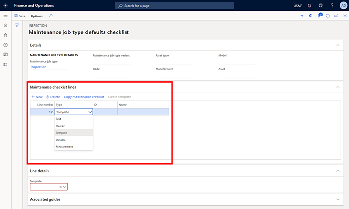
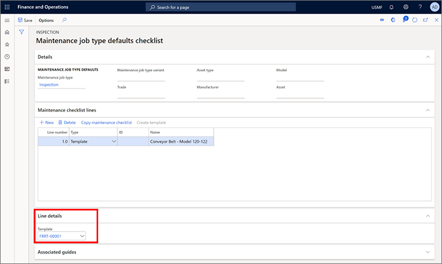
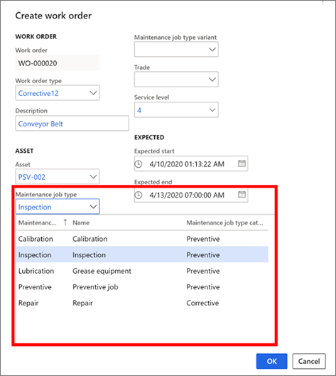
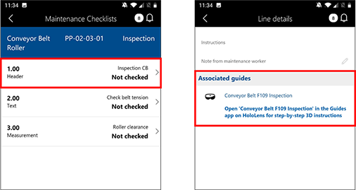
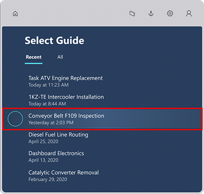

# Integrate Dynamics 365 Supply Chain Management (Asset management) with Dynamics 365 Guides

[!include [banner](../includes/banner.md)]

You can integrate the **Asset management** module in Microsoft Dynamics 365 Supply Chain Management with Dynamics 365 Guides to take advantage of mixed-reality guides in your day-to-day service and maintenance workflows. If a guide is associated with an Asset Management work order, a worker who opens the work order's maintenance checklist in the Supply Chain Management (Dynamics 365) mobile app sees that a guide is available. The worker can then find and open the guide in the Dynamics 365 Guides HoloLens app.

## Prerequisites

Before you can attach guides to Asset management work orders, you must complete these prerequisites:

- [Set up Dynamics 365 Supply Chain Management](../../fin-ops-core/fin-ops/index.md) version 10.0.9 or later.
- [Turn on dual-write for Supply Chain Management apps](../../fin-ops-core/dev-itpro/power-platform/enable-power-platform-integration.md).
- [Turn on the following configuration keys](/dynamicsax-2012/appuser-itpro/license-code-and-configuration-key-reference) on the **License configuration** page:

    - Asset management \> Asset management mixed reality
    - Mixed reality \> Mixed reality guide

- [Set up Dynamics 365 Guides](/dynamics365/mixed-reality/guides/setup#step-2-create-a-common-data-service-environment-and-install-the-dynamics-365-guides-solution) version 200.0.0.96 or later.

## Use Dynamics 365 Guides with Asset management

To associate a guide, you use a maintenance checklist line in Asset management. You can create the association through a maintenance checklist template, a maintenance job type, or a work order, because all three contain maintenance checklist lines. You can save time by using a template, because a template can be associated with all the maintenance job types that use it. For example, a guide that is associated with a maintenance job type is automatically associated with all work orders that specify that job type. On the other hand, a guide that is associated directly with a work order exists only for that work order.

### Associate a guide with a maintenance checklist template

To associate a guide with a maintenance checklist template, follow these steps.

1. Create a guide by using the Dynamics 365 Guides PC and HoloLens apps. For information about how to create a guide, see the following articles:

    - [Use the PC app to create a guide](/dynamics365/mixed-reality/guides/pc-app-overview)
    - [Use the HoloLens app to place your holograms](/dynamics365/mixed-reality/guides/hololens-app-overview)

1. In Supply Chain Management, [create a maintenance checklist template](setup-for-work-orders/job-groups-and-job-types-variants-trades-and-checklists.md#create-a-maintenance-checklist-template).
1. Associate the guide that you created with a maintenance checklist line in the new maintenance checklist template:

    1. On the **Maintenance checklist lines** FastTab, select the line that you want to associate the guide with.
    1. On the **Associated guides** FastTab, select **Add Guide**.

        

    1. In the **Name** field, select a guide, and then select **Save**.

        

1. Associate the maintenance checklist template with a job type:

    1. [Create a maintenance job type](setup-for-work-orders/job-groups-and-job-types-variants-trades-and-checklists.md#create-a-maintenance-job-type), or select an existing maintenance job type.
    1. On the Action Pane, select **Maintenance job type defaults**.

        

    1. Create a line, and then select **Save**.

        

    1. On the Action Pane, select **Maintenance checklist**.

        

    1. On the **Maintenance checklist lines** FastTab, add a line, and then change the value of the **Type** field to **Template**.

        

    1. On the **Line details** FastTab, in the **Template** field, select the template that you associated the guide with, and then select **Save**.

        

1. [Create a work order](work-orders/manually-created-workorders.md#create-work-order), and then select the maintenance job type that uses the maintenance checklist template that you associated the guide with. The guide is automatically associated with the work order.

    

1. View the guide that is associated with the work order and workers:

    1. Open the [Asset management mobile workspace](asset-management-mobile-workspace.md) to access the work order.
    1. [Open the maintenance checklist](asset-management-mobile-workspace.md#view-maintenance-checklist-on-a-work-order-job) for the work order.
    1. Select a checklist line to see the associated guide.

        

    1. Open the guide on HoloLens.

        

> [!NOTE]
> You can also associate a guide directly in the maintenance checklist of a work order or a job type.

> [!IMPORTANT]
> There is a known issue where, when you associate a maintenance checklist template with a default maintenance job type, the guide that is linked to the template doesn't appear on the **Associated guides** FastTab of the **Maintenance job type defaults** page. However, the guide will appear after that job type is applied to a work order on the **Associated guides** FastTab.

## Related information

- [Dual-write overview](../../fin-ops-core/dev-itpro/data-entities/dual-write/dual-write-overview.md)
- [Asset management overview](index.md)

[!INCLUDE[footer-include](../../includes/footer-banner.md)]
