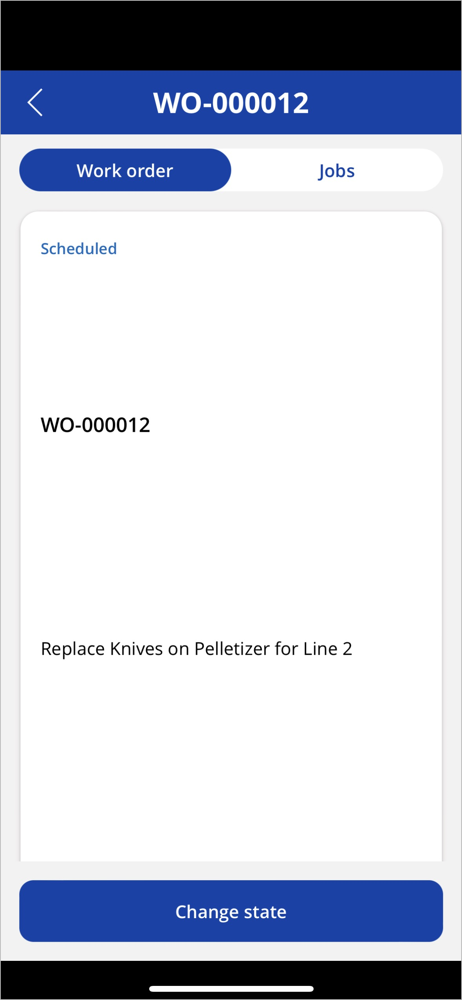

# Asset Management mobile app FAQs and known issues

This article provides answers to several frequently asked questions (FAQs) about the Asset Management mobile app. It also describes a few known issues that affect the app and how to work around them.

## What platforms and mobile devices are supported?

The Asset Management mobile app runs within the Power Apps mobile app. All platforms supported by the Power Apps mobile app can also run the Asset Management mobile app. For details, see [System requirements, limits, and configuration values for Power Apps](/power-apps/limits-and-config).

## Why don't I see anything when I sign in to the app?

If you don't see any features in the app, you probably lack the permissions required to access them. Access to each feature is controlled by security roles assigned to your user account in Supply Chain Management.  For more information, see the [Configure users and workers in Supply Chain Management](onboard-app.md#roles-workers)

## What versions of Supply Chain Management support the app?

The Asset Management mobile app requires Supply Chain Management version 10.0.32 or newer.

## Can I customize and extend the app?

No, it isn't currently possible to customize or extend the app.

## Does the app support offline mode?

No, the Asset Management mobile app doesn't currently support offline mode.

## Is there multi-language support?

No, the Asset Management mobile app is only available in English at this time. We plan to add multi-language support in an upcoming release.

## Where can I go to discuss the app with the community and submit suggestions to Microsoft?

The [Asset Management Yammer group](https://www.yammer.com/dynamicsaxfeedbackprograms/#/threads/inGroup?type=in_group&feedId=17556554&view=all) is a great place to go if you want to exchange tips, ask questions, or submit suggestions for improvement. Yammer group participants include Microsoft partners, customers, experts, and employees.

## Are there any known issues affecting the preview release of the Asset Management mobile app?

Yes. The Asset Management mobile app is currently in public preview and therefore has a few known issues that we expect to correct in an upcoming release. The following subsections describe the known issues.

### Stuck on the loading or onboarding page of the mobile app

After you install or update the preview application package or solution in the Power Platform admin center (see also [Install the mobile app in Dataverse](onboard-app.md#install-in-dataverse)), you might get stuck at the loading page or at the end of the onboarding page.

To work around this issue, open the canvas application for editing in Power Apps Studio and then republish it immediately without making any changes. For more information about how to republish a canvas application, see [Save and publish canvas apps](/power-apps/maker/canvas-apps/save-publish-app).

### Too much vertical whitespace on details pages

Occasionally, the first time you open job or work-order details from a list page, some of the fields will show too much vertical white space. To mitigate this issue, return to the list page and then reopen the details.

The following screenshot shows an example of this issue.

### Limited file-type support for attachments

The current release provides only limited support for viewing file attachments on the job details page. We plan to add support for more file types in the final release.

Supported attachment types:

- URL (link)
- PNG/JPEG/JPG/BMP/GIF (image)
- PDF (document)

Unsupported attachment types:

- Note
- All other file types
