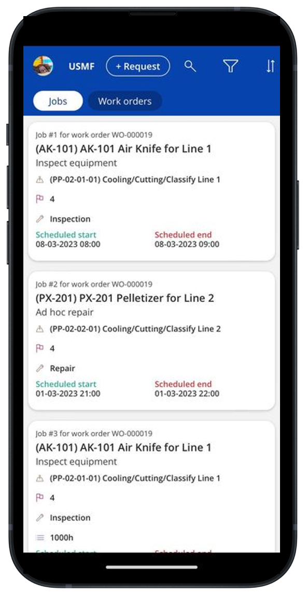

# Asset Management mobile app overview

[!include [banner](../../includes/banner.md)]
[!INCLUDE [preview-banner](../../includes/preview-banner.md)]
<!-- KFM: Preview until further notice -->

The Asset Management mobile app provides the following capabilities for workers and organizations that use Asset Management for Microsoft Dynamics 365 Supply Chain Management:

- **Manage work orders.** Maintenance workers use work orders as a daily to-do list that provides the information that they need to complete their planned maintenance tasks. In the app, workers can search for work orders that have been assigned to them. They then use the app to record their progress, so that the system can track labor, materials, and services for the work that's done. Workers can process work orders and perform tasks such as updating checklist items, registering time and materials, and viewing and adding notes.
- **Create maintenance requests.** Administrators can use the role-based security setup in Supply Chain Management to grant workers permission to create new maintenance requests. Workers who receive this permission will then be able to use the mobile app to proactively request maintenance of assets.

To use the app, you must have a fully implemented setup of Asset Management in your Supply Chain Management environment.

The following video shows how the Asset Management mobile app supports various business roles in common asset management scenarios.

> [!VIDEO https://www.microsoft.com/videoplayer/embed/RW17VjF]

The following illustration shows an example of a list of jobs for a work order in the Asset Management mobile app.

> [!NOTE]
> The Asset Management mobile app replaces the now-deprecated [Asset management mobile workspace](../asset-management-mobile-workspace.md).

## Next steps

- [Onboard the Asset Management mobile app](onboard-app.md)
- [Manage work orders using the Asset Management mobile app](work-orders.md)
- [File maintenance requests using the Asset Management mobile app](maintenance-requests.md)
