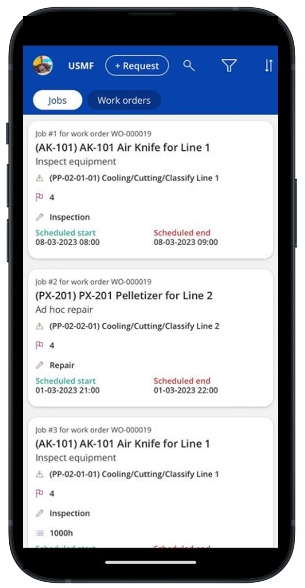

# Asset Management mobile app overview

[!include [banner](../../includes/banner.md)]

> [!IMPORTANT]
> The Asset Management mobile app is now available as an open-source sample at [microsoft/scmsamples-EnterpriseAssetManagement](https://github.com/microsoft/scmsamples-EnterpriseAssetManagement). Same functionality, freely customizable. For the timeline and transition guidance, see [Asset Management mobile app open-source release](open-source-release.md).

The Asset Management mobile app provides the following capabilities for workers and organizations that use Asset Management for Microsoft Dynamics 365 Supply Chain Management:

- **Manage work orders.** Maintenance workers use work orders as a daily to-do list that provides the information that they need to complete their planned maintenance tasks. In the app, workers can search for work orders that have been assigned to them. They then use the app to record their progress, so that the system can track labor, materials, and services for the work that's done. Workers can process work orders and perform tasks such as updating checklist items, registering time and materials, and viewing and adding notes.
- **Create maintenance requests.** Administrators can use the role-based security setup in Supply Chain Management to grant workers permission to create new maintenance requests. Workers who receive this permission will then be able to use the mobile app to proactively request maintenance of assets.
- **Create work orders.** Maintenance workers can create new work orders from scratch, or from existing work orders that need further work in the future.

To use the app, you must have a fully implemented setup of Asset Management in your Supply Chain Management environment.

The following video shows how the Asset Management mobile app supports various business roles in common asset management scenarios.

> [!VIDEO https://learn-video.azurefd.net/vod/player?id=0781126d-d706-42af-b4f5-e4f727a55e8e]

The following illustration shows an example of a list of jobs for a work order in the Asset Management mobile app.

> [!NOTE]
> Use of the Asset Management mobile app is covered by the *Dynamics 365 Supply Chain Management* user licenses. Using the app for maintenance requests requires a *Dynamics 365 Team Members* license. Using the app for processing work orders requires a *Dynamics 365 Operations – Activity* license. Licensing terms are subject to change without notice. For complete and up-to-date licensing information, see the [Dynamics 365 Licensing Guide](https://go.microsoft.com/fwlink/?LinkId=866544).

## Next steps

- [Asset Management mobile app open-source release](open-source-release.md)
- [Onboard the Asset Management mobile app](onboard-app.md)
- [Manage work orders using the Asset Management mobile app](work-orders.md)
- [File maintenance requests using the Asset Management mobile app](maintenance-requests.md)
