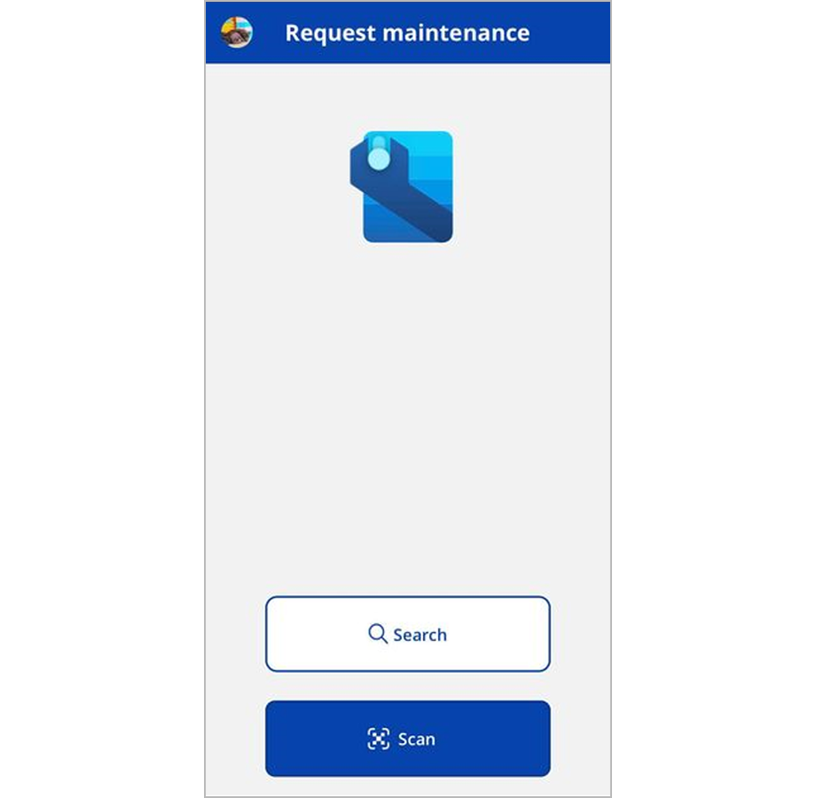

# File maintenance requests using the Asset Management mobile app

[!include [banner](../../includes/banner.md)]
[!INCLUDE [preview-banner](../../includes/preview-banner.md)]
<!-- KFM: Preview until further notice. Note that app install procedure may change after GA -->

You can use the Asset Management mobile app to file maintenance requests.

For more information about maintenance requests in Supply Chain Management, see [Maintenance requests](../manage-maintenance-requests/maintenance-request-overview.md).

## User requirements

To be able to submit maintenance requests from the Asset Management mobile app, you must meet the following requirements:

- You must sign in to Power Apps using a domain account that matches a user account in Supply Chain Management with the same Azure Active Directory ID.
- Your user account in Supply Chain Management must be assigned the *Maintenance requester* security role.

For more information about how to set up roles and security in Supply Chain Management, see
[Security roles](../../../fin-ops-core/dev-itpro/sysadmin/role-based-security.md#security-roles).

## Identify the asset or functional location you want to request maintenance for

The procedure for creating maintenance requests varies slightly based on which security roles are assigned to your user account in Supply Chain Management. The following combinations are possible:

- If you have the *Maintenance requester* role, but not the *Maintenance worker* role, the app opens directly to the **Search** and **Scan** buttons. Choose one of these buttons to start creating a maintenance request as described later in this article.
- If you have both the *Maintenance requester* and*Maintenance worker* roles, then the app opens to show a list of jobs assigned to you. To start creating a maintenance request, select **Request** at the top of the page to open a dialog that shows the **Search** and **Scan** buttons.
- If you have the *System administrator* role, the app will behave as though you have both the *Maintenance requester* and *Maintenance worker* roles.

| Start page for users that have both the *Maintenance requester* role and the *Maintenance worker* role (or the *System administrator* role) | Start page for users that have the *Maintenance requester* role but not the *Maintenance worker* role. |
|---|---|
|  |  |

### Search

Select **Search** to manually search for the asset or functional location that you want to create a maintenance request for. If you want to search for assets, then select the **Asset** button under the search field. If you want to search for functional locations, then select the **Functional locations** button. The system will search for assets and functional locations across all legal entities where the user's security role as *Maintenance requester* is granted access in Supply Chain Management.

In the search field, enter the name or ID of the asset or functional location you want to submit a maintenance request for. Then select an asset or functional location to continue.

### Scan

If your organization uses bar codes or QR codes to uniquely identify each asset, then you can use the **Scan** option to identify the asset you want to submit a maintenance request for. The code must contain the asset- or functional location's ID.

When you scan the tag, the system will automatically search for matching assets or functional locations and then show a list of results. Select an asset or functional location to continue.

## Document the maintenance request

When you've identified the target asset or functional location, you're directed to a page where you can add details about the maintenance request.

Before filing the request, check the **Work orders** and **Requests** buttons at the top of the page to see whether any open maintenance requests or work orders already exist for your selected item. If a button shows a value greater than zero, select the button to see a list of relevant records and get more information.

Enter the following information as needed:

- **Description** – Enter a description of the request.
- **Notes** – Add details about the request.
- **Service level** – Select a service level for the request. The service level is typically used to identify how critical the maintenance request is. For more information about how to set up service levels and set related default values, see [Asset service levels](../setup-for-objects/object-priorities.md).
- **Maintenance request type** – Select the request type. The request type is typically used to categorize the type of incident that is being reported. For more information about how to set up request types and set related default values, see [Maintenance request types](../setup-for-maintenance-requests/request-types.md).

## Add photos

You can use the camera on your mobile device to take photos that document the incident you're filing. The photos will be attached to your maintenance request. If the maintenance request is later converted into a maintenance work order, then the system will copy these photos to the work order.

To add photos, select **Add photos** at the bottom of the documentation page.

## Submit the maintenance request

When you're done filling out the documentation page, select **Submit** to create the maintenance request. You'll get a confirmation message when the maintenance request is created in the system.
