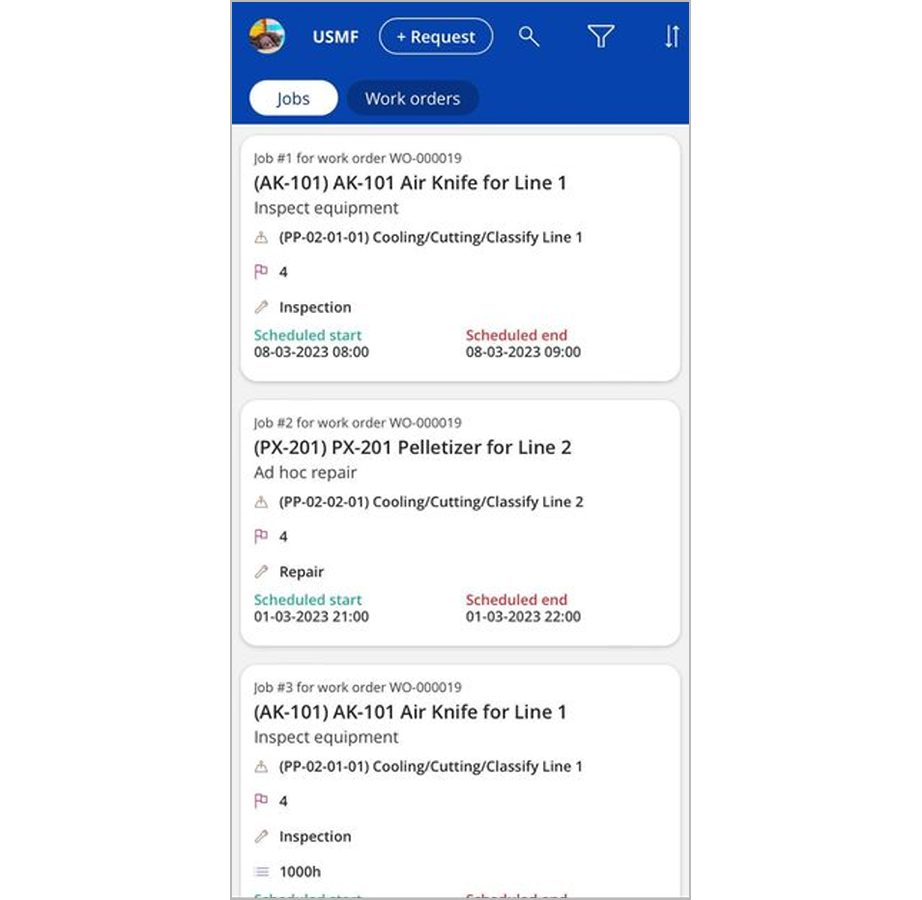
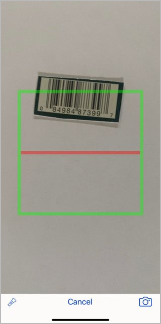

# File maintenance requests using the Asset Management mobile app

[!include [banner](../../includes/banner.md)]
[!INCLUDE [preview-banner](../../includes/preview-banner.md)]
<!-- KFM: Preview until further notice.-->

You can use the Asset Management mobile app to file maintenance requests.

For more information about maintenance requests in Microsoft Dynamics 365 Supply Chain Management, see [Maintenance requests](../manage-maintenance-requests/maintenance-request-overview.md).

## User requirements

To submit maintenance requests from the Asset Management mobile app, you must meet the following requirements:

- You must sign in to Power Apps by using a domain account that matches a user account in Supply Chain Management that has the same Azure Active Directory (Azure AD) ID.
- Your user account in Supply Chain Management must be assigned the *Maintenance requester* security role.

For more information about how to set up roles and security in Supply Chain Management, see
[Security roles](../../../fin-ops-core/dev-itpro/sysadmin/role-based-security.md#security-roles).

## Identify the asset or functional location that you want to request maintenance for

The procedure for creating maintenance requests varies slightly, depending on the security roles that are assigned to your user account in Supply Chain Management. The following combinations are possible:

- If you have the *Maintenance requester* role but not the *Maintenance worker* role, the **Search** and **Scan** buttons are shown when you first open the app. Select one of these button to start to create a maintenance request as described later in this article.
- If you have both the *Maintenance requester* role and the *Maintenance worker* role, a list of jobs that are assigned to you is shown when you first open the app. To start to create a maintenance request, select **Request** at the top of the page to open a dialog box that includes the **Search** and **Scan** buttons.
- If you have the *System administrator* role, the app behaves as though you have both the *Maintenance requester* role and the *Maintenance worker* role.

:::row:::
    :::column span="":::
        
    :::column-end:::
    :::column span="":::
        
    :::column-end:::
:::row-end:::
:::row:::
    :::column span="":::
        Start page for users who have both the *Maintenance requester* role and the *Maintenance worker* role (or the *System administrator* role)
    :::column-end:::
    :::column span="":::
        Start page for users who have the *Maintenance requester* role but not the *Maintenance worker* role
    :::column-end:::
:::row-end:::

### Search

Select **Search** to manually search for the asset or functional location that you want to create a maintenance request for. If you want to search for assets, select **Asset** under the search field. If you want to search for functional locations, select **Functional locations**. The system will search for assets and functional locations across all legal entities where the user's *Maintenance requester* security role is granted access in Supply Chain Management.

In the search field, enter the name or ID of the asset or functional location that you want to submit a maintenance request for. Then select an asset or functional location to continue.

The following illustration shows an example of search results for an asset.

### Scan

If your organization uses bar codes or QR codes to uniquely identify each asset, you can use the **Scan** button to identify the asset that you want to submit a maintenance request for. The bar code or QR must contain the ID of the asset or functional location.

When you scan the bar code or QR code on a tag, the system automatically searches for matching assets or functional locations, and then shows a list of results. Select an asset or functional location to continue.

## Document the maintenance request

When you've identified the target asset or functional location, you're directed to a documentation page where you can add details about the maintenance request.

Before you file the request, look at the **Work orders** and **Requests** buttons at the top of the page to determine whether any open maintenance requests or work orders already exist for the selected item. If a button shows a value that's more than 0 (zero), select the button to view a list of relevant records and get more information.

Set the following fields as required:

- **Description** – Enter a description of the request.
- **Notes** – Add details about the request.
- **Service level** – Select a service level for the request. The service level is typically used to identify how critical the maintenance request is. For more information about how to set up service levels and set related default values, see [Asset service levels](../setup-for-objects/object-priorities.md).
- **Maintenance request type** – Select the request type. The request type is typically used to categorize the type of incident that's being reported. For more information about how to set up request types and set related default values, see [Maintenance request types](../setup-for-maintenance-requests/request-types.md).

## Add photos

You can use the camera on your mobile device to take photos that document the incident that you're filing. The photos will be attached to your maintenance request. If the maintenance request is later converted into a maintenance work order, the system will copy these photos to the work order.

To add photos, select **Add photos** at the bottom of the documentation page.

## Submit the maintenance request

When you've finished filling in the documentation page, select **Submit** to create the maintenance request. You'll receive a confirmation message when the maintenance request is created in the system.
