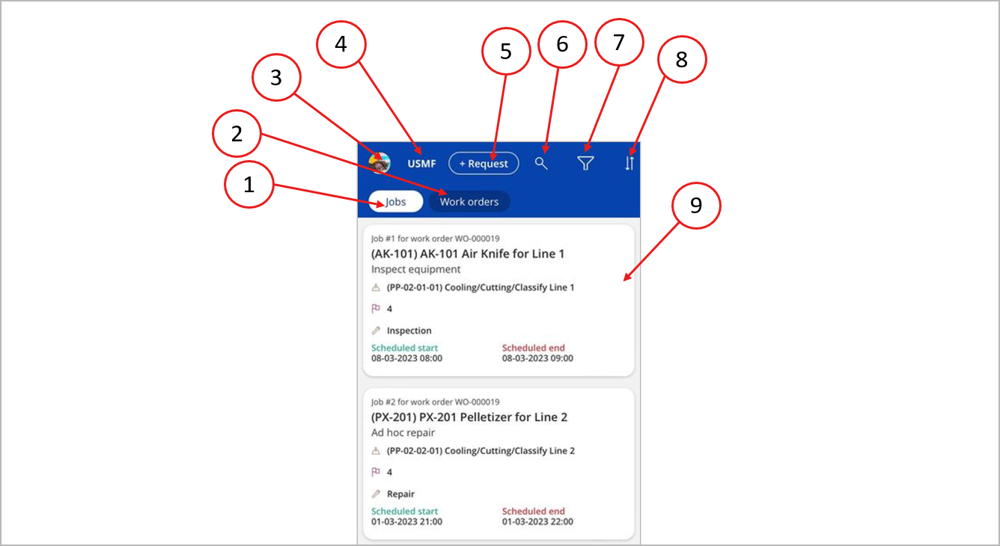
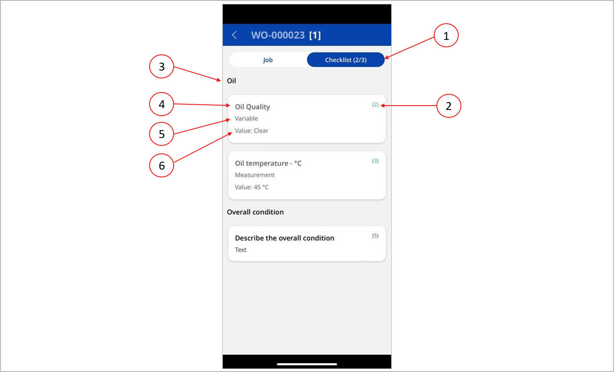

# Manage work orders using the Asset Management mobile app

[!include [banner](../../includes/banner.md)]
[!INCLUDE [preview-banner](../../includes/preview-banner.md)]
<!-- KFM: Preview until further notice. Note that app install procedure may change after GA -->

Maintenance workers can use the Asset Management mobile app to manage and process maintenance work orders. The app supports maintenance workers through the following main capabilities:

- It lists maintenance jobs and work orders that are assigned to a worker, including all information that the worker needs to process each job.
- Workers can register the time and spare parts that are consumed for each job.
- Workers can view and update the maintenance checklist that's associated with a job.

For more information about maintenance work orders in Supply Chain Management, see [Introduction to work orders](../work-orders/introduction-to-work-orders.md).

## User requirements

To view and process work orders by using the Asset Management mobile app, you must meet the following requirements:

- Your user account in Supply Chain Management must be assigned the *Maintenance worker* security role. For more information, see [Onboard the Asset Management mobile app](onboard-app.md).
- Your user account in Supply Chain Management must be associated with a human resources *Worker* record that's also set up as an Asset Management worker. For more information, see [Onboard the Asset Management mobile app](onboard-app.md).
- You must sign in to Power Apps by using a domain account that matches a user account in Supply Chain Management that has the same Azure Active Directory (Azure AD) ID.

## View the jobs and work orders assigned to you

When you open the Asset Maintenance mobile app and sign in as a user who has the *Maintenance worker* security role, the list of jobs and work orders is shown.

The following illustration highlights the different user interface (UI) elements for working with maintenance work orders.

The job and work order list includes the UI following elements. The numbers correspond to the numbers in the previous illustration.

1. **Jobs tab** – Select this tab to view the job list. The list shows only maintenance jobs that both are assigned to you and belong to a maintenance work order that's *Active*.
1. **Work orders tab** – Select this tab to view the work order list. The list shows only active work orders that have jobs that are assigned to you.
1. **User image** – Select this image to view information about the app, such as terms and conditions and the current version of the app.
1. **Legal entity identifier** – This label shows the legal entity (company) that you're currently working in. The lists show only jobs and work orders that are associated with this legal entity. If your Supply Chain Management user account is set up as an Asset Management worker in more than one legal entity, you can select this label to switch between legal entities.
1. **Request button** – If your Supply Chain Management user account is assigned the *Maintenance requester* security role, you can use this button to create a maintenance request. For more information about this functionality, see [Maintenance requests](../manage-maintenance-requests/maintenance-request-overview.md).
1. **Search button** – When you select this button, a search field appears. There, you can enter text to search for the ID of the work order, asset, or functional location that you're looking for.
1. **Filter button** – Select this button to filter the jobs or work orders in the list, based on the following criteria:

    - *Today* – Show only jobs that are scheduled for today.
    - *This week* – Show only jobs that are scheduled to start during the current week.
    - *All time* – Show all jobs.

1. **Sort order button** – Select this button to specify how the list is sorted. You can sort by work order service level, scheduled start date, or work order ID.
1. **Job or work order cards** – Each job or work order in the list is presented as a *card* that summarizes the item. Tap a card to open its details page, which provides more information about the selected job or work order.

## Job details page

In the job lists, each job is presented as a *card* that shows summary information. Tap a card to open its details page, which provides more information about the selected job. The job details page provides access to both job information and the maintenance checklist.

### Job information

To view the job information, select the **Jobs** tab at the top of the page. The following illustration highlights the different UI elements on the **Jobs** tab.

The **Jobs** tab of the job details page includes the following UI elements. The numbers correspond to the numbers in the previous illustration.

1. **Job and Checklist tabs** – Select a tab to switch between the job details and the checklist. The numbers in parentheses on the **Checklist** tab indicate the number of completed tasks and the total number of tasks on the checklist.
1. **Work order identifier** – This heading shows the ID of the work order that the current job belongs to. The number in square brackets indicates the total number of jobs in the work order.
1. **Job information** – This section shows the job description, and lets you view and edit a worker's remark and an internal note.
1. **Attachment, time spent, and materials consumed information** – This section lets you view and open documents that are attached to the job. You can also adjust the time that's spent and the materials that are consumed while you work on the job. In Supply Chain Management, the hours that are spent on a maintenance job are accounted for in a project journal. For more information about how materials and time are accounted for in journals, see [Register consumption](../consumption/register-consumption.md).

    - To adjust the number of hours that are spent working on the job, select **Adjust** next to the **My time spent** heading.
    - To adjust the materials that are consumed while you work on the job, select **Adjust** next to the **Items consumed** heading. You can adjust quantities in the list of items that are expected to be consumed for the job. You can also add new items. When you add new items, you can select from lists of released products, items on the asset bill of materials (BOM), and spare parts for the current asset. When you select a product that will be consumed, you can specify storage dimensions (site, warehouse, and location) and tracking dimensions (batch and serial number) as required. Items that have product variants (such as configuration, color, and size) aren't listed.

1. **Scheduled start and end dates and times** – This section shows the dates and times when the current job was expected to be done.
1. **Work order state** – This section shows the current state of the work order.
1. **Change work order state button** – Select this button to change the state of the parent work order for the current job. You'll typically use this button to mark the work order as completed or to note a problem that prevents it from being completed.
1. **Go to work order button** – Select this button to open the work order that the current job belongs to.
1. **See jobs for this asset button** – Select this button to view a list of all open maintenance jobs that are associated with the same asset as the current job. This list includes jobs that are assigned to other workers.
1. **See jobs for this location** – Select this button to view a list of all open maintenance jobs that are associated with the same location as the current job. This list includes jobs that are assigned to other workers.

### Maintenance checklist

A maintenance checklist is a set of tasks that the maintenance worker must complete to close the maintenance job. For more information about how to define a checklist for a job, including how to use item types and create groups, see [Maintenance checklists](../work-orders/maintenance-checklists.md). For more information about how to set up default checklists that can be assigned to various maintenance jobs or asset types, see [Maintenance job types, categories, variants, trades, and checklists](../setup-for-work-orders/job-groups-and-job-types-variants-trades-and-checklists.md).

To view the maintenance checklist, select the **Checklist** tab at the top of the page. The following illustration highlights the different UI elements on the **Checklist** tab.

The **Checklist** tab of the job details page includes the following UI elements. The numbers correspond to the numbers in the previous illustration.

1. **Job and Checklist tabs** – Select a tab to switch between the job details and the checklist. The numbers in parentheses on the label of the **Checklist** tab indicate the number of completed items and the total number of items on the checklist.
1. **Checklist line number** – Each checklist item has a system-generated line number. You can use this number to refer to the checklist item when you communicate with other workers. The text color changes to green when the item is marked as completed by the worker.
1. **Group name** – Checklist items can be grouped under a heading. (You set up group names in Supply Chain Management by creating a checklist item of the *Header* type.)
1. **Checklist item title** – This text shows the title of the checklist item.
1. **Checklist item type** – This text shows the type of checklist item (*Variable*, *Text*, or *Measurement*).
1. **Value** – This field shows the value that has been entered for checklist items of the *Measurement* or *Variable* type. To enter these values, select the checklist item card.

## Work order details page

The work order details page shows more information about a selected work order. To open it, select a card in the work order list. The following illustration highlights the different UI elements on a work order details page.

The work order details page includes the following UI elements. The numbers correspond to the numbers in the previous illustration.

1. **Work order and Jobs tabs** – Select a tab to switch between the work order details and the list of jobs that belong to the work order. The job list shows a list of job cards. Select a card to open the details page for that job.
1. **Work order information** – Information about the work order is shown on various cards.
1. **Change state button** – Select this button to change the lifecycle state of the work order. For more information about work order states, see [Work order lifecycle states](../setup-for-work-orders/work-order-lifecycle-states.md).
