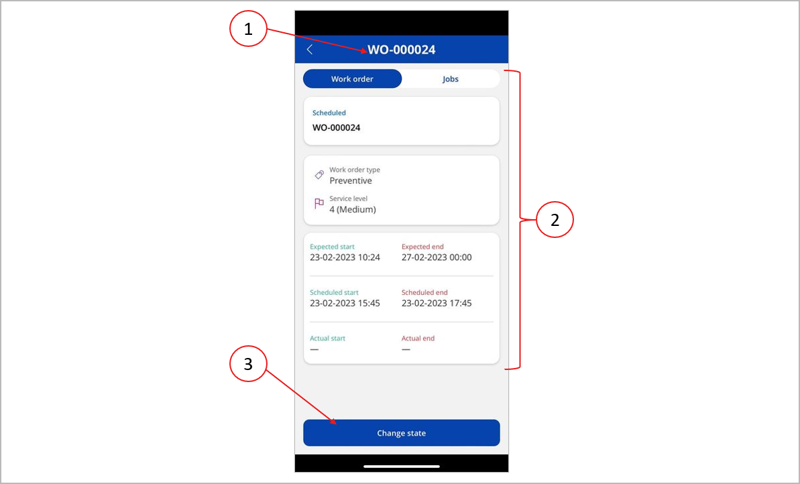

# Manage work orders using the Asset Management mobile app

[!include [banner](../../includes/banner.md)]
[!INCLUDE [preview-banner](../../includes/preview-banner.md)]
<!-- KFM: Preview until further notice. Note that app install procedure may change after GA -->

Maintenance workers can use the Asset Management mobile app to manage and process maintenance work orders. The app supports maintenance workers with the following main capabilities:

- Lists maintenance jobs and work orders assigned to the worker, including all information the worker needs to process each job.
- Enables workers to register the time and spare parts consumed for each job.
- Let workers view and update the maintenance checklist associated with a job.

For more information about maintenance work orders in Supply Chain Management, see [Introduction to work orders](../work-orders/introduction-to-work-orders.md)

## User requirements

To be able to view and process work orders using the Asset Management mobile app, you must meet the following requirements:

- Your user account in Supply Chain Management must be assigned the *Maintenance worker* security role. See also [Onboard the Asset Management mobile app](onboard-app.md).
- Your user account in Supply Chain Management must be associated with a human resources *Worker* record that is also set up as an Asset Management worker. See also [Onboard the Asset Management mobile app](onboard-app.md).
- You must sign in to Power Apps using a domain account that matches a user account in Supply Chain Management with the same Azure Active Directory ID.

## View the jobs and work orders assigned to you

When you launch the Asset Maintenance mobile app and sign in as a user with the Maintenance worker security role, the app opens to the jobs and work orders list.

The following illustration highlights the various user interface elements for working with maintenance work orders.

The jobs and work orders list includes the following elements. The numbers correspond to the numbers in the previous illustration.

1. **Jobs** – Select this tab to see the jobs list. It only shows maintenance jobs that are both assigned to you and belong to a maintenance work order that is *Active*.
1. **Work orders** – Select this tab to see the work orders list. It only shows active work orders that have jobs assigned to you.
1. **User icon** – Select this icon to get information about the app, such as terms and conditions and the current version of the app.
1. **Legal entity** – Shows the legal entity (company) that you're currently working in. The lists only show jobs and work orders associated with this legal entity. If your Supply Chain Management user account is set up as an Asset Management worker in more than one legal entity, then you can select this label to switch between legal entities.
1. **Request** – If your Supply Chain Management user account is assigned the *Maintenance requester* security role, then you can use this button to create a maintenance request. For more information about this functionality, see [Maintenance requests](../manage-maintenance-requests/maintenance-request-overview.md)
1. **Search** – When you select this button, a search field appears where you can enter text to search for ID of the work order, asset, or functional location you're looking for.
1. **Filter** – Select this button to filter the jobs or work orders in the list based on the following criteria:
    - *Today* – Only show jobs that are scheduled for today.
    - *This week* – Only show jobs that are scheduled to start during the current week.
    - *All time* – Show all jobs.
1. **Sort order** – Select this button to choose how to sort the list. You can choose to sort by work order service level, scheduled start date, or work order ID.
1. **Job or work order cards** – Each listed job or work order is presented as a *card*, which summarizes the item. Tap a card to open its details page, which provides more information about the selected job or work order.

## The job details page

In the job lists, each job is presented as a *card*, which shows summary information. Tap a card to open its details page, which provides more information about the selected job. The job details page provides access both to job information and to the maintenance checklist.

### Job information

To see the job information, select the **Jobs** tab at the top of the page. The following illustration highlights the various elements shown on the **Jobs** tab.

The job details page has the following user interface elements. The numbers correspond to the numbers in the previous illustration.

1. **Job and Checklist tabs** – Select a tab to switch between the **Jobs** and the **Checklist**. The numbers in parentheses on the **Checklist** tab indicate the number of completed tasks and the total number of tasks in the checklist.
1. **Work order identification** – This heading shows the ID of the work order that the current job belongs to. The number in square brackets indicates the total number of jobs in the work order.
1. **Job information** – This section shows the job description and lets you view and edit a **Worker's remark** and **Internal note**.
1. **Attachments, time spent, and materials consumed** – This section lets you view, and open documents attached to the job. You can also adjust time spent and material consumed while working on the job. In Supply Chain Management, the hours spent on a maintenance job are accounted for in a project journal. For more information about how materials and time are accounted for in journals, see [Register consumption](../consumption/register-consumption.md).
    - To adjust the number of hours spent working on the job, select the **Adjust** button next to the **My time spent** heading.
    - To adjust material consumed while working on the job, select the **Adjust** button next to the **Items consumed** heading. You can both adjust quantities in the list of items expected to be consumed for the job and add new items. When adding new items, you can choose from lists of released products, items in the asset BOM, and spare parts for the current asset. When selecting a product to be consumed, you can specify storage dimensions (site, warehouse, and location) and tracking dimensions (batch and serial number) as needed. Items with product variants (such as configuration, color, and size) aren't listed.
1. **Scheduled start and end date and times** – Shows the days and times when the current job was expected to be done.
1. **Work order state** – Shows the current state of the work order.
1. **Change work order state** – Select this button to change the state of the parent work order for the current job. You'll typically use this to mark the work order as complete or to note a problem that prevents it from being completed.
1. **Go to work order** – Select this button to open the work order that this job belongs to.
1. **See jobs for this asset** – Select this button to see a list of all open maintenance jobs associated with the same asset as the current job. This includes jobs assigned to other workers.
1. **See jobs for this location** – Select this button to see a list of all open maintenance jobs associated with the same location as the current job. This includes jobs assigned to other workers.

### The maintenance checklist

A maintenance checklist is a set of tasks that the maintenance worker needs to complete to close the maintenance job. For more information about how to define a checklist for a job, including how to use item types and how to create groups, see [Maintenance checklists](../work-orders/maintenance-checklists.md). For more information about how to set up default checklists that can be assigned to various maintenance jobs or asset types, see [Maintenance job types, categories, variants, trades, and checklists](../setup-for-work-orders/job-groups-and-job-types-variants-trades-and-checklists.md).

To see the maintenance checklist, select the **Checklist** tab at the top of the page. The following illustration highlights the various elements shown on the **Checklist** tab.

The checklist has the following elements. The numbers correspond to the numbers in the previous illustration.

1. **Job and Checklist tabs** – Select a tab to switch between the **Jobs** and the **Checklist**. The numbers in parentheses on the **Checklist** tab indicate the number of completed items and the total number of items in the checklist.
1. **Checklist line number** – Each checklist item has a system generated line number. You can use this to refer to the checklist item when communicating with other workers. The text color changes to green when the item is marked as completed by the worker.
1. **Group name** – Checklist items can be grouped under a header text. (Group names are set up in Supply Chain Management by creating a checklist item of type *Header*.)
1. **Checklist item title** – Shows the title of the checklist item.
1. **Checklist item type** – Shows the type of checklist item it is (*Variable*, *Text*, or*Measurement*).
1. **Value** – Showing the value entered for checklist items of type *Measurement* or*Variable*. To enter these values, select the checklist item card.

## The work order details page

The work order details page shows more information about a selected work order. To open it, select a card from the work order list. The following illustration highlights the various elements shown on the work order detail page.

The work order detail page has the following elements. The numbers correspond to the numbers in the previous illustration.

1. **Work order and jobs tabs** – Select a tab to switch between the **Work order** details and the list of **Jobs** that belong to this work order. The Jobs list shows a list of job cards; select a card to open the jobs details page for that job.
1. **Work order information** – Information about the work order is shown here in various cards.
1. **Change state** – Select this button to change the life cycle state of the work order. For more information about work order states, see [Work order lifecycle states](../setup-for-work-orders/work-order-lifecycle-states.md).
