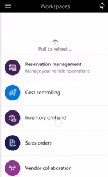
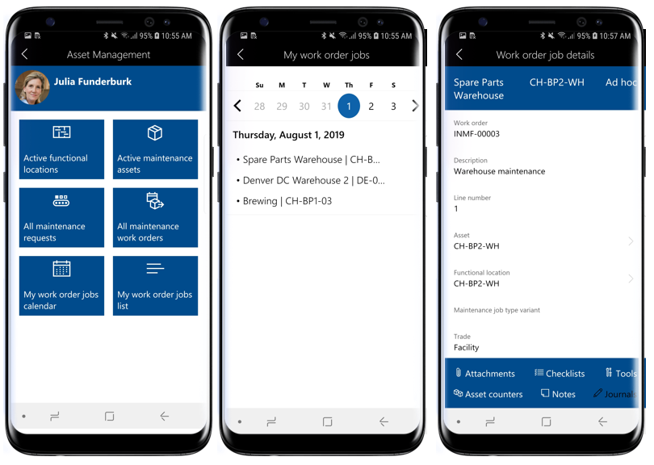
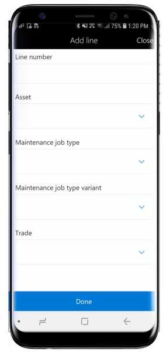
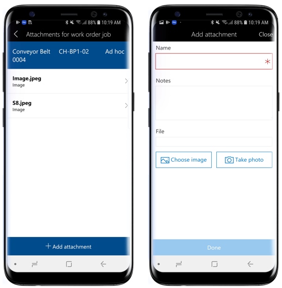
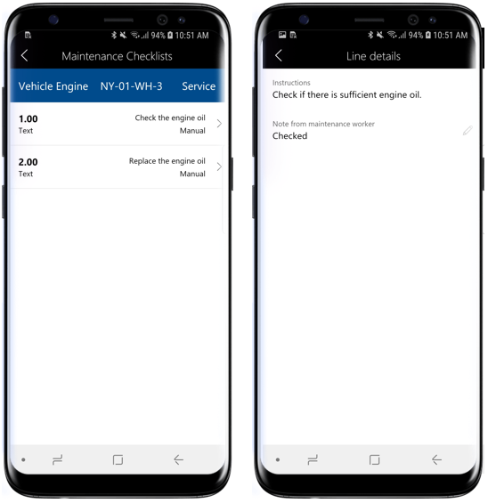
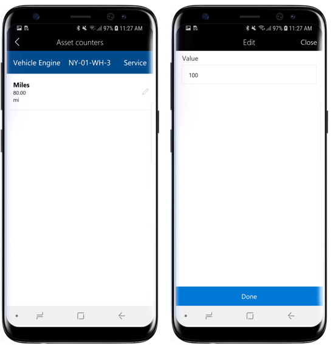
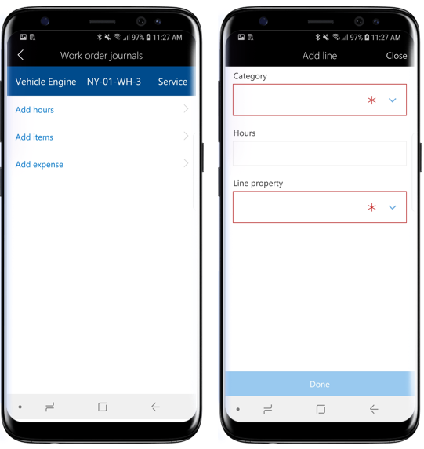
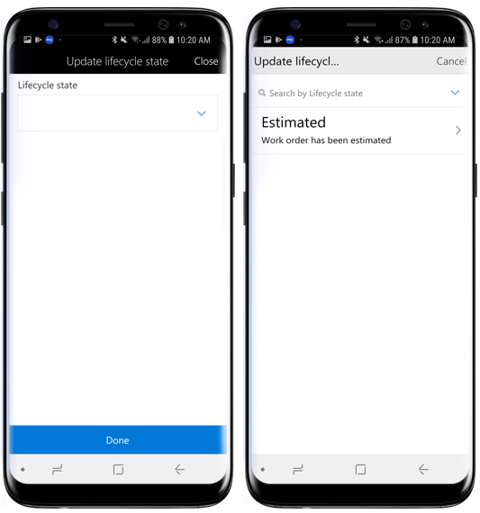
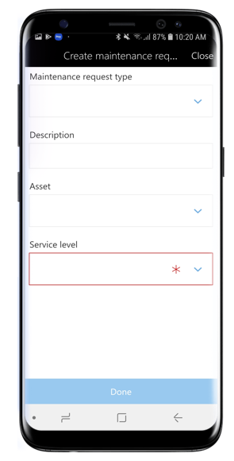
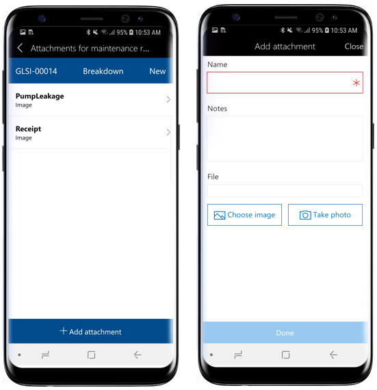

---
# required metadata

title: Asset management mobile workspace

description: This topic provides information about the Asset management mobile workspace.
author: josaw1 
manager: tfehr
ms.date: 10/01/2019
ms.topic: article
ms.prod: 
ms.service: dynamics-ax-applications
ms.technology: 

# optional metadata

# ms.search.form: 
# ROBOTS: 
audience: Application User
# ms.devlang: 
ms.reviewer: kamaybac
ms.search.scope: Core, Operations
# ms.tgt_pltfrm: 
ms.custom: 
ms.assetid: 
ms.search.region: Global
# ms.search.industry: 
ms.author: mkirknel
ms.dyn365.ops.version: 10.0.5
ms.search.validFrom: 2019-08-31

---

# Asset management mobile workspace

[!include [banner](../../includes/banner.md)]

This topic provides information about the Asset management mobile workspace. This workspace lets users view and create maintenance requests and work orders. Users can also view the assigned work order jobs in a calendar or list view. Assets and functional locations can also be viewed and searched for.

## Overview

Asset Management is an advanced module for managing assets and work order jobs in Dynamics 365 Supply Chain Management. The **Asset management** mobile workspace lets users quickly view assigned work order jobs on the mobile device of their choice. Users can also create and manage maintenance requests, update lifecycle state, and view asset and functional location details by using their mobile device.

Specifically, the **Asset management** mobile workspace lets users perform these tasks:

- Create, view, and edit maintenance requests, take a photo or attach an existing image to the maintenance request, change the maintenance request lifecycle state. 
- Create, view, and edit work orders, take a photo or attach an existing image to the work order, change the work order lifecycle state, view work order jobs.
- View assigned work order jobs in a calendar view.
- Create, view, and edit work order job, update asset counters, view maintenance checklist, view and edit work order job notes, view the tools required for the work order job.
- View or search for a specific asset or functional location.

## Prerequisites

The prerequisites vary, based on the version of Dynamics 365 Supply Chain Management that has been deployed for your organization.

### Prerequisites if you use Microsoft Dynamics 365 Supply Chain Management 
If Microsoft Dynamics 365 Supply Chain Management has been deployed for your organization, the system administrator must publish the **Asset management** mobile workspace. For instructions, see [Publish a mobile workspace](../../dev-itpro/mobile-apps/publish-mobile-workspace.md).

## Download and install the mobile app
Download and install the Dynamics 365 for Unified Operations mobile app:

- [For Android phones](https://go.microsoft.com/fwlink/?linkid=850662)
- [For iPhones](https://go.microsoft.com/fwlink/?linkid=850663)

## Sign in to the mobile app
1. Start the app on your mobile device.

2. Enter your Dynamics 365 URL.

3. The first time that you sign in, you're prompted for your user name and password. Enter your credentials.

4. After you sign in, the available workspaces for your company are shown. Note that if your system administrator publishes a new workspace later, you'll have to refresh the list of mobile workspaces.

## View assigned work order jobs in calendar view

1. On your mobile device, open the **Asset management** workspace.

2. Select **My work order jobs calendar**.

3. Select the date you want to view work order jobs for. In the list, you'll see the asset ID and functional location ID for each work order job.

4. Select a work order job in the list to see job details: Asset and functional location details as well as other navigation links to view **Attachments**, **Checklists**, **Tools**, **Asset counters**, **Notes**, **Journals**.

## Create a work order job

1. On your mobile device, open the **Asset management** workspace.

2. Select **All maintenance work orders**.

3. Select the work order you want to create a new work order job for.

4. Select the **Add line** button.

5. Select the **Asset** you want to create a work order job for.

6. Select **Maintenance job type**, **Maintenance job type variant** and **Trade**.

7. Select **Done**.

## Add attachment to a work order job

1. On your mobile device, open the **Asset management** workspace.

2. Select **All maintenance work orders**.

3. Select the work order > work order job you want to add an attachment to.
    - Alternatively, you can also select **My work order jobs calendar** or **My work order jobs list** on the home page to navigate to the **Work order job details** page.

4. Select **Attachments** on the **Work order job details** page.

5. You'll see existing attachments on the work order job. Select **Add attachment**.

6. Enter **Name** and **Notes** for the attachment.

7. Select **Choose image** to select a photo from the mobile gallery, or **Take photo** to take a photo.

8. Select **Done**.

## View maintenance checklist on a work order job

1. On your mobile device, open the **Asset management** workspace.

2. Select **All maintenance work orders**.

3. Select the work order > work order job you want to view checklists for.
    - Alternatively, you can also select **My work order jobs calendar** or **My work order jobs list** on the home page to navigate to the **work order job details** page.

4. Select **Checklists** on the **Work order job details** page.

5. You'll see a list of checklist lines related to the work order job. Select a checklist line to view **Instructions** and add **Notes**.

6. Select the back button (**<**) to return to the previous page.

## View and update asset counters on a work order job

1. On your mobile device, open the **Asset management** workspace.

2. Select **All maintenance work orders**.

3. Select the work order > work order job you want to view asset counters for.
    - Alternatively, you can also select **My work order jobs calendar** or **My work order jobs list** on the home page to navigate to the **work order job details** page.

4. Select **Asset counters** on the **Work order job details** page.

5. You see a list of asset counters related to the work order job. Select the pencil icon on an asset counter line to update the counter value.

6. Enter a new counter value, and select **Done**.

## Register consumption on a work order job

1. On your mobile device, open the **Asset management** workspace.

2. Select **All maintenance work orders**.

3. Select the work order > work order job you want to add consumtion registrations for.
    - Alternatively, you can also select **My work order jobs calendar** or **My work order jobs list** on the home page to navigate to the **work order job details** page.

4. Select **Journals** on the **Work order job details** page.

5. Select **Add hours** to create work hour registrations.
    1. Select the **Category** from the lookup.
    2. In the **Hours** field, enter the number of work hours spent on the work order job.
    3. Select the appropriate **Line property**.
    4. Select **Done**.

6. Select **Add items** to create item registrations.
    1. Select the **Item number** from the lookup.
    2. Select the **Site** from the lookup.
    3. Enter the **Quantity** of items consumed.
    4. Select **Done**.

7. Select **Add expense** to create expense registrations.
    1. Select the **Category** from the lookup.
    2. Enter the quantity for the expense registration.
    3. Select the **Sales currency** from the lookup.
    4. Enter the **Cost price** for the expense registration.
    5. Select **Done**.

## Update lifecycle state on a work order

1. On your mobile device, open the **Asset management** workspace.

2. Select **All maintenance work orders**.

3. Select the work order you want to update lifecycle state for.

4. Select the **Update state** button at the bottom of the screen.

5. Select a new lifecycle state from the list.

6. Select **Done**.

## Create a maintenance request

1. On your mobile device, open the **Asset management** workspace.

2. Select **All maintenance requests**.

3. Select **Actions** at the bottom of the screen, and select **Create maintenance request**.

4. If number sequence is enabled for maintenance requests in **Asset management**, the **Maintenance request** field is hidden because it is automatically filled out. If the **Maintenance request** field is visible, enter a maintenance request ID.

5. Select a **Maintenance request type**.

6. Enter a **Description** for the maintenance request.

7. Select the **Asset** you want to create the request for.

8. Select the **Service level** for the maintenance request.

9. Select **Done**.

## Add attachment to a maintenance request

1. On your mobile device, open the **Asset management** workspace.

2. Select **All maintenance requests**.

3. Select the maintenance request you want to add an attachment to.

4. Select **Attachments** at the bottom of the screen.

5. Select **Add attachments**.

6. Enter **Name** and **Notes** for the attachment.

7. Select **Choose image** to select a photo from the mobile gallery, or **Take photo** to take a photo.

8. Select **Done**.

