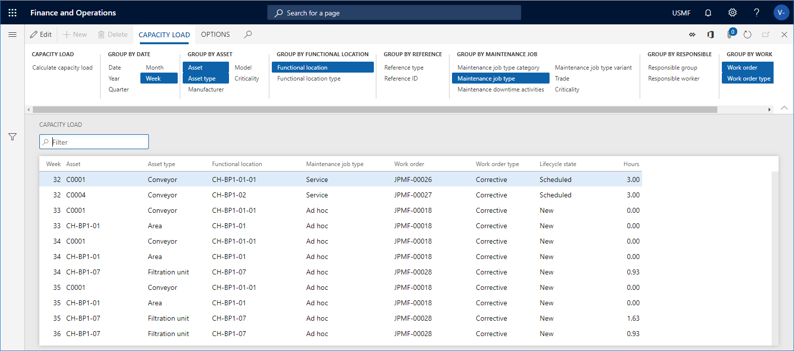

# Calculate capacity load

[!include [banner](../../includes/banner.md)]

In Asset Management, you can calculate capacity load on:

- maintenance schedule lines  
- work orders that have not yet been scheduled  
- scheduled work orders

This is useful if you want to get an overview of expected capacity load for a specific period. Calculation of capacity load can be done on all assets or selected assets. You can also make a calculation on maintenance downtime activities or work order pools.

1. Click **Asset management** > **Inquiries** > **Capacity load**, or **Asset management** > **Work order pools** > **All work order pools** / **Active work order pools** > select work order pool in the list > **Capacity load** button, or **Asset management** > **Maintenance downtime activities** > **All maintenance downtime activities** / **Active maintenance downtime activities** > select maintenance activity in the list > **Capacity load** button.

2. In the **Calculate capacity load** dialog, select a period for the calculation in the **Start date/time** and **End date/time** fields.

3. Select "Yes" on the **Include maintenance schedule** toggle button if you want to include maintenance schedule lines in the calculation.

4. Select "Yes" on the **Include work order** toggle button if you want to include work order jobs in the calculation.

5. You can use the **Level** field to indicate how detailed you want the capacity load lines to be regarding functional locations. 

    For example, if you insert the number "1" in the field, and you have a multi-level functional location structure, all maintenance schedule lines and work orders for a functional location will be shown on the top level, and therefore the hours on a line may be added up from functional locations located at a lower level. 
    
    If you insert the number "0" in the **Level** field, you will see a detailed result showing all maintenance schedule lines and all work orders on all the functional location levels to which they are related.

6. Click **OK** to start the calculation.

7. In the **Group by...** groups, click the relevant buttons to show the required detail level of the calculation. In the screenshot below, the selected **Group by** buttons are highlighted in blue color. Click on a button to activate or deactivate it.

    

>[!NOTE]
>If you want to focus only on capacity planning regarding scheduled work orders, see [Calculate capacity load on scheduled work orders](../work-order-scheduling/calculate-capacity-load-on-scheduled-work-orders.md).

[!INCLUDE[footer-include](../../../includes/footer-banner.md)]