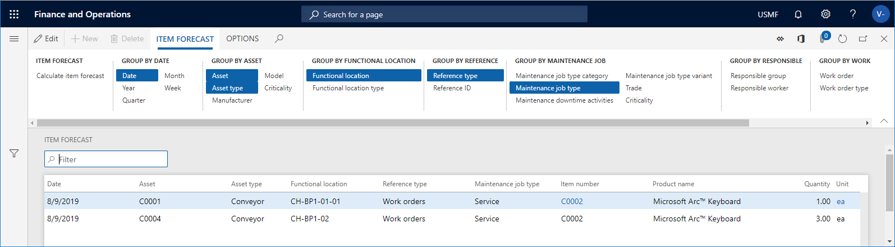

---
# required metadata

title: Calculate item forecast
description: This topic explains how to calculate item forecast in Asset Management.
author: johanhoffmann
ms.date: 08/16/2019
ms.topic: article
ms.prod: 
ms.technology: 

# optional metadata

ms.search.form: EntAssetItemForecast 
# ROBOTS: 
audience: Application User
# ms.devlang: 
ms.reviewer: kamaybac
# ms.tgt_pltfrm: 
ms.custom: 
ms.assetid: 
ms.search.region: Global
# ms.search.industry: 
ms.author: johanho
ms.search.validFrom: 2019-08-31
ms.dyn365.ops.version: 10.0.5

---

# Calculate item forecast

[!include [banner](../../includes/banner.md)]

 

Just as you can make capacity load calculations, which are described in the previous section, you can also make item forecast calculations on:

- maintenance schedule lines  
- work orders that have not yet been scheduled  
- scheduled work orders

This is useful if you want to get an overview of expected item consumption (spare parts as well as other items required for completing work orders) for a specific period. Calculation of item forecast can be done on all assets or selected assets. You can also make a calculation on a maintenance downtime activity (**All maintenance downtime activities** or **Active maintenance downtime activities**), or on a work order pool (**All work order pools** or **Active work order pools**).

1. Click **Asset management** > **Inquiries** > **Item forecast**, or **Asset management** > **Common** > **Work order pools** > **All work order pools** / **Active work order pools** > select work order pool in the list > **Item forecast** button, or **Asset management** > **Common** > **Maintenance downtime activities** > **All maintenance downtime activities** / **Active maintenance downtime activities** > select maintenance downtime activity in the list > **Item forecast** button.

2. In the **Calculate item forecast** dialog, select a period for the calculation in the **Start date/time** and **End date/time** fields.

3. Select "Yes" on the **Include maintenance schedule** toggle button if you want to include maintenance schedule lines in the forecast calculation.

4. Select "Yes" on the **Include work order** toggle button if you want to include work order jobs in the forecast calculation.

5. You can use the **Level** field to indicate how detailed you want the item forecast lines to be regarding functional locations. 

      For example, if you insert the number "1" in the field, and you have a multi-level functional location structure, all maintenance schedule lines and work orders for a functional location will be shown on the top level, and therefore the hours on a line may be added up from functional locations located at a lower level. 
  
      If you insert the number "0" in the **Level** field, you will see a detailed result showing all maintenance schedule lines and all work orders on all the functional location level to which they are related.

6. Click **OK** to start the calculation.

7. In the **Group by...** groups, click the relevant buttons to show the required detail level of the calculation. In the screenshot below, the selected **Group by** buttons are highlighted in blue color. Click on a button to activate or deactivate it.

8. Click the **Display dimensions** button if you want to see the product, storage, or tracking dimensions related to the items. Select the relevant check boxes, and click **OK**.

[!INCLUDE[footer-include](../../../includes/footer-banner.md)]