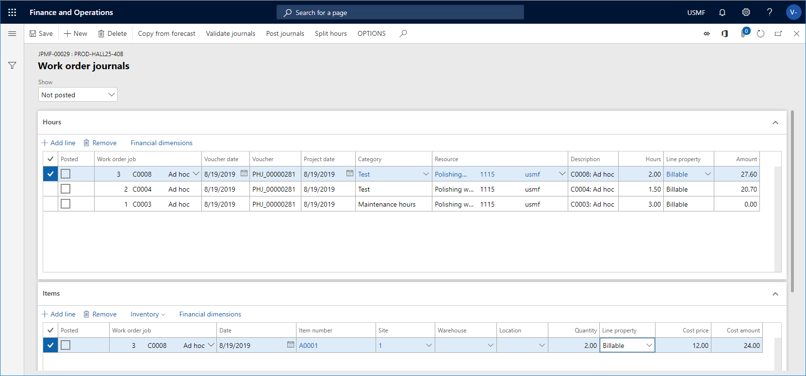
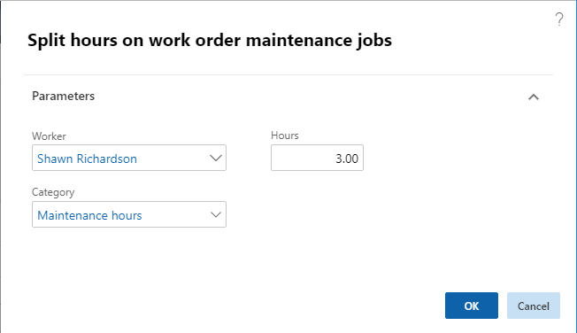
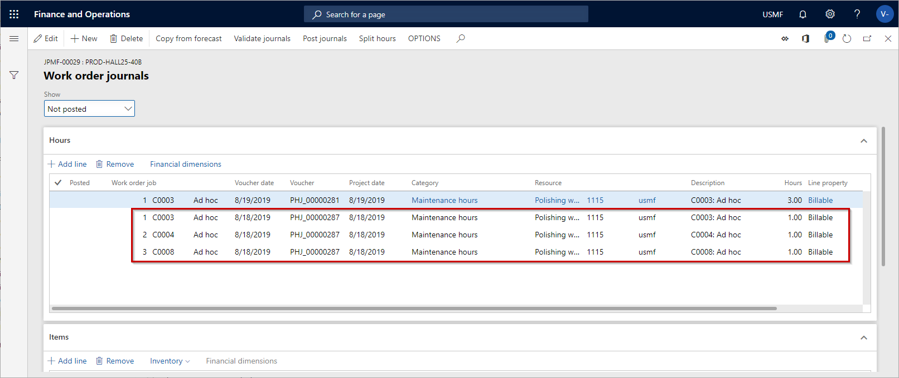

# Register consumption

[!include [banner](../../includes/banner.md)]

 

When a maintenance job has been completed on a work order, the next step is to make consumption registrations and post the journals. You can make registrations on the following consumption types: Hours, items, and expenses. The different consumption types are registered and posted on the **Work order journals** page. The journal setup in **Asset Management** is used for creating and posting separate journals for hours, items, and expenses in the **Project management and accounting** module.

In some cases, you may be able to add or delete forecast lines on a work order. The setup of a work order lifecycle state, the related project type, and the stage rules related to the project type determine if you are able to add or edit journal lines. Read more about work order lifecycle states and related project stages in [Forecasts, work orders, and projects](../integration-to-project-management-and-accounting/forecasts-work-orders-and-projects.md).

>[!NOTE]
>It is possible to set up automatic posting of journals on a work order lifecycle state. Refer to [Work order lifecycle states](../setup-for-work-orders/work-order-lifecycle-states.md) for more information.

1. Click **Asset management** > **Work orders** > **All Work orders** or **Active work orders**.

2. Select the work order, and click **Journals**.

3. Click **Copy from forecast** to transfer any forecast lines that may be connected to the work order. You can select which consumption types you want to transfer.

4. If necessary, you can add more consumption lines on the relevant FastTab by clicking **Add line** and filling out data on the line.

5. Click **Validate journals** to validate the journal lines before posting.

6. Click **Post journals** to post the journal lines.

7. After you've posted the consumption journals, you can update the work order lifecycle state. For example, to indicate that the work order has been completed, you can update the lifecycle state to "Ended".

    - In the **Show** field at the top of the **Work order journals** page, select which journal lines you want to see: **All**, **Not posted**, or **Posted**. Posted journals have a check mark in the **Posted** check box.  
    - When item lines are created in the work order journal, product dimensions and tracking dimensions related to the item are automatically transferred to the journal line.  

The screenshot below shows an example of hour and item registrations on a work order in **Work order journals**.

## Split hours on work orders with several work order jobs

If a work order contains several work order jobs, you can register work hours using the **Split hours** functionality, meaning one hour registration line can be distributed evenly on each work order job.

1. Click **Asset management** > **Work orders** > **All Work orders** or **Active work orders**.

2. Select the work order and click **Journals**.

3. Select the hour registration line you want to split, and click **Split hours**.

4. In the **Split hours on work order maintenance jobs** dialog, the name of the worker who is logged in is automatically shown in the **Worker** field. If required, you can select another worker.

5. Select a category for the hour registration in the **Category** field.

6. Insert number of work hours to be split in the **Hours** field.

    

7. Click **OK**.

*Example:* In the screenshot below, journal lines for a work order containing three work order jobs are shown. The first line, containing three work hours, has been split, and one work hour is registered on each work order job. After the three hour registration lines have been created, you decide what to do with the original hour registration line (the first line in the example). You can keep it as is or delete it. 

## Financial dimensions on consumption registrations

When you make consumption registrations, financial dimensions related to the different registration types are added to the registrations in a specific sequence. 

- *Hour and Expense registrations:* First, financial dimensions from the journal header are added, if any. Next, financial dimensions from the related work order project are added. Finally, financial dimensions from the resource (worker) are added.

- *Item registrations:* First, financial dimensions from the journal header are added, if any. Then, financial dimensions from the related work order project are added. Next, financial dimensions from the site are added. Finally, financial dimensions from the item are added.

>[!NOTE]
>For all three registration types, the financial dimension combination is validated, and invalid combinations are blanked. This is standard setup with other finance and operations apps.

[!INCLUDE[footer-include](../../../includes/footer-banner.md)]
