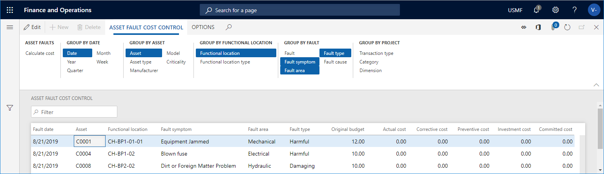

# Asset fault cost control

[!include [banner](../../includes/banner.md)]

 

In Asset Management, you can calculate costs on asset fault registrations to get an overview of actual costs compared to budget costs. Actual costs are based on posted transactions. The date is the fault date on which the symptom was recorded.

1. Click **Asset management** > **Inquiries** > **Asset fault** > **Asset fault cost control**.

2. In the **Asset fault cost control** dialog, select a financial dimension set to be included in the calculation, if required.

4. Select "Yes" on the **Skip zero** toggle button if you don't want to show results with a cost of zero.

5. You can use the **Level** field to indicate how detailed you want the cost control lines to be regarding functional locations. 

    For example, if you insert the number "1" in the field, and you have a multi-level functional location structure, all asset fault cost control lines for a functional location will be shown on the top level, and therefore the hours on a line may be added up from functional locations located at a lower level. 
    
    If you insert the number "0" in the **Level** field, you will see a detailed result showing all asset fault cost control lines on all the functional location levels to which they are related.

6. If you want to limit the search, you can select specific assets, fault dates, and fault causes on the **Records to include** FastTab.

7. Click **OK** to start the calculation.

8. Click the **Group by** buttons to show the required detail level of the calculation. The selected **Group by** buttons are highlighted. Click on a button to activate or deactivate it.

## Example

This example shows an asset fault cost control calculation.

- The **Original budget** field shows budget costs from the work order forecast. 
- The **Actual cost** field shows posted costs on work orders. 
- The **Committed cost** field shows total costs that your company is committed to in relation to work orders.

    

For information about how to set up faults, see the [Fault management](../setup-for-work-orders/fault-management.md) article.

[!INCLUDE[footer-include](../../../includes/footer-banner.md)]