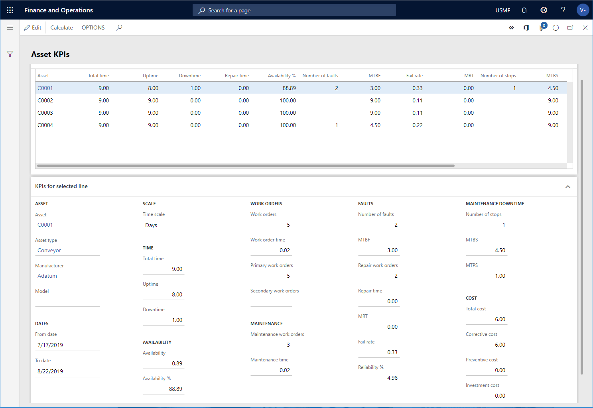

---
# required metadata

title: Asset KPIs
description: This topic explains asset KPIs in Asset Management.
author: johanhoffmann
ms.date: 08/23/2019
ms.topic: article
ms.prod: 
ms.technology: 

# optional metadata

ms.search.form: EntAssetObjectKPI 
# ROBOTS: 
audience: Application User
# ms.devlang: 
ms.reviewer: kamaybac
# ms.tgt_pltfrm: 
ms.custom: 
ms.assetid: 
ms.search.region: Global
# ms.search.industry: 
ms.author: johanho
ms.search.validFrom: 2019-08-31
ms.dyn365.ops.version: 10.0.5

---

# Asset KPIs

[!include [banner](../../includes/banner.md)]

 

In Asset Management, you can calculate various Key Performance Indicators (KPIs) for assets and asset types. You use KPIs to get an overview of performance on assets in relation to, for example, uptime, downtime, repair time, and Mean Time Between Failure (MTBF).

1. Click **Asset management** > **Inquiries** > **Assets** > **Asset KPIs**.

2. In the **Calculate asset KPIs** dialog, you select the **Time scale** to be used in the calcualtion, and a period in the **From date** and **To date** fields. 

3. On the **Records to include** FastTab, you can select specific assets and asset types to be included in the calculation, if required.

4. Click **OK** to start the calculation.

5. On the **Overview** FastTab, the results of the calculation are displayed in grid view. Each asset is displayed on a separate line.

6. On the **KPIs for selected line** FastTab, you see calculations for the asset selected on the **Overview** FastTab. The KPI values are categorized regarding **Time**, **Availability**, **Work orders**, **Maintenance**, **Faults**, **Maintenance downtime**, and **Cost**.

In the table below, you'll find a description of the fields on the **Asset KPIs** page.

| Field                   | Description                                                                                                                                                                                                                                                                                           |
|-------------------------|-------------------------------------------------------------------------------------------------------------------------------------------------------------------------------------------------------------------------------------------------------------------------------------------------------|
| Asset                   | Asset ID.                                                                                                                                                                                                                                                                                             |
| Total time              | Total time set up in the calendar used in the calculation. If the asset is related to a resource, the related resource calendar is used. If the asset isn't related to a resource, the calendar selected in the **Standard calendar** field in **Asset management parameters** is used. |
| Uptime                  | Total time minus downtime.                                                                                                                                                                                                                                                                            |
| Downtime                | Maintenance downtime registrations made on the asset in the selected period.                                                                                                                                                                                                                              |
| Repair time             | Total number of work hours consumed on repair work orders.                                                                                                                                                                                                                                            |
| Availability %          | Uptime divided by total time and multiplied by 100.                                                                                                                                                                                                                                                   |
| Number of faults        | Number of fault causes registered on fault symptoms on the asset in the selected period.                                                                                                                                                                                                             |
| MTBF                    | Mean Time Between Failure, which is total time divided by number of faults registered on the asset in the selected period. If number of faults is zero, MTBF is set to total time.                                                                                                                   |
| Fail rate               | 1 divided by MTBF.                                                                                                                                                                                                                                                                                    |
| MRT                     | Mean Repair Time, which is repair time divided by number of faults registered on the asset in the selected period. If number of faults is zero, MRT is set to repair time.                                                                                                                           |
| Number of stops         | Number of maintenance downtime registrations created on the asset.                                                                                                                                                                                                                                     |
| MTBS                    | Mean Time Between Stops, which is total time divided by number of maintenance downtime registrations. If number of maintenance downtime registrations is zero in the selected period, the MTBS value is set to total time.                                                                                      |
| Preventive cost         | Costs posted on the asset related to cost type "Preventive" in the selected period. Cost types are set up on work order types.                                                                                                                                                                       |
| Corrective cost         | Costs posted on the asset related to cost type "Corrective" in the selected period. Cost types are set up on work order types.                                                                                                                                                                       |
| Replacement value       | Value defined on the asset as the replacement cost.                                                                                                                                                                                                                                                  |
| Asset type             | Identification of the asset type selected on the asset.                                                                                                                                                                                                                                             |
| Manufacturer           | Identification of the manufacturer selected on the asset.                                                                                                                                                                                                                                                 |
| Model                   | Identification of the manufacturer model selected on the asset.                                                                                                                                                                                                                                           |
| From date               | Start date of the KPI calculation. If the asset was created after the start date selected for the calculation, the start date of the asset is shown in this field.                                                                                                                                  |
| To date                 | End date of the KPI calculation. If the asset was registered as inactive before the end date selected for the calculation, the date from which the asset was no longer active is shown in this field.                                                                                               |
| Time scale              | During calculation of the KPIs, you select a time scale to be used: Hours, Days, or Weeks.                                                                                                                                                                                                            |
| Availability            | Uptime divided by total time.                                                                                                                                                                                                                                                                         |
| Work orders             | Total number of work orders included in the KPI calculation.                                                                                                                                                                                                                                          |
| Work order time         | Total number of work hours consumed on the work orders.                                                                                                                                                                                                                                               |
| Primary work orders     | Number of primary work orders included in the KPI calculation.                                                                                                                                                                                                                                        |
| Secondary work orders   | Number of secondary work orders included in the KPI calculation.                                                                                                                                                                                                                                      |
| Maintenance work orders | Number of maintenance work orders included in the KPI calculation. A maintenance work order is a work order with no related fault causes.                                                                                                                                                             |
| Maintenance time        | Total number of work hours consumed on maintenance work orders.                                                                                                                                                                                                                                       |
| Repair work orders      | Number of repair work orders included in the KPI calculation. A repair work order is a work order with a related fault cause.                                                                                                                                                                        |
| Reliability %           | Calculation based on the expected exponential development in fault registrations on an asset meaning that, over time, the asset becomes less reliable due to wear and tear. The calculation of this KPI is based on MTBF and total time.                                                            |
| MTPS                    | Mean Time Production Stops, which is maintenance downtime divided by number of maintenance downtime registrations. If number of maintenance downtime registrations is zero in the selected period, the MTPS value is set to zero.                                                                               |
| Total cost              | Total costs posted on the asset in the selected period.                                                                                                                                                                                                                                              |
| Investment cost         | Costs posted on the asset related to cost type "Investment" in the selected period. Cost types are set up on work order types.                                                                                                                                                                       |

The figure below shows a screenshot of a KPI calculation for four assets.

- You can multi-select several assets in **All assets** and click the **Asset KPIs** button on the **General** tab. Then click **OK** in the **Calculate asset KPIs** dialog to calculate KPIs for the selected assets.  
- Results from a KPI calculation may or may not include [maintenance downtime registrations](../work-orders/maintenance-downtime.md), depending on the setup and use of maintenance downtime reason codes. 

[!INCLUDE[footer-include](../../../includes/footer-banner.md)]