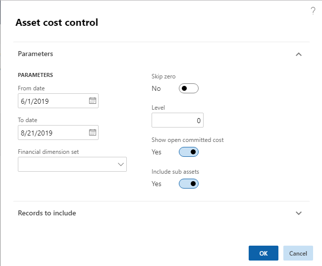
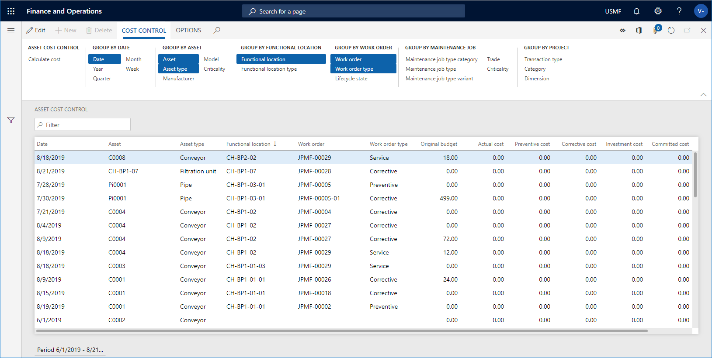
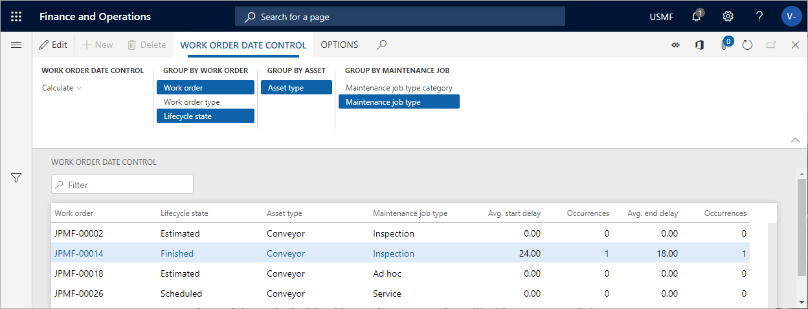

---
# required metadata

title: Cost and date control
description: This topic explains cost and date control in Asset Management.
author: johanhoffmann
ms.date: 08/23/2019
ms.topic: article
ms.prod: 
ms.technology: 

# optional metadata

ms.search.form: EntAssetBICostControlWorkspace, EntAssetWorkOrderDateControl, EntAssetWorkOrderForecastCostInfoPart, EntAssetMaintenanceCostTrans, EntAssetWorkOrderDateControlCalcDialog, EntAssetCostControl, EntAssetCostObjectCalendar, EntAssetWorkOrderCostInfoPart 
# ROBOTS: 
audience: Application User
# ms.devlang: 
ms.reviewer: kamaybac
# ms.tgt_pltfrm: 
ms.custom: 
ms.assetid: 
ms.search.region: Global
# ms.search.industry: 
ms.author: johanho
ms.search.validFrom: 2019-08-31
ms.dyn365.ops.version: 10.0.5

---

# Cost and date control

[!include [banner](../../includes/banner.md)]

In Asset Management, you can calculate costs to get an overview of actual costs compared to budget costs on assets, functional locations, and work orders. Actual costs are based on posted transactions.

You can also make a date calculation if you want to compare scheduled start and end dates to actual start and end dates on work orders.

## Cost control for assets, functional locations, and work orders

The calculations made for assets, functional locations, and work orders are almost identical. The only difference is that for assets and functional locations, you can also include sub assets and sub locations in your calculation. The date is the transaction date when the registration was recorded.

1. Click **Asset management** > **Inquiries** > **Assets** > **Asset cost control** or **Functional location cost control**, or **Asset management** > **Inquiries** > **Work orders** > **Work order cost control**.

2. In the **Asset cost control** / **Functional location cost control** / **Work order cost control** dialog, select a time range to be calculated.

3. If required, select a financial dimension set to be included in the calculation.

4. Select "Yes" on the **Skip zero** toggle button if you don't want to show results with a cost of zero.

5. You can use the **Level** field to indicate how detailed you want the cost control lines to be regarding functional locations. 

    For example, if you insert the number "1" in the field, and you have a multi-level functional location hierarchy, all cost control lines for a functional location will be shown on the top level, and therefore the hours on a line may be added up from functional locations located at a lower level.

    If you insert the number "0" in the **Level** field, you will see a detailed result showing all cost control lines on all the functional location level to which they are related.

6. Select "Yes" on the **Show open committed cost** toggle button if you want to include that column in the calculation.

7. Select "Yes" on the **Include sub assets** toggle button to show costs related to sub assets as separate lines.

8. If you want to limit the search, you can select specific assets / functional locations / work orders on the **Records to include** FastTab.

9. Click **OK** to start the calculation.

    The figure below shows an example of the **Asset cost control** dialog.

    

10. On the **Asset cost control** page, click the **Group by** buttons to show the required detail level of the calculation. The selected **Group by** buttons are highlighted. Click on a button to activate or deactivate it.

## Example of calculation results in asset cost control

The screenshot below shows an example of calculation results in **Asset cost control**.

- The **Original budget** field shows budget costs from the work order forecast. 
- The **Committed cost** field shows the total amount of expenses that a legal entity has committed itself to pay. 
- The **Open committed cost** field shows commitments to pay for items, hours, and services you have ordered or received but not yet paid for. 
- The **Actual cost** field shows related costs after all consumption registrations have been posted.

Another way of making a cost calculation is to multi-select assets in **All assets** or **Active assets**. Then, you click the **Cost control** button on the **General** tab. In the **Asset cost control** dialog, the selected assets are automatically inserted in the **Asset** field on the **Records to include** FastTab. Click **OK**, and a cost calculation for the selected assets is shown. The same procedure can be done for functional locations in **All functional locations** or **Active functional locations**, and for work orders in **All work orders** or **Active work orders**.

## Work order date control

Use this page to get an overview of expected start and end dates compared to actual start and end dates on work orders.

1. Click **Asset management** > **Inquiries** > **Work orders** > **Work order date control**.

2. Click **Calculate**.

3. Select a functional location in the **Functional location** field.

4. Insert the range for which you want to make the calculation in the **From date** and **To date** fields. All work orders with expected start date within the range will be included.

5. Click **OK**.

6. Click the **Group by** buttons to show the required detail level of the calculation. The selected **Group by** buttons are highlighted. Click on a button to activate or deactivate it.

## Example of calculation results in work order date control

The screenshot below shows an example of calculation results in **Work order date control**.

- The **Avg. start delay** field shows the difference in days between scheduled start date for a work order compared to actual start date. If, for example, the actual start date was two days before the scheduled start date, "-2" will be displayed in this field.  
- The **Avg. end delay** field shows the difference in days between scheduled end date for a work order compared to actual end date. If, for example, the actual end date was three days after the scheduled end date, "3" will be displayed in this field.  
- The **Occurrences** fields show the number of times deviations occur in relation to scheduled and actual start date, and scheduled and actual end date on the work order.

[!INCLUDE[footer-include](../../../includes/footer-banner.md)]