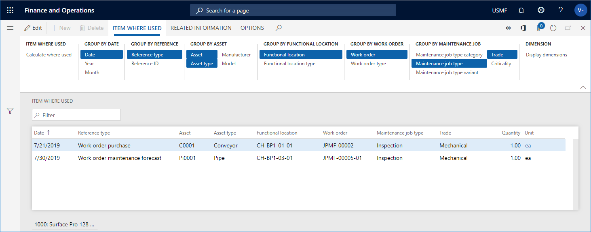

# Item where used

[!include [banner](../../includes/banner.md)]

 

You can make a calculation for a specific item to get an overview of where in Asset Management the item has been used. The results show the context in which the item has been used during its lifetime. The **Item where used** page can be opened from the main Asset Management menu, and it can also be accessed from the following pages:

- [Asset BOMs](../objects/object-BOM.md)

- [Spare parts on asset type defaults](../setup-for-objects/object-types.md#spare-parts-on-the-asset-type-setup)

- [Maintenance job type categories and maintenance job types, maintenance job type variants, maintenance job trades, and maintenance checklists](../setup-for-work-orders/job-groups-and-job-types-variants-trades-and-checklists.md)

- [Maintenance forecast](../work-orders/maintenance-forecasts.md)

- [Procurement](../work-orders/procurement.md)

- [Work order purchase](../work-orders/procurement.md)

## Make an item-where-used calculation

1. Click **Asset management** > **Inquiries** > **Item where used**, or select the **Item where used** button on one of the pages mentioned above.

2. In the **Item where used** dialog, select the item for which you want to make the calculation in the **Item number** field.

3. You can use the **Level** field to indicate how detailed you want the item lines to be regarding functional locations. 

    For example, if you insert the number "1" in the field, and you have a multi-level functional location structure, all item lines for a functional location will be shown on the top level. Therefore, relation/quantity on a line may be added up from functional locations located at a lower level. 
    
    If you insert the number "0" in the **Level** field, you will see a detailed result showing all item lines on all the functional location levels to which they are related.

4. In the **Include** section, select "Yes" on the toggle buttons that you want to include in the calculation.

5. Click **OK** to start the calculation.

6. On the **Item where used** tab, select the **Group by** buttons to show the required detail level of the calculation. The selected **Group by** buttons are highlighted. Click on a button to activate or deactivate it.

7. If you want to show dimensions related to the item, click **Display dimensions**, and select the dimensions to be shown.

## Example

In the screenshot below, you see an example of an item-where-used calculation for item number "1000".

[!INCLUDE[footer-include](../../../includes/footer-banner.md)]