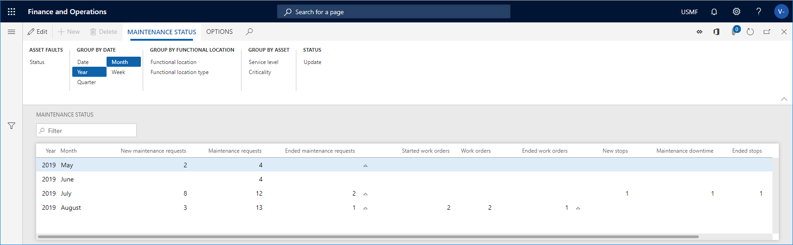
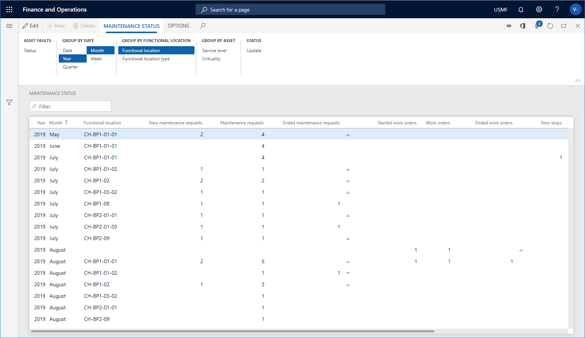

---
# required metadata

title: Maintenance status
description: This topic explains how to calculate maintenance status in Asset Management.
author: johanhoffmann
ms.date: 08/23/2019
ms.topic: article
ms.prod: 
ms.technology: 

# optional metadata

ms.search.form: EntAssetStatusCalculate, EntAssetStatus 
# ROBOTS: 
audience: Application User
# ms.devlang: 
ms.reviewer: kamaybac
# ms.tgt_pltfrm: 
ms.custom: 
ms.assetid: 
ms.search.region: Global
# ms.search.industry: 
ms.author: johanho
ms.search.validFrom: 2019-08-31
ms.dyn365.ops.version: 10.0.5

---

# Maintenance status

[!include [banner](../../includes/banner.md)]

 

In Asset Management, you can make an overview calculation for a specific period for new, active, and completed maintenance requests, work orders, and maintenance downtime activities. You can also see the number of completed condition assessments for the same period. Use this calculation to get an overview of workload for incoming and completed maintenance requests and work orders.

## Make a maintenance status calculation

1. Click **Asset management** > **Inquiries** > **Maintenance status**.

2. In the **Calculate status** dialog, select the time range that you want to make the calculation in the **From date** and **To date** fields.

3. You can use the **Level** field to indicate how detailed you want the maintenance lines to be regarding functional locations. 

  For example, if you insert the number "1" in the field, and you have a multi-level functional location structure, all maintenance lines for a functional location will be shown on the top level, and therefore the status on a line may be added up from functional locations located at a lower level. 
  
  If you insert the number "0" in the **Level** field, you see a detailed result showing all maintenance lines on all the functional location levels to which they are related.

4. Click **OK** to start the calculation.

5. Click the **Group by** buttons to show the required detail level of the calculation. The selected **Group by** buttons are highlighted. Click on a button to activate or deactivate it.

6. Remember to click the **Update** button to update the calculation each time you make changes by activating or deactivating **Group by** buttons, or by making a calculation for a new period.

7. Click **Status** if you want to create a new maintenance status calculation.

>[!NOTE]
>The results shown in **Maintenance status** only include maintenance requests and work orders that have an actual start date and time. End date and time may be blank.

## Example 1

In the screenshot below, the **Year** and **Month** buttons have been activated. With these **Group by** options selected, you get a general overview on a monthly basis of workload and throughput related to maintenance requests and work orders. 

## Example 2

In the screenshot below, information about functional locations has been added. Now it is possible to compare workload and throughput across functional locations, which may represent geographical locations, factories, or work areas. 

[!INCLUDE[footer-include](../../../includes/footer-banner.md)]