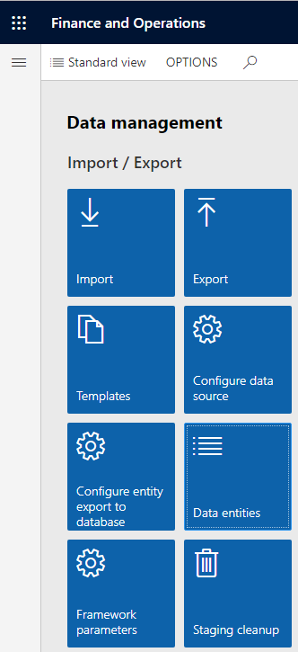
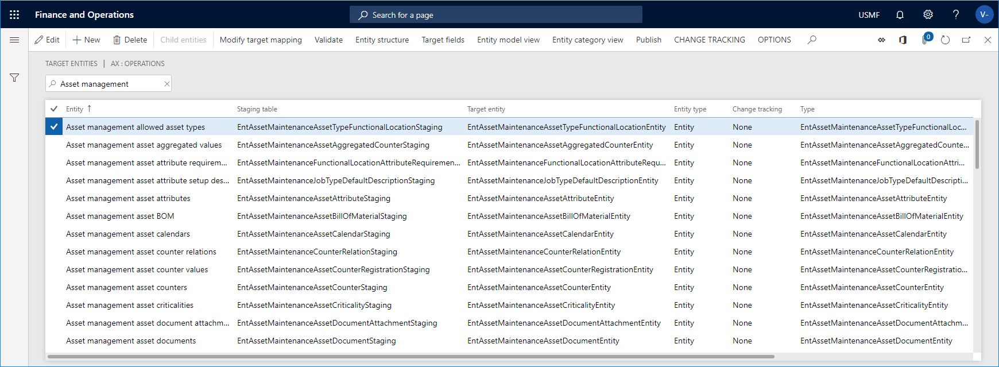
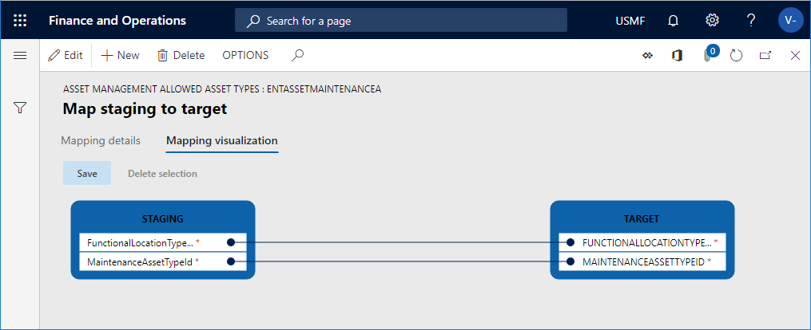

# Target entities

[!include [banner](../../includes/banner.md)]

 

In the **Data management** workspace, you can get an overview of target entities, related entity types and staging tables related to the **Asset management** module. 

1. Click the **Finance and operations** button in the upper-left corner of the screen, and click **Data management**.

2. In the **Import / Export** section, click **Data entities**. 

    

3. On the **Target entities** page, search for "asset management" in the filter, and press Enter to see a list of the entities related to Asset management.

    The figure below shows some of the Asset management entities.

   

4. Select an entity and click **Modify target mapping**.

5. On the **Map staging to target** page, you see a list of the staging fields related to the selected entity. Click **Mapping visualization** to see a graphic overview of how staging data and target data are related. 

    In the figure below, a visualization of the fields related to the asset types entity is shown.

    

[!INCLUDE[footer-include](../../../includes/footer-banner.md)]
