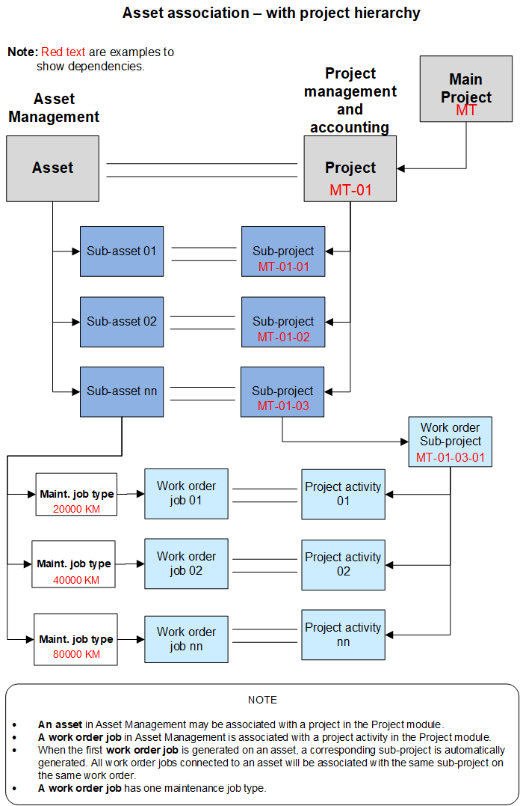
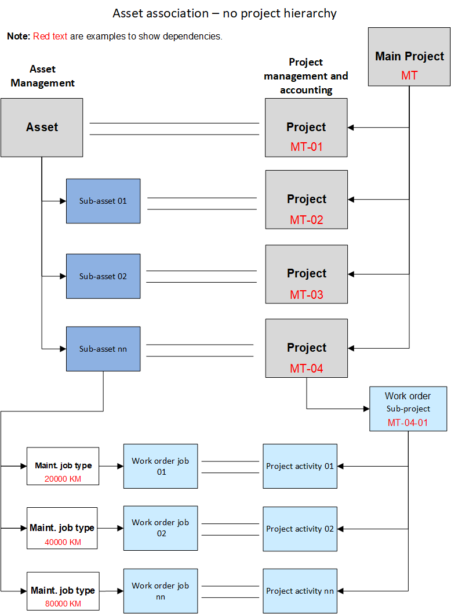
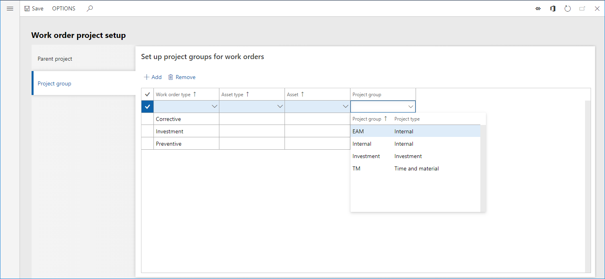
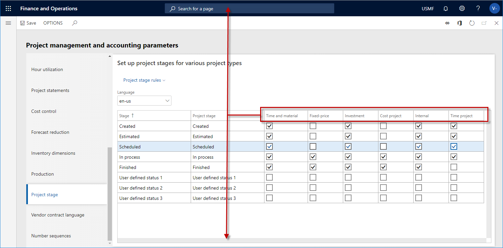
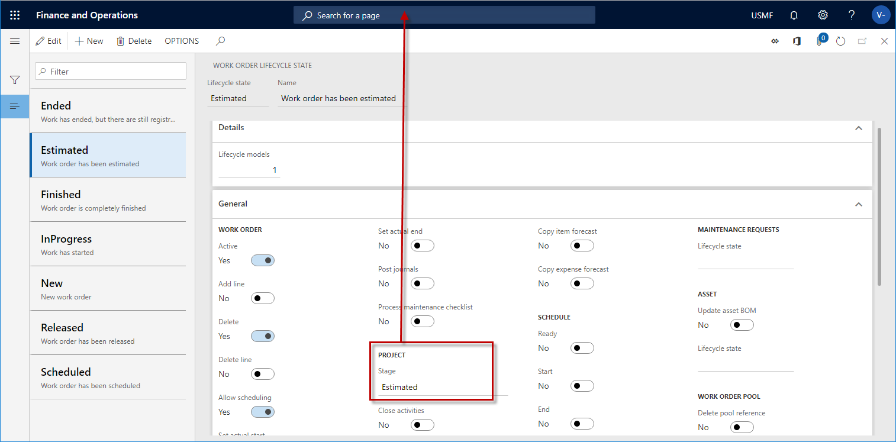
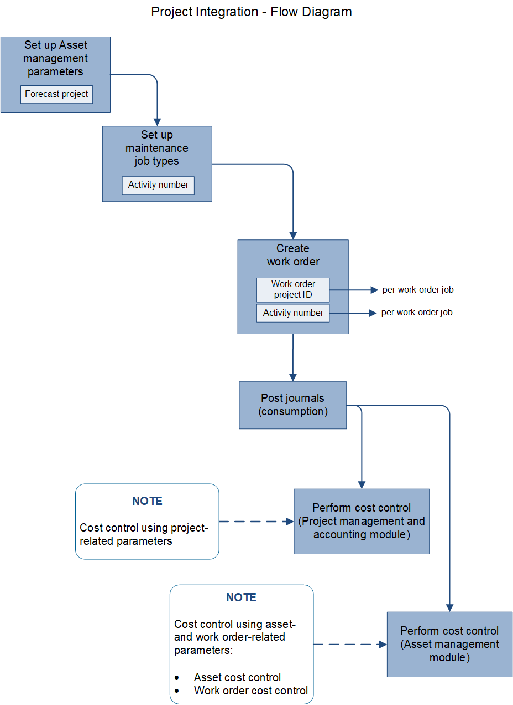

# Forecasts, work orders, and projects

[!include [banner](../../includes/banner.md)]

 

In Asset Management, integration with the **Project management and accounting** module helps optimize cost control, so that users can track costs on maintenance job type forecasts and work order jobs.

Tracking of maintenance job type forecasts requires two settings:

1. Select a project in **Asset management** > **Setup** > **Asset management parameters**, and then, on the **Assets** tab > on the **Project** FastTab, in the **Maintenance forecast project** field, select a project.

2. When you create a maintenance job type default line, an activity number is automatically created for the line on the **Maintenance job type defaults** page (**Asset management** > **Setup** > **Jobs** > **Maintenance job type defaults**).

Maintenance job type forecasts serve two purposes: 

- You can track costs on maintenance job type forecasts in the **Project management and accounting** module. 
- Forecasts are automatically transferred to a work order job project when you select a maintenance job type on a work order job.

To track costs on work order jobs, you must first set up work order projects. Learn more in [Work order project setup](../setup-for-work-orders/work-order-project-setup.md).

## Work order job projects

When you create a work order job on a work order, the work order project is determined by the setup of the parent project for work orders on the **Work order project setup** page (**Asset management** > **Setup** > **Work orders** > **Project setup**).

Work order job projects are created by using a combination of the following work order information:

- The work order type selected on the work order 
- The functional location related to the asset on the work order job
- The asset type that is related to the asset on the work order job  
- The expected start and end times that are set on the work order  

Some of this information might not be found on a work order. Therefore, the search for a work order parent project is done by using the available combination of data and selecting the project ID that corresponds to work order data.

For example, in the following illustration, because of the way that the **Truck Engine** asset type is set up, every work order job that is created with the **Truck Engine** asset type will be a sub-project of project ID 000186.

The purpose of the project ID on the work order job, and the related activity number, is to track costs that are related to the work order job, and the asset that is selected on it, in the **Project management and accounting** module. (To view the project ID and activity number, select **Asset management** > **Work orders** > **All work orders**, and then select the work order. On the **Line details** FastTab, the **Project ID** field shows the project ID, and the **Activity number** field shows the activity number.) For more information about cost control in Asset Management, see [Cost and date control](../controlling-and-reporting/cost-and-date-control.md).

The following illustration shows a graphical overview of work order projects and related project activities.

When a new work order job is created on a work order, a work order project is automatically created for the job. The financial dimensions for the asset that is related to the work order job are automatically transferred to the work order project.

The project activity that is created for a work order job has related information attached to it. This information is about the maintenance job type, maintenance job type variant, and trade. It's useful if, for example, you create a purchase order from a work order (see [Procurement](../work-orders/procurement.md)), or if you use the **Project management and accounting** module for time registration.

If the asset was installed on a functional location but is later installed on a different functional location, the financial dimensions that are related to the new functional location are automatically updated on the asset. Then, when you create a work order job for the asset, the work order project for the work order job automatically gets the financial dimensions that are now related to the asset. Therefore, when you use functional locations, costs can always be tracked on the functional locations that an asset was installed on at any given time. The automatic update of financial dimensions helps guarantee complete traceability of costs for project control and reporting.

## Work order projects, work order lifecycle states, project stages, and project types

To help guarantee that work order lifecycle states and related project stages on work orders are used correctly, consider the dependencies in relation to the **Project management and accounting** module:

- In the **Project management and accounting** module, project stages are set up on project types on the **Project management and accounting parameters** page.  
- On the **Project management and accounting parameters** page, use the check boxes to select relevant project stages for all the project types that you will use. In the following illustrations, five stages (**Created**, **Estimated**, **Scheduled**, **In process**, and **Finished**) have been selected for the **Time and material** and **Internal** project types. Those five stages are relevant to both internal maintenance jobs and service maintenance jobs.
- In the **Asset Management** module, project types are defined by the project groups that you set up on the **Work order project setup** page > **Project group** tab (**Asset management** > **Setup** > **Work orders** > **Project setup**).  
- The project groups that are set up on the **Work order project setup** page are used when you create work orders. When a work order is created, a work order project is automatically created for the work order.  
- Every work order lifecycle state must have a related project stage.  
- The project stage that is related to a work order lifecycle state must be defined as an active stage for the project group that is defined in the work order project. The work order project is automatically created on a work order.
- When you create a new work order, the automatic allocation of a work order project is based on the setup on the **Work order project setup** page.  

The following illustrations show the associations between work order project groups, related project types, project stages, and work order lifecycle states.

For information about how to set up work order projects, see [Work order project setup](../setup-for-work-orders/work-order-project-setup.md). For information about how to create work order lifecycle states, see [Work order lifecycle states](../setup-for-work-orders/work-order-lifecycle-states.md).

The following illustration shows a graphical overview of the various projects that are created in the **Asset management** module to enable integration with the **Project management and accounting** module. It also shows the work processes that the projects are related to.

[!INCLUDE[footer-include](../../../includes/footer-banner.md)]