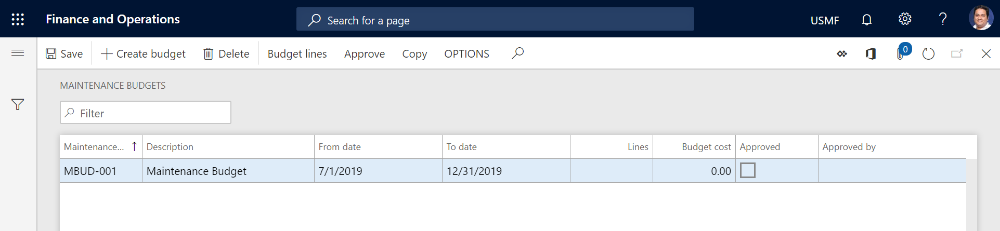

# Create maintenance budgets

[!include [banner](../../includes/banner.md)]

 

Maintenance budgets are used to provide an overview of expected costs for preventive maintenance. Budget lines are calculated based on maintenance schedule lines that have an expected start date during the budget period.

Maintenance budgets are based on the cost types that are used in Asset Management: **Preventive**, **Corrective**, and **Investment**. Budget costs for investment maintenance are included for active assets that have a replacement date during the budget period and a related replacement value. Budget costs for corrective maintenance are included if a past corrective date is included in the budget calculation. In that case, corrective costs from an earlier period are calculated for the same future period that you calculate the maintenance budget for.

## Create a maintenance budget

1. Select **Asset management** \> **Inquiries** \> **Maintenance budget** \> **Budget**.
2. Select **Create budget**.
3. In the **Maintenance budget** field, enter a budget ID.
4. In the **Description** field, enter a description.
4. On the **Period** FastTab, in the **From date** and **To date** fields, enter the start and end dates of the budget period.
5. To include corrective budget costs that are calculated on the basis of actual costs from a previous period, in the **Corrective from date** field, enter the start date of the period that those costs should be included from.
6. Depending on the level of detail that is required in the budget, set the relevant options on the five **Group by** FastTabs.
7. Select **OK**.
8. Select **Budget lines** to open **Maintenance budget lines** page, where you can view all the budget lines that have been created for the period.
9. To approve the budget, select it on the **Maintenance budgets** page, and then select **Approve**. Then, in the **Approve budget** dialog box, select **OK**. Your name is entered in the **Approved by** field on the **Maintenance budgets** page.

    > [!NOTE]
    > After you've approved a maintenance budget, you can't recalculate or adjust the related lines on the **Maintenance budget lines** page unless you first remove the approval. To remove the approval of a maintenance budget, select it on the **Maintenance budgets** page, and then select **Approve**. Then, in the **Approve budget** dialog box, select **OK**.

You can also create a new maintenance budget by copying an existing budget. On the **Maintenance budgets** page, select the budget to copy, and then select **Copy**. This approach is useful if, for example, you've created a budget for one month and want to copy it to other months.

> [!NOTE]
> The maintenance budget calculates only budget costs based on maintenance schedule lines. To calculate actual costs for the same period, you can do that calculation on the **Asset cost control** page. 

[!INCLUDE[footer-include](../../../includes/footer-banner.md)]