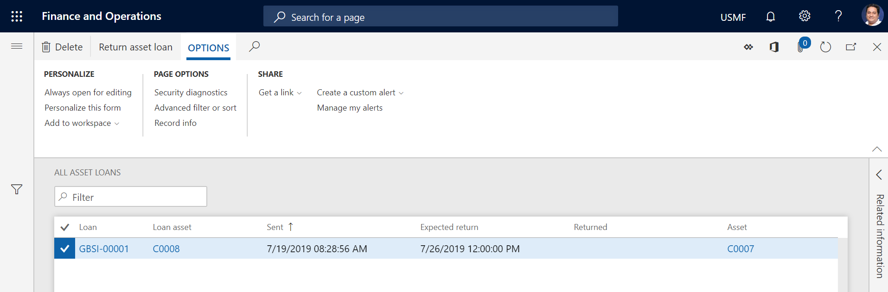

# Asset loans

[!include [banner](../../includes/banner.md)]

 

If your company receives assets for repair or maintenance jobs from either internal locations or customers, and if you temporarily loan assets to those locations or customers, Asset Management can track the asset loans.

## Register asset loans on a maintenance request

1. Select **Asset management** \> **Maintenance requests** \> **All maintenance requests** or **Active maintenance requests**.
2. Select the maintenance request to register an asset loan on, and then select **Edit**.
3. On the **Request** page, select **Send loan asset**.
4. Select the asset, and enter the expected return date.
5. Select **OK**.

> [!NOTE]
> - You can send a loan asset only if an asset of the same asset type is available.
> - The asset that you loan must have an asset lifecycle state that allows it to be used as a loan asset, such as **InStorage**. When the asset loan is registered, the asset lifecycle state of the asset is automatically updated to, for example, **OnLoan**.

To view a list of all the assets that you've loaned to other locations or customers, select **Asset management** \> **Asset loan** \> **All asset loans**. If the **Ended** check box is selected for an asset, the asset has been registered as returned to your company.

On the **Active asset loans** page, you can view a list of all the loan assets that haven't yet been returned to your company.

## Register loan assets as returned

1. Select **Asset management** \> **Asset loan** \> **Active asset loans**.
2. Select the asset loan to register as returned, and then select **Return asset loan**.
3. In the **Returned** field, enter the date and time.
4. Select **OK**.
5. Refresh the **Active asset loans** list page, and notice that the asset loan no longer appears in the list.

[!INCLUDE[footer-include](../../../includes/footer-banner.md)]