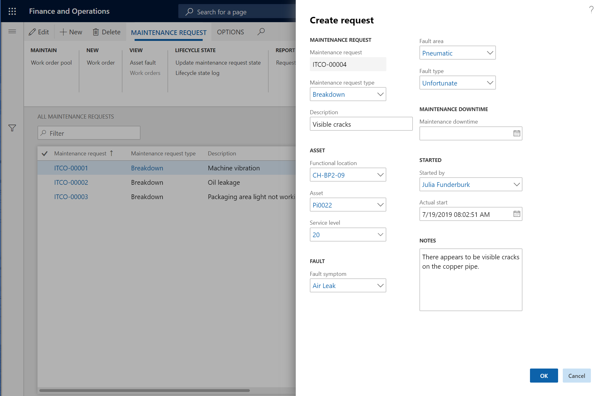
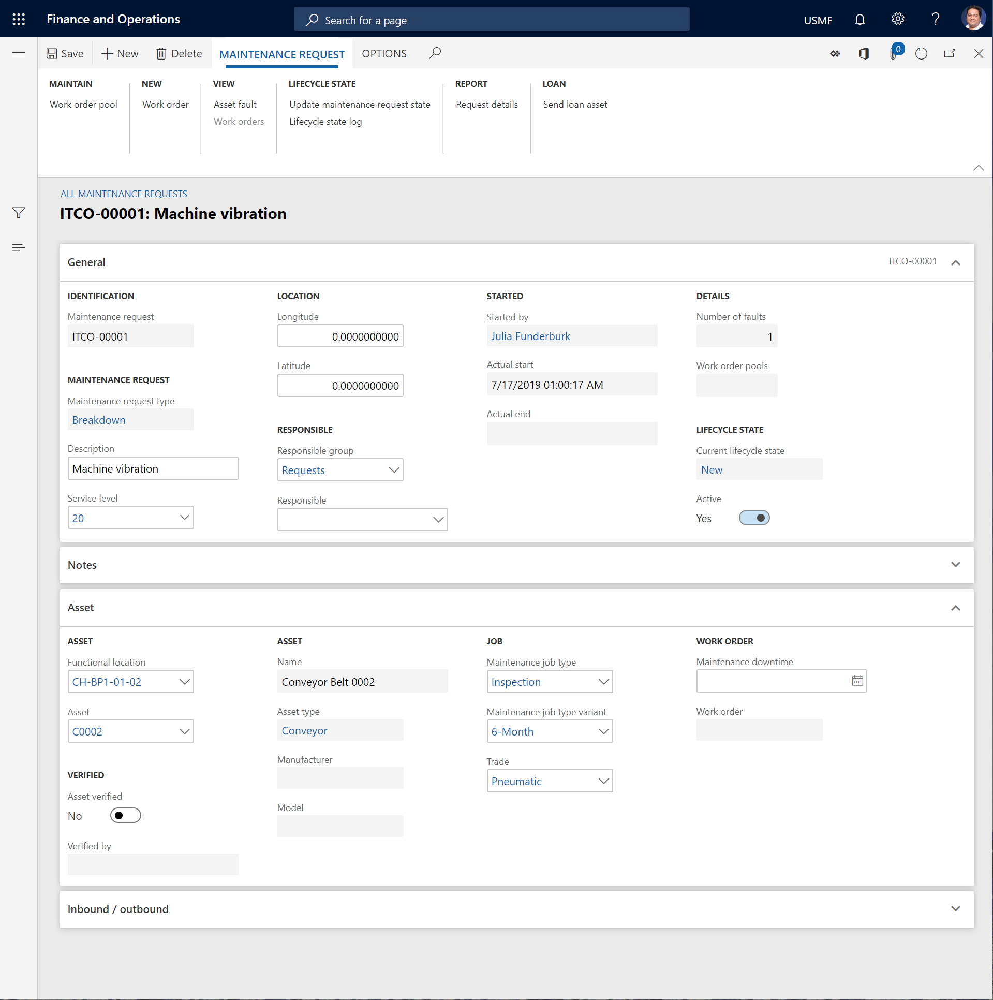

# Create maintenance requests

[!include [banner](../../includes/banner.md)]

 

Maintenance requests can be used if maintenance workers or production workers discover that equipment requires repair, but the repair job can't be done right away.

**Example:** While a maintenance worker is making a repair, they discover that another asset at the same location must be serviced. However, the maintenance worker doesn't have the time or the required spare parts to do the repair job. Therefore, they create a maintenance request on the asset and enters a short description of the issue.

The **Active maintenance requests** section of the **Related information** pane on the right side of the **All assets** or **Active assets** page (**Asset management** \> **Assets** \> **All assets** or **Active assets**) shows the active maintenance requests that are attached to the selected asset.

1. Select **Asset management** \> **Maintenance requests** \> **All maintenance requests** or **Active maintenance requests**.
2. Select **New**.
3. In the **Create request** dialog box, in the **Maintenance request type** field, select the type of maintenance request. A default type is suggested.
4. In the **Description** field, enter a name or title that briefly describes the maintenance request.
5. In the **Functional location** and **Asset** fields, select a functional location or an asset, or a combination of a functional location and an asset, as you require. You can create a maintenance request without selecting an asset, and the asset can be added to the maintenance request later. If the maintenance worker who is signed in is related to a resource that is related to an asset, the **Asset** field is automatically set.

    If a maintenance request is already attached to the selected asset, a message bar appears at the top of the **Create request** dialog box to notify you about the ID of the existing maintenance request. A message bar also notifies you if the asset is covered by a warranty agreement.

6. In the **Service level** field, select a service level that indicates the urgency of the request.
7. If you selected an asset in step 5, you can use the **Fault symptom**, **Fault area**, and **Fault type** fields to create a fault registration.
8. If the maintenance request has caused maintenance downtime, enter the start date and time of the downtime.

    The **Started by** field is automatically set to your name.

10. The **Actual start** field is automatically set to the current date and time. However, you can change the value as you require.
11. In the **Notes** field, enter any additional notes that are required.
12. Select **OK**.

## Subsequent processing of maintenance requests

After a maintenance request is created, but before it's converted to a work order, various information should be updated on it. Typically, a planner or another administrative employee completes this task.

- On the **All maintenance requests** or **Active maintenance requests** page, select the request to work with, and then select **Edit**.

In the details view, you can update various information. Here are some examples:

- Select and verify the asset. If you must select a different asset later, you can set the **Asset verified** option to **No**.
- Select a responsible maintenance worker group and/or a responsible maintenance worker. For more information about the required setup, see [Responsible maintenance workers](../setup-for-maintenance-requests/responsible-workers.md).
- Select a maintenance job type and, if this information is relevant, a related maintenance job variant and a job trade.
- In the **Latitude** and **Longitude** fields, enter geographic coordinates. Any coordinates that are added to a maintenance request are automatically transferred to a related work order. 

> [!NOTE]
> If you select an asset when you create a maintenance request, you can add one fault to the asset. After the maintenance request has been created, you can add more faults, as you require. To add faults, select **Asset fault** on the **All maintenance requests** page.

[!INCLUDE[footer-include](../../../includes/footer-banner.md)]