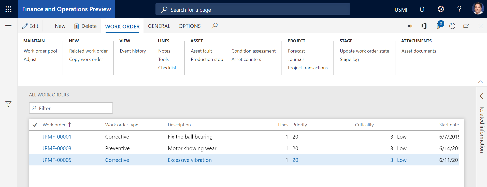

---
# required metadata

title: Create work orders from maintenance requests
description: This topic explains how to create a work order from a maintenance request in Asset Management.
author: johanhoffmann
ms.date: 10/01/2019
ms.topic: article
ms.prod: 
ms.technology: 

# optional metadata

ms.search.form: 
# ROBOTS: 
audience: Application User
# ms.devlang: 
ms.reviewer: kamaybac
# ms.tgt_pltfrm: 
ms.custom: 
ms.assetid:
ms.search.region: Global
# ms.search.industry: 
ms.author: johanho
ms.search.validFrom: 2019-10-31
ms.dyn365.ops.version: 10.0.5

---
# Create work orders from maintenance requests

[!include [banner](../../includes/banner.md)]

 

After you've created maintenance requests, you can easily convert them to work orders. This topic describes the quickest way to work with maintenance requests, update several maintenance requests at the same time, and then create a work order for several maintenance requests at the same time. On the **Active maintenance requests** or **My functional location maintenance requests** page, you can also work with one maintenance request at a time and convert one maintenance request to a work order.

> [!NOTE]
> Every maintenance request can be related to only one work order. However, multiple maintenance requests can be included in one work order, even if the maintenance requests have different assets.

1. Select **Asset management** \> **Common** \> **maintenance requests** \> **All maintenance requests**.
2. Before you can create a work order from maintenance requests, you must select, at a minimum, a maintenance job type for the maintenance requests, and also a maintenance job type variant and trade, if this information is relevant. In the grid view, you can easily update information for a maintenance request.
3. When you're ready to create a work order, select the maintenance requests to include in it.

    - If you select several maintenance requests to convert to a work order, both the **Asset** field and the **Maintenance job type** field must be set before you create the work order.
    - If you select one maintenance request to convert to a work order, only the **Asset** field must be set before you create the work order. However, when you create the work order, you can select a maintenance job type (and a related maintenance job type variant and trade, if this information is relevant) in the **Create work order** dialog box.

4. Select **Work order**.
5. In the **Create work order** dialog box, set the fields, and then select **OK**.

    A message bar might notify you that a new work order has been created.

    Additionally, when you create a work order that is based on a maintenance request, if the asset that is related to the maintenance request is included in a warranty agreement, a message bar notifies you about the warranty agreement.

6. Select **Asset management** \> **Common** \> **Work orders** \> **All work orders**, and open the new work order.

    

[!INCLUDE[footer-include](../../../includes/footer-banner.md)]