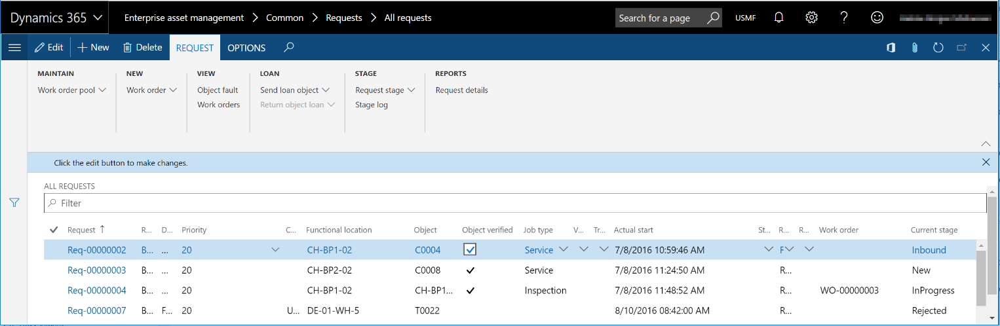
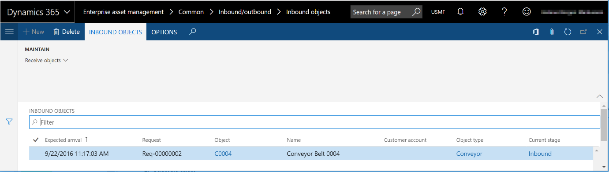

---
# required metadata

title: Inbound and outbound assets
description: This topic explains how to register inbound and outbound assets in Asset Management.
author: johanhoffmann
ms.date: 10/01/2019
ms.topic: article
ms.prod: 
ms.technology: 

# optional metadata

ms.search.form: EntAssetOutboundObjectsListPage, EntAssetOutboundObjectsDeliver, EntAssetInboundObjectsListPage, EntAssetInboundObjectsRecieve 
# ROBOTS: 
audience: Application User
# ms.devlang: 
ms.reviewer: kamaybac
# ms.tgt_pltfrm: 
ms.custom: 
ms.assetid: 
ms.search.region: Global
# ms.search.industry: 
ms.author: johanho
ms.search.validFrom: 2019-10-31
ms.dyn365.ops.version: 10.0.5

---

# Inbound and outbound assets

[!include [banner](../../includes/banner.md)]

 

If your company does repair jobs or maintenance jobs on assets that are received from other locations or customers, Asset Management can track both inbound assets that are on their way to your company and outbound assets that are being returned.

> [!NOTE]
> If you want to use inbound and outbound lifecycle states to manage assets that are coming in and being returned, you must set up maintenance request lifecycle states and lifecycle models to support these actions. For more information, see [Maintenance requests](/d365F-O/supply-chain/asset-management/manage-maintenance-requests/../manage-maintenance-requests/maintenance-request-overview).

The setup of Asset Management determines whether you can work with inbound and outbound assets.

## Register assets as inbound

1. Select **Asset management** \> **Common** \> **Maintenance requests** \> **Active maintenance requests**.
2. Select the maintenance request.
3. Select **Update maintenance request state**.
4. Select **Inbound** (or another lifecycle state that you've created for inbound assets), and then select **OK**.

## Register inbound assets as received

1. Select **Asset management** \> **Common** \> **Inbound/outbound** \> **Inbound assets**.
2. Select the asset or maintenance request.
3. Select **Receive assets**.
4. In the **Received** field, enter the date and time. Then select **OK**. The record is removed from the **Inbound assets** list page.

## Register assets as outbound

When you've completed the maintenance or repair job, you can register the asset as returned.

1. Select **Asset management** \> **Common** \> **Maintenance requests** \> **Active maintenance requests**.
2. Select the maintenance request.
3. Select **Update maintenance request state**.
4. Select **Outbound** (or another lifecycle state that you've created for outbound assets), and then select **OK**.

## Register outbound assets as delivered

1. Select **Asset management** \> **Common** \> **Inbound/outbound** \> **Outbound assets**.
2. Select the asset or maintenance request.
3. Select **Deliver assets**.
4. In the **Delivered** field, enter the date and time. Then select **OK**. The record is removed from the **Outbound assets** list page.

[!INCLUDE[footer-include](../../../includes/footer-banner.md)]