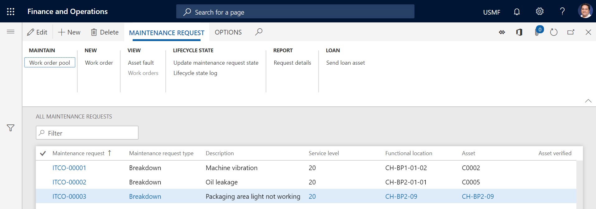
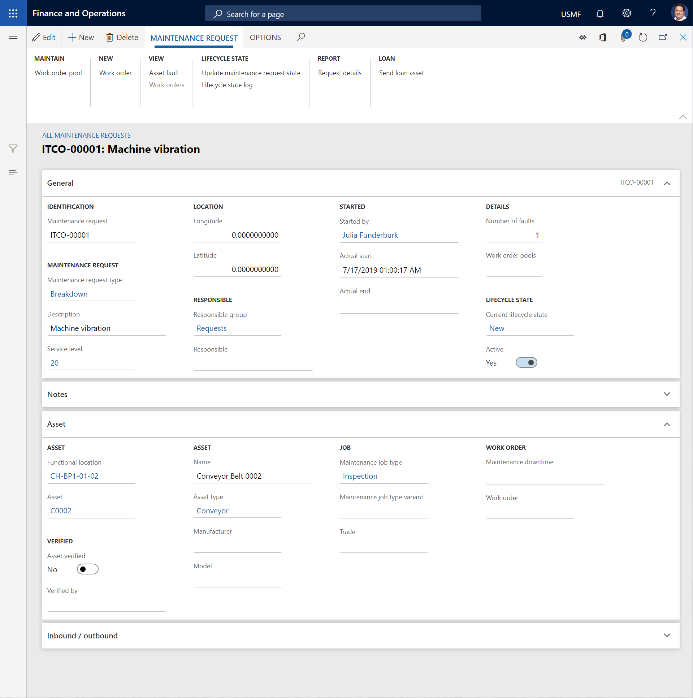

# Maintenance requests

[!include [banner](../../includes/banner.md)]

Maintenance requests are notes or declarations that are created to notify a manager or planner that an asset might require a maintenance or repair job, but without creating a work order. If the contents of a maintenance request are considered valid, a work order can then be created based on the maintenance request.

Maintenance requests can be created for any asset in Asset Management. Various types of maintenance requests can be created, depending on how your company uses maintenance requests. Here are some examples:

- Maintenance requests
- Notes
- Corrections or enhancements
- Investments
- Depot repair (This type is used when you receive assets from another location so that you can do a maintenance or repair job, and you then return the asset after the job is completed.)

## View maintenance requests

To view maintenance requests, select **Asset management** \> **Maintenance requests** \> **All maintenance requests**, **Active maintenance requests**, or **My functional location maintenance requests**. Each list page shows some of the information that is related to a maintenance request.

> [!NOTE]
> Use the **My functional location maintenance requests** list page to view a list of maintenance requests that contain either functional locations that you're related to as a worker or assets that are installed on functional locations that you're related to as a worker. (For information about how to set up functional locations on maintenance workers, see [Maintenance workers and worker groups](../setup-for-objects/workers-and-worker-groups.md).)
> 
> Although customer account information is available in Asset Service Management (external maintenance), it isn't available in Asset Management (internal maintenance).

To open the details view of a record, on the **All maintenance requests** list page, in the grid view, select a link in the **Maintenance request** column.

The buttons on the Action Pane are organized on tabs. The following table briefly describes the buttons that are related to Asset Management.

| Button name                      | Description |
|----------------------------------|-------------|
| Edit                             | Edit the selected maintenance request. |
| New                              | Create a new maintenance request. |
| Delete                           | Delete the selected maintenance request. |
| Work order pool                  | Connect the selected maintenance request to a work order pool. |
| Work order                       | Create a work order, based on the selected maintenance request. |
| Asset fault                      | Click **Asset faults**, where you can create a fault registration on the selected maintenance request. |
| Work orders                      | Show a list of all work orders that are connected to the selected maintenance request. |
| Update maintenance request state | Update the maintenance request state. |
| Lifecycle state log              | View a log that shows the lifecycle states of the selected maintenance request. |
| Maintenance request details      | Print a report that shows details of the selected maintenance request. |
| Send loan asset                  | Select a loan asset that should be a temporary replacement for the asset that is selected on the selected maintenance request. |
| Return loan asset                | Register the loan asset as returned. |

[!INCLUDE[footer-include](../../../includes/footer-banner.md)]