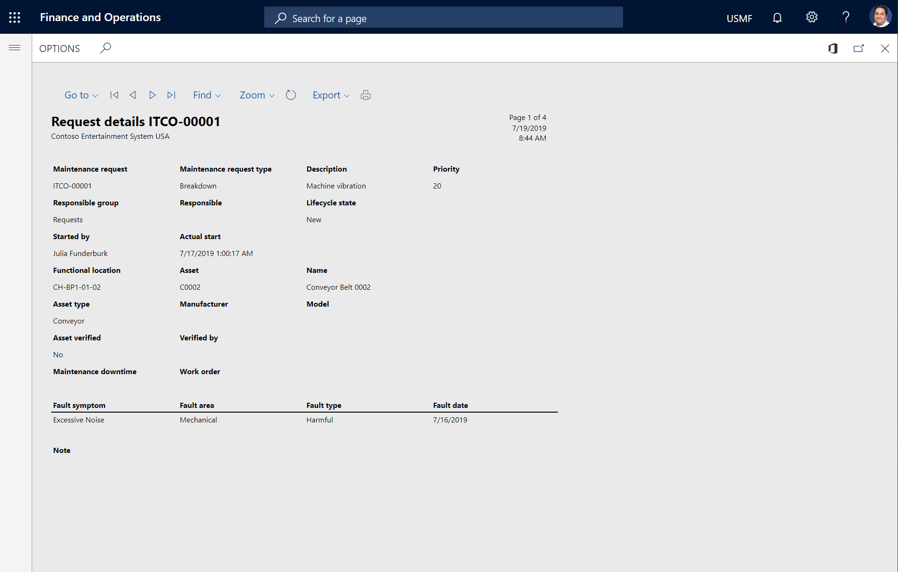
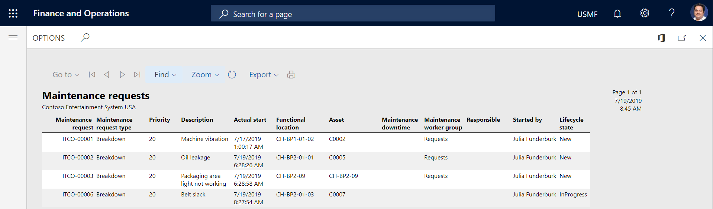

---
# required metadata

title: Maintenance request reports
description: This topic explains how to create maintenance request reports in Asset Management.
author: johanhoffmann
ms.date: 10/31/2019
ms.topic: article
ms.prod: 
ms.technology: 

# optional metadata

ms.search.form: 
# ROBOTS: 
audience: Application User
# ms.devlang: 
ms.reviewer: kamaybac
# ms.tgt_pltfrm: 
ms.custom: 
ms.assetid: 
ms.search.region: Global
# ms.search.industry: 
ms.author: johanho
ms.search.validFrom: 2019-10-31
ms.dyn365.ops.version: 10.0.5

---

# Maintenance request reports

[!include [banner](../../includes/banner.md)]

 

In Asset Management, you can generate two reports that are related to maintenance requests. One report shows details, and the other report provides a list that can be used for planning and follow-up.

## Create a Maintenance request details report

The **Maintenance request details** report shows various information that is related to maintenance requests.

1. Select **Asset management** \> **Reports** \> **Maintenance requests** \> **Maintenance request details**.
2. On the **Records to include** FastTab, you can select specific maintenance requests to include on the report.
3. On the **Run in the background** FastTab, you can set up report generation as a batch job, as you require.
4. Select **OK** to generate the report.

The following illustration shows an example of the **Maintenance request details** report.

## Create a Maintenance request list report

The **Maintenance request list** report shows a list of all maintenance requests of the same request type.

1. Select **Asset management** \> **Reports** \> **Maintenance requests** \> **Maintenance request list**.
2. On the **Records to include** FastTab, you can make selections to define which maintenance requests are included on the report.
3. On the **Run in the background** FastTab, you can set up report generation as a batch job, as you require.
4. Select **OK** to generate the report.

The following illustration shows an example of the **Maintenance request list** report for all active maintenance requests.

[!INCLUDE[footer-include](../../../includes/footer-banner.md)]