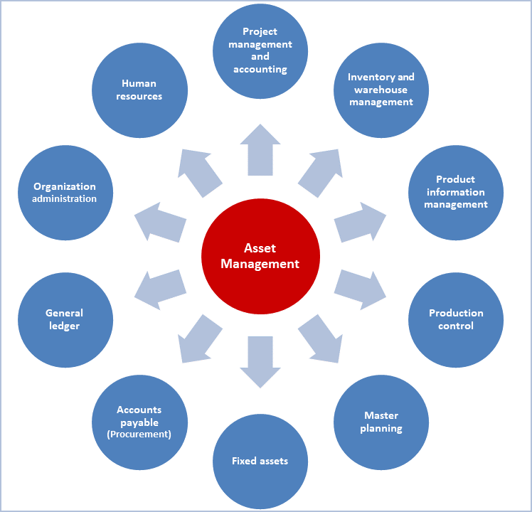
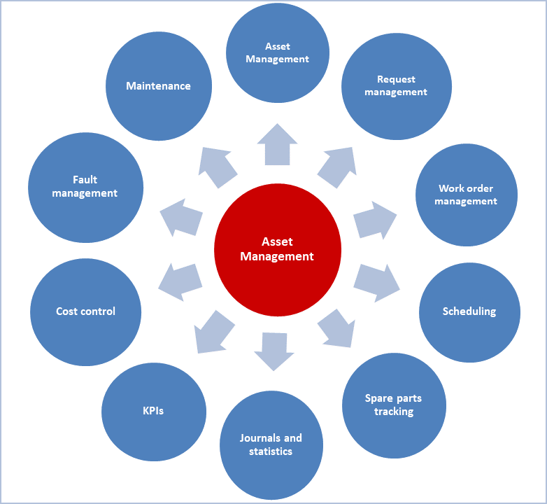

---
# required metadata

title: Functional locations and assets
description: This topic describes functional locations and assets in Asset Management. Asset Management is an advanced module for managing assets and maintenance jobs in Dynamics 365 Supply Chain Management.
author: johanhoffmann
ms.date: 06/24/2019
ms.topic: article
ms.prod: 
ms.technology: 

# optional metadata

ms.search.form: CatProcureCatalogEdit, CatProcureCatalogListPage
# ROBOTS: 
audience: Application User
# ms.devlang: 
ms.reviewer: kamaybac
# ms.tgt_pltfrm: 
ms.custom: 2214
ms.assetid: 2f3e0441-414d-402b-b28b-7ab0d650d658
ms.search.region: Global
# ms.search.industry: 
ms.author: johanho
ms.search.validFrom: 2016-02-28
ms.dyn365.ops.version: AX 7.0.0

---

# Functional locations and assets

[!include [banner](../../includes/banner.md)]

 

This topic describes functional locations and assets in Asset Management. Asset Management is an advanced module for managing assets and maintenance jobs in Dynamics 365 Supply Chain Management.

## Overview

Asset Management is integrated seamlessly with several modules with other Finance and Operations apps. The following illustration shows the interfaces with other modules.

Asset Management lets you efficiently manage and perform all tasks that are related to managing and servicing many types of equipment in your company. This equipment includes machines, production equipment, and vehicles. Asset Management also supports solutions across numerous industries.

The following illustration shows an overview of the main functionality that is covered by Asset Management.

## Functional locations and assets

Functional locations are used to manage assets on locations. This management includes tracking of asset costs on functional locations. Functional locations are structured hierarchically, and locations can have sub-locations. The structure of functional locations is static. In other words, locations can't change place. Assets can be installed on functional locations and, as required, can be installed on other functional locations later.

Asset costs always follow the location of the asset. In other words, if you install an asset on a new functional location, the asset automatically uses the financial dimensions that are related to the new functional location. Therefore, asset costs are always related to the functional location that the asset is  currently installed on. This automatic handling of financial dimensions helps guarantee complete tracking of costs when your company does project controlling and reporting on functional locations.

The way that you build your hierarchy of functional locations depends on your company's requirements for maintaining internal equipment or servicing customer equipment. The following figure shows an example of functional locations that are based on geographical locations.

The following figure shows an example of functional locations that are based on customers.

[!INCLUDE[footer-include](../../../includes/footer-banner.md)]