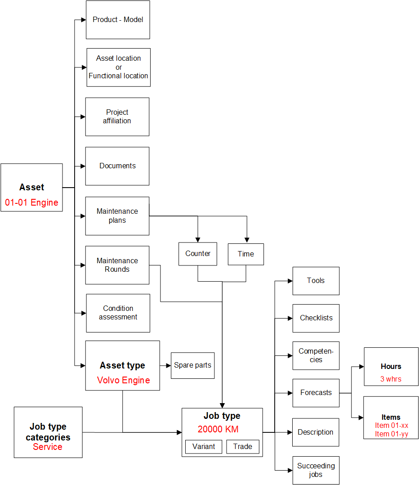
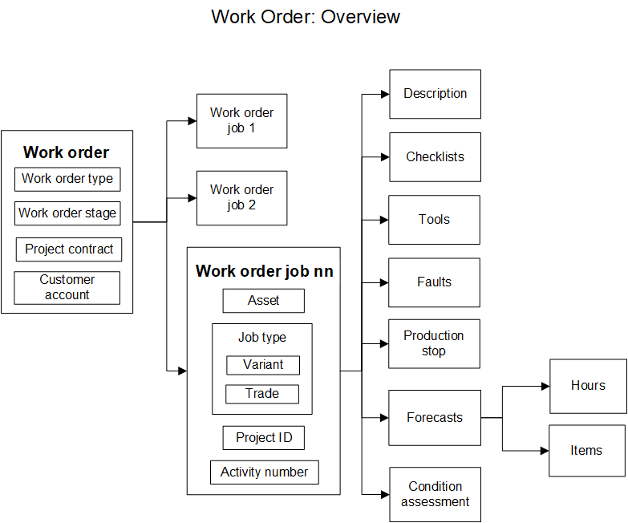
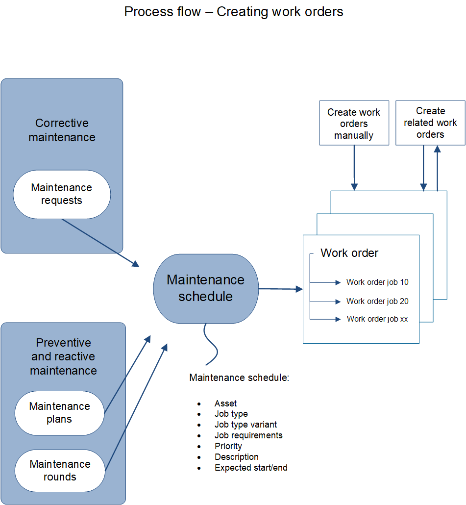
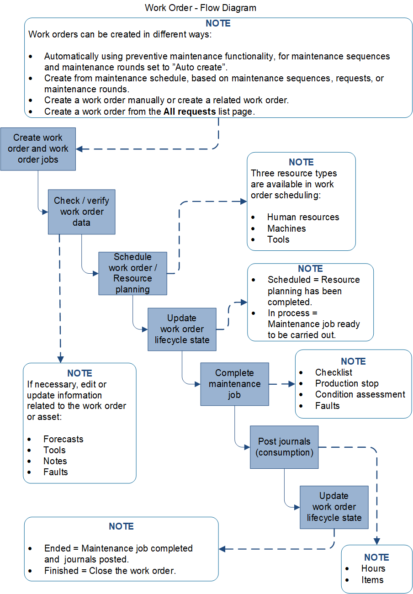

# Assets and work orders

[!include [banner](../../includes/banner.md)]

This article describes assets and work orders in Asset Management. Assets and work orders are the central parts of Asset Management. An *asset* is a machine or machine part that requires continuous maintenance and service. Assets can be created in a hierarchical structure, and they can be related to functional locations. Maintenance jobs can be planned at all levels in the asset structure.

## Asset data and job types

Various data, such as product information and asset specification, and required maintenance plans are set up on each asset. The following illustration shows an overview of asset data and the affiliation of assets to job types. Red text is used for examples that show inheritance and dependencies.

## Key data in a work order

Every work order has a work order type, such preventive maintenance, corrective maintenance, or inspection. The work order contains one or more work order jobs. Every work order job defines a job that must be performed on an asset and a related job type. Examples of related job types include 10,000 km, 50,000 km, 1-year overhaul, and safety inspection. One work order can be related to multiple assets.

The following illustration shows an overview of the key data in a work order.

A work order can be related to another work order, and job types can contain succeeding jobs that create a work order. In general, there are no dependencies between work orders. Therefore, they can change their work order lifecycle state and can be scheduled independently of each other.

## Creating work orders automatically or manually

Work orders can be created in various ways that are related to corrective, preventive, or reactive maintenance. You can also create work orders manually. The following illustration shows an overview of the process for automatic or manual creation of work orders.

## Processing a work order

Several steps must be completed when you want to schedule and run a maintenance job on a work order. The following illustration shows an overview of the processing for a work order.

> [!NOTE]
> In general, when you work in Dynamics 365 Supply Chain Management and the **Asset Management** module, you select **New** to create a new record, you select **Edit** to update an existing record, and you select **Save** to save new or edited data.

## Next steps

- [Introduction to assets](../objects/introduction-to-objects.md)
- [Introduction to work orders](../work-orders/introduction-to-work-orders.md)

[!INCLUDE[footer-include](../../../includes/footer-banner.md)]
