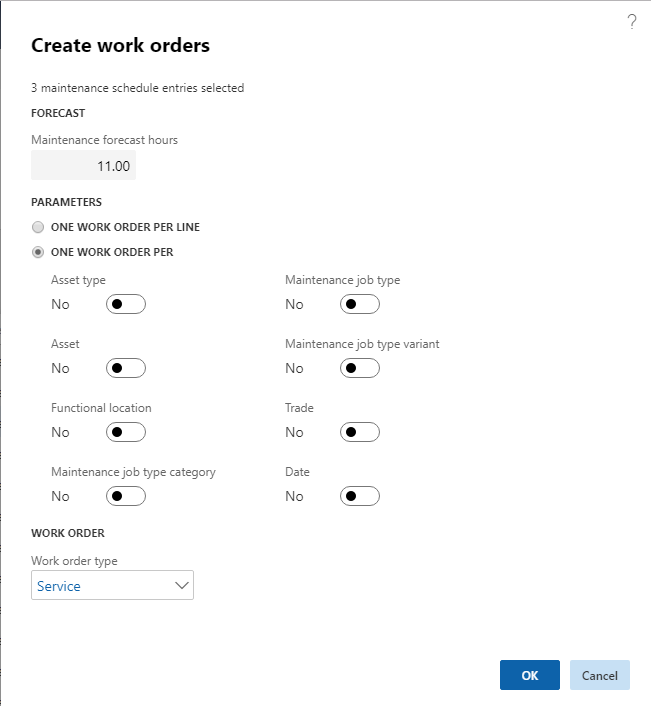

---
# required metadata

title: Creating work orders
description: This article explains how to create work orders in Asset Management.
author: johanhoffmann
ms.date: 02/01/2021
ms.topic: article
ms.prod: 
ms.technology: 

# optional metadata

ms.search.form: EntAssetMaintenancePlan, EntAssetObjectCalendarListPage, EntAssetObjectCalendarListPagePoolsOpen
# ROBOTS: 
audience: Application User
# ms.devlang: 
ms.reviewer: kamaybac
# ms.tgt_pltfrm: 
ms.custom: 
ms.assetid: 
ms.search.region: Global
# ms.search.industry: 
ms.author: johanho
ms.search.validFrom: 2019-08-31
ms.dyn365.ops.version: 10.0.17

---

# Creating work orders

[!include [banner](../../includes/banner.md)]

After you've scheduled preventive maintenance jobs, the next step is to create work orders for them. You can complete this step by using one of the maintenance schedules. The scheduled jobs in a maintenance schedule can have different reference types, as described in the following table.

| Reference type | Description |
|---|---|
| Maintenance plans | Preventive maintenance jobs that are based on the *Time* or *Counter* maintenance plan type. |
| Maintenance rounds | Preventive maintenance jobs that contain several assets that require a similar type of maintenance. |
| Maintenance request | A manually created request for maintenance or repair of an asset. This request can be converted to a work order. |

## Create work orders based on your maintenance schedule

To create work orders that are based on your maintenance schedule, follow these steps.

1. Open one of the following pages, depending on how you want to select schedule items for your work orders:

    - All maintenance schedule (**Asset management \> Management schedule \> All maintenance schedule**)
    - Open maintenance schedule lines (**Asset management \> Management schedule \> Open maintenance schedule lines**)
    - Open maintenance schedule pools (**Asset management \> Management schedule \> Open maintenance schedule pools**)

1. In the grid, select the check box for every scheduled maintenance job that you want to create a work order for. Then, on the Action Pane, select **Work order**.

    The **Create work orders** dialog box appears. The **Maintenance forecast hours** field shows the total number of forecast hours for the selected lines.

    

1. In the **Parameters** section, specify the number of work orders that should be created. Select one of the following options:

    - **One work order per line** – Create one work order per maintenance schedule line.
    - **One work order per** – Create work orders that are grouped according to the settings of the other options that become available when you select this option.

1. In the **Work order type** field, select the work order type to use for all the work orders that you create.
1. Select **OK** to create the work orders according to your settings.

## Group work order lines that are automatically created while a maintenance plan runs

This feature lets you define rules for grouping work order lines under a single work order when the system is set up to generate work orders automatically, based on a maintenance plan. Previously, automatically generated work orders could contain only one line. However, you can now group work orders by, for example, asset, asset type, or functional location. (Manually generated work orders could already be grouped in this way, as described in the previous section of this article.)

### Enable grouping for automatically generated work orders

Before you can use this feature, it must be turned on for your system. As of Supply Chain Management version 10.0.32, this feature is mandatory and can't be turned off. If you're running a version older than 10.0.32, then admins can turn this functionality on or off by searching for the *Apply rules for grouping work orders while running a maintenance plan* feature in the [Feature management](../../../fin-ops-core/fin-ops/get-started/feature-management/feature-management-overview.md) workspace.

### Set up grouping for automatically generated work orders

To set up grouping for automatically generated work orders, follow these steps.

1. Go to **Asset management \> Setup \> Preventative maintenance \> Maintenance plans**.
1. For each plan where you want to generate grouped work orders, follow these steps:

    1. Select the plan in the list pane.
    1. On the **Lines** FastTab, make sure that the **Auto create** check box is selected on every line.

1. Go to **Asset management \> Periodic \> Preventive maintenance \> Schedule maintenance plans**.
1. In the **Schedule maintenance plans** dialog box, in the **Period** section, specify the time horizon for the plan (how far to look ahead when finding scheduled maintenance jobs to generate work for).
1. Set the **Automatically create work order from schedule** option to *Yes*.
1. In the **Work order** section, select one of the following options:

    - **One work order per line** – Create one work order per maintenance schedule line. (This option provides the same functionality that is available when the *Apply rules for grouping work orders while running a maintenance plan* feature is turned off.)
    - **One work order per** – Create work orders that are grouped according to the settings of the other options that become available when you select this option.

1. If you want the options to apply when you run only some of your maintenance plans, on the **Records to include** FastTab, add filters as you require, just as you might do for other batch jobs in Microsoft Dynamics 365 Supply Chain Management.
1. On the **Run in the background** FastTab, set up batch and scheduling options as you require, just as you might do for other batch jobs in Supply Chain Management.
1. Select **OK** to run and/or schedule the selected maintenance plans.

[!INCLUDE[footer-include](../../../includes/footer-banner.md)]