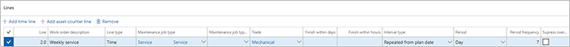
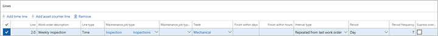

---
# required metadata

title: Maintenance plans
description: This topic explains maintenance plans in Asset Management.
author: josaw1
manager: tfehr
ms.date: 08/27/2019
ms.topic: article
ms.prod: 
ms.service: dynamics-ax-applications
ms.technology: 

# optional metadata

ms.search.form: 
# ROBOTS: 
audience: Application User
# ms.devlang: 
ms.reviewer: kamaybac
ms.search.scope: Core, Operations
# ms.tgt_pltfrm: 
ms.custom: 
ms.assetid: 
ms.search.region: Global
# ms.search.industry: 
ms.author: mkirknel
ms.search.validFrom: 2019-08-31
ms.dyn365.ops.version: 10.0.5

---

# Maintenance plans

[!include [banner](../../includes/banner.md)]

 

A maintenance plan defines when a pre-planned preventive maintenance job is to be carried out on an asset. Maintenance plans can be related to assets, asset types, functional locations, or functional location types, but first you create the maintenance plans to be used in your company.

A maintenance plan can have multiple maintenance plan lines. Maintenance job type and interval are specified on the maintenance plan line. There are two types of maintenance plan lines:

- Time  
- Counter  

Maintenance plan lines of type "Time" are used for recurring planned maintenance based on a fixed time interval. Maintenance plan lines of type "Counter" are used for planned maintenance or reactive maintenance based on asset counter registrations. A maintenance plan may include several maintenance plan lines of both types.

>[!NOTE]
>If no counter values have been registered for a counter type on an asset, the maintenance plan lines are omitted.

First, you create the maintenance plans you require for your preventive maintenance jobs and select the asset types, assets, functional location types, and functional locations that should be related to each maintenance plan. Afterwards, if required, you can also add maintenance plans to an asset or a functional location, which is done in **All assets** > select asset > **Asset maintenance plans** FastTab, or **All functional locations** > select functional location > **Maintenance plans** FastTab.

If you add a maintenance plan to asset types or functional location types, it means that when you create new assets or functional locations with those asset types or functional location types, the asset or functional location will automatically be added to the maintenance plan. The start date of the relation to a maintenance plan will be the current date, which may need to be adjusted.

## Set up maintenance plans

This section describes how to set up maintenance plan lines and provides examples of how they can be used.

1. Click **Asset management** > **Setup** > **Preventive maintenance** > **Maintenance plans**.

2. Click **New** to create a new sequence.

3. Insert an ID in the **Maintenance sequence** field, and a name in the **Name** field.

4. In the **Plan date** field, insert the start date from which planning can be done on the maintenance plan. Note that time-based maintenance plan lines may have other plan dates.

5. Select "Yes" in the **Active** toggle button to activate the maintenance plan.

>[!NOTE]
>If you deactivate a maintenance plan, no schedule posts will be created in the maintenance schedule when you run a schedule maintenenance plan job.

6. The **Tolerance days before** and **Tolerance days after** fields relate to maintenance plan lines in which the **Supress overlappping maintenance jobs** check box is selected (refer to step 17). The "Tolerance" fields are used to extend the interval in days in which, if several maintenance plans overlap, the most comprehensive / largest job is created as a maintenance schedule line during maintenance plan scheduling, while more frequent, overlapping jobs are omitted during maintenance plan scheduling. Insert number of days in the **Tolerance days before** field, for example "2".

7. If you have inserted a value in **Tolerance days before**, also insert number of days in the **Tolerance days after** field, for example "2".

>[!NOTE]
>The example described in this and the previous step means that if several maintenance plan lines overlap, and **Supress overlappping maintenance jobs** is selected for one or more lines, the period of omitting maintenance schedule lines is extended to a total of five days (the expected start date on the maintenance schedule line *and* two days before *and* two days after that date).

8. The fields in the **Details** group on the **Details** FastTab show number of maintenance plan lines set up on the maintenance plan, and number of assets and functional locations related to the maintenance plan.

9. On the **Lines** FastTab, click **Add time line** or **Add asset counter line** to create a new maintenance plan line.

10. Insert a description for the line in the **Work order description** field. The description is transferred to related work orders.

11. In the **Maintenance job type** field, select the job type to which the maintenance plan line is related.

12. In the **Maintenance job type variant** and **Trade** fields, select the variant and trade related to the maintenance job type.

13. In the **Finish within days** and **Finish within hours** fields, you can insert expected end date in days or hours. The expected end date is inserted relative to the expected start date, which is calculated when maintenance schedule lines are created. For example, you can insert "7" in the **Finish within days** field to indicate that the related job should be completed within a week from the expected start date.

14. In the **Interval type** field, select the type of interval to be used on the maintenance plan line, for example, "Repeated..." or "Once...". Refer to the [Interval types overview](## Interval types overview) table below for a description of the relation between interval types and line types.

15. The **Period** field only relates to time-based line types. Select the period type related to the period frequency.

16. In the **Period frequency** field, insert the number of times the line should be used for planning preventive maintenance jobs. Example: If you have created a line of type "Counter", and your counter is production quantity, and you insert the number "20000" in this field, new maintenance sequence lines are created during preventive maintenance scheduling every time you are expected to produce 20,000 more items.

17. The **Supress overlapping maintenance jobs** check box relates to time-based as well as counter-based line types. Select the check box to delete maintenance schedule entries that are created on the same date. This is relevant if, for example, you have created a 1-month inspection line, a 6-month inspection line, and a 1-year inspection line. For the 1-year inspection you only want that inspection to be done, not the other two inspections, which would also fit in the time frame. In order to set up this example correctly, you set up the 1-year inspection line as the first line, the 6-month line as the second line, and the 1-month line as the third line, and you select the **Supress overlapping maintenance jobs** check box for the 1-month and 6-month lines. That way you ensure that when you reach the 1-year mark, the inspections for one month and six months are omitted, and a maintenance schedule line is only created for the 1-year inspection line.

>[!NOTE]
>The example described in this step shows that the most comprehensive job, which contains the largest number of tasks, and which is not done so often, should always be inserted as the first line. The more frequent jobs are then inserted as separate lines in the order of frequency, placing the most frequent job at the bottom of the list.

18. The **Counter** field only relates to counter-based line types. Select the counter type to be used on the line. If a counter type is not active on a related asset, the maintenance plan line is omitted.

19. The **Asset counter time fence in days** field only relates to counter-based line types. Insert a number that defines how many days back counter registrations are checked when maintenance plan scheduling is done. This means how far back are data (existing counter registrations) used as basis for calculating the trend that determines how many maintenance schedule lines are created.

>*Example:* If counter registrations are expected to be made once a month, you may insert the number '365' in this field because maintenance plan scheduling will always be based on the last 12 months and therefore create maintenance schedule lines based on the trend of the past year. On the other hand, if you insert the number '10' in this field, you expect counter registrations to be made more often, for example, on a daily basis. This means that when you schedule maintenance plan, counter registrations for the last 10 days are used as the basis for the scheduling of maintenance schedule lines.

20. The **Plan date** field only relates to time-based line types. If the maintenance plan line has another planning date than the entire maintenance plan, select a date in the **Plan date** field on the line.

21. In the **Service level** field, you can select a work order service level as a further delimitation on the maintenance plan line - to be used as a service level on work orders.

22. Select the **Auto create** check box if you want a work order to be automatically created according to the selected maintenance plan line when scheduling maintenance plans.

23. If you have selected the **Auto create** check box, you can select a work order type for the auto-created work order in the **Work order type** field. If you have selected the **Auto create** check box, and you do not select a work order type in this field, the work order type selected in **Asset management** > **Setup** > **Asset management parameters** > **Work orders** link > **Preventive work order type** field is used.

24. Use the **Season from** and **Season to** fields to create a repeated time-based maintenance plan line within a 12-month period. *Example:* Equipment used for maintaining green areas requires service each spring within a predefined period. Insert the start date of the period to be repeated in the **Season from** field.

25. Insert the end date of the period to be repeated in the **Season to** field.

26. In the **Resulting period** field, the current period to be repeated is shown. When the current period has passed, and you start a new year, the period shown in this field will be updated to reflect the next period in the repeat sequence.

27. On the **Assets** FastTab, select the assets that should be related to the maintenance plan.

28. On the **Asset types** FastTab, select the asset types that should be related to the maintenance plan.

29. On the **Functional locations** FastTab, select the functional locations that should be related to the maintenance plan. If required, you can make the setup more specific by selecting a related asset type, manufacturer, and model.

30. On the **Functional location types** FastTab, select the functional location types that should be related to the maintenance plan.

>[!NOTE]
>When work orders are manually created on assets that are covered by a vendor warranty, a dialog box is shown to make the user aware of the warranty. The creation of the work order can then be canceled. The check for a warranty relation is omitted for work orders that are automatically created.

## Interval types overview

| Interval type and Description                                                                                                                                                                                                                                                                                                                                                                                                       | Line Type: Time                                                                                                                                                                                                                                                                                                                                                           | Line Type: Counter                                                                                                                                                                                                                                                                                                                                                                                                                                                                                                                                                                                                                                                            |
|-------------------------------------------------------------------------------------------------------------------------------------------------------------------------------------------------------------------------------------------------------------------------------------------------------------------------------------------------------------------------------------------------------------------------------------|---------------------------------------------------------------------------------------------------------------------------------------------------------------------------------------------------------------------------------------------------------------------------------------------------------------------------------------------------------------------------|-------------------------------------------------------------------------------------------------------------------------------------------------------------------------------------------------------------------------------------------------------------------------------------------------------------------------------------------------------------------------------------------------------------------------------------------------------------------------------------------------------------------------------------------------------------------------------------------------------------------------------------------------------------------------------|
| **Interval type: Repeated from plan date** The count starts from the plan date used. When you schedule maintenance plans, maintenance schedule lines are created when the interval is reached.                                                                                                                                                                                                                | The **Plan date** on the maintenance plan line is used. If no plan date is selected on the line, the **Plan date** for the maintenance plan is used. Example: If the number "3" is inserted in the **Period frequency** field, and "Year" is selected in the **Period** field, a new maintenance schedule line will be created once every 3 years.                             | The **Plan date** for the maintenance plan is used. If the counter has been replaced, the latest replacement date is used as the plan date.                                                                                                                                                                                                                                                                                                                                                                                                                                                                                                                               |
| **Interval type: Repeated from start date** The count starts from the start date on the asset relation. The date is selected in the **All asset** details view > **Asset maintenance plans** FastTab > **Start date** field, or in the **All functional locations** details view > **Maintenance plans** FastTab > **Start date** field. When you schedule maintenance plans, a maintenance schedule line is created when the interval is reached. | The start date of the maintenance plan line on asset or functional location is used. If that field is blank, the **Plan date** for the maintenance plan is used.                                                                                                                                                                                                 | The start date of the maintenance plan line on asset or functional location is used. If that field is blank, the **Plan date** for the maintenance plan is used.                                                                                                                                                                                                                                                                                                                                                                                                                                                                                                     |
| **Interval type: Repeated from last work order** The count starts from the actual end date and time of the latest work order that was completed on the asset with that specific maintenance job type / maintenance job type variant / trade combination. That date and time is shown in the **Actual end** field in the **All work order** details view.                                                                                                                                 | The actual end date and time of the work order completed on the asset with that specific maintenance job type / maintenance job type variant / trade combination. If no completed work order is found, one of the dates used in the "Repeated from start date" interval type described above is used instead.                                                                                             | The actual end date and time of the work order completed on the asset *and* the maintenance job type / maintenance job type variant / trade combination. is used. If the end date and time was left blank on the work order, one of the dates used in the "Repeated from start date" interval type described above is used instead.                                                                                                                                                                                                                                                                                                                                                                           |
| **Interval type: Once from plan date** See description for the "Repeated from plan date" interval type above. Only difference is that this interval type is to be used only once.                                                                                                                                                                                                                                                   | See description for "Repeated from plan date" interval type above. This interval is typically used for a one-time maintenance or service job.                                                                                                                                                                                                                             | See description for "Repeated from plan date" interval type above. This interval is typically used for a one-time maintenance or service job. **Note 1:** This interval type is only relevant if the counter is replaced every time you carry out a maintenance or service job. If, for some reason, a counter has been replaced before the end of the planned interval, a new time is calculated for the job from the time of the counter replacement. **Note 2:** If the counter is replaced when completing the maintenance or service job, this interval type functions as the "Repeated from plan date" interval type above.                                             |
| **Interval type: Once from start date** See description for the "Repeated from start date" interval type above. Only difference is that this interval type is to be used only once.                                                                                                                                                                                                                                                 | See description for "Repeated from start date" interval type above. This interval is typically used for a one-time maintenance or service job.                                                                                                                                                                                                                            | See description for "Repeated from start date" interval type above. This interval is typically used for a one-time maintenance or service job. **Note 1** above also applies to this interval type. **Note 3:** If the counter is replaced when completing the maintenance or service job, this interval type functions as the "Repeated from start date" interval type above.                                                                                                                                                                                                                                                                                                |
| **Interval type: Once reached above** This interval type only relates to counters and is used for indicating an upper limit set up on the maintenance plan line. Maintenance schedule entries will have the expected start date and time of the counter registration, meaning these entries will be created with an expected start date equal to or earlier than the system date.                                                | N/A                                                                                                                                                                                                                                                                                                                                                                       | The counter interval indicates an upper limit. If that limit is exceeded when you create a counter registration, a maintenance schedule line is created when you schedule preventive maintenance.                                                                                                                                                                                                                                                                                                                                                                                                                                                                                 |
| **Interval type: Once reached below** This interval type only relates to counters and is used for indicating a lower limit set up on the maintenance plan line. Maintenance schedule entries will have the expected start date and time of the counter registration, meaning these entries will be created with an expected start date equal to or earlier than the system date.                                                 | N/A                                                                                                                                                                                                                                                                                                                                                                       | The counter interval indicates a lower limit. If that limit is passed when you create a counter registration, a maintenance schedule line is created when you schedule preventive maintenance.                                                                                                                                                                                                                                                                                                                                                                                                                                                                                    |
| **Interval type: Linked from start date** This interval type only creates a maintenance schedule line once. A maintenance plan can contain more maintenance plan lines using this interval type, and those lines are linked. Typically, you will create a maintenance plan that contains lines of only this interval type. Maintenance schedule lines are created by identifying the maintenance plan line that has the first expected start date and time.                                                                                                                                                                                                                                                                                                                                                                                           | See description for "Once from start date" above. Example: You create two lines in a maintenance plan for a service job on a car: one time-based line with a 1-year period, and one counter-based line with a 25,000 km limit. A maintenance schedule line is created for the limit that is reached first. For this line type you create the line with the 1-year period.                                                                                                                                                                                   | See description for "Once from start date" above. Example: You create two lines in a maintenance plan for a service job on a car: one time-based line with a 1-year period, and one counter-based line with a 25,000 km limit. A maintenance schedule line is created for the limit that is reached first. For this line type you create the line with the 25,000 km limit. Example creating two counter lines: You can also set up a maintenance plan with two linked, counter-based lines in which the first line has a limit of 10,000 items quantity produced, and the second line relates to the machine or work center requiring service after running 3,000 hours.                                                                                                                                                           |
| **Interval type: Linked from last work order** This interval type creates new maintenance schedule lines after every completed work order. A maintenance plan can contain more lines using this interval type, and those lines are linked. Typically, you will create a maintenance plan that contains maintenance plan lines of only this interval type. Maintenance schedule lines are created by identifying the maintenance plan line that has the first expected start date and time.                                                                                                                                                                                                                                                                        | This interval type basically works as "Linked from start date" described above. Only difference is the date on which the interval type is based. The date used is the actual date and time on the latest work order completed on the asset *and* the maintenance job type / maintenance job type variant / trade combination.                                                                                                                                                                                                                                                           | This interval type basically works as "Linked from start date" described above. Only difference is the date on which the interval type is based. The date used is the actual date and time on the latest work order completed on the asset *and* the maintenance job type / maintenance job type variant / trade combination.                                                                                                                   |

>[!NOTE]
>When maintenance schedule lines are created for time-based maintenance plan lines, expected time is always at the start of the day. For counter-based maintenance plan lines, expected time can be anytime during the day.

Below you will find examples of the setup of time-based and counter-based maintenance plan lines:

**Example 1 - Time-based maintenance plan line:** A lubrication job may be set up in a fixed interval, occurring once a week. For that purpose, select "Repeated from plan date" in the **Interval type** field. See an example in the following illustration.

**Example 2 - Time-based maintenance plan line:** An inspection job may be set up to be carried out approximately once a week. For that purpose, select "Repeated from last work order" in the **Interval type** field. See an example in the following illustration.

**Example 3 - Counter-based maintenance plan line:** The following graphic illustration shows an hour counter for which a new maintenance schedule line is created each time 250 hours have passed. The interval type for this counter-based line is "Repeated from start date". The start date is the start date of the related assets in the **All assets** details view > **Asset maintenance plans** FastTab > **Start date** field, or in the **Functional location** details view > **Maintenance plans** FastTab > **Start date** field. This is an example of a *preventive* maintenance plan because the maintenance schedule line is automatically created each time the threshold (+ 250) is reached.

**Example 4 - Counter-based maintenance plan line:** The following graphic illustration shows a decrease in counter value, measuring brake pad wear. A maintenance schedule line is created when a counter registration below 20 mm is created on the brake pad. The interval type for this counter-based line is "Once reached below" or "Once from last start date". This is an example of a *reactive* maintenance plan because the maintenance schedule line is not created until a measurement below 20 mm is registered.

**Example 5 - Counter-based maintenance plan line:** The following graphic illustration shows a counter with a threshold of -18° Celsius. A maintenance schedule line is created when a counter registration above -18° Celsius is made. The interval type for this counter-based line is "Once reached above". This is an example of a *reactive* maintenance plan because the maintenance schedule line is not created until a measurement higher than -18° Celsius is registered.

- When you create a new asset, and that asset uses an asset type related to a maintenance plan, the maintenance plan is automatically inserted in **All objects** > **Asset maintenance plans** FastTab. Also, in the **Asset type defaults**, on the **Maintenance plans** FastTab, the related maintenance plans will automatically be inserted.  
- If you add or remove asset types or functional location types in **Maintenance plans**, that change will only reflect on new assets created after you made the change.  
- If you add or remove assets or functional locations in **Maintenance plans**, that change will automatically be updated in **All assets** > **Asset maintenance plans** FastTab, or in **All functional locations** > **Maintenance plans** FastTab.  

The following illustration shows an example of a "Truck service" maintenance plan on the **Maintenance plans** page.

## Add a maintenance plan to an asset

1. Click **Asset management** > **Common** > **Assets** > **All assets** or **Active assets**.

2. Select the asset on which you want to set up a maintenance plan and click **Edit**.

3. On the **Asset maintenance plans** FastTab, click **Add line** to add a maintenance plan to the asset.

4. In the **Maintenance plan** field, select the relevant maintenance plan.

5. In the **Start date** field, select the date from which planning of preventive maintenance jobs can be done. 

6. Click **Save**. The **Active** field is automatically updated.

The following illustration shows an example of maintenance plans set up on an asset on the **All assets** page.

